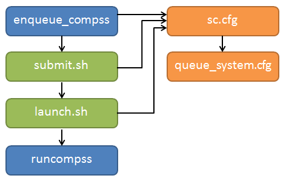
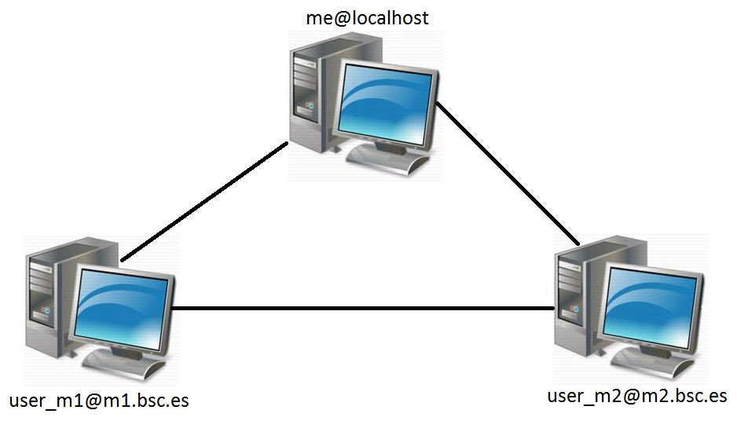

===============================
Installation and Administration
===============================

Dependencies
============

Next we provide a list of dependencies for installing COMPSs package.
The exact names may vary depending on the Linux distribution but this
list provides a general overview of the COMPSs dependencies. For
specific information about your distribution please check the *Depends*
section at your package manager (apt, yum, zypper, etc.).

.. table:: COMPSs dependencies
    :name: COMPSs_dependencies
    :widths: auto

    +-------------------------+---------------------------------------------------------------------------------+
    | Module                  | Dependencies                                                                    |
    +=========================+=================================================================================+
    | **COMPSs Runtime**      | | **openjdk-8-jre, graphviz, xdg-utils, openssh-server**                        |
    +-------------------------+---------------------------------------------------------------------------------+
    | COMPSs Python Binding   | | libtool, automake, build-essential, python (>= 2.7 \| >=3.6),                 |
    |                         | | python-dev \| python3-dev, python-setuptools\|python3-setuptools,             |
    |                         | | libpython2.7                                                                  |
    +-------------------------+---------------------------------------------------------------------------------+
    | COMPSs C/C++ Binding    | | libtool, automake, build-essential, libboost-all-dev, libxml2-dev             |
    +-------------------------+---------------------------------------------------------------------------------+
    | COMPSs Autoparallel     | | libgmp3-dev, flex, bison, libbison-dev, texinfo, libffi-dev, astor,           |
    |                         | | sympy, enum34, islpy                                                          |
    +-------------------------+---------------------------------------------------------------------------------+
    | COMPSs Tracing          | | libxml2 (>= 2.5), libxml2-dev (>= 2.5), gfortran, papi                        |
    +-------------------------+---------------------------------------------------------------------------------+

Build Dependencies
------------------

To build COMPSs from sources you will also need ``wget``,
``openjdk-8-jdk`` and ``maven``.

Optional Dependencies
---------------------

For the Python binding it is also recommended to have ``dill`` and
``guppy`` installed. The ``dill`` package increases the variety of
serializable objects by Python (for example: lambda functions), and the
``guppy`` package is needed to use the ``@local`` decorator. Both
packages can be found in pyPI and can be installed via ``pip``.

Building from sources
=====================

This section describes the steps to install COMPSs from the sources.

The first step is downloading the source code from the Git repository.

.. code-block:: console

    $ git clone https://github.com/bsc-wdc/compss.git
    $ cd framework

Then, you need to download the embedded dependencies from the git
submodules.

.. code-block:: console

    $ framework> ./submodules_get.sh
    $ framework> ./submodules_patch.sh

Finally you just need to run the installation script. You have to
options: For installing COMPSs for all the users run the following
command. (root access is required)

.. code-block:: console

    $ framework> cd builders/
    $ builders> INSTALL_DIR=/opt/COMPSs/
    $ builders> sudo -E ./buildlocal [options] ${INSTALL_DIR}

For installing COMPSs for the current user run the following command.

.. code-block:: console

    $ framework> cd builders/
    $ builders> INSTALL_DIR=$HOME/opt/COMPSs/
    $ builders> ./buildlocal [options] ${INSTALL_DIR}

The different installation options can be found in the command help.

.. code-block:: console

    $ framework> cd builders/
    $ builders> ./buildlocal -h

Post installation
-----------------

Once your COMPSs package has been installed remember to log out and back
in again to end the installation process.

If you need to set up your machine for the first time please take a look
at :ref:`Additional Configuration` Section for a detailed description of
the additional configuration.

Pip
===

Pre-requisites
--------------

In order to be able to install COMPSs and PyCOMPSs with Pip the
following requirements must be met:

#. Have all the dependencies (excluding the COMPSs packages) mentioned
   in the :ref:`Dependencies` Section satisfied and Python
   ``pip``. As an example for some distributions:

   **Fedora 25** dependencies installation command:

   .. code-block:: console

              $ sudo dnf install -y java-1.8.0-openjdk java-1.8.0-openjdk-devel graphviz xdg-utils libtool automake python python-libs python-pip python-devel python2-decorator boost-devel boost-serialization boost-iostreams libxml2 libxml2-devel gcc gcc-c++ gcc-gfortran tcsh @development-tools redhat-rpm-config papi
              $ # If the libxml softlink is not created during the installation of libxml2, the COMPSs installation may fail.
              $ # In this case, the softlink has to be created manually with the following command:
              $ sudo ln -s /usr/include/libxml2/libxml/ /usr/include/libxml

   **Ubuntu 16.04** dependencies installation command:

   .. code-block:: console

              $ sudo apt-get install -y openjdk-8-jdk graphviz xdg-utils libtool automake build-essential python2.7 libpython2.7 libboost-serialization-dev libboost-iostreams-dev  libxml2 libxml2-dev csh gfortran python-pip libpapi-dev

   **Ubuntu 18.04** dependencies installation command:

   .. code-block:: console

              $ sudo apt-get install -y openjdk-8-jdk graphviz xdg-utils libtool automake build-essential python2.7 libpython2.7 python3 python3-dev libboost-serialization-dev libboost-iostreams-dev  libxml2 libxml2-dev csh gfortran libgmp3-dev flex bison texinfo python3-pip libpapi-dev

   **OpenSuse 42.2** dependencies installation command:

   .. code-block:: console

              $ sudo zypper install --type pattern -y devel_basis
              $ sudo zypper install -y java-1_8_0-openjdk-headless java-1_8_0-openjdk java-1_8_0-openjdk-devel graphviz xdg-utils python python-devel libpython2_7-1_0 python-decorator libtool automake  boost-devel libboost_serialization1_54_0 libboost_iostreams1_54_0  libxml2-2 libxml2-devel tcsh gcc-fortran python-pip papi libpapi

   **Debian 8** dependencies installation command:

   .. code-block:: console

               $ su -
               $ echo "deb http://ppa.launchpad.net/webupd8team/java/ubuntu xenial main" | tee /etc/apt/sources.list.d/webupd8team-java.list
               $ echo "deb-src http://ppa.launchpad.net/webupd8team/java/ubuntu xenial main" | tee -a /etc/apt/sources.list.d/webupd8team-java.list
               $ apt-key adv --keyserver hkp://keyserver.ubuntu.com:80 --recv-keys EEA14886
               $ apt-get update
               $ apt-get install oracle-java8-installer
               $ apt-get install graphviz xdg-utils libtool automake build-essential python python-decorator python-pip python-dev libboost-serialization1.55.0 libboost-iostreams1.55.0 libxml2 libxml2-dev libboost-dev csh gfortran papi-tools

   **CentOS 7** dependencies installation command:

   .. code-block:: console

               $ sudo rpm -iUvh https://dl.fedoraproject.org/pub/epel/epel-release-latest-7.noarch.rpm
               $ sudo yum -y update
               $ sudo yum install java-1.8.0-openjdk java-1.8.0-openjdk-devel graphviz xdg-utils libtool automake python python-libs python-pip python-devel python2-decorator boost-devel boost-serialization boost-iostreams libxml2 libxml2-devel gcc gcc-c++ gcc-gfortran tcsh @development-tools redhat-rpm-config papi
               $ sudo pip install decorator

#. Have a proper ``JAVA_HOME`` environment variable definition. This
   variable must contain a valid path to a Java JDK (as a remark, it
   must point to a JDK, not JRE). A possible value is the following:

   .. code-block:: console

         $ echo $JAVA_HOME
         /usr/lib64/jvm/java-openjdk/

Installation
------------

Depending on the machine, the installation command may vary. Some of the
possible scenarios and their proper installation command are:

#. Install systemwide:

   .. code-block:: console

        $ sudo -E pip install pycompss -v

   It is recommended to restart the user session once the installation
   process has finished. Alternatively, the following command sets all
   the COMPSs environment.

   .. code-block:: console

       $ source /etc/profile.d/compss.sh

   However, this command should be executed in every different terminal
   during the current user session.

#. Install in user home folder (.local):

   .. code-block:: console

        $ pip install pycompss -v

   It is recommended to restart the user session once the installation
   process has finished. Alternatively, the following command sets all
   the COMPSs environment.

   .. code-block:: console

       $ source ~/.bashrc

#. Within a Python virtual environment:

   .. code-block:: console

        $ pip install pycompss -v

   In this particular case, the installation includes the necessary
   variables in the activate script. So, restart the virtual environment
   in order to set all the COMPSs environment.

Configuration (using pip)
-------------------------

The steps mentioned in Section :ref:`Configure SSH passwordless` must be done
in order to have a functional COMPSs and PyCOMPSs installation.

Post installation (using pip)
-----------------------------

As mentioned in :ref:`Configure SSH passwordless` Section, it is recommended to
restart the user session or virtual environment once the installation
process has finished.

Supercomputers
==============

The COMPSs Framework can be installed in any Supercomputer by installing
its packages as in a normal distribution. The packages are ready to be
reallocated so the administrators can choose the right location for the
COMPSs installation.

However, if the administrators are not willing to install COMPSs through
the packaging system, we also provide a **COMPSs zipped file**
containing a pre-build script to easily install COMPSs. Next subsections
provide further information about this process.

SC Prerequisites
----------------

In order to successfully run the installation script some dependencies
must be present on the target machine. Administrators must provide the
correct installation and environment of the following software:

-  Autotools

-  BOOST

-  Java 8 JRE

The following environment variables must be defined:

-  JAVA_HOME

-  BOOST_CPPFLAGS

The tracing system can be enhanced with:

-  PAPI, which provides support for harware counters

-  MPI, which speeds up the tracing merge (and enables it for huge
   traces)

SC Installation
---------------

To perform the COMPSs Framework installation please execute the
following commands:

.. code-block:: console

     $ # Check out the last COMPSs release
     $ wget http://compss.bsc.es/repo/sc/stable/COMPSs_<version>.tar.gz

     $ # Unpackage COMPSs
     $ tar -xvzf COMPSs_<version>.tar.gz

     $ # Install COMPSs at your preferred target location
     $ cd COMPSs
     $ ./install <targetDir>

     $ # Clean downloaded files
     $ rm -r COMPSs
     $ rm COMPSs_<version>.tar.gz

The installation script will create a COMPSs folder inside the given
``<targetDir>`` so the final COMPSs installation will be placed under
the ``<targetDir>/COMPSs`` folder.

.. warning::
   If the ``<targetDir>/COMPSs` folder already exists it will be **automatically erased**.

  After completing the previous steps, administrators must ensure that
the nodes have passwordless ssh access. If it is not the case, please
contact the COMPSs team at support-compss@bsc.es.

  The COMPSs package also provides a *compssenv* file that loads the
required environment to allow users work more easily with COMPSs. Thus,
after the installation process we recomend to source the
``<targetDir>/COMPSs/compssenv`` into the users *.bashrc*.

  Once done, remember to log out and back in again to end the
installation process.

SC Configuration
----------------

For queue system executions, COMPSs has a pre-build structure (see
:numref:`queue_structure`) to execute applications in
SuperComputers. For this purpose, users must use the *enqueue\_compss*
script provided in the COMPSs installation. This script has several
parameters (see *enqueue\_compss -h*) that allow users to customize
their executions for any SuperComputer.

   Structure of COMPSs queue scripts. In Blue user scripts, in Green
   queue scripts and in Orange system dependant scripts

To make this structure works, the administrators must define a
configuration file for the queue system (under
``<targetDir>/COMPSs/scripts/queues/cfgs/QUEUE/QUEUE.cfg``) and a
configuration file for the specific SuperComputer parameters (under
``<targetDir>`` ``/COMPSs/scripts/queues/cfgs/SC_NAME.cfg``). The COMPSs
installation already provides queue configurations for *LSF* and *SLURM*
and several examples for SuperComputer configurations.

To create a new configuration we recommend to use one of the
configurations provided by COMPSs (such as the configuration for the
*MareNostrum IV* SuperComputer) or to contact us at
support-compss@bsc.es.

SC Post installation
--------------------

To check that COMPSs Framework has been successfully installed you may
run:

.. code-block:: console

     $ # Check the COMPSs version
     $ runcompss -v
     COMPSs version <version>

For queue system executions, COMPSs provides several prebuild queue
scripts than can be accessible throgh the *enqueue\_compss* command.
Users can check the available options by running:

.. code-block:: console

    $ enqueue_compss -h

    Usage: enqueue_compss [queue_system_options] [COMPSs_options]
              application_name [application_arguments]

    * Options:
      General:
        --help, -h                              Print this help message
        --heterogeneous                         Indicates submission is going to be heterogeneous
                                                Default: Disabled
      Queue system configuration:
        --sc_cfg=<name>                         SuperComputer configuration file to use. Must exist inside queues/cfgs/
                                                Default: default

      Submission configuration:
      General submision arguments:
        --exec_time=<minutes>                   Expected execution time of the application (in minutes)
                                                Default: 10
        --job_name=<name>                       Job name
                                                Default: COMPSs
        --queue=<name>                          Queue name to submit the job. Depends on the queue system.
                                                For example (MN3): bsc_cs | bsc_debug | debug | interactive
                                                Default: default
        --reservation=<name>                    Reservation to use when submitting the job.
                                                Default: disabled
        --constraints=<constraints>             Constraints to pass to queue system.
                                                Default: disabled
        --qos=<qos>                             Quality of Service to pass to the queue system.
                                                Default: default
        --cpus_per_task                         Number of cpus per task the queue system must allocate per task.
                                                Note that this will be equal to the cpus_per_node in a worker node and
                                                equal to the worker_in_master_cpus in a master node respectively.
                                                Default: false
        --job_dependency=<jobID>                Postpone job execution until the job dependency has ended.
                                                Default: None
        --storage_home=<string>                 Root installation dir of the storage implementation
                                                Default: null
        --storage_props=<string>                Absolute path of the storage properties file
                                                Mandatory if storage_home is defined
      Normal submission arguments:
        --num_nodes=<int>                       Number of nodes to use
                                                Default: 2
        --num_switches=<int>                    Maximum number of different switches. Select 0 for no restrictions.
                                                Maximum nodes per switch: 18
                                                Only available for at least 4 nodes.
                                                Default: 0
      Heterogeneous submission arguments:
        --type_cfg=<file_location>              Location of the file with the descriptions of node type requests
                                                File should follow the following format:
                                                type_X(){
                                                  cpus_per_node=24
                                                  node_memory=96
                                                  ...
                                                }
                                                type_Y(){
                                                  ...
                                                }
        --master=<master_node_type>             Node type for the master
                                                (Node type descriptions are provided in the --type_cfg flag)
        --workers=type_X:nodes,type_Y:nodes     Node type and number of nodes per type for the workers
                                                (Node type descriptions are provided in the --type_cfg flag)
      Launch configuration:
        --cpus_per_node=<int>                   Available CPU computing units on each node
                                                Default: 48
        --gpus_per_node=<int>                   Available GPU computing units on each node
                                                Default: 0
        --fpgas_per_node=<int>                  Available FPGA computing units on each node
                                                Default: 0
        --fpga_reprogram="<string>              Specify the full command that needs to be executed to reprogram the FPGA with
                                                the desired bitstream. The location must be an absolute path.
                                                Default:
        --max_tasks_per_node=<int>              Maximum number of simultaneous tasks running on a node
                                                Default: -1
        --node_memory=<MB>                      Maximum node memory: disabled | <int> (MB)
                                                Default: disabled
        --network=<name>                        Communication network for transfers: default | ethernet | infiniband | data.
                                                Default: infiniband

        --prolog="<string>"                     Task to execute before launching COMPSs (Notice the quotes)
                                                If the task has arguments split them by "," rather than spaces.
                                                This argument can appear multiple times for more than one prolog action
                                                Default: Empty
        --epilog="<string>"                     Task to execute after executing the COMPSs application (Notice the quotes)
                                                If the task has arguments split them by "," rather than spaces.
                                                This argument can appear multiple times for more than one epilog action
                                                Default: Empty

        --master_working_dir=<path>             Working directory of the application
                                                Default: .
        --worker_working_dir=<name | path>      Worker directory. Use: scratch | gpfs | <path>
                                                Default: scratch

        --worker_in_master_cpus=<int>           Maximum number of CPU computing units that the master node can run as worker. Cannot exceed cpus_per_node.
                                                Default: 24
        --worker_in_master_memory=<int> MB      Maximum memory in master node assigned to the worker. Cannot exceed the node_memory.
                                                Mandatory if worker_in_master_cpus is specified.
                                                Default: 50000
        --jvm_worker_in_master_opts="<string>"  Extra options for the JVM of the COMPSs Worker in the Master Node.
                                                Each option separed by "," and without blank spaces (Notice the quotes)
                                                Default:
        --container_image=<path>                Runs the application by means of a container engine image
                                                Default: Empty
        --container_compss_path=<path>          Path where compss is installed in the container image
                                                Default: /opt/COMPSs
        --container_opts="<string>"             Options to pass to the container engine
                                                Default: empty
        --elasticity=<max_extra_nodes>          Activate elasticity specifiying the maximum extra nodes (ONLY AVAILABLE FORM SLURM CLUSTERS WITH NIO ADAPTOR)
                                                Default: 0

        --jupyter_notebook=<path>,              Swap the COMPSs master initialization with jupyter notebook from the specified path.
        --jupyter_notebook                      Default: false

      Runcompss configuration:

      Tools enablers:
        --graph=<bool>, --graph, -g             Generation of the complete graph (true/false)
                                                When no value is provided it is set to true
                                                Default: false
        --tracing=<level>, --tracing, -t        Set generation of traces and/or tracing level ( [ true | basic ] | advanced | scorep | arm-map | arm-ddt | false)
                                                True and basic levels will produce the same traces.
                                                When no value is provided it is set to true
                                                Default: false
        --monitoring=<int>, --monitoring, -m    Period between monitoring samples (milliseconds)
                                                When no value is provided it is set to 2000
                                                Default: 0
        --external_debugger=<int>,
        --external_debugger                     Enables external debugger connection on the specified port (or 9999 if empty)
                                                Default: false

      Runtime configuration options:
        --task_execution=<compss|storage>       Task execution under COMPSs or Storage.
                                                Default: compss
        --storage_impl=<string>                 Path to an storage implementation. Shortcut to setting pypath and classpath. See Runtime/storage in your installation folder.
        --storage_conf=<path>                   Path to the storage configuration file
                                                Default: null
        --project=<path>                        Path to the project XML file
                                                Default: /apps/COMPSs/2.6.pr/Runtime/configuration/xml/projects/default_project.xml
        --resources=<path>                      Path to the resources XML file
                                                Default: /apps/COMPSs/2.6.pr/Runtime/configuration/xml/resources/default_resources.xml
        --lang=<name>                           Language of the application (java/c/python)
                                                Default: Inferred is possible. Otherwise: java
        --summary                               Displays a task execution summary at the end of the application execution
                                                Default: false
        --log_level=<level>, --debug, -d        Set the debug level: off | info | debug
                                                Warning: Off level compiles with -O2 option disabling asserts and __debug__
                                                Default: off

      Advanced options:
        --extrae_config_file=<path>             Sets a custom extrae config file. Must be in a shared disk between all COMPSs workers.
                                                Default: null
        --comm=<ClassName>                      Class that implements the adaptor for communications
                                                Supported adaptors: es.bsc.compss.nio.master.NIOAdaptor | es.bsc.compss.gat.master.GATAdaptor
                                                Default: es.bsc.compss.nio.master.NIOAdaptor
        --conn=<className>                      Class that implements the runtime connector for the cloud
                                                Supported connectors: es.bsc.compss.connectors.DefaultSSHConnector
                                                                    | es.bsc.compss.connectors.DefaultNoSSHConnector
                                                Default: es.bsc.compss.connectors.DefaultSSHConnector
        --streaming=<type>                      Enable the streaming mode for the given type.
                                                Supported types: FILES, OBJECTS, PSCOS, ALL, NONE
                                                Default: null
        --streaming_master_name=<str>           Use an specific streaming master node name.
                                                Default: null
        --streaming_master_port=<int>           Use an specific port for the streaming master.
                                                Default: null
        --scheduler=<className>                 Class that implements the Scheduler for COMPSs
                                                Supported schedulers: es.bsc.compss.scheduler.fullGraphScheduler.FullGraphScheduler
                                                                    | es.bsc.compss.scheduler.fifoScheduler.FIFOScheduler
                                                                    | es.bsc.compss.scheduler.resourceEmptyScheduler.ResourceEmptyScheduler
                                                Default: es.bsc.compss.scheduler.loadbalancing.LoadBalancingScheduler
        --scheduler_config_file=<path>          Path to the file which contains the scheduler configuration.
                                                Default: Empty
        --library_path=<path>                   Non-standard directories to search for libraries (e.g. Java JVM library, Python library, C binding library)
                                                Default: Working Directory
        --classpath=<path>                      Path for the application classes / modules
                                                Default: Working Directory
        --appdir=<path>                         Path for the application class folder.
                                                Default: /home/bsc19/bsc19234
        --pythonpath=<path>                     Additional folders or paths to add to the PYTHONPATH
                                                Default: /home/bsc19/bsc19234
        --base_log_dir=<path>                   Base directory to store COMPSs log files (a .COMPSs/ folder will be created inside this location)
                                                Default: User home
        --specific_log_dir=<path>               Use a specific directory to store COMPSs log files (no sandbox is created)
                                                Warning: Overwrites --base_log_dir option
                                                Default: Disabled
        --uuid=<int>                            Preset an application UUID
                                                Default: Automatic random generation
        --master_name=<string>                  Hostname of the node to run the COMPSs master
                                                Default:
        --master_port=<int>                     Port to run the COMPSs master communications.
                                                Only for NIO adaptor
                                                Default: [43000,44000]
        --jvm_master_opts="<string>"            Extra options for the COMPSs Master JVM. Each option separed by "," and without blank spaces (Notice the quotes)
                                                Default:
        --jvm_workers_opts="<string>"           Extra options for the COMPSs Workers JVMs. Each option separed by "," and without blank spaces (Notice the quotes)
                                                Default: -Xms1024m,-Xmx1024m,-Xmn400m
        --cpu_affinity="<string>"               Sets the CPU affinity for the workers
                                                Supported options: disabled, automatic, user defined map of the form "0-8/9,10,11/12-14,15,16"
                                                Default: automatic
        --gpu_affinity="<string>"               Sets the GPU affinity for the workers
                                                Supported options: disabled, automatic, user defined map of the form "0-8/9,10,11/12-14,15,16"
                                                Default: automatic
        --fpga_affinity="<string>"              Sets the FPGA affinity for the workers
                                                Supported options: disabled, automatic, user defined map of the form "0-8/9,10,11/12-14,15,16"
                                                Default: automatic
        --fpga_reprogram="<string>"             Specify the full command that needs to be executed to reprogram the FPGA with the desired bitstream. The location must be an absolute path.
                                                Default:
        --task_count=<int>                      Only for C/Python Bindings. Maximum number of different functions/methods, invoked from the application, that have been selected as tasks
                                                Default: 50
        --input_profile=<path>                  Path to the file which stores the input application profile
                                                Default: Empty
        --output_profile=<path>                 Path to the file to store the application profile at the end of the execution
                                                Default: Empty
        --PyObject_serialize=<bool>             Only for Python Binding. Enable the object serialization to string when possible (true/false).
                                                Default: false
        --persistent_worker_c=<bool>            Only for C Binding. Enable the persistent worker in c (true/false).
                                                Default: false
        --enable_external_adaptation=<bool>     Enable external adaptation. This option will disable the Resource Optimizer.
                                                Default: false
        --python_interpreter=<string>           Python interpreter to use (python/python2/python3).
                                                Default: python Version: 2
        --python_propagate_virtual_environment=<true>  Propagate the master virtual environment to the workers (true/false).
                                                       Default: true
        --python_mpi_worker=<false>             Use MPI to run the python worker instead of multiprocessing. (true/false).
                                                Default: false

    * Application name:

        For Java applications:   Fully qualified name of the application
        For C applications:      Path to the master binary
        For Python applications: Path to the .py file containing the main program

    * Application arguments:

        Command line arguments to pass to the application. Can be empty.

If none of the pre-build queue configurations adapts to your
infrastructure (lsf, pbs, slurm, etc.) please contact the COMPSs team at
support-compss@bsc.es to find out a solution.

  If you are willing to test the COMPSs Framework installation you can
run any of the applications available at our application repository
https://compss.bsc.es/projects/bar. We suggest to run the java simple
application following the steps listed inside its *README* file.

  For further information about either the installation or the usage
please check the *README* file inside the COMPSs package.

Additional Configuration
========================

Configure SSH passwordless
--------------------------

By default, COMPSs uses SSH libraries for communication between nodes.
Consequently, after COMPSs is installed on a set of machines, the SSH
keys must be configured on those machines so that COMPSs can establish
passwordless connections between them. This requires to install the
OpenSSH package (if not present already) and follow these steps **on
each machine**:

#. Generate an SSH key pair

   .. code-block:: console

       	  $ ssh-keygen -t dsa

#. Distribute the public key to all the other machines and configure it
   as authorized

   .. code-block:: console

          $ # For every other available machine (MACHINE):
       	  $ scp ~/.ssh/id_dsa.pub MACHINE:./myDSA.pub
       	  $ ssh MACHINE "cat ./myDSA.pub >> ~/.ssh/authorized_keys; rm ./myDSA.pub"

#. Check that passwordless SSH connections are working fine

   .. code-block:: console

          $ # For every other available machine (MACHINE):
       	  $ ssh MACHINE

For example, considering the cluster shown in :numref:`cluster`,
users will have to execute the following commands to grant free ssh
access between any pair of machines:

.. code-block:: text

     me@localhost:~$ ssh-keygen -t id_dsa
     # Granting access localhost -> m1.bsc.es
     me@localhost:~$ scp ~/.ssh/id_dsa.pub user_m1@m1.bsc.es:./me_localhost.pub
     me@localhost:~$ ssh user_m1@m1.bsc.es "cat ./me_localhost.pub >> ~/.ssh/authorized_keys; rm ./me_localhost.pub"
     # Granting access localhost -> m2.bsc.es
     me@localhost:~$ scp ~/.ssh/id_dsa.pub user_m2@m2.bsc.es:./me_localhost.pub
     me@localhost:~$ ssh user_m2@m2.bsc.es "cat ./me_localhost.pub >> ~/.ssh/authorized_keys; rm ./me_localhost.pub"

     me@localhost:~$ ssh user_m1@m1.bsc.es
     user_m1@m1.bsc.es:~> ssh-keygen -t id_dsa
     user_m1@m1.bsc.es:~> exit
     # Granting access m1.bsc.es -> localhost
     me@localhost:~$ scp user_m1@m1.bsc.es:~/.ssh/id_dsa.pub ~/userm1_m1.pub
     me@localhost:~$ cat ~/userm1_m1.pub >> ~/.ssh/authorized_keys
     # Granting access m1.bsc.es -> m2.bsc.es
     me@localhost:~$ scp ~/userm1_m1.pub user_m2@m2.bsc.es:~/userm1_m1.pub
     me@localhost:~$ ssh user_m2@m2.bsc.es "cat ./userm1_m1.pub >> ~/.ssh/authorized_keys; rm ./userm1_m1.pub"
     me@localhost:~$ rm ~/userm1_m1.pub

     me@localhost:~$ ssh user_m2@m2.bsc.es
     user_m2@m2.bsc.es:~> ssh-keygen -t id_dsa
     user_m2@m2.bsc.es:~> exit
     # Granting access m2.bsc.es -> localhost
     me@localhost:~$ scp user_m2@m1.bsc.es:~/.ssh/id_dsa.pub ~/userm2_m2.pub
     me@localhost:~$ cat ~/userm2_m2.pub >> ~/.ssh/authorized_keys
     # Granting access m2.bsc.es -> m1.bsc.es
     me@localhost:~$ scp ~/userm2_m2.pub user_m1@m1.bsc.es:~/userm2_m2.pub
     me@localhost:~$ ssh user_m1@m1.bsc.es "cat ./userm2_m2.pub >> ~/.ssh/authorized_keys; rm ./userm2_m2.pub"
     me@localhost:~$ rm ~/userm2_m2.pub

   Cluster example

Configure the COMPSs Cloud Connectors
-------------------------------------

This section provides information about the additional configuration
needed for some Cloud Connectors.

OCCI (Open Cloud Computing Interface) connector
~~~~~~~~~~~~~~~~~~~~~~~~~~~~~~~~~~~~~~~~~~~~~~~

In order to execute a COMPSs application using cloud resources, the
rOCCI (Ruby OCCI) connector has to be configured properly. The connector
uses the rOCCI CLI client (upper versions from 4.2.5) which has to be
installed in the node where the COMPSs main application runs. The client
can be installed following the instructions detailed at
http://appdb.egi.eu/store/software/rocci.cli

Configuration Files
===================

The COMPSs runtime has two configuration files: ``resources.xml`` and
``project.xml`` . These files contain information about the execution
environment and are completely independent from the application.

For each execution users can load the default configuration files or
specify their custom configurations by using, respectively, the
``--resources=<absolute_path_to_resources.xml>`` and the
``--project=<absolute_path_to_project.xml>`` in the ``runcompss``
command. The default files are located in the
``/opt/COMPSs/Runtime/configuration/xml/`` path.

Next sections describe in detail the ``resources.xml`` and the
``project.xml`` files, explaining the available options.

Resources file
--------------

The ``resources`` file provides information about all the available
resources that can be used for an execution. This file should normally
be managed by the system administrators. Its full definition schema
can be found at ``/opt/COMPSs/Runtime/configuration/xml/resources/resource_schema.xsd``.

For the sake of clarity, users can also check the SVG schema located at
``/opt/COMPSs/Runtime/configuration/xml/resources/resource_schema.svg``.

This file contains one entry per available resource defining its name
and its capabilities. Administrators can define several resource
capabilities (see example in the next listing) but we would like to
underline the importance of **ComputingUnits**. This capability
represents the number of available cores in the described resource and
it is used to schedule the correct number of tasks. Thus, it becomes
essential to define it accordingly to the number of cores in the
physical resource.

.. code-block:: xml

    compss@bsc:~$ cat /opt/COMPSs/Runtime/configuration/xml/resources/default_resources.xml
    <?xml version="1.0" encoding="UTF-8" standalone="yes"?>
    <ResourcesList>
        <ComputeNode Name="localhost">
            <Processor Name="P1">
                <ComputingUnits>4</ComputingUnits>
                <Architecture>amd64</Architecture>
                <Speed>3.0</Speed>
            </Processor>
            <Processor Name="P2">
                <ComputingUnits>2</ComputingUnits>
            </Processor>
            <Adaptors>
                <Adaptor Name="es.bsc.compss.nio.master.NIOAdaptor">
                    <SubmissionSystem>
                        <Interactive/>
                    </SubmissionSystem>
                    <Ports>
                        <MinPort>43001</MinPort>
                        <MaxPort>43002</MaxPort>
                    </Ports>
                </Adaptor>
            </Adaptors>
            <Memory>
                <Size>16</Size>
            </Memory>
            <Storage>
                <Size>200.0</Size>
            </Storage>
            <OperatingSystem>
                <Type>Linux</Type>
                <Distribution>OpenSUSE</Distribution>
            </OperatingSystem>
            <Software>
                <Application>Java</Application>
                <Application>Python</Application>
            </Software>
        </ComputeNode>
    </ResourcesList>

Project file
------------

The project file provides information about the resources used in a
specific execution. Consequently, the resources that appear in this file
are a subset of the resources described in the ``resources.xml`` file.
This file, that contains one entry per worker, is usually edited by the
users and changes from execution to execution. Its full definition
schema can be found at
``/opt/COMPSs/Runtime/configuration/xml/projects/project_schema.xsd``.

For the sake of clarity, users can also check the SVG schema located at
``/opt/COMPSs/Runtime/configuration/xml/projects/project_schema.xsd``.

We emphasize the importance of correctly defining the following entries:

installDir
    Indicates the path of the COMPSs installation **inside the
    resource** (not necessarily the same than in the local machine).

User
    Indicates the username used to connect via ssh to the resource. This
    user **must** have passwordless access to the resource (see
    :ref:`Configure SSH passwordless` Section). If left empty COMPSs will
    automatically try to access the resource with the **same username
    than the one that lauches the COMPSs main application**.

LimitOfTasks
    The maximum number of tasks that can be simultaneously scheduled to
    a resource. Considering that a task can use more than one core of a
    node, this value must be lower or equal to the number of available
    cores in the resource.

.. code-block:: xml

    compss@bsc:~$ cat /opt/COMPSs/Runtime/configuration/xml/projects/default_project.xml
    <?xml version="1.0" encoding="UTF-8" standalone="yes"?>
    <Project>
        <!-- Description for Master Node -->
        <MasterNode></MasterNode>

        <!--Description for a physical node-->
        <ComputeNode Name="localhost">
            <InstallDir>/opt/COMPSs/</InstallDir>
            <WorkingDir>/tmp/Worker/</WorkingDir>
            <Application>
                <AppDir>/home/user/apps/</AppDir>
                <LibraryPath>/usr/lib/</LibraryPath>
                <Classpath>/home/user/apps/jar/example.jar</Classpath>
                <Pythonpath>/home/user/apps/</Pythonpath>
            </Application>
            <LimitOfTasks>4</LimitOfTasks>
            <Adaptors>
                <Adaptor Name="es.bsc.compss.nio.master.NIOAdaptor">
                    <SubmissionSystem>
                        <Interactive/>
                    </SubmissionSystem>
                    <Ports>
                        <MinPort>43001</MinPort>
                        <MaxPort>43002</MaxPort>
                    </Ports>
                    <User>user</User>
                </Adaptor>
            </Adaptors>
        </ComputeNode>
    </Project>

Configuration examples
----------------------

In the next subsections we provide specific information about the
services, shared disks, cluster and cloud configurations and several
``project.xml`` and ``resources.xml`` examples.

Parallel execution on one single process configuration
~~~~~~~~~~~~~~~~~~~~~~~~~~~~~~~~~~~~~~~~~~~~~~~~~~~~~~

The most basic execution that COMPSs supports is using no remote workers
and running all the tasks internally within the same process that hosts
the application execution. To enable the parallel execution of the
application, the user needs to set up the runtime and provide a
description of the resources available on the node. For that purpose,
the user describes within the ``<MasterNode>`` tag of the
``project.xml`` file the resources in the same way it describes other
nodes’ resources on the using the ``resources.xml`` file. Since there is
no inter-process communication, adaptors description is not allowed. In
the following example, the master will manage the execution of tasks on
the MainProcessor CPU of the local node - a quad-core amd64 processor at
3.0GHz - and use up to 16 GB of RAM memory and 200 GB of storage.

.. code-block:: xml

    <?xml version="1.0" encoding="UTF-8" standalone="yes"?>
    <Project>
        <MasterNode>
            <Processor Name="MainProcessor">
                <ComputingUnits>4</ComputingUnits>
                <Architecture>amd64</Architecture>
                <Speed>3.0</Speed>
            </Processor>
            <Memory>
                <Size>16</Size>
            </Memory>
            <Storage>
                <Size>200.0</Size>
            </Storage>
        </MasterNode>
    </Project>

If no other nodes are available, the list of resources on the
``resources.xml`` file is empty as shown in the following file sample.
Otherwise, the user can define other nodes besides the master node as
described in the following section, and the runtime system will
orchestrate the task execution on both the local process and on the
configured remote nodes.  

.. code-block:: xml

    <?xml version="1.0" encoding="UTF-8" standalone="yes"?>
    <ResourcesList>
    </ResourcesList>

Cluster and grid configuration (static resources)
~~~~~~~~~~~~~~~~~~~~~~~~~~~~~~~~~~~~~~~~~~~~~~~~~

In order to use external resources to execute the applications, the
following steps have to be followed:

#. Install the *COMPSs Worker* package (or the full *COMPSs Framework*
   package) on all the new resources.

#. Set SSH passwordless access to the rest of the remote resources.

#. Create the *WorkingDir* directory in the resource (remember this path
   because it is needed for the ``project.xml`` configuration).

#. Manually deploy the application on each node.

The ``resources.xml`` and the ``project.xml`` files must be configured
accordingly. Here we provide examples about configuration files for Grid
and Cluster environments.

 

.. code-block:: xml

    <?xml version="1.0" encoding="UTF-8" standalone="yes"?>
    <ResourcesList>
        <ComputeNode Name="hostname1.domain.es">
            <Processor Name="MainProcessor">
                <ComputingUnits>4</ComputingUnits>
            </Processor>
            <Adaptors>
                <Adaptor Name="es.bsc.compss.nio.master.NIOAdaptor">
                    <SubmissionSystem>
                        <Interactive/>
                    </SubmissionSystem>
                    <Ports>
                        <MinPort>43001</MinPort>
                        <MaxPort>43002</MaxPort>
                    </Ports>
                </Adaptor>
                <Adaptor Name="es.bsc.compss.gat.master.GATAdaptor">
                    <SubmissionSystem>
                        <Batch>
                            <Queue>sequential</Queue>
                        </Batch>
                        <Interactive/>
                    </SubmissionSystem>
                    <BrokerAdaptor>sshtrilead</BrokerAdaptor>
                </Adaptor>
            </Adaptors>
        </ComputeNode>

        <ComputeNode Name="hostname2.domain.es">
          ...
        </ComputeNode>
    </ResourcesList>

.. code-block:: xml

    <?xml version="1.0" encoding="UTF-8" standalone="yes"?>
    <Project>
        <MasterNode/>
        <ComputeNode Name="hostname1.domain.es">
            <InstallDir>/opt/COMPSs/</InstallDir>
            <WorkingDir>/tmp/COMPSsWorker1/</WorkingDir>
            <User>user</User>
            <LimitOfTasks>2</LimitOfTasks>
        </ComputeNode>
        <ComputeNode Name="hostname2.domain.es">
          ...
        </ComputeNode>
    </Project>

Shared Disks configuration example
~~~~~~~~~~~~~~~~~~~~~~~~~~~~~~~~~~

Configuring shared disks might reduce the amount of data transfers
improving the application performance. To configure a shared disk the
users must:

#. Define the shared disk and its capabilities

#. Add the shared disk and its mountpoint to each worker

#. Add the shared disk and its mountpoint to the master node

Next example illustrates steps 1 and 2. The ``<SharedDisk>`` tag adds a
new shared disk named ``sharedDisk0`` and the ``<AttachedDisk>`` tag
adds the mountpoint of a named shared disk to a specific worker.

.. code-block:: xml

    <?xml version="1.0" encoding="UTF-8" standalone="yes"?>
    <ResourcesList>
        <SharedDisk Name="sharedDisk0">
            <Storage>
                <Size>100.0</Size>
                <Type>Persistent</Type>
            </Storage>
        </SharedDisk>

        <ComputeNode Name="localhost">
          ...
          <SharedDisks>
            <AttachedDisk Name="sharedDisk0">
              <MountPoint>/tmp/SharedDisk/</MountPoint>
            </AttachedDisk>
          </SharedDisks>
        </ComputeNode>
    </ResourcesList>

On the other side, to add the shared disk to the **master node**, the
users must edit the ``project.xml`` file. Next example shows how to
attach the previous ``sharedDisk0`` to the master node:

.. code-block:: xml

    <?xml version="1.0" encoding="UTF-8" standalone="yes"?>
    <Project>
        <MasterNode>
            <SharedDisks>
                <AttachedDisk Name="sharedDisk0">
                    <MountPoint>/home/sharedDisk/</MountPoint>
                </AttachedDisk>
            </SharedDisks>
        </MasterNode>

        <ComputeNode Name="localhost">
          ...
        </ComputeNode>
    </Project>

Notice that the ``resources.xml`` file can have multiple ``SharedDisk``
definitions and that the ``SharedDisks`` tag (either in the
``resources.xml`` or in the ``project.xml`` files) can have multiple
``AttachedDisk`` childrens to mount several shared disks on the same
worker or master.

 

Cloud configuration (dynamic resources)
~~~~~~~~~~~~~~~~~~~~~~~~~~~~~~~~~~~~~~~

In order to use cloud resources to execute the applications, the
following steps have to be followed:

#. Prepare cloud images with the *COMPSs Worker* package or the full
   *COMPSs Framework* package installed.

#. The application will be deployed automatically during execution but
   the users need to set up the configuration files to specify the
   application files that must be deployed.

The COMPSs runtime communicates with a cloud manager by means of
connectors. Each connector implements the interaction of the runtime
with a given provider’s API, supporting four basic operations: ask for
the price of a certain VM in the provider, get the time needed to create
a VM, create a new VM and terminate a VM. This design allows connectors
to abstract the runtime from the particular API of each provider and
facilitates the addition of new connectors for other providers.

The ``resources.xml`` file must contain one or more
``<CloudProvider>`` tags that include the information about a
particular provider, associated to a given connector. The tag **must**
have an attribute **Name** to uniquely identify the provider. Next
example summarizes the information to be specified by the user inside
this tag.

.. code-block:: xml

    <?xml version="1.0" encoding="UTF-8" standalone="yes"?>
    <ResourcesList>
        <CloudProvider Name="PROVIDER_NAME">
            <Endpoint>
                <Server>https://PROVIDER_URL</Server>
                <ConnectorJar>CONNECTOR_JAR</ConnectorJar>
                <ConnectorClass>CONNECTOR_CLASS</ConnectorClass>
            </Endpoint>
            <Images>
                <Image Name="Image1">
                    <Adaptors>
                        <Adaptor Name="es.bsc.compss.nio.master.NIOAdaptor">
                            <SubmissionSystem>
                                <Interactive/>
                            </SubmissionSystem>
                            <Ports>
                                <MinPort>43001</MinPort>
                                <MaxPort>43010</MaxPort>
                            </Ports>
                        </Adaptor>
                    </Adaptors>
                    <OperatingSystem>
                        <Type>Linux</Type>
                    </OperatingSystem>
                    <Software>
                        <Application>Java</Application>
                    </Software>
                    <Price>
                        <TimeUnit>100</TimeUnit>
                        <PricePerUnit>36.0</PricePerUnit>
                    </Price>
                </Image>
                <Image Name="Image2">
                    <Adaptors>
                        <Adaptor Name="es.bsc.compss.nio.master.NIOAdaptor">
                            <SubmissionSystem>
                                <Interactive/>
                            </SubmissionSystem>
                            <Ports>
                                <MinPort>43001</MinPort>
                                <MaxPort>43010</MaxPort>
                            </Ports>
                        </Adaptor>
                    </Adaptors>
                </Image>
            </Images>

            <InstanceTypes>
                <InstanceType Name="Instance1">
                    <Processor Name="P1">
                        <ComputingUnits>4</ComputingUnits>
                        <Architecture>amd64</Architecture>
                        <Speed>3.0</Speed>
                    </Processor>
                    <Processor Name="P2">
                        <ComputingUnits>4</ComputingUnits>
                    </Processor>
                    <Memory>
                        <Size>1000.0</Size>
                    </Memory>
                    <Storage>
                        <Size>2000.0</Size>
                    </Storage>
                </InstanceType>
                <InstanceType Name="Instance2">
                    <Processor Name="P1">
                        <ComputingUnits>4</ComputingUnits>
                    </Processor>
                </InstanceType>
             </InstanceTypes>
      </CloudProvider>
    </ResourcesList>

The ``project.xml`` complements the information about a provider listed
in the ``resources.xml`` file. This file can contain a ``<Cloud>``
tag where to specify a list of providers, each with a
``<CloudProvider>`` tag, whose **name** attribute must match one of
the providers in the ``resources.xml`` file. Thus, the ``project.xml``
file **must** contain a subset of the providers specified in the
``resources.xml`` file. Next example summarizes the information to be
specified by the user inside this ``<Cloud>`` tag.

.. code-block:: xml

    <?xml version="1.0" encoding="UTF-8" standalone="yes"?>
    <Project>
        <Cloud>
            <InitialVMs>1</InitialVMs>
            <MinimumVMs>1</MinimumVMs>
            <MaximumVMs>4</MaximumVMs>
            <CloudProvider Name="PROVIDER_NAME">
                <LimitOfVMs>4</LimitOfVMs>
                <Properties>
                    <Property Context="C1">
                        <Name>P1</Name>
                        <Value>V1</Value>
                    </Property>
                    <Property>
                        <Name>P2</Name>
                        <Value>V2</Value>
                    </Property>
                </Properties>

                <Images>
                    <Image Name="Image1">
                        <InstallDir>/opt/COMPSs/</InstallDir>
                        <WorkingDir>/tmp/Worker/</WorkingDir>
                        <User>user</User>
                        <Application>
                            <Pythonpath>/home/user/apps/</Pythonpath>
                        </Application>
                        <LimitOfTasks>2</LimitOfTasks>
                        <Package>
                            <Source>/home/user/apps/</Source>
                            <Target>/tmp/Worker/</Target>
                            <IncludedSoftware>
                                <Application>Java</Application>
                                <Application>Python</Application>
                            </IncludedSoftware>
                        </Package>
                        <Package>
                            <Source>/home/user/apps/</Source>
                            <Target>/tmp/Worker/</Target>
                        </Package>
                        <Adaptors>
                            <Adaptor Name="es.bsc.compss.nio.master.NIOAdaptor">
                                <SubmissionSystem>
                                    <Interactive/>
                                </SubmissionSystem>
                                <Ports>
                                    <MinPort>43001</MinPort>
                                    <MaxPort>43010</MaxPort>
                                </Ports>
                            </Adaptor>
                        </Adaptors>
                    </Image>
                    <Image Name="Image2">
                        <InstallDir>/opt/COMPSs/</InstallDir>
                        <WorkingDir>/tmp/Worker/</WorkingDir>
                    </Image>
                </Images>
                <InstanceTypes>
                    <InstanceType Name="Instance1"/>
                    <InstanceType Name="Instance2"/>
                </InstanceTypes>
            </CloudProvider>

            <CloudProvider Name="PROVIDER_NAME2">
                ...
            </CloudProvider>
        </Cloud>
    </Project>

For any connector the Runtime is capable to handle the next list of properties:

.. table:: Connector supported properties in the ``project.xml`` file
    :name: jclouds_properties
    :widths: auto

    +--------------------------+------------------------------------------------------------------------------+
    | **Name**                 | **Description**                                                              |
    +==========================+==============================================================================+
    | provider-user            | Username to login in the provider                                            |
    +--------------------------+------------------------------------------------------------------------------+
    | provider-user-credential | Credential to login in the provider                                          |
    +--------------------------+------------------------------------------------------------------------------+
    | time-slot                | Time slot                                                                    |
    +--------------------------+------------------------------------------------------------------------------+
    | estimated-creation-time  | Estimated VM creation time                                                   |
    +--------------------------+------------------------------------------------------------------------------+
    | max-vm-creation-time     | Maximum VM creation time                                                     |
    +--------------------------+------------------------------------------------------------------------------+

Additionally, for any connector based on SSH, the Runtime automatically
handles the next list of properties:

.. table:: Properties supported by any SSH based connector in the ``project.xml`` file
    :name: ssh_properties
    :widths: auto

    +--------------------------+------------------------------------------------------------------------------+
    | **Name**                 | **Description**                                                              |
    +==========================+==============================================================================+
    | vm-user                  | User to login in the VM                                                      |
    +--------------------------+------------------------------------------------------------------------------+
    | vm-password              | Password to login in the VM                                                  |
    +--------------------------+------------------------------------------------------------------------------+
    | vm-keypair-name          | Name of the Keypair to login in the VM                                       |
    +--------------------------+------------------------------------------------------------------------------+
    | vm-keypair-location      | Location (in the master) of the Keypair to login in the VM                   |
    +--------------------------+------------------------------------------------------------------------------+

Finally, the next sections provide a more accurate description of each
of the currently available connector and its specific properties.

Cloud connectors: rOCCI
^^^^^^^^^^^^^^^^^^^^^^^

The connector uses the rOCCI binary client [1]_ (version newer or equal
than 4.2.5) which has to be installed in the node where the COMPSs main
application is executed.

This connector needs additional files providing details about the
resource templates available on each provider. This file is located
under
``<COMPSs_INSTALL_DIR>/configuration/xml/templates`` path.
Additionally, the user must define the virtual images flavors and
instance types offered by each provider; thus, when the runtime
decides the creation of a VM, the connector selects the appropriate
image and resource template according to the requirements (in terms of
CPU, memory, disk, etc) by invoking the rOCCI client through Mixins
(heritable classes that override and extend the base templates).

:numref:`rOCCI_extensions` contains the rOCCI specific properties
that must be defined under the ``Provider`` tag in the ``project.xml``
file and :numref:`rOCCI_extensions` contains the specific properties
that must be defined under the ``Instance`` tag.

.. table:: rOCCI extensions in the ``project.xml`` file
    :name: rOCCI_extensions
    :widths: auto

    +--------------------------+------------------------------------------------------------------------------+
    | **Name**                 | **Description**                                                              |
    +==========================+==============================================================================+
    | auth                     | Authentication method, x509 only supported                                   |
    +--------------------------+------------------------------------------------------------------------------+
    | user-cred                | Path of the VOMS proxy                                                       |
    +--------------------------+------------------------------------------------------------------------------+
    | ca-path                  | Path to CA certificates directory                                            |
    +--------------------------+------------------------------------------------------------------------------+
    | ca-file                  | Specific CA filename                                                         |
    +--------------------------+------------------------------------------------------------------------------+
    | owner                    | Optional. Used by the PMES Job-Manager                                       |
    +--------------------------+------------------------------------------------------------------------------+
    | jobname                  | Optional. Used by the PMES Job-Manager                                       |
    +--------------------------+------------------------------------------------------------------------------+
    | timeout                  | Maximum command time                                                         |
    +--------------------------+------------------------------------------------------------------------------+
    | username                 | Username to connect to the back-end cloud provider                           |
    +--------------------------+------------------------------------------------------------------------------+
    | password                 | Password to connect to the back-end cloud provider                           |
    +--------------------------+------------------------------------------------------------------------------+
    | voms                     | Enable VOMS authentication                                                   |
    +--------------------------+------------------------------------------------------------------------------+
    | media-type               | Media type                                                                   |
    +--------------------------+------------------------------------------------------------------------------+
    | resource                 | Resource type                                                                |
    +--------------------------+------------------------------------------------------------------------------+
    | attributes               | Extra resource attributes for the back-end cloud provider                    |
    +--------------------------+------------------------------------------------------------------------------+
    | context                  | Extra context for the back-end cloud provider                                |
    +--------------------------+------------------------------------------------------------------------------+
    | action                   | Extra actions for the back-end cloud provider                                |
    +--------------------------+------------------------------------------------------------------------------+
    | mixin                    | Mixin definition                                                             |
    +--------------------------+------------------------------------------------------------------------------+
    | link                     | Link                                                                         |
    +--------------------------+------------------------------------------------------------------------------+
    | trigger-action           | Adds a trigger                                                               |
    +--------------------------+------------------------------------------------------------------------------+
    | log-to                   | Redirect command logs                                                        |
    +--------------------------+------------------------------------------------------------------------------+
    | skip-ca-check            | Skips CA checks                                                              |
    +--------------------------+------------------------------------------------------------------------------+
    | filter                   | Filters command output                                                       |
    +--------------------------+------------------------------------------------------------------------------+
    | dump-model               | Dumps the internal model                                                     |
    +--------------------------+------------------------------------------------------------------------------+
    | debug                    | Enables the debug mode on the connector commands                             |
    +--------------------------+------------------------------------------------------------------------------+
    | verbose                  | Enables the verbose mode on the connector commands                           |
    +--------------------------+------------------------------------------------------------------------------+

.. table:: Configuration of the ``<resources>.xml`` templates file
    :name: rOCCI_configuration
    :widths: auto

    +----------------+----------------------------------------------------------------------------------------+
    | **Instance**   | Multiple entries of resource templates.                                                |
    +================+========================================================================================+
    | Type           | Name of the resource template. It has to be the same name than in the previous files   |
    +----------------+----------------------------------------------------------------------------------------+
    | CPU            | Number of cores                                                                        |
    +----------------+----------------------------------------------------------------------------------------+
    | Memory         | Size in GB of the available RAM                                                        |
    +----------------+----------------------------------------------------------------------------------------+
    | Disk           | Size in GB of the storage                                                              |
    +----------------+----------------------------------------------------------------------------------------+
    | Price          | Cost per hour of the instance                                                          |
    +----------------+----------------------------------------------------------------------------------------+

Cloud connectors: JClouds
^^^^^^^^^^^^^^^^^^^^^^^^^

The JClouds connector is based on the JClouds API version *1.9.1*. Table
:ref:`jclouds_extensions` shows the extra available options under the
*Properties* tag that are used by this connector.

.. table:: JClouds extensions in the  ``<project>.xml`` file
    :name: jclouds_extensions
    :widths: auto

    +----------------+----------------------------------------------------------------------------------------+
    | **Instance**   | **Description**                                                                        |
    +================+========================================================================================+
    | provider       | Back-end provider to use with JClouds (i.e. aws-ec2)                                   |
    +----------------+----------------------------------------------------------------------------------------+

Cloud connectors: Docker
^^^^^^^^^^^^^^^^^^^^^^^^

This connector uses a Java API client from
https://github.com/docker-java/docker-java, version *3.0.3*. It has not
additional options. Make sure that the image/s you want to load are
pulled before running COMPSs with ``docker pull IMAGE``. Otherwise, the
connectorn will throw an exception.

Cloud connectors: Mesos
^^^^^^^^^^^^^^^^^^^^^^^

The connector uses the v0 Java API for Mesos which has to be installed
in the node where the COMPSs main application is executed. This
connector creates a Mesos framework and it uses Docker images to deploy
workers, each one with an own IP address.

By default it does not use authentication and the timeout timers are set
to 3 minutes (180.000 milliseconds). The list of **optional** properties
available from connector is shown in :numref:`Mesos_options`.

.. table:: Mesos connector options in the  ``<project>.xml`` file
    :name: Mesos_options
    :widths: auto

    +----------------------------------------+----------------------------------------------------------------+
    | **Instance**                           | **Description**                                                |
    +========================================+================================================================+
    | mesos-framework-name                   | Framework name to show in Mesos.                               |
    +----------------------------------------+----------------------------------------------------------------+
    | mesos-woker-name                       | Worker names to show in Mesos.                                 |
    +----------------------------------------+----------------------------------------------------------------+
    | mesos-framework-hostname               | Framework hostname to show in Mesos.                           |
    +----------------------------------------+----------------------------------------------------------------+
    | mesos-checkpoint                       | Checkpoint for the framework.                                  |
    +----------------------------------------+----------------------------------------------------------------+
    | mesos-authenticate                     | Uses authentication? (``true``/``false``)                      |
    +----------------------------------------+----------------------------------------------------------------+
    | mesos-principal                        | Principal for authentication.                                  |
    +----------------------------------------+----------------------------------------------------------------+
    | mesos-secret                           | Secret for authentication.                                     |
    +----------------------------------------+----------------------------------------------------------------+
    | mesos-framework-register-timeout       | Timeout to wait for Framework to register.                     |
    +----------------------------------------+----------------------------------------------------------------+
    | mesos-framework-register-timeout-units | Time units to wait for register.                               |
    +----------------------------------------+----------------------------------------------------------------+
    | mesos-worker-wait-timeout              | Timeout to wait for worker to be created.                      |
    +----------------------------------------+----------------------------------------------------------------+
    | mesos-worker-wait-timeout-units        | Time units for waiting creation.                               |
    +----------------------------------------+----------------------------------------------------------------+
    | mesos-worker-kill-timeout              | Number of units to wait for killing a worker.                  |
    +----------------------------------------+----------------------------------------------------------------+
    | mesos-worker-kill-timeout-units        | Time units to wait for killing.                                |
    +----------------------------------------+----------------------------------------------------------------+
    | mesos-docker-command                   | Command to use at start for each worker.                       |
    +----------------------------------------+----------------------------------------------------------------+
    | mesos-containerizer                    | Containers to use: (``MESOS``/``DOCKER``)                      |
    +----------------------------------------+----------------------------------------------------------------+
    | mesos-docker-network-type              | Network type to use: (``BRIDGE``/``HOST``/``USER``)            |
    +----------------------------------------+----------------------------------------------------------------+
    | mesos-docker-network-name              | Network name to use for workers.                               |
    +----------------------------------------+----------------------------------------------------------------+
    | mesos-docker-mount-volume              | Mount volume on workers? (``true``/``false``)                  |
    +----------------------------------------+----------------------------------------------------------------+
    | mesos-docker-volume-host-path          | Host path for mounting volume.                                 |
    +----------------------------------------+----------------------------------------------------------------+
    | mesos-docker-volume-container-path     | Container path to mount volume.                                |
    +----------------------------------------+----------------------------------------------------------------+

TimeUnit avialable values: ``DAYS``, ``HOURS``, ``MICROSECONDS``,
``MILLISECONDS``, ``MINUTES``, ``NANOSECONDS``, ``SECONDS``.

Services configuration
~~~~~~~~~~~~~~~~~~~~~~

To allow COMPSs applications to use WebServices as tasks, the
``resources.xml`` can include a special type of resource called
*Service*. For each WebService it is necessary to specify its wsdl, its
name, its namespace and its port.

.. code-block:: xml

    <?xml version="1.0" encoding="UTF-8" standalone="yes"?>
    <ResourcesList>
        <ComputeNode Name="localhost">
          ...
        </ComputeNode>

        <Service wsdl="http://bscgrid05.bsc.es:20390/hmmerobj/hmmerobj?wsdl">
            <Name>HmmerObjects</Name>
            <Namespace>http://hmmerobj.worker</Namespace>
            <Port>HmmerObjectsPort</Port>
        </Service>
    </ResourcesList>

When configuring the ``project.xml`` file it is necessary to include the
service as a worker by adding an special entry indicating only the name
and the limit of tasks as shown in the following example:

.. code-block:: xml

    <?xml version="1.0" encoding="UTF-8" standalone="yes"?>
    <Project>
        <MasterNode/>
        <ComputeNode Name="localhost">
          ...
        </ComputeNode>

        <Service wsdl="http://bscgrid05.bsc.es:20390/hmmerobj/hmmerobj?wsdl">
            <LimitOfTasks>2</LimitOfTasks>
        </Service>
    </Project>

.. [1]
   https://appdb.egi.eu/store/software/rocci.cli

.. figure:: /Logos/bsc_280.jpg
   :width: 40.0%
   :align: center
