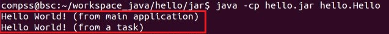
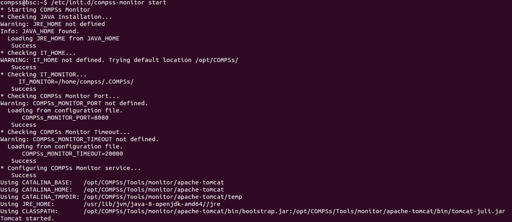

=====================
Application execution
=====================

Executing COMPSs applications
=============================

Prerequisites
-------------

Prerequisites vary depending on the application’s code language: for
Java applications the users need to have a **jar archive** containing
all the application classes, for Python applications there are no
requirements and for C/C++ applications the code must have been
previously compiled by using the *buildapp* command.

For further information about how to develop COMPSs applications please
refer to the *COMPSs User Manual: Application development guide*
available at the http://compss.bsc.es/ webpage.

Runcompss command
-----------------

COMPSs applications are executed using the **runcompss** command:

.. code-block:: console

    $ runcompss [options] application_name [application_arguments]

The application name must be the fully qualified name of the application
in Java, the path to the *.py* file containing the main program in
Python and the path to the master binary in C/C++.

The application arguments are the ones passed as command line to main
application. This parameter can be empty.

The ``runcompss`` command allows the users to customize a COMPSs
execution by specifying different options. For clarity purposes,
parameters are grouped in *Runtime configuration*, *Tools enablers* and
*Advanced options*.

.. code-block:: console

    $ runcompss -h

    Usage: runcompss [options] application_name application_arguments

    * Options:
      General:
        --help, -h                              Print this help message

        --opts                                  Show available options

        --version, -v                           Print COMPSs version

      Tools enablers:
        --graph=<bool>, --graph, -g             Generation of the complete graph (true/false)
                                                When no value is provided it is set to true
                                                Default: false
        --tracing=<level>, --tracing, -t        Set generation of traces and/or tracing level
                                                ( [ true | basic ] | advanced | false)
                                                True and basic levels will produce the same traces.
                                                When no value is provided it is set to true
                                                Default: false
        --monitoring=<int>, --monitoring, -m    Period between monitoring samples (milliseconds)
                                                When no value is provided it is set to 2000
                                                Default: 0
        --external_debugger=<int>,
        --external_debugger                     Enables external debugger connection on the specified
                                                port (or 9999 if empty)
                                                Default: false

      Runtime configuration options:
        --task_execution=<compss|storage>       Task execution under COMPSs or Storage.
                                                Default: compss
        --storage_conf=<path>                   Path to the storage configuration file
                                                Default: None
        --project=<path>                        Path to the project XML file
                                                Default: /opt/COMPSs/Runtime/configuration/xml/
                                                projects/default_project.xml
        --resources=<path>                      Path to the resources XML file
                                                Default: /opt/COMPSs/Runtime/configuration/xml/
                                                resources/default_resources.xml
        --lang=<name>                           Language of the application (java/c/python)
                                                Default: java
        --summary                               Displays a task execution summary at the end of
                                                the application execution
                                                Default: false
        --log_level=<level>, --debug, -d        Set the debug level: off | info | debug
                                                Default: off

      Advanced options:
        --extrae_config_file=<path>             Sets a custom extrae config file. Must be in a shared disk
                                                between all COMPSs workers.
                                                Default: null
        --comm=<ClassName>                      Class that implements the adaptor for communications
                                                Supported adaptors: es.bsc.compss.nio.master.NIOAdaptor
                                                                  | es.bsc.compss.gat.master.GATAdaptor
                                                Default: es.bsc.compss.nio.master.NIOAdaptor
        --conn=<className>                      Class that implements the runtime connector for the cloud
                                                Supported connectors:
                                                            es.bsc.compss.connectors.DefaultSSHConnector
                                                          | es.bsc.compss.connectors.DefaultNoSSHConnector
                                                Default: es.bsc.compss.connectors.DefaultSSHConnector
        --scheduler=<className>                 Class that implements the Scheduler for COMPSs
                                                Supported schedulers:
                                                  es.bsc.compss.scheduler.fullGraphScheduler.FullGraphScheduler
                                                | es.bsc.compss.scheduler.fifoScheduler.FIFOScheduler
                                                | es.bsc.compss.scheduler.resourceEmptyScheduler.
                                                  ResourceEmptyScheduler
                                                Default: es.bsc.compss.scheduler.loadBalancingScheduler.
                                                         LoadBalancingScheduler
        --scheduler_config_file=<path>          Path to the file which contains the scheduler configuration.
                                                Default: Empty
        --library_path=<path>                   Non-standard directories to search for libraries (e.g. Java JVM
                                                library, Python library, C binding library)
                                                Default: Working Directory
        --classpath=<path>                      Path for the application classes / modules
                                                Default: Working Directory
        --appdir=<path>                         Path for the application class folder.
                                                Default: /home/user/
        --pythonpath=<path>                     Additional folders or paths to add to the PYTHONPATH
                                                Default: /home/user/
        --base_log_dir=<path>                   Base directory to store COMPSs log files (a .COMPSs/ folder
                                                will be created inside this location)
                                                Default: User home
        --specific_log_dir=<path>               Use a specific directory to store COMPSs log files (the folder
                                                MUST exist and no sandbox is created)
                                                Warning: Overwrites --base_log_dir option
                                                Default: Disabled
        --uuid=<int>                            Preset an application UUID
                                                Default: Automatic random generation
        --master_name=<string>                  Hostname of the node to run the COMPSs master
                                                Default:
        --master_port=<int>                     Port to run the COMPSs master communications.
                                                Only for NIO adaptor
                                                Default: [43000,44000]
        --jvm_master_opts="<string>"            Extra options for the COMPSs Master JVM. Each option separed
                                                by "," and without blank spaces (Notice the quotes)
                                                Default:
        --jvm_workers_opts="<string>"           Extra options for the COMPSs Workers JVMs. Each option separed
                                                by "," and without blank spaces (Notice the quotes)
                                                Default: -Xms1024m,-Xmx1024m,-Xmn400m
        --cpu_affinity="<string>"               Sets the CPU affinity for the workers
                                                Supported options: disabled, automatic, user defined map of
                                                the form "0-8/9,10,11/12-14,15,16"
                                                Default: automatic
        --gpu_affinity="<string>"               Sets the GPU affinity for the workers
                                                Supported options: disabled, automatic, user defined map of
                                                the form "0-8/9,10,11/12-14,15,16"
                                                Default: automatic
        --task_count=<int>                      Only for C/Python Bindings. Maximum number of different
                                                functions/methods, invoked from the application, that have
                                                been selected as tasks
                                                Default: 50
        --input_profile=<path>                  Path to the file which stores the input application profile
                                                Default: Empty
        --output_profile=<path>                 Path to the file to store the application profile at the end of
                                                the execution
                                                Default: Empty
        --PyObject_serialize=<bool>             Only for Python Binding. Enable the object serialization to
                                                string when possible (true/false).
                                                Default: false
        --persistent_worker_c=<bool>            Only for C Binding. Enable the persistent worker in c
                                                (true/false).
                                                Default: false
        --enable_external_adaptation=<bool>     Enable external adaptation. This option will disable the
                                                Resource Optimizer.
                                                Default: false

    * Application name:
        For Java applications:   Fully qualified name of the application
        For C applications:      Path to the master binary
        For Python applications: Path to the .py file containing the main program

    * Application arguments:
        Command line arguments to pass to the application. Can be empty.

Running a COMPSs application
----------------------------

Before running COMPSs applications the application files **must** be in
the **CLASSPATH**. Thus, when launching a COMPSs application, users can
manually pre-set the **CLASSPATH** environment variable or can add the
``--classpath`` option to the ``runcompss`` command.

The next three sections provide specific information for launching
COMPSs applications developed in different code languages (Java, Python
and C/C++). For clarity purposes, we will use the *Simple*
application (developed in Java, Python and C++) available in the
COMPSs Virtual Machine or at https://compss.bsc.es/projects/bar webpage.
This application takes an integer as input parameter and increases it by
one unit using a task. For further details about the codes please refer
to the *Sample Applications* document available at http://compss.bsc.es
.

Running Java applications
~~~~~~~~~~~~~~~~~~~~~~~~~

A Java COMPSs application can be launched through the following command:

.. code-block:: console

    compss@bsc:~$ cd tutorial_apps/java/simple/jar/
    compss@bsc:~/tutorial_apps/java/simple/jar$ runcompss simple.Simple <initial_number>

.. code-block:: console

    compss@bsc:~/tutorial_apps/java/simple/jar$ runcompss simple.Simple 1
    [  INFO] Using default execution type: compss
    [  INFO] Using default location for project file: /opt/COMPSs/Runtime/configuration/xml/projects/default_project.xml
    [  INFO] Using default location for resources file: /opt/COMPSs/Runtime/configuration/xml/resources/default_resources.xml
    [  INFO] Using default language: java

    ----------------- Executing simple.Simple --------------------------

    WARNING: COMPSs Properties file is null. Setting default values
    [(1066)    API]  -  Starting COMPSs Runtime v<version>
    Initial counter value is 1
    Final counter value is 2
    [(4740)    API]  -  Execution Finished

    ------------------------------------------------------------

In this first execution we use the default value of the ``–classpath``
option to automatically add the jar file to the classpath (by executing
runcompss in the directory which contains the jar file). However, we can
explicitly do this by exporting the **CLASSPATH** variable or by
providing the ``–classpath`` value. Next, we provide two more ways to
perform the same execution:

.. code-block:: console

    compss@bsc:~$ export CLASSPATH=$CLASSPATH:/home/compss/tutorial_apps/java/simple/jar/simple.jar
    compss@bsc:~$ runcompss simple.Simple <initial_number>

.. code-block:: console

    compss@bsc:~$ runcompss --classpath=/home/compss/tutorial_apps/java/simple/jar/simple.jar
                            simple.Simple <initial_number>

Running Python applications
~~~~~~~~~~~~~~~~~~~~~~~~~~~

To launch a COMPSs Python application users have to provide the
``–lang=python`` option to the runcompss command. If the extension of
the main file is a regular Python extension (``.py`` or ``.pyc``) the
*runcompss* command can also infer the application language without
specifying the *lang* flag.

.. code-block:: console

    compss@bsc:~$ cd tutorial_apps/python/simple/
    compss@bsc:~/tutorial_apps/python/simple$ runcompss --lang=python ./simple.py <initial_number>

.. code-block:: console

    compss@bsc:~/tutorial_apps/python/simple$ runcompss simple.py 1
    [  INFO] Using default execution type: compss
    [  INFO] Using default location for project file: /opt/COMPSs/Runtime/configuration/xml/projects/default_project.xml
    [  INFO] Using default location for resources file: /opt/COMPSs/Runtime/configuration/xml/resources/default_resources.xml
    [  INFO] Inferred PYTHON language

    ----------------- Executing simple.py --------------------------

    WARNING: COMPSs Properties file is null. Setting default values
    [(616)    API]  -  Starting COMPSs Runtime v<version>
    Initial counter value is 1
    Final counter value is 2
    [(4297)    API]  -  Execution Finished

    ------------------------------------------------------------

**Attention**: Executing without debug (e.g. default log level or
``–log_level=off``) uses -O2 compiled sources, disabling ``asserts``
and ``__debug__``.

Alternatively, it is possible to execute the a COMPSs Python application
using ``pycompss`` as module:

.. code-block:: console

    $ python -m pycompss <runcompss_flags> <application> <application_parameters>

Consequently, the previous example could also be run as follows:

.. code-block:: console

    compss@bsc:~$ cd tutorial_apps/python/simple/
    compss@bsc:~/tutorial_apps/python/simple$ python -m pycompss simple.py <initial_number>

If the ``-m pycompss`` is not set, the application will be run ignoring
all PyCOMPSs imports, decorators and API calls, that is, sequentially.

In order to run a COMPSs Python application with a different
interpreter, the *runcompss* command provides a specific flag:

.. code-block:: console

    compss@bsc:~$ cd tutorial_apps/python/simple/
    compss@bsc:~/tutorial_apps/python/simple$ runcompss --python_interpreter=python3 ./simple.py <initial_number>

However, when using the *pycompss* module, it is inferred from the
python used in the call:

.. code-block:: console

    compss@bsc:~$ cd tutorial_apps/python/simple/
    compss@bsc:~/tutorial_apps/python/simple$ python3 -m pycompss simple.py <initial_number>

Finally, both *runcompss* and *pycompss* module provide a particular
flag for virtual environment propagation
(``--python_propagate_virtual_environment=<bool>``). This, flag is
intended to activate the current virtual environment in the worker nodes
when set to true.

Running C/C++ applications
~~~~~~~~~~~~~~~~~~~~~~~~~~~~~~~~

To launch a COMPSs C/C++ application users have to compile the
C/C++ application by means of the ``buildapp`` command. For
further information please refer to the *COMPSs User Manual: Application
development guide* document available at http://compss.bsc.es . Once
complied, the ``–lang=c`` option must be provided to the runcompss
command. If the main file is a C/C++ binary the *runcompss* command
can also infer the application language without specifying the *lang*
flag.

.. code-block:: console

    compss@bsc:~$ cd tutorial_apps/c/simple/
    compss@bsc:~/tutorial_apps/c/simple$ runcompss --lang=c simple <initial_number>

.. code-block:: console

    compss@bsc:~/tutorial_apps/c/simple$ runcompss ~/tutorial_apps/c/simple/master/simple 1
    [  INFO] Using default execution type: compss
    [  INFO] Using default location for project file: /opt/COMPSs/Runtime/configuration/xml/projects/default_project.xml
    [  INFO] Using default location for resources file: /opt/COMPSs/Runtime/configuration/xml/resources/default_resources.xml
    [  INFO] Inferred C/C++ language

    ----------------- Executing simple --------------------------

    JVM_OPTIONS_FILE: /tmp/tmp.ItT1tQfKgP
    COMPSS_HOME: /opt/COMPSs
    Args: 1

    WARNING: COMPSs Properties file is null. Setting default values
    [(650)    API]  -  Starting COMPSs Runtime v<version>
    Initial counter value is 1
    [   BINDING]  -  @compss_wait_on  -  Entry.filename: counter
    [   BINDING]  -  @compss_wait_on  -  Runtime filename: d1v2_1497432831496.IT
    Final counter value is 2
    [(4222)    API]  -  Execution Finished

    ------------------------------------------------------------

Additional configurations
-------------------------

The COMPSs runtime has two configuration files: ``resources.xml`` and
``project.xml`` . These files contain information about the execution
environment and are completely independent from the application.

For each execution users can load the default configuration files or
specify their custom configurations by using, respectively, the
``–resources=<absolute_path_to_resources.xml>`` and the
``–project=<absolute_path_to_project.xml>`` in the ``runcompss``
command. The default files are located in the
``/opt/COMPSs/Runtime/configuration/xml/`` path. Users can manually edit
these files or can use the *Eclipse IDE* tool developed for COMPSs. For
further information about the *Eclipse IDE* please refer to Section
[subsec:IDE].

 

For further details please check the *Configuration Files* Section
inside the *COMPSs Installation and Administration Manual* available at
http://compss.bsc.es/releases/compss/latest/docs/COMPSs_Installation_Manual.pdf
.

Results and logs
================

Results
-------

When executing a COMPSs application we consider different type of
results:

-  **Application Output:** Output generated by the application.

-  **Application Files:** Files used or generated by the application.

-  **Tasks Output:** Output generated by the tasks invoked from the application.

Regarding the application output, COMPSs will preserve the application
output but will add some pre and post output to indicate the COMPSs
Runtime state. Figure [fig:compss\_out] shows the standard output
generated by the execution of the Simple Java application. The green box
highlights the application ``stdout`` while the rest of the output is
produced by COMPSs.

.. figure:: ./Figures/app_execution/simple_java_stdout.jpeg
   :alt: Output generated by the execution of the *Simple* Java application with COMPSs
   :width: 95.0%

   Output generated by the execution of the *Simple* Java application
   with COMPSs

Regarding the application files, COMPSs **does not modify** any of them
and thus, the results obtained by executing the application with COMPSs
are the same than the ones generated by the sequential execution of the
application.

Regarding the tasks output, COMPSs introduces some modifications due
to the fact that tasks can be executed in remote machines. After the
execution, COMPSs stores the *stdout* and the *stderr* of each job (a
task execution) inside the
**``/home/$USER/.COMPSs/$APPNAME/$EXEC_NUMBER/jobs/``** directory of
the main application node.

Figures [fig:hello\_seq] and [fig:hello\_compss] show an example of the
results obtained from the execution of the *Hello* Java application.
While Figure [fig:hello\_seq] provides the output of the sequential
execution of the application (without COMPSs), Figure
[fig:hello\_compss] provides the output of the equivalent COMPSs
execution. Please note that the sequential execution produces the
``Hello World! (from a task)`` message in the ``stdout`` while the
COMPSs execution stores the message inside the ``job1_NEW.out`` file.

   Sequential execution of the *Hello* java application

.. figure:: ./Figures/app_execution/hello_compss_stdout_and_job.jpeg
   :alt: COMPSs execution of the *Hello* java application

   COMPSs execution of the *Hello* java application

Logs
----

COMPSs includes three log levels for running applications but users can
modify them or add more levels by editing the logger files under the
``/opt/COMPSs/Runtime/configuration`` ``/log/`` folder. Any of these log
levels can be selected by adding the ``–log_level=<debug | info | off>``
flag to the ``runcompss`` command. The default value is ``off``.

The logs generated by the ``NUM_EXEC`` execution of the application APP
by the user USER are stored under
``/home/$USER/.COMPSs/$APP/$EXEC_NUMBER/`` folder (from this point on:
**base log folder**). The ``EXEC_NUMBER`` execution number is
automatically used by COMPSs to prevent mixing the logs of data of
different executions.

When running COMPSs with **log level off** only the errors are reported.
This means that the *base log folder* will contain two empty files
(``runtime.log`` and ``resources.log``) and one empty folder (``jobs``).
If somehow the application has failed, the ``runtime.log`` and/or the
``resources.log`` will not be empty and a new file per failed job will
appear inside the ``jobs`` folder to store the ``stdout`` and the
``stderr``. Figure [fig:simple\_log\_off] shows the logs generated by
the execution of the Simple java application (without errors) in **off**
mode.

   Structure of the logs folder for the Simple java application in
   **off** mode

When running COMPSs with **log level info** the *base log folder* will
contain two files (``runtime.log`` and ``resources.log``) and one folder
(``jobs``). The ``runtime.log`` file contains the execution information
retrieved from the master resource, including the file transfers and the
job submission details. The ``resources.log`` file contains information
about the available resources such as the number of processors of each
resource (slots), the information about running or pending tasks in the
resource queue and the created and destroyed resources. The jobs folder
will be empty unless there has been a failed job. In this case it will
store, for each failed job, one file for the ``stdout`` and another for
the ``stderr``. As an example, Figure [fig:simple\_log\_info] shows the
logs generated by the same execution than the previous case but with
**info** mode.

   Structure of the logs folder for the Simple java application in
   **info** mode

The ``runtime.log`` and ``resources.log`` are quite large files, thus
they should be only checked by advanced users. For an easier
interpretation of these files the COMPSs Framework includes a monitor
tool. For further information about the COMPSs Monitor please check
Section [subsec:monitor].

Figures [fig:simple\_runtimelog] and [fig:simple\_resourceslog] provide
the content of these two files generated by the execution of the
*Simple* java application.

   runtime.log generated by the execution of the *Simple* java
   application

   resources.log generated by the execution of the *Simple* java
   application

Running COMPSs with **log level debug** generates the same files as the
info log level but with more detailed information. Additionally, the
``jobs`` folder contains two files per **submitted** job; one for the
``stdout`` and another for the ``stderr``. In the other hand, the COMPSs
Runtime state is printed out on the ``stdout``. Figure
[fig:simple\_log\_debug] shows the logs generated by the same execution
than the previous cases but with **debug** mode.

The runtime.log and the resources.log files generated in this mode can
be **extremely large**. Consequently, the users should take care of
their quota and manually erase these files if needed.

.. figure:: ./Figures/app_execution/simple_log_debug.jpeg
   :alt: Structure of the logs folder for the Simple java application in **debug** mode
   :width: 40.0%

   Structure of the logs folder for the Simple java application in
   **debug** mode

When running Python applications a ``pycompss.log`` file is written
inside the *base log folder* containing debug information about the
specific calls to PyCOMPSs.

Furthermore, when running ``runcompss`` with additional flags (such as
monitoring or tracing) additional folders will appear inside the *base
log folder*. The meaning of the files inside these folders is explained
in Section [sec:Tools].

COMPSs Tools
============

Application graph
-----------------

At the end of the application execution a dependency graph can be
generated representing the order of execution of each type of task and
their dependencies. To allow the final graph generation the ``-g`` flag
has to be passed to the ``runcompss`` command; the graph file is written
in the ``base_log_folder/monitor/complete_graph.dot`` at the end of the
execution.

Figure [fig:complete\_graph] shows a dependency graph example of a
*SparseLU* java application. The graph can be visualized by running the
following command:

.. code-block:: console

    compss@bsc:~$ compss_gengraph ~/.COMPSs/sparseLU.arrays.SparseLU_01/monitor/complete_graph.dot

.. figure:: ./Figures/app_execution/dependency_graph.jpeg
   :alt: The dependency graph of the SparseLU application
   :width: 40.0%

   The dependency graph of the SparseLU application

COMPSs Monitor
--------------

The COMPSs Framework includes a Web graphical interface that can be used
to monitor the execution of COMPSs applications. COMPSs Monitor is
installed as a service and can be easily managed by running any of the
following commands:

.. code-block:: console

    compss@bsc:~$ /etc/init.d/compss-monitor usage
    Usage: compss-monitor {start | stop | reload | restart | try-restart | force-reload | status}

Service configuration
~~~~~~~~~~~~~~~~~~~~~

The COMPSs Monitor service can be configured by editing the
``/opt/COMPSs/Tools/monitor/apache-tomcat/conf/compss-monitor.conf`` file which contains
one line per property:

-  ``COMPSS_MONITOR`` Default directory to retrieve monitored
   applications (defaults to the ``.COMPSs`` folder inside the ``root``
   user).

-  ``COMPSs_MONITOR_PORT`` Port where to run the compss-monitor web
   service (defaults to 8080).

-  ``COMPSs_MONITOR_TIMEOUT`` Web page timeout between browser and
   server (defaults to 20s).

Usage
~~~~~

In order to use the COMPSs Monitor users need to start the service as
shown in Figure [fig:monitor\_start].

   COMPSs Monitor start command

And use a web browser to open the specific URL:

.. code-block:: console

    compss@bsc:~$ firefox http://localhost:8080/compss-monitor &

The COMPSs Monitor allows to monitor applications from different users
and thus, users need to first login to access their applications. As
shown in Figure [fig:monitoring\_interface], the users can select any of
their executed or running COMPSs applications and display it.

   COMPSs monitoring interface

 

To enable **all** the COMPSs Monitor features, applications must run the
``runcompss`` command with the ``-m`` flag. This flag allows the COMPSs
Runtime to store special information inside inside the
``log_base_folder`` under the ``monitor`` folder (see Figures
[fig:simple\_exec\_monitor] and [fig:simple\_logs\_monitor]). Only
advanced users should modify or delete any of these files. If the
application that a user is trying to monitor has not been executed with
this flag, some of the COMPSs Monitor features will be disabled.

.. code-block:: console

    compss@bsc:~/tutorial_apps/java/simple/jar$ runcompss -dm simple.Simple 1
    [  INFO] Using default execution type: compss
    [  INFO] Using default location for project file: /opt/COMPSs/Runtime/configuration/xml/projects/default_project.xml
    [  INFO] Using default location for resources file: /opt/COMPSs/Runtime/configuration/xml/resources/default_resources.xml
    [  INFO] Using default language: java

    ----------------- Executing simple.Simple --------------------------

    WARNING: COMPSs Properties file is null. Setting default values
    [(799)    API]  -  Deploying COMPSs Runtime v<version>
    [(801)    API]  -  Starting COMPSs Runtime v<version>
    [(801)    API]  -  Initializing components
    [(1290)    API]  -  Ready to process tasks
    [(1293)    API]  -  Opening /home/compss/tutorial_apps/java/simple/jar/counter in mode OUT
    [(1338)    API]  -  File target Location: /home/compss/tutorial_apps/java/simple/jar/counter
    Initial counter value is 1
    [(1340)    API]  -  Creating task from method increment in simple.SimpleImpl
    [(1340)    API]  -  There is 1 parameter
    [(1341)    API]  -    Parameter 1 has type FILE_T
    Final counter value is 2
    [(4307)    API]  -  No more tasks for app 1
    [(4311)    API]  -  Getting Result Files 1
    [(4340)    API]  -  Stop IT reached
    [(4344)    API]  -  Stopping Graph generation...
    [(4344)    API]  -  Stopping Monitor...
    [(6347)    API]  -  Stopping AP...
    [(6348)    API]  -  Stopping TD...
    [(6509)    API]  -  Stopping Comm...
    [(6510)    API]  -  Runtime stopped
    [(6510)    API]  -  Execution Finished

    ------------------------------------------------------------

.. figure:: ./Figures/app_execution/logs_with_monitor.jpeg
   :alt: Logs generated by the Simple java application with the monitoring flag enabled
   :width: 60.0%

   Logs generated by the Simple java application with the monitoring
   flag enabled

Graphical Interface features
~~~~~~~~~~~~~~~~~~~~~~~~~~~~

In this section we provide a summary of the COMPSs Monitor supported
features available through the graphical interface:

-  **Resources information** Provides information about the resources
   used by the application

-  **Tasks information** Provides information about the tasks definition
   used by the application

-  **Current tasks graph** Shows the tasks dependency graph currently
   stored into the COMPSs Runtime

-  **Complete tasks graph** Shows the complete tasks dependecy graph of
   the application

-  **Load chart** Shows different dynamic charts representing the
   evolution over time of the resources load and the tasks load

-  **Runtime log** Shows the runtime log

-  **Execution Information** Shows specific job information allowing
   users to easily select failed or uncompleted jobs

-  **Statistics** Shows application statistics such as the accumulated
   cloud cost.

**Attention**: To enable all the COMPSs Monitor features applications
must run with the ``-m`` flag.

The webpage also allows users to configure some performance parameters
of the monitoring service by accessing the *Configuration* button at the
top-right corner of the web page.

For specific COMPSs Monitor feature configuration please check our *FAQ*
section at the top-right corner of the web page.

Application tracing
-------------------

COMPSs Runtime can generate a post-execution trace of the execution of
the application. This trace is useful for performance analysis and
diagnosis.

A trace file may contain different events to determine the COMPSs master
state, the task execution state or the file-transfers. The current
release does not support file-transfers informations.

During the execution of the application, an XML file is created in the
worker nodes to keep track of these events. At the end of the execution,
all the XML files are merged to get a final trace file.

In this manual we only provide information about how to obtain a trace
and about the available Paraver (the tool used to analyze the traces)
configurations. For further information about the application
instrumentation or the trace visualization and configurations please
check the *COMPSs Tracing Manual* available at http://compss.bsc.es .

Trace Command
~~~~~~~~~~~~~

In order to obtain a post-execution trace file one of the following
options ``-t``, ``–tracing``, ``–tracing=true``, ``–tracing=basic`` must
be added to the ``runcompss`` command. All this options activate the
basic tracing mode; the advanced mode is activated with the option
``–tracing=advanced``. For further information about advanced mode check
the *COMPSs Tracing Manual*. Next, we provide an example of the command
execution with the basic tracing option enabled for a java K-Means
application.

.. code-block:: console

    compss@bsc:~$ runcompss -t kmeans.Kmeans
    *** RUNNING JAVA APPLICATION KMEANS
    [  INFO] Relative Classpath resolved: /path/to/jar/kmeans.jar

    ----------------- Executing kmeans.Kmeans --------------------------

    Welcome to Extrae VERSION
    Extrae: Parsing the configuration file (/opt/COMPSs/Runtime/configuration/xml/tracing/extrae_basic.xml) begins
    Extrae: Warning! <trace> tag has no <home> property defined.
    Extrae: Generating intermediate files for Paraver traces.
    Extrae: <cpu> tag at <counters> level will be ignored. This library does not support CPU HW.
    Extrae: Tracing buffer can hold 100000 events
    Extrae: Circular buffer disabled.
    Extrae: Dynamic memory instrumentation is disabled.
    Extrae: Basic I/O memory instrumentation is disabled.
    Extrae: System calls instrumentation is disabled.
    Extrae: Parsing the configuration file (/opt/COMPSs/Runtime/configuration/xml/tracing/extrae_basic.xml) has ended
    Extrae: Intermediate traces will be stored in /user/folder
    Extrae: Tracing mode is set to: Detail.
    Extrae: Successfully initiated with 1 tasks and 1 threads

    WARNING: COMPSs Properties file is null. Setting default values
    [(751)    API]  -  Deploying COMPSs Runtime v<version>
    [(753)    API]  -  Starting COMPSs Runtime v<version>
    [(753)    API]  -  Initializing components
    [(1142)   API]  -  Ready to process tasks
    ...
    ...
    ...
    merger: Output trace format is: Paraver
    merger: Extrae 3.3.0 (revision 3966 based on extrae/trunk)
    mpi2prv: Assigned nodes < Marginis >
    mpi2prv: Assigned size per processor < <1 Mbyte >
    mpi2prv: File set-0/TRACE@Marginis.0000001904000000000000.mpit is object 1.1.1 on node Marginis assigned to processor 0
    mpi2prv: File set-0/TRACE@Marginis.0000001904000000000001.mpit is object 1.1.2 on node Marginis assigned to processor 0
    mpi2prv: File set-0/TRACE@Marginis.0000001904000000000002.mpit is object 1.1.3 on node Marginis assigned to processor 0
    mpi2prv: File set-0/TRACE@Marginis.0000001980000001000000.mpit is object 1.2.1 on node Marginis assigned to processor 0
    mpi2prv: File set-0/TRACE@Marginis.0000001980000001000001.mpit is object 1.2.2 on node Marginis assigned to processor 0
    mpi2prv: File set-0/TRACE@Marginis.0000001980000001000002.mpit is object 1.2.3 on node Marginis assigned to processor 0
    mpi2prv: File set-0/TRACE@Marginis.0000001980000001000003.mpit is object 1.2.4 on node Marginis assigned to processor 0
    mpi2prv: File set-0/TRACE@Marginis.0000001980000001000004.mpit is object 1.2.5 on node Marginis assigned to processor 0
    mpi2prv: Time synchronization has been turned off
    mpi2prv: A total of 9 symbols were imported from TRACE.sym file
    mpi2prv: 0 function symbols imported
    mpi2prv: 9 HWC counter descriptions imported
    mpi2prv: Checking for target directory existance... exists, ok!
    mpi2prv: Selected output trace format is Paraver
    mpi2prv: Stored trace format is Paraver
    mpi2prv: Searching synchronization points... done
    mpi2prv: Time Synchronization disabled.
    mpi2prv: Circular buffer enabled at tracing time? NO
    mpi2prv: Parsing intermediate files
    mpi2prv: Progress 1 of 2 ... 5% 10% 15% 20% 25% 30% 35% 40% 45% 50% 55% 60% 65% 70% 75% 80% 85% 90% 95% done
    mpi2prv: Processor 0 succeeded to translate its assigned files
    mpi2prv: Elapsed time translating files: 0 hours 0 minutes 0 seconds
    mpi2prv: Elapsed time sorting addresses: 0 hours 0 minutes 0 seconds
    mpi2prv: Generating tracefile (intermediate buffers of 838848 events)
             This process can take a while. Please, be patient.
    mpi2prv: Progress 2 of 2 ... 5% 10% 15% 20% 25% 30% 35% 40% 45% 50% 55% 60% 65% 70% 75% 80% 85% 90% 95% done
    mpi2prv: Warning! Clock accuracy seems to be in microseconds instead of nanoseconds.
    mpi2prv: Elapsed time merge step: 0 hours 0 minutes 0 seconds
    mpi2prv: Resulting tracefile occupies 991743 bytes
    mpi2prv: Removing temporal files... done
    mpi2prv: Elapsed time removing temporal files: 0 hours 0 minutes 0 seconds
    mpi2prv: Congratulations! ./trace/kmeans.Kmeans_compss_trace_1460456106.prv has been generated.
    [   API]  -  Execution Finished

    ------------------------------------------------------------

At the end of the execution the trace will be stored inside the
``trace`` folder under the application log directory.

.. code-block:: console

    compss@bsc:~$ cd .COMPSs/kmeans.Kmeans_01/trace/
    compss@bsc:~$ ls -1
    kmeans.Kmeans_compss_trace_1460456106.pcf
    kmeans.Kmeans_compss_trace_1460456106.prv
    kmeans.Kmeans_compss_trace_1460456106.row

Trace visualization
~~~~~~~~~~~~~~~~~~~

The traces generated by an application execution are ready to be
visualized with *Paraver*. *Paraver* is a powerful tool developed by
*BSC* that allows users to show many views of the trace data by means of
different configuration files. Users can manually load, edit or create
configuration files to obtain different trace data views.

If *Paraver* is installed, issue the following command to visualize a
given tracefile:

.. code-block:: console

    compss@bsc:~$ wxparaver path/to/trace/trace_name.prv

For further information about *Paraver* please visit the following site:

http://www.bsc.es/computer-sciences/performance-tools/paraver

COMPSs IDE
----------

COMPSs IDE is an Integrated Development Environment to develop, compile,
deploy and execute COMPSs applications. It is available through the
*Eclipse Market* as a plugin and provides an even easier way to work
with COMPSs.

For further information please check the *COMPSs IDE User Guide*
available at: http://compss.bsc.es .

Special Execution Platforms
===========================

This section provides information about how to run COMPSs Applications
in specific platforms such as *Docker*, *Chameleon* or *MareNostrum*.

Docker
------

Introduction
~~~~~~~~~~~~

Docker is an open-source project that automates the deployment of
applications inside software containers, by providing an additional
layer of abstraction and automation of operating-system-level
virtualization on Linux. In addition to the Docker container engine,
there are other Docker tools that allow users to create complex
applications (Docker-Compose) or to manage a cluster of Docker
containers (Docker Swarm).

COMPSs supports running a distributed application in a Docker Swarm
cluster.

Requirements
~~~~~~~~~~~~

In order to use COMPSs with Docker, some requirements must be fulfilled:

-  Have **Docker** and **Docker-Compose** installed in your local
   machine.

-  Have an available **Docker Swarm cluster** and its Swarm manager ip
   and port to access it remotely.

-  A **Dockerhub account**. Dockerhub is an online repository for Docker
   images. We don’t currently support another sharing method besides
   uploading to Dockerhub, so you will need to create a personal
   account. This has the advantage that it takes very little time either
   upload or download the needed images, since it will reuse the
   existing layers of previous images (for example the COMPSs base
   image).

Execution
~~~~~~~~~

The runcompss-docker execution workflow uses Docker-Compose, which is
in charge of spawning the different application containers into the
Docker Swarm manager. Then the Docker Swarm manager schedules the
containers to the nodes and the application starts running.
The COMPSs master and workers will run in the nodes Docker Swarm
decides. To see where the masters and workers are located in runtime,
you can use:

.. code-block:: console

    $ docker -H '<swarm_manager_ip:swarm_port>' ps -a

The execution of an application using Docker containers with COMPSs
**consists of 2 steps**:

Execution step 1: Creation of the application image
~~~~~~~~~~~~~~~~~~~~~~~~~~~~~~~~~~~~~~~~~~~~~~~~~~~

The very first step to execute a COMPSs application in Docker is
creating your application Docker image.

This must be done **only once** for every new application, and then
you can run it as many times as needed. If the application is updated
for whatever reason, this step must be done again to create and share
the updated image.

In order to do this, you must use the **compss\_docker\_gen\_image**
tool, which is available in the standard COMPSs application. This tool
is the responsible of taking your application, create the needed
image, and upload it to Dockerhub to share it.

The image is created injecting your application into a COMPSs base
image. This base image is available in Dockerhub. In case you need it,
you can pull it using the following command:

.. code-block:: console

    $ docker pull compss/compss

The **compss\_docker\_gen\_image** script receives 2 parameters:

-  **--c, --context-dir:**
   Specifies the **context directory** path of the application. This
   path **MUST BE ABSOLUTE**, not relative. The context directory is a
   local directory that **must contain the needed binaries and input
   files of the app (if any)**. In its simplest case, it will contain
   the executable file (a .jar for example). Keep the
   context-directory as lightest as possible.

   For example: **--context-dir=’/home/compss-user/my-app-dir’** (where
   ’my-app-dir’ contains ’app.jar’, ’data1.dat’ and ’data2.csv’). For
   more details, this context directory will be recursively copied into
   a COMPSs base image. Specifically, it will create all the path down
   to the context directory inside the image.

-  **--image-name:**
   Specifies a name for the created image. It MUST have this format:
   ’DOCKERHUB-USERNAME/image-name’.
   The *DOCKERHUB\_USERNAME* must be the username of your personal
   Dockerhub account.
   The *image\_name* can be whatever you want, and will be used as the
   identifier for the image in Dockerhub. This name will be the one
   you will use to execute the application in Docker.
   For example, if my Dockerhub username is john123 and I want my
   image to be named “my-image-app”:
   –image-name=“john123/my-image-app”.

   As stated before, this is needed to share your container application
   image with the nodes that need it. Image tags are also supported (for
   example "john123/my-image-app:1.23).

**IMPORTANT NOTE:**
After creating the image, be sure to write down the absolute
context-directory and the absolute classpath (the absolute path to the
executable jar). You will need it to run the application using
**runcompss-docker**. In addition, if you plan on distributing the
application, you can use the Dockerhub image’s information tab to
write them, so the application users can retrieve them.

Execution step 2: Run the application
~~~~~~~~~~~~~~~~~~~~~~~~~~~~~~~~~~~~~

To execute COMPSs in a Docker Swarm cluster, you must use the
**runcompss-docker** command, instead of runcompss.

The command **runcompss-docker** has some **additional arguments**
that will be needed by COMPSs to run your application in a distributed
Docker Swarm cluster environment. The rest of typical arguments
(classpath for example) will be delegated to runcompss command.

These additional arguments must go before the typical runcompss
arguments. The runcompss-docker additional arguments are:

-   **--w, --worker-containers:**

Specifies the number of **worker containers** the app will execute
on. One more container will be created to host the **master**. If you
have enough nodes in the Swarm cluster, each container will be
executed by one node. This is the default schedule strategy used by
Swarm.
For example: **--worker-containers=3**

-   **--s, --swarm-manager:**

Specifies the Swarm manager ip and port (format: ip:port).
For example: **--swarm-manager=’129.114.108.8:4000’**

-   **--i, --image-name:**

Specify the image name of the application image in Dockerhub.
Remember you must generate this with compss\_docker\_gen\_image
Remember as well that the format must be:
’DOCKERHUB\_USERNAME/APP\_IMAGE\_NAME:TAG’ (the :TAG is optional).
For example: **--image-name=’john123/my-compss-application:1.9’**

-   **--c, --context-dir:**

Specifies the **context directory** of the app. It must be specified
by the application image provider.
For example:
**--context-dir=’/home/compss-user/my-app-context-dir’**.

As **optional** arguments:

-   **--c-cpu-units:**

Specifies the number of cpu units used by each container (default value is 4).
For example: **--c-cpu-units:=16**

-   **--c-memory:**

Specifies the physical memory used by each container in GB (default value is 8 GB).
For example, in this case, each container would use as maximum 32 GB
of physical memory: **--c-memory=32**

Here is the **format** you must use with **runcompss-docker** command:

.. code-block:: console

    $ runcompss-docker --worker-containers=N \
                       --swarm-manager='<ip>:<port>' \
                       --image-name='DOCKERHUB_USERNAME/image_name' \
                       --context-dir='CTX_DIR' \
                       [rest of classic runcompss args]

Or alternatively, in its shortest form:

.. code-block:: console

    $ runcompss-docker --w=N --s='<ip>:<port>' --i='DOCKERHUB_USERNAME/image_name' --c='CTX_DIR' \
                       [rest of classic runcompss args]

Execution with TLS
~~~~~~~~~~~~~~~~~~

If your cluster uses **TLS** or has been created using
**Docker-Machine**, you will have to **export two environment
variables** before using runcompss-docker:

On one hand, **DOCKER\_TLS\_VERIFY** environment variable will tell
Docker that you are using TLS:

.. code-block:: bash

    export DOCKER_TLS_VERIFY="1"

On the other hand, **DOCKER\_CERT\_PATH** variable will tell Docker
where to find your TLS certificates. As an example:

.. code-block:: bash

    export DOCKER_CERT_PATH="/home/compss-user/.docker/machine/machines/my-manager-node"

In case you have created your cluster using docker-machine, in order to
know what your *DOCKER\_CERT\_PATH* is, you can use this command:

.. code-block:: console

    $ docker-machine env my-swarm-manager-node-name | grep DOCKER_CERT_PATH

In which *swarm-manager-node-name* must be changed by the name
docker-machine has assigned to your swarm manager node.
With these environment variables set, you are ready to use
**runcompss-docker** in a cluster using TLS.

Execution results
~~~~~~~~~~~~~~~~~

The execution results will be retrieved from the master container of
your application.

If your context-directory name is **’matmul’**, then your results will
be saved in the **’matmul-results’** directory, which will be located
in the same directory you executed runcompss-docker on.

Inside the **’matmul-results’** directory you will have:

-  A folder named **’matmul’** with all the result files that were in
   the same directory as the executable when the application execution
   ended. More precisely, this will contain the context-directory state
   right after finishing your application execution.
   Additionally, and for more advanced debug purposes, you will have
   some intermediate files created by runcompss-docker (Dockerfile,
   project.xml, resources.xml), in case you want to check for more
   complex errors or details.

-  A folder named **’debug’**, which (in case you used the runcompss
   debug option (**-d**)), will contain the **’.COMPSs’** directory,
   which contains another directory in which there are the typical debug
   files runtime.log, jobs, etc.
   Remember **.COMPSs** is a **hidden** directory, take this into
   account if you do **ls** inside the debug directory (add the **-a**
   option).

To make it simpler, we provide a **tree visualization** of an example of
what your directories should look like after the execution. In this case
we executed the **Matmul example application** that we provide you:

 

.. figure:: ./Figures/app_execution/docker-matmul-results-tree.png
   :alt: Result and log folders of a *Matmul* execution with COMPSs and Docker
   :width: 60.0%

   Result and log folders of a *Matmul* execution with COMPSs and Docker

Execution examples
~~~~~~~~~~~~~~~~~~

Next we will use the *Matmul* application as an example of a Java
application running with COMPSs and Docker.

Imagine we have our Matmul application in ``/home/john/matmul`` and
inside the ``matmul`` directory we only have the file ``matmul.jar``.

We have created a Dockerhub account with username ’john123’.

The first step will be creating the image:

.. code-block:: console

    $ compss_docker_gen_image --context-dir='/home/john/matmul' \
                              --image-name='john123/matmul-example'

Now, we write down the context-dir (``/home/john/matmul``) and the
classpath (``/home/john/matmul/matmul.jar``). We do this because they will be
needed for future executions.
Since the image is created and uploaded, we won’t need to do this step
anymore.

 

Now we are going to execute our Matmul application in a Docker cluster.

Take as assumptions:

-  We will use **5 worker docker containers**.

-  The **swarm-manager ip** will be 129.114.108.8, with the Swarm
   manager listening to the **port** 4000.

-  We will use **debug (-d)**.

-  Finally, as we would do with the typical runcompss, we specify the
   **main class** name and its **parameters** (16 and 4 in this case).

In addition, we know from the former step that the image name is
``john123/matmul-example``, the **context directory** is
``/home/john/matmul``, and the classpath is
``/home/john/matmul/matmul.jar``. And this is how you would run
**runcompss-docker**:

.. code-block:: console

    $ runcompss-docker --worker-containers=5 \
                       --swarm-manager='129.114.108.8:4000' \
                       --context-dir='/home/john/matmul' \
                       --image-name='john123/matmul-example' \
                       --classpath=/home/john/matmul/matmul.jar \
                       -d \
                       matmul.objects.Matmul 16 4

Here we show another example using the short arguments form, with the
KMeans example application, that is also provided as an example COMPSs
application to you:

First step, create the image once:

.. code-block:: console

    $ compss_docker_gen_image --context-dir='/home/laura/apps/kmeans' \
                              --image-name='laura-67/my-kmeans'

And now execute with 30 worker containers, and Swarm located in
’110.3.14.159:26535’.

.. code-block:: console

    $ runcompss-docker --w=30 \
                       --s='110.3.14.159:26535' \
                       --c='/home/laura/apps/kmeans' \
                       --image-name='laura-67/my-kmeans' \
                       --classpath=/home/laura/apps/kmeans/kmeans.jar \
                       kmeans.KMeans

Chameleon
---------

Introduction
~~~~~~~~~~~~

The Chameleon project is a configurable experimental environment for
large-scale cloud research based on a *OpenStack* KVM Cloud. With
funding from the *National Science Foundation (NSF)*, it provides a
large-scale platform to the open research community allowing them
explore transformative concepts in deeply programmable cloud services,
design, and core technologies. The Chameleon testbed, is deployed at the
*University of Chicago* and the *Texas Advanced Computing Center* and
consists of 650 multi-core cloud nodes, 5PB of total disk space, and
leverage 100 Gbps connection between the sites.

The project is led by the *Computation Institute* at the *University of
Chicago* and partners from the *Texas Advanced Computing Center* at the
*University of Texas* at Austin, the *International Center for Advanced
Internet Research* at *Northwestern University*, the *Ohio State
University*, and *University of Texas* at *San Antoni*, comprising a
highly qualified and experienced team. The team includes members from
the *NSF* supported *FutureGrid* project and from the *GENI* community,
both forerunners of the *NSFCloud* solicitation under which this project
is funded. Chameleon will also sets of partnerships with commercial and
academic clouds, such as *Rackspace*, *CERN* and *Open Science Data
Cloud (OSDC)*.

For more information please check https://www.chameleoncloud.org/ .

Execution
~~~~~~~~~

Currently, COMPSs can only handle the Chameleon infrastructure as a
cluster (deployed inside a lease). Next, we provide the steps needed to
execute COMPSs applications at Chameleon:

-  Make a lease reservation with 1 minimum node (for the COMPSs master
   instance) and a maximum number of nodes equal to the number of COMPSs
   workers needed plus one

-  Instantiate the master image (based on the published image
   *COMPSs\_\_CC-CentOS7*)

-  Attach a public IP and login to the master instance (the instance is
   correctly contextualized for COMPSs executions if you see a COMPSs
   login banner)

-  Set the instance as COMPSs master by running
   ``/etc/init.d/chameleon_init start``

-  Copy your CH file (API credentials) to the Master and source it

-  Run the ``chameleon_cluster_setup`` script and fill the information
   when prompted (you will be asked for the name of the master instance,
   the reservation id and number of workers). This scripts may take
   several minutes since it sets up the all cluster.

-  Execute your COMPSs applications normally using the ``runcompss``
   script

As an example you can check this video
https://www.youtube.com/watch?v=BrQ6anPHjAU performing a full setup and
execution of a COMPSs application at Chameleon.

SuperComputers
--------------

To maintain the portability between different environments, COMPSs has a
pre-build structure (see Figure [fig:queue\_scripts\_structure]) to
execute applications in SuperComputers. For this purpose, users must use
the ``enqueue_compss`` script provided in the COMPSs installation. This
script has several parameters (see ``enqueue_compss -h``) that allow
users to customize their executions for any SuperComputer.

.. figure:: ./Figures/app_execution/queue_scripts_structure.png
   :alt: Structure of COMPSs queue scripts. In Blue user scripts, in Green queue scripts and in Orange system dependant scripts
   :width: 80.0%

   Structure of COMPSs queue scripts. In Blue user scripts, in Green
   queue scripts and in Orange system dependant scripts

To make this structure works, the administrators must define a
configuration file for the queue system and a configuration file for the
specific SuperComputer parameters. The COMPSs installation already
provides queue configurations for *LSF* and *SLURM* and several examples
for SuperComputer configurations. To create a new configuration we
recommend to use one of the configurations provided by COMPSs (such as
the configuration for the *MareNostrum IV* SuperComputer) or to contact
us at `support-compss@bsc.es <support-compss@bsc.es>`__ .

 

For information about how to submit COMPSs applications at any
Supercomputer please refer to the *COMPSs Supercomputers* manual
available at
http://compss.bsc.es/releases/compss/latest/docs/COMPSs_Supercomputers_Manual.pdf
.

Common Issues
=============

This section provides answers for the most common issues of the
execution of COMPSs applications. For specific issues not covered in
this section, please do not hesitate to contact us at:

**`support-compss@bsc.es <support-compss@bsc.es>`__**

How to debug
------------

When the application does not behave as expected the first thing users
must do is to run it in **debug** mode executing the ``runcompss``
command withthe ``-d`` flag to enable the debug log level.

In this case the application execution will produce the following files:

-  ``runtime.log``

-  ``resources.log``

-  ``jobs`` folder

First, users should check the last lines of the runtime.log. If the
file-transfers or the tasks are failing an error message will appear in
this file. If the file-transfers are successfully and the jobs are
submitted, users should check the ``jobs`` folder and look at the error
messages produced inside each job. Users should notice that if there are
:math:`\_RESUBMITTED` files something inside the job is failing.

Tasks are not executed
----------------------

If the tasks remain in **Blocked** state probably there are no existing
resources matching the specific task constraints. This error can be
potentially caused by two facts: the resources are not correctly loaded
into the runtime, or the task constraints do not match with any
resource.

In the first case, users should take a look at the ``resouces.log`` and
check that all the resources defined in the ``project.xml`` file are
available to the runtime. In the second case users should re-define the
task constraints taking into account the resources capabilities defined
into the ``resources.xml`` and ``project.xml`` files.

Jobs fail
---------

If all the application’s tasks fail because all the submitted jobs fail,
it is probably due to the fact that there is a resource
miss-configuration. In most of the cases, the resource that the
application is trying to access has no passwordless access through the
configured user. This can be checked by:

-  Open the ``project.xml``. (The default file is stored under
   ``/opt/COMPSs/ Runtime/configuration/xml/projects/project.xml``)

-  For each resource annotate its name and the value inside the ``User``
   tag. Remember that if there is no ``User`` tag COMPSs will try to
   connect this resource with the same username than the one that
   launches the main application.

-  For each annotated resourceName - user please try
   ``ssh user@resourceName``. If the connection asks for a password then
   there is an error in the configuration of the ssh access in the
   resource.

The problem can be solved running the following commands:

.. code-block:: console

    compss@bsc:~$ scp ~/.ssh/id_dsa.pub user@resourceName:./mydsa.pub
    compss@bsc:~$ ssh user@resourceName "cat mydsa.pub >> ~/.ssh/authorized_keys; rm ./mydsa.pub"

These commands are a quick solution, for further details please check
the *Additional Configuration* section inside the *COMPSs Installation
Manual* available at our website http://compss.bsc.es.

Compilation error: @Method not found
------------------------------------

When trying to compile Java applications users can get some of the
following compilation errors:

.. code-block:: console

    error: package es.bsc.compss.types.annotations does not exist
    import es.bsc.compss.types.annotations.Constraints;
                                              ^
    error: package es.bsc.compss.types.annotations.task does not exist
    import es.bsc.compss.types.annotations.task.Method;
                                              ^
    error: package es.bsc.compss.types.annotations does not exist
    import es.bsc.compss.types.annotations.Parameter;
                                              ^
    error: package es.bsc.compss.types.annotations.Parameter does not exist
    import es.bsc.compss.types.annotations.parameter.Direction;
                                                        ^
    error: package es.bsc.compss.types.annotations.Parameter does not exist
    import es.bsc.compss.types.annotations.parameter.Type;
                                                        ^
    error: cannot find symbol
    @Parameter(type = Type.FILE, direction = Direction.INOUT)
    ^
      symbol:   class Parameter
      location: interface APPLICATION_Itf

    error: cannot find symbol
    @Constraints(computingUnits = "2")
    ^
      symbol:   class Constraints
      location: interface APPLICATION_Itf

    error: cannot find symbol
    @Method(declaringClass = "application.ApplicationImpl")
    ^
      symbol:   class Method
      location: interface APPLICATION_Itf

All these errors are raised because the ``compss-engine.jar`` is not
listed in the CLASSPATH. The default COMPSs installation automatically
inserts this package into the CLASSPATH but it may have been overwritten
or deleted. Please check that your environment variable CLASSPATH
containts the ``compss-engine.jar`` location by running the following
command:

.. code-block:: console

    $ echo $CLASSPATH | grep compss-engine

If the result of the previous command is empty it means that you are
missing the ``compss-engine.jar`` package in your classpath.

The easiest solution is to manually export the CLASSPATH variable into
the user session:

.. code-block:: console

    $ export CLASSPATH=$CLASSPATH:/opt/COMPSs/Runtime/compss-engine.jar

However, you will need to remember to export this variable every time
you log out and back in again. Consequently, we recommend to add this
export to the ``.bashrc`` file:

.. code-block:: console

    $ echo "# COMPSs variables for Java compilation" >> ~/.bashrc
    $ echo "export CLASSPATH=$CLASSPATH:/opt/COMPSs/Runtime/compss-engine.jar" >> ~/.bashrc

Attention: The ``compss-engine.jar`` is installed inside the COMPSs
installation directory. If you have performed a custom installation,
the path of the package may be different.

Jobs failed on method reflection
--------------------------------

When executing an application the main code gets stuck executing a task.
Taking a look at the ``runtime.log`` users can check that the job
associated to the task has failed (and all its resubmissions too). Then,
opening the ``jobX_NEW.out`` or the ``jobX_NEW.err`` files users find
the following error:

.. code-block:: console

    [ERROR|es.bsc.compss.Worker|Executor] Can not get method by reflection
    es.bsc.compss.nio.worker.executors.Executor$JobExecutionException: Can not get method by reflection
            at es.bsc.compss.nio.worker.executors.JavaExecutor.executeTask(JavaExecutor.java:142)
            at es.bsc.compss.nio.worker.executors.Executor.execute(Executor.java:42)
            at es.bsc.compss.nio.worker.JobLauncher.executeTask(JobLauncher.java:46)
            at es.bsc.compss.nio.worker.JobLauncher.processRequests(JobLauncher.java:34)
            at es.bsc.compss.util.RequestDispatcher.run(RequestDispatcher.java:46)
            at java.lang.Thread.run(Thread.java:745)
    Caused by: java.lang.NoSuchMethodException: simple.Simple.increment(java.lang.String)
            at java.lang.Class.getMethod(Class.java:1678)
            at es.bsc.compss.nio.worker.executors.JavaExecutor.executeTask(JavaExecutor.java:140)
            ... 5 more

This error is due to the fact that COMPSs cannot find one of the tasks
declared in the Java Interface. Commonly this is triggered by one of the
following errors:

-  The *declaringClass* of the tasks in the Java Interface has not been
   correctly defined.

-  The parameters of the tasks in the Java Interface do not match the
   task call.

-  The tasks have not been defined as *public*.

Jobs failed on reflect target invocation null pointer
-----------------------------------------------------

When executing an application the main code gets stuck executing a task.
Taking a look at the ``runtime.log`` users can check that the job
associated to the task has failed (and all its resubmissions too). Then,
opening the ``jobX_NEW.out`` or the ``jobX_NEW.err`` files users find
the following error:

.. code-block:: console

    [ERROR|es.bsc.compss.Worker|Executor]
    java.lang.reflect.InvocationTargetException
            at sun.reflect.NativeMethodAccessorImpl.invoke0(Native Method)
            at sun.reflect.NativeMethodAccessorImpl.invoke(NativeMethodAccessorImpl.java:57)
            at sun.reflect.DelegatingMethodAccessorImpl.invoke(DelegatingMethodAccessorImpl.java:43)
            at java.lang.reflect.Method.invoke(Method.java:606)
            at es.bsc.compss.nio.worker.executors.JavaExecutor.executeTask(JavaExecutor.java:154)
            at es.bsc.compss.nio.worker.executors.Executor.execute(Executor.java:42)
            at es.bsc.compss.nio.worker.JobLauncher.executeTask(JobLauncher.java:46)
            at es.bsc.compss.nio.worker.JobLauncher.processRequests(JobLauncher.java:34)
            at es.bsc.compss.util.RequestDispatcher.run(RequestDispatcher.java:46)
            at java.lang.Thread.run(Thread.java:745)
    Caused by: java.lang.NullPointerException
            at simple.Ll.printY(Ll.java:25)
            at simple.Simple.task(Simple.java:72)
            ... 10 more

This cause of this error is that the Java object accessed by the task
has not been correctly transferred and one or more of its fields is
null. The transfer failure is normally caused because the transferred
object is not serializable.

Users should check that all the object parameters in the task are either
implementing the serializable interface or following the *java beans*
model (by implementing an empty constructor and getters and setters for
each attribute).

Tracing merge failed: too many open files
-----------------------------------------

When too many nodes and threads are instrumented, the tracing merge can
fail due to an OS limitation, namely: the maximum open files. This
problem usually happens when using advanced mode due to the larger
number of threads instrumented. To overcome this issue users have two
choices. **First option**, use *Extrae* parallel MPI merger. This merger
is automatically used if COMPSs was installed with MPI support. In
Ubuntu you can install the following packets to get MPI support:

.. code-block:: console

    $ sudo apt-get install libcr-dev mpich2 mpich2-doc

Please note that extrae is never compiled with MPI support when building
it locally (with buildlocal command).

To check if COMPSs was deployed with MPI support, you can check the
installation log and look for the following *Extrae* configuration
output:

.. code-block:: console

    Package configuration for Extrae VERSION based on extrae/trunk rev. 3966:
    -----------------------
    Installation prefix: /gpfs/apps/MN3/COMPSs/Trunk/Dependencies/extrae
    Cross compilation: no
    CC: gcc
    CXX: g++
    Binary type: 64 bits

    MPI instrumentation: yes
    	MPI home: /apps/OPENMPI/1.8.1-mellanox
    	MPI launcher: /apps/OPENMPI/1.8.1-mellanox/bin/mpirun

On the other hand, if you already installed COMPSs, you can check
*Extrae* configuration executing the script
``/opt/COMPSs/Dependencies/extrae/etc/configured.sh``. Users should
check that flags ``–with-mpi=/usr`` and ``–enable-parallel-merge`` are
present and that MPI path is correct and exists. Sample output:

.. code-block:: console

    EXTRAE_HOME is not set. Guessing from the script invoked that Extrae was installed in /opt/COMPSs/Dependencies/extrae
    The directory exists .. OK
    Loaded specs for Extrae from /opt/COMPSs/Dependencies/extrae/etc/extrae-vars.sh

    Extrae SVN branch extrae/trunk at revision 3966

    Extrae was configured with:
    $ ./configure --enable-gettimeofday-clock --without-mpi --without-unwind --without-dyninst --without-binutils --with-mpi=/usr --enable-parallel-merge --with-papi=/usr --with-java-jdk=/usr/lib/jvm/java-7-openjdk-amd64/ --disable-openmp --disable-nanos --disable-smpss --prefix=/opt/COMPSs/Dependencies/extrae --with-mpi=/usr --enable-parallel-merge --libdir=/opt/COMPSs/Dependencies/extrae/lib

    CC was gcc
    CFLAGS was -g -O2 -fno-optimize-sibling-calls -Wall -W
    CXX was g++
    CXXFLAGS was -g -O2 -fno-optimize-sibling-calls -Wall -W

    MPI_HOME points to /usr and the directory exists .. OK
    LIBXML2_HOME points to /usr and the directory exists .. OK
    PAPI_HOME points to /usr and the directory exists .. OK
    DYNINST support seems to be disabled
    UNWINDing support seems to be disabled (or not needed)
    Translating addresses into source code references seems to be disabled (or not needed)

    Please, report bugs to tools@bsc.es

**Disclaimer:** the parallel merge with MPI will not bypass the system’s
maximum number of open files, just distribute the files among the
resources. If all resources belong to the same machine, the merge will
fail anyways.

The **second option** is to increase the OS maximum number of open
files. For instance, in Ubuntu add `` ulimit -n 40000 `` just before the
start-stop-daemon line in the do\_start section.
