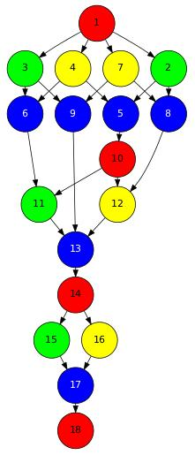
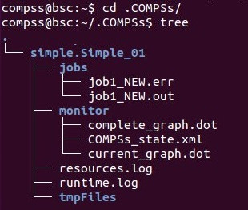

COMPSs Tools
============

Application graph
-----------------

At the end of the application execution a dependency graph can be
generated representing the order of execution of each type of task and
their dependencies. To allow the final graph generation the ``-g`` flag
has to be passed to the ``runcompss`` command; the graph file is written
in the ``base_log_folder/monitor/complete_graph.dot`` at the end of the
execution.

:numref:`complete_graph` shows a dependency graph example of a
*SparseLU* java application. The graph can be visualized by running the
following command:

.. code-block:: console

    compss@bsc:~$ compss_gengraph ~/.COMPSs/sparseLU.arrays.SparseLU_01/monitor/complete_graph.dot

   The dependency graph of the SparseLU application

COMPSs Monitor
--------------

The COMPSs Framework includes a Web graphical interface that can be used
to monitor the execution of COMPSs applications. COMPSs Monitor is
installed as a service and can be easily managed by running any of the
following commands:

.. code-block:: console

    compss@bsc:~$ /etc/init.d/compss-monitor usage
    Usage: compss-monitor {start | stop | reload | restart | try-restart | force-reload | status}

Service configuration
~~~~~~~~~~~~~~~~~~~~~

The COMPSs Monitor service can be configured by editing the
``/opt/COMPSs/Tools/monitor/apache-tomcat/conf/compss-monitor.conf`` file which contains
one line per property:

COMPSS_MONITOR
   Default directory to retrieve monitored applications
   (defaults to the ``.COMPSs`` folder inside the ``root`` user).

COMPSs_MONITOR_PORT
   Port where to run the compss-monitor web service (defaults to 8080).

COMPSs_MONITOR_TIMEOUT
   Web page timeout between browser and server (defaults to 20s).

Usage
~~~~~

In order to use the COMPSs Monitor users need to start the service as
shown in :numref:`monitor_start`.

.. figure:: ./Figures/monitor_start.jpeg
   :name: monitor_start
   :alt: COMPSs Monitor start command
   :align: center

   COMPSs Monitor start command

And use a web browser to open the specific URL:

.. code-block:: console

    compss@bsc:~$ firefox http://localhost:8080/compss-monitor &

The COMPSs Monitor allows to monitor applications from different users
and thus, users need to first login to access their applications. As
shown in :numref:`monitoring_interface`, the users can select any of
their executed or running COMPSs applications and display it.

.. figure:: ./Figures/compss_monitor.jpeg
   :name: monitoring_interface
   :alt: COMPSs monitoring interface
   :align: center
   :width: 95.0%

   COMPSs monitoring interface

To enable **all** the COMPSs Monitor features, applications must run the
``runcompss`` command with the ``-m`` flag. This flag allows the COMPSs
Runtime to store special information inside inside the
``log_base_folder`` under the ``monitor`` folder (see
:numref:`monitoring_interface` and :numref:`simple_logs_monitor`). Only
advanced users should modify or delete any of these files. If the
application that a user is trying to monitor has not been executed with
this flag, some of the COMPSs Monitor features will be disabled.

.. code-block:: console

    compss@bsc:~/tutorial_apps/java/simple/jar$ runcompss -dm simple.Simple 1
    [  INFO] Using default execution type: compss
    [  INFO] Using default location for project file: /opt/COMPSs/Runtime/configuration/xml/projects/default_project.xml
    [  INFO] Using default location for resources file: /opt/COMPSs/Runtime/configuration/xml/resources/default_resources.xml
    [  INFO] Using default language: java

    ----------------- Executing simple.Simple --------------------------

    WARNING: COMPSs Properties file is null. Setting default values
    [(799)    API]  -  Deploying COMPSs Runtime v<version>
    [(801)    API]  -  Starting COMPSs Runtime v<version>
    [(801)    API]  -  Initializing components
    [(1290)    API]  -  Ready to process tasks
    [(1293)    API]  -  Opening /home/compss/tutorial_apps/java/simple/jar/counter in mode OUT
    [(1338)    API]  -  File target Location: /home/compss/tutorial_apps/java/simple/jar/counter
    Initial counter value is 1
    [(1340)    API]  -  Creating task from method increment in simple.SimpleImpl
    [(1340)    API]  -  There is 1 parameter
    [(1341)    API]  -    Parameter 1 has type FILE_T
    Final counter value is 2
    [(4307)    API]  -  No more tasks for app 1
    [(4311)    API]  -  Getting Result Files 1
    [(4340)    API]  -  Stop IT reached
    [(4344)    API]  -  Stopping Graph generation...
    [(4344)    API]  -  Stopping Monitor...
    [(6347)    API]  -  Stopping AP...
    [(6348)    API]  -  Stopping TD...
    [(6509)    API]  -  Stopping Comm...
    [(6510)    API]  -  Runtime stopped
    [(6510)    API]  -  Execution Finished

    ------------------------------------------------------------

   Logs generated by the Simple java application with the monitoring
   flag enabled

Graphical Interface features
~~~~~~~~~~~~~~~~~~~~~~~~~~~~

In this section we provide a summary of the COMPSs Monitor supported
features available through the graphical interface:

-  **Resources information** Provides information about the resources
   used by the application

-  **Tasks information** Provides information about the tasks definition
   used by the application

-  **Current tasks graph** Shows the tasks dependency graph currently
   stored into the COMPSs Runtime

-  **Complete tasks graph** Shows the complete tasks dependecy graph of
   the application

-  **Load chart** Shows different dynamic charts representing the
   evolution over time of the resources load and the tasks load

-  **Runtime log** Shows the runtime log

-  **Execution Information** Shows specific job information allowing
   users to easily select failed or uncompleted jobs

-  **Statistics** Shows application statistics such as the accumulated
   cloud cost.

.. important::
   To enable all the COMPSs Monitor features applications must run with the ``-m`` flag.

The webpage also allows users to configure some performance parameters
of the monitoring service by accessing the *Configuration* button at the
top-right corner of the web page.

For specific COMPSs Monitor feature configuration please check our *FAQ*
section at the top-right corner of the web page.

Application tracing
-------------------

COMPSs Runtime can generate a post-execution trace of the execution of
the application. This trace is useful for performance analysis and
diagnosis.

A trace file may contain different events to determine the COMPSs master
state, the task execution state or the file-transfers. The current
release does not support file-transfers informations.

During the execution of the application, an XML file is created in the
worker nodes to keep track of these events. At the end of the execution,
all the XML files are merged to get a final trace file.

In this manual we only provide information about how to obtain a trace
and about the available Paraver (the tool used to analyze the traces)
configurations. For further information about the application
instrumentation or the trace visualization and configurations please
check the :ref:`Tracing` Section.

Trace Command
~~~~~~~~~~~~~

In order to obtain a post-execution trace file one of the following
options ``-t``, ``--tracing``, ``--tracing=true``, ``--tracing=basic`` must
be added to the ``runcompss`` command. All this options activate the
basic tracing mode; the advanced mode is activated with the option
``--tracing=advanced``. For further information about advanced mode check
the :ref:`Tracing` Section. Next, we provide an example of the command
execution with the basic tracing option enabled for a java K-Means
application.

.. code-block:: console

    compss@bsc:~$ runcompss -t kmeans.Kmeans
    *** RUNNING JAVA APPLICATION KMEANS
    [  INFO] Relative Classpath resolved: /path/to/jar/kmeans.jar

    ----------------- Executing kmeans.Kmeans --------------------------

    Welcome to Extrae VERSION
    Extrae: Parsing the configuration file (/opt/COMPSs/Runtime/configuration/xml/tracing/extrae_basic.xml) begins
    Extrae: Warning! <trace> tag has no <home> property defined.
    Extrae: Generating intermediate files for Paraver traces.
    Extrae: <cpu> tag at <counters> level will be ignored. This library does not support CPU HW.
    Extrae: Tracing buffer can hold 100000 events
    Extrae: Circular buffer disabled.
    Extrae: Dynamic memory instrumentation is disabled.
    Extrae: Basic I/O memory instrumentation is disabled.
    Extrae: System calls instrumentation is disabled.
    Extrae: Parsing the configuration file (/opt/COMPSs/Runtime/configuration/xml/tracing/extrae_basic.xml) has ended
    Extrae: Intermediate traces will be stored in /user/folder
    Extrae: Tracing mode is set to: Detail.
    Extrae: Successfully initiated with 1 tasks and 1 threads

    WARNING: COMPSs Properties file is null. Setting default values
    [(751)    API]  -  Deploying COMPSs Runtime v<version>
    [(753)    API]  -  Starting COMPSs Runtime v<version>
    [(753)    API]  -  Initializing components
    [(1142)   API]  -  Ready to process tasks
    ...
    ...
    ...
    merger: Output trace format is: Paraver
    merger: Extrae 3.3.0 (revision 3966 based on extrae/trunk)
    mpi2prv: Assigned nodes < Marginis >
    mpi2prv: Assigned size per processor < <1 Mbyte >
    mpi2prv: File set-0/TRACE@Marginis.0000001904000000000000.mpit is object 1.1.1 on node Marginis assigned to processor 0
    mpi2prv: File set-0/TRACE@Marginis.0000001904000000000001.mpit is object 1.1.2 on node Marginis assigned to processor 0
    mpi2prv: File set-0/TRACE@Marginis.0000001904000000000002.mpit is object 1.1.3 on node Marginis assigned to processor 0
    mpi2prv: File set-0/TRACE@Marginis.0000001980000001000000.mpit is object 1.2.1 on node Marginis assigned to processor 0
    mpi2prv: File set-0/TRACE@Marginis.0000001980000001000001.mpit is object 1.2.2 on node Marginis assigned to processor 0
    mpi2prv: File set-0/TRACE@Marginis.0000001980000001000002.mpit is object 1.2.3 on node Marginis assigned to processor 0
    mpi2prv: File set-0/TRACE@Marginis.0000001980000001000003.mpit is object 1.2.4 on node Marginis assigned to processor 0
    mpi2prv: File set-0/TRACE@Marginis.0000001980000001000004.mpit is object 1.2.5 on node Marginis assigned to processor 0
    mpi2prv: Time synchronization has been turned off
    mpi2prv: A total of 9 symbols were imported from TRACE.sym file
    mpi2prv: 0 function symbols imported
    mpi2prv: 9 HWC counter descriptions imported
    mpi2prv: Checking for target directory existance... exists, ok!
    mpi2prv: Selected output trace format is Paraver
    mpi2prv: Stored trace format is Paraver
    mpi2prv: Searching synchronization points... done
    mpi2prv: Time Synchronization disabled.
    mpi2prv: Circular buffer enabled at tracing time? NO
    mpi2prv: Parsing intermediate files
    mpi2prv: Progress 1 of 2 ... 5% 10% 15% 20% 25% 30% 35% 40% 45% 50% 55% 60% 65% 70% 75% 80% 85% 90% 95% done
    mpi2prv: Processor 0 succeeded to translate its assigned files
    mpi2prv: Elapsed time translating files: 0 hours 0 minutes 0 seconds
    mpi2prv: Elapsed time sorting addresses: 0 hours 0 minutes 0 seconds
    mpi2prv: Generating tracefile (intermediate buffers of 838848 events)
             This process can take a while. Please, be patient.
    mpi2prv: Progress 2 of 2 ... 5% 10% 15% 20% 25% 30% 35% 40% 45% 50% 55% 60% 65% 70% 75% 80% 85% 90% 95% done
    mpi2prv: Warning! Clock accuracy seems to be in microseconds instead of nanoseconds.
    mpi2prv: Elapsed time merge step: 0 hours 0 minutes 0 seconds
    mpi2prv: Resulting tracefile occupies 991743 bytes
    mpi2prv: Removing temporal files... done
    mpi2prv: Elapsed time removing temporal files: 0 hours 0 minutes 0 seconds
    mpi2prv: Congratulations! ./trace/kmeans.Kmeans_compss_trace_1460456106.prv has been generated.
    [   API]  -  Execution Finished

    ------------------------------------------------------------

At the end of the execution the trace will be stored inside the
``trace`` folder under the application log directory.

.. code-block:: console

    compss@bsc:~$ cd .COMPSs/kmeans.Kmeans_01/trace/
    compss@bsc:~$ ls -1
    kmeans.Kmeans_compss_trace_1460456106.pcf
    kmeans.Kmeans_compss_trace_1460456106.prv
    kmeans.Kmeans_compss_trace_1460456106.row

Trace visualization
~~~~~~~~~~~~~~~~~~~

The traces generated by an application execution are ready to be
visualized with *Paraver*. *Paraver* is a powerful tool developed by
*BSC* that allows users to show many views of the trace data by means of
different configuration files. Users can manually load, edit or create
configuration files to obtain different trace data views.

If *Paraver* is installed, issue the following command to visualize a
given tracefile:

.. code-block:: console

    compss@bsc:~$ wxparaver path/to/trace/trace_name.prv

For further information about *Paraver* please visit the following site:

http://www.bsc.es/computer-sciences/performance-tools/paraver

COMPSs IDE
----------

COMPSs IDE is an Integrated Development Environment to develop, compile,
deploy and execute COMPSs applications. It is available through the
*Eclipse Market* as a plugin and provides an even easier way to work
with COMPSs.

For further information please check the *COMPSs IDE User Guide*
available at: http://compss.bsc.es .

.. figure:: /Logos/bsc_logo.jpg
   :width: 40.0%
   :align: center
