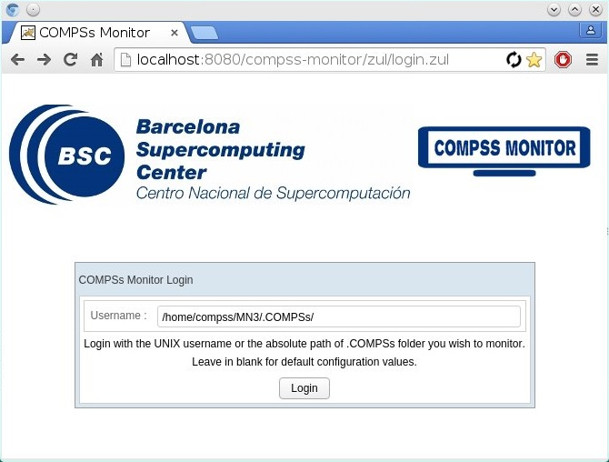
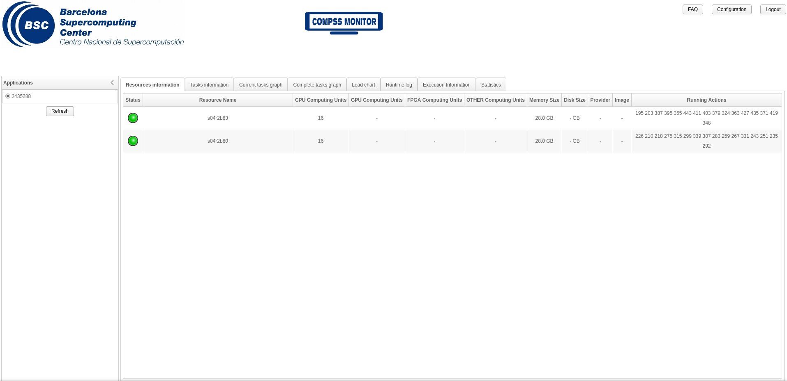

==============
Supercomputers
==============

Common usage
============

Available COMPSs modules
------------------------

COMPSs is configured as a Linux Module. As shown in next Figure, the
users can type the ``module available COMPSs`` command to list the
supported COMPSs modules in the supercomputer. The users can also
execute the ``module load COMPSs/<version>`` command to load an specific
COMPSs module.

.. code-block:: console

    $ module available COMPSs
    ---------- /apps/modules/modulefiles/tools ----------
    COMPSs/1.3
    COMPSs/1.4
    COMPSs/2.0
    COMPSs/2.1
    COMPSs/2.2
    COMPSs/2.3
    COMPSs/2.4
    COMPSs/2.5
    COMPSs/2.6

    COMPSs/release(default)
    COMPSs/trunk

    $ module load COMPSs/release
    load java/1.8.0u66 (PATH, MANPATH, JAVA_HOME, JAVA_ROOT, JAVA_BINDIR,
                        SDK_HOME, JDK_HOME, JRE_HOME)
    load MKL/11.0.1 (LD_LIBRARY_PATH)
    load PYTHON/2.7.3 (PATH, MANPATH, LD_LIBRARY_PATH, C_INCLUDE_PATH)
    load COMPSs/release (PATH, MANPATH, COMPSS_HOME)

The following command can be run to check if the correct COMPSs version
has been loaded:

.. code-block:: console

    $ enqueue_compss --version
    COMPSs version <version>

Configuration
-------------

The COMPSs module contains **all** the COMPSs dependencies, including
Java, Python and MKL. Modifying any of these dependencies can cause
execution failures and thus, we **do not** recomend to change them.
Before running any COMPSs job please check your environment and, if
needed, comment out any line inside the ``.bashrc`` file that loads
custom COMPSs, Java, Python and/or MKL modules.

The COMPSs module needs to be loaded in all the nodes that will run
COMPSs jobs. Consequently, the ``module load`` **must** be included in
your ``.bashrc`` file. To do so, please run the following command with
the corresponding COMPSs version:

.. code-block:: console

    $ cat "module load COMPSs/release" >> ~/.bashrc

Log out and back in again to check that the file has been correctly
edited. The next listing shows an example of the output generated by
well loaded COMPSs installation.

.. code-block:: console

    $ exit
    $ ssh USER@SC
    load java/1.8.0u66 (PATH, MANPATH, JAVA_HOME, JAVA_ROOT, JAVA_BINDIR,
                        SDK_HOME, JDK_HOME, JRE_HOME)
    load MKL/11.0.1 (LD_LIBRARY_PATH)
    load PYTHON/2.7.3 (PATH, MANPATH, LD_LIBRARY_PATH, C_INCLUDE_PATH)
    load COMPSs/release (PATH, MANPATH, COMPSS_HOME)

    USER@SC$ enqueue_compss --version
    COMPSs version <version>

.. note::
   Please remember that COMPSs runs in several nodes and your current
   enviroment is not exported to them. Thus, all the needed environment
   variables **must** be loaded through the *.bashrc* file.

.. note::
   Please remember that PyCOMPSs uses Python 2.7 by default. In order to
   use Python 3, the Python 2.7 module **must** be unloaded after loading
   COMPSs module, and then load the Python 3 module.

COMPSs Job submission
---------------------

COMPSs jobs can be easily submited by running the **enqueue_compss**
command. This command allows to configure any **runcompss** option and
some particular queue options such as the queue system, the number of
nodes, the wallclock time, the master working directory, the workers
working directory and number of tasks per node.

Next, we provide detailed information about the ``enqueue_compss``
command:

.. code-block:: console

    $ enqueue_compss -h

    Usage: enqueue_compss [queue_system_options] [COMPSs_options]
              application_name [application_arguments]

    * Options:
      General:
        --help, -h                              Print this help message
        --heterogeneous                         Indicates submission is going to be heterogeneous
                                                Default: Disabled
      Queue system configuration:
        --sc_cfg=<name>                         SuperComputer configuration file to use. Must exist inside queues/cfgs/
                                                Default: default

      Submission configuration:
      General submision arguments:
        --exec_time=<minutes>                   Expected execution time of the application (in minutes)
                                                Default: 10
        --job_name=<name>                       Job name
                                                Default: COMPSs
        --queue=<name>                          Queue name to submit the job. Depends on the queue system.
                                                For example (MN3): bsc_cs | bsc_debug | debug | interactive
                                                Default: default
        --reservation=<name>                    Reservation to use when submitting the job.
                                                Default: disabled
        --constraints=<constraints>             Constraints to pass to queue system.
                                                Default: disabled
        --qos=<qos>                             Quality of Service to pass to the queue system.
                                                Default: default
        --cpus_per_task                         Number of cpus per task the queue system must allocate per task.
                                                Note that this will be equal to the cpus_per_node in a worker node and
                                                equal to the worker_in_master_cpus in a master node respectively.
                                                Default: false
        --job_dependency=<jobID>                Postpone job execution until the job dependency has ended.
                                                Default: None
        --storage_home=<string>                 Root installation dir of the storage implementation
                                                Default: null
        --storage_props=<string>                Absolute path of the storage properties file
                                                Mandatory if storage_home is defined
      Normal submission arguments:
        --num_nodes=<int>                       Number of nodes to use
                                                Default: 2
        --num_switches=<int>                    Maximum number of different switches. Select 0 for no restrictions.
                                                Maximum nodes per switch: 18
                                                Only available for at least 4 nodes.
                                                Default: 0
      Heterogeneous submission arguments:
        --type_cfg=<file_location>              Location of the file with the descriptions of node type requests
                                                File should follow the following format:
                                                type_X(){
                                                  cpus_per_node=24
                                                  node_memory=96
                                                  ...
                                                }
                                                type_Y(){
                                                  ...
                                                }
        --master=<master_node_type>             Node type for the master
                                                (Node type descriptions are provided in the --type_cfg flag)
        --workers=type_X:nodes,type_Y:nodes     Node type and number of nodes per type for the workers
                                                (Node type descriptions are provided in the --type_cfg flag)
      Launch configuration:
        --cpus_per_node=<int>                   Available CPU computing units on each node
                                                Default: 48
        --gpus_per_node=<int>                   Available GPU computing units on each node
                                                Default: 0
        --fpgas_per_node=<int>                  Available FPGA computing units on each node
                                                Default: 0
        --fpga_reprogram="<string>              Specify the full command that needs to be executed to reprogram the FPGA with
                                                the desired bitstream. The location must be an absolute path.
                                                Default:
        --max_tasks_per_node=<int>              Maximum number of simultaneous tasks running on a node
                                                Default: -1
        --node_memory=<MB>                      Maximum node memory: disabled | <int> (MB)
                                                Default: disabled
        --network=<name>                        Communication network for transfers: default | ethernet | infiniband | data.
                                                Default: infiniband

        --prolog="<string>"                     Task to execute before launching COMPSs (Notice the quotes)
                                                If the task has arguments split them by "," rather than spaces.
                                                This argument can appear multiple times for more than one prolog action
                                                Default: Empty
        --epilog="<string>"                     Task to execute after executing the COMPSs application (Notice the quotes)
                                                If the task has arguments split them by "," rather than spaces.
                                                This argument can appear multiple times for more than one epilog action
                                                Default: Empty

        --master_working_dir=<path>             Working directory of the application
                                                Default: .
        --worker_working_dir=<name | path>      Worker directory. Use: scratch | gpfs | <path>
                                                Default: scratch

        --worker_in_master_cpus=<int>           Maximum number of CPU computing units that the master node can run as worker. Cannot exceed cpus_per_node.
                                                Default: 24
        --worker_in_master_memory=<int> MB      Maximum memory in master node assigned to the worker. Cannot exceed the node_memory.
                                                Mandatory if worker_in_master_cpus is specified.
                                                Default: 50000
        --jvm_worker_in_master_opts="<string>"  Extra options for the JVM of the COMPSs Worker in the Master Node.
                                                Each option separed by "," and without blank spaces (Notice the quotes)
                                                Default:
        --container_image=<path>                Runs the application by means of a container engine image
                                                Default: Empty
        --container_compss_path=<path>          Path where compss is installed in the container image
                                                Default: /opt/COMPSs
        --container_opts="<string>"             Options to pass to the container engine
                                                Default: empty
        --elasticity=<max_extra_nodes>          Activate elasticity specifiying the maximum extra nodes (ONLY AVAILABLE FORM SLURM CLUSTERS WITH NIO ADAPTOR)
                                                Default: 0

        --jupyter_notebook=<path>,              Swap the COMPSs master initialization with jupyter notebook from the specified path.
        --jupyter_notebook                      Default: false

      Runcompss configuration:

      Tools enablers:
        --graph=<bool>, --graph, -g             Generation of the complete graph (true/false)
                                                When no value is provided it is set to true
                                                Default: false
        --tracing=<level>, --tracing, -t        Set generation of traces and/or tracing level ( [ true | basic ] | advanced | scorep | arm-map | arm-ddt | false)
                                                True and basic levels will produce the same traces.
                                                When no value is provided it is set to true
                                                Default: false
        --monitoring=<int>, --monitoring, -m    Period between monitoring samples (milliseconds)
                                                When no value is provided it is set to 2000
                                                Default: 0
        --external_debugger=<int>,
        --external_debugger                     Enables external debugger connection on the specified port (or 9999 if empty)
                                                Default: false

      Runtime configuration options:
        --task_execution=<compss|storage>       Task execution under COMPSs or Storage.
                                                Default: compss
        --storage_impl=<string>                 Path to an storage implementation. Shortcut to setting pypath and classpath. See Runtime/storage in your installation folder.
        --storage_conf=<path>                   Path to the storage configuration file
                                                Default: null
        --project=<path>                        Path to the project XML file
                                                Default: /apps/COMPSs/2.6.pr/Runtime/configuration/xml/projects/default_project.xml
        --resources=<path>                      Path to the resources XML file
                                                Default: /apps/COMPSs/2.6.pr/Runtime/configuration/xml/resources/default_resources.xml
        --lang=<name>                           Language of the application (java/c/python)
                                                Default: Inferred is possible. Otherwise: java
        --summary                               Displays a task execution summary at the end of the application execution
                                                Default: false
        --log_level=<level>, --debug, -d        Set the debug level: off | info | debug
                                                Warning: Off level compiles with -O2 option disabling asserts and __debug__
                                                Default: off

      Advanced options:
        --extrae_config_file=<path>             Sets a custom extrae config file. Must be in a shared disk between all COMPSs workers.
                                                Default: null
        --comm=<ClassName>                      Class that implements the adaptor for communications
                                                Supported adaptors: es.bsc.compss.nio.master.NIOAdaptor | es.bsc.compss.gat.master.GATAdaptor
                                                Default: es.bsc.compss.nio.master.NIOAdaptor
        --conn=<className>                      Class that implements the runtime connector for the cloud
                                                Supported connectors: es.bsc.compss.connectors.DefaultSSHConnector
                                                                    | es.bsc.compss.connectors.DefaultNoSSHConnector
                                                Default: es.bsc.compss.connectors.DefaultSSHConnector
        --streaming=<type>                      Enable the streaming mode for the given type.
                                                Supported types: FILES, OBJECTS, PSCOS, ALL, NONE
                                                Default: null
        --streaming_master_name=<str>           Use an specific streaming master node name.
                                                Default: null
        --streaming_master_port=<int>           Use an specific port for the streaming master.
                                                Default: null
        --scheduler=<className>                 Class that implements the Scheduler for COMPSs
                                                Supported schedulers: es.bsc.compss.scheduler.fullGraphScheduler.FullGraphScheduler
                                                                    | es.bsc.compss.scheduler.fifoScheduler.FIFOScheduler
                                                                    | es.bsc.compss.scheduler.resourceEmptyScheduler.ResourceEmptyScheduler
                                                Default: es.bsc.compss.scheduler.loadbalancing.LoadBalancingScheduler
        --scheduler_config_file=<path>          Path to the file which contains the scheduler configuration.
                                                Default: Empty
        --library_path=<path>                   Non-standard directories to search for libraries (e.g. Java JVM library, Python library, C binding library)
                                                Default: Working Directory
        --classpath=<path>                      Path for the application classes / modules
                                                Default: Working Directory
        --appdir=<path>                         Path for the application class folder.
                                                Default: /home/bsc19/bsc19234
        --pythonpath=<path>                     Additional folders or paths to add to the PYTHONPATH
                                                Default: /home/bsc19/bsc19234
        --base_log_dir=<path>                   Base directory to store COMPSs log files (a .COMPSs/ folder will be created inside this location)
                                                Default: User home
        --specific_log_dir=<path>               Use a specific directory to store COMPSs log files (no sandbox is created)
                                                Warning: Overwrites --base_log_dir option
                                                Default: Disabled
        --uuid=<int>                            Preset an application UUID
                                                Default: Automatic random generation
        --master_name=<string>                  Hostname of the node to run the COMPSs master
                                                Default:
        --master_port=<int>                     Port to run the COMPSs master communications.
                                                Only for NIO adaptor
                                                Default: [43000,44000]
        --jvm_master_opts="<string>"            Extra options for the COMPSs Master JVM. Each option separed by "," and without blank spaces (Notice the quotes)
                                                Default:
        --jvm_workers_opts="<string>"           Extra options for the COMPSs Workers JVMs. Each option separed by "," and without blank spaces (Notice the quotes)
                                                Default: -Xms1024m,-Xmx1024m,-Xmn400m
        --cpu_affinity="<string>"               Sets the CPU affinity for the workers
                                                Supported options: disabled, automatic, user defined map of the form "0-8/9,10,11/12-14,15,16"
                                                Default: automatic
        --gpu_affinity="<string>"               Sets the GPU affinity for the workers
                                                Supported options: disabled, automatic, user defined map of the form "0-8/9,10,11/12-14,15,16"
                                                Default: automatic
        --fpga_affinity="<string>"              Sets the FPGA affinity for the workers
                                                Supported options: disabled, automatic, user defined map of the form "0-8/9,10,11/12-14,15,16"
                                                Default: automatic
        --fpga_reprogram="<string>"             Specify the full command that needs to be executed to reprogram the FPGA with the desired bitstream. The location must be an absolute path.
                                                Default:
        --task_count=<int>                      Only for C/Python Bindings. Maximum number of different functions/methods, invoked from the application, that have been selected as tasks
                                                Default: 50
        --input_profile=<path>                  Path to the file which stores the input application profile
                                                Default: Empty
        --output_profile=<path>                 Path to the file to store the application profile at the end of the execution
                                                Default: Empty
        --PyObject_serialize=<bool>             Only for Python Binding. Enable the object serialization to string when possible (true/false).
                                                Default: false
        --persistent_worker_c=<bool>            Only for C Binding. Enable the persistent worker in c (true/false).
                                                Default: false
        --enable_external_adaptation=<bool>     Enable external adaptation. This option will disable the Resource Optimizer.
                                                Default: false
        --python_interpreter=<string>           Python interpreter to use (python/python2/python3).
                                                Default: python Version: 2
        --python_propagate_virtual_environment=<true>  Propagate the master virtual environment to the workers (true/false).
                                                       Default: true
        --python_mpi_worker=<false>             Use MPI to run the python worker instead of multiprocessing. (true/false).
                                                Default: false

    * Application name:

        For Java applications:   Fully qualified name of the application
        For C applications:      Path to the master binary
        For Python applications: Path to the .py file containing the main program

    * Application arguments:

        Command line arguments to pass to the application. Can be empty.

MareNostrum 4
=============

Basic queue commands
--------------------

The MareNostrum supercomputer uses the SLURM (Simple Linux Utility for
Resource Management) workload manager. The basic commands to manage jobs
are listed below:

-  **sbatch** Submit a batch job to the SLURM system

-  **scancel** Kill a running job

-  **squeue -u <username>** See the status of jobs
   in the SLURM queue

For more extended information please check the *SLURM: Quick start user
guide* at https://slurm.schedmd.com/quickstart.html .

Tracking COMPSs jobs
--------------------

When submitting a COMPSs job a temporal file will be created storing the
job information. For example:

.. code-block:: console

    $ enqueue_compss \
      --exec_time=15 \
      --num_nodes=3 \
      --cpus_per_node=16 \
      --master_working_dir=. \
      --worker_working_dir=gpfs \
      --lang=python \
      --log_level=debug \
      <APP> <APP_PARAMETERS>

    SC Configuration:          default.cfg
    Queue:                     default
    Reservation:               disabled
    Num Nodes:                 3
    Num Switches:              0
    GPUs per node:             0
    Job dependency:            None
    Exec-Time:                 00:15
    Storage Home:              null
    Storage Properties:        null
    Other:
            --sc_cfg=default.cfg
            --cpus_per_node=48
            --master_working_dir=.
            --worker_working_dir=gpfs
            --lang=python
            --classpath=.
            --library_path=.
            --comm=es.bsc.compss.nio.master.NIOAdaptor
            --tracing=false
            --graph=false
            --pythonpath=.
            <APP> <APP_PARAMETERS>
    Temp submit script is: /scratch/tmp/tmp.pBG5yfFxEo

    $ cat /scratch/tmp/tmp.pBG5yfFxEo
    #!/bin/bash
    #
    #SBATCH --job-name=COMPSs
    #SBATCH --workdir=.
    #SBATCH -o compss-%J.out
    #SBATCH -e compss-%J.err
    #SBATCH -N 3
    #SBATCH -n 144
    #SBATCH --exclusive
    #SBATCH -t00:15:00
    ...

In order to trac the jobs state users can run the following command:

.. code-block:: console

    $ squeue
    JOBID   PARTITION  NAME    USER  TIME_LEFT  TIME_LIMIT   START_TIME  ST NODES  CPUS  NODELIST
    474130    main    COMPSs    XX    0:15:00    0:15:00        N/A      PD    3   144   -

The specific COMPSs logs are stored under the ``~/.COMPSs/`` folder;
saved as a local *runcompss* execution. For further details please check the
:ref:`Application execution` Section.

MinoTauro
=========

Basic queue commands
--------------------

The MinoTauro supercomputer uses the SLURM (Simple Linux Utility for
Resource Management) workload manager. The basic commands to manage jobs
are listed below:

-  **sbatch** Submit a batch job to the SLURM system

-  **scancel** Kill a running job

-  **squeue -u <username>** See the status of jobs
   in the SLURM queue

For more extended information please check the *SLURM: Quick start user
guide* at https://slurm.schedmd.com/quickstart.html .

Tracking COMPSs jobs
--------------------

When submitting a COMPSs job a temporal file will be created storing the
job information. For example:

.. code-block:: console

    $ enqueue_compss \
      --exec_time=15 \
      --num_nodes=3 \
      --cpus_per_node=16 \
      --master_working_dir=. \
      --worker_working_dir=gpfs \
      --lang=python \
      --log_level=debug \
      <APP> <APP_PARAMETERS>

    SC Configuration:          default.cfg
    Queue:                     default
    Reservation:               disabled
    Num Nodes:                 3
    Num Switches:              0
    GPUs per node:             0
    Job dependency:            None
    Exec-Time:                 00:15
    Storage Home:              null
    Storage Properties:        null
    Other:
            --sc_cfg=default.cfg
            --cpus_per_node=16
            --master_working_dir=.
            --worker_working_dir=gpfs
            --lang=python
            --classpath=.
            --library_path=.
            --comm=es.bsc.compss.nio.master.NIOAdaptor
            --tracing=false
            --graph=false
            --pythonpath=.
            <APP> <APP_PARAMETERS>
    Temp submit script is: /scratch/tmp/tmp.pBG5yfFxEo

    $ cat /scratch/tmp/tmp.pBG5yfFxEo
    #!/bin/bash
    #
    #SBATCH --job-name=COMPSs
    #SBATCH --workdir=.
    #SBATCH -o compss-%J.out
    #SBATCH -e compss-%J.err
    #SBATCH -N 3
    #SBATCH -n 48
    #SBATCH --exclusive
    #SBATCH -t00:15:00
    ...

In order to trac the jobs state users can run the following command:

.. code-block:: console

    $ squeue
    JOBID  PARTITION   NAME    USER  ST  TIME    NODES  NODELIST (REASON)
    XXXX   projects    COMPSs   XX   R   00:02       3  nvb[6-8]

The specific COMPSs logs are stored under the ``~/.COMPSs/`` folder;
saved as a local *runcompss* execution. For further details please check the
:ref:`Application execution` Section.

Nord 3
======

Basic queue commands
--------------------

The Nord3 supercomputer uses the LSF (Load Sharing Facility) workload
manager. The basic commands to manage jobs are listed below:

-  **bsub** Submit a batch job to the LSF system

-  **bkill** Kill a running job

-  **bjobs** See the status of jobs in the LSF queue

-  **bqueues** Information about LSF batch queues

For more extended information please check the *IBM Platform LSF Command
Reference* at
https://www.ibm.com/support/knowledgecenter/en/SSETD4_9.1.2/lsf_kc_cmd_ref.html
.

Tracking COMPSs jobs
--------------------

When submitting a COMPSs job a temporal file will be created storing the
job information. For example:

.. code-block:: console

    $ enqueue_compss \
      --exec_time=15 \
      --num_nodes=3 \
      --cpus_per_node=16 \
      --master_working_dir=. \
      --worker_working_dir=gpfs \
      --lang=python \
      --log_level=debug \
      <APP> <APP_PARAMETERS>

    SC Configuration:          default.cfg
    Queue:                     default
    Reservation:               disabled
    Num Nodes:                 3
    Num Switches:              0
    GPUs per node:             0
    Job dependency:            None
    Exec-Time:                 00:15
    Storage Home:              null
    Storage Properties:        null
    Other:
            --sc_cfg=default.cfg
            --cpus_per_node=16
            --master_working_dir=.
            --worker_working_dir=gpfs
            --lang=python
            --classpath=.
            --library_path=.
            --comm=es.bsc.compss.nio.master.NIOAdaptor
            --tracing=false
            --graph=false
            --pythonpath=.
            <APP> <APP_PARAMETERS>
    Temp submit script is: /scratch/tmp/tmp.pBG5yfFxEo

    $ cat /scratch/tmp/tmp.pBG5yfFxEo
    #!/bin/bash
    #
    #BSUB -J COMPSs
    #BSUB -cwd .
    #BSUB -oo compss-%J.out
    #BSUB -eo compss-%J.err
    #BSUB -n 3
    #BSUB -R "span[ptile=1]"
    #BSUB -W 00:15
    ...

In order to trac the jobs state users can run the following command:

.. code-block:: console

    $ bjobs
    JOBID  USER   STAT  QUEUE  FROM_HOST  EXEC_HOST  JOB_NAME  SUBMIT_TIME
    XXXX   bscXX  PEND  XX     login1     XX         COMPSs    Month Day Hour

The specific COMPSs logs are stored under the ``~/.COMPSs/`` folder;
saved as a local *runcompss* execution. For further details please check the
:ref:`Application execution` Section.

Enabling COMPSs Monitor
=======================

Configuration
-------------

As supercomputer nodes are connection restricted, the better way to
enable the *COMPSs Monitor* is from the users local machine. To do so
please install the following packages:

-  COMPSs Runtime

-  COMPSs Monitor

-  sshfs

For further details about the COMPSs packages installation and
configuration please refer to :ref:`Installation and Administration` Section.
If you are not willing to install COMPSs in your local machine please
consider to download our Virtual Machine available at our webpage.

Once the packages have been installed and configured, users need to
mount the sshfs directory as follows. The ``SC_USER`` stands for your
supercomputer’s user, the ``SC_ENDPOINT`` to the supercomputer’s public
endpoint and the ``TARGET_LOCAL_FOLDER`` to the local folder where you
wish to deploy the supercomputer files):

.. code-block:: console

    compss@bsc:~$ scp $HOME/.ssh/id_dsa.pub ${SC_USER}@mn1.bsc.es:~/id_dsa_local.pub
    compss@bsc:~$ ssh SC_USER@SC_ENDPOINT \
                      "cat ~/id_dsa_local.pub >> ~/.ssh/authorized_keys; \
                      rm ~/id_dsa_local.pub"
    compss@bsc:~$ mkdir -p TARGET_LOCAL_FOLDER/.COMPSs
    compss@bsc:~$ sshfs -o IdentityFile=$HOME/.ssh/id_dsa -o allow_other \
                       SC_USER@SC_ENDPOINT:~/.COMPSs \
                       TARGET_LOCAL_FOLDER/.COMPSs

Whenever you wish to unmount the sshfs directory please run:

.. code-block:: console

    compss@bsc:~$ sudo umount TARGET_LOCAL_FOLDER/.COMPSs

Execution
---------

Access the COMPSs Monitor through its webpage
(http://localhost:8080/compss-monitor by default) and log in with the
``TARGET_LOCAL_FOLDER`` to enable the COMPSs Monitor for MareNostrum.

Please remember that to enable **all** the COMPSs Monitor features
applications must be ran with the *-m* flag. For further details please check the
:ref:`Application execution` Section.

:numref:`mn_monitor1` illustrates how to login and :numref:`mn_monitor2`
shows the COMPSs Monitor main page for an application
run inside a Supercomputer.

   COMPSs Monitor login for Supercomputers

   COMPSs Monitor main page for a test application at Supercomputers

.. figure:: /Logos/bsc_logo.jpg
   :width: 40.0%
   :align: center
