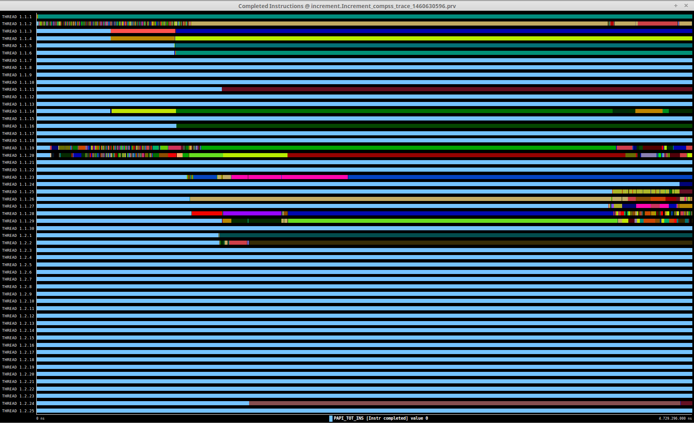
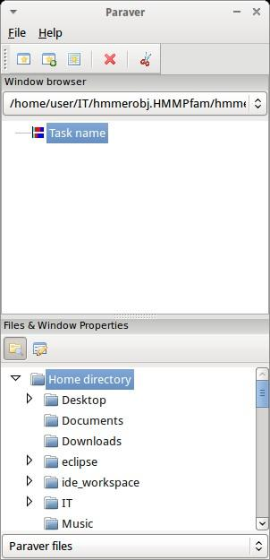
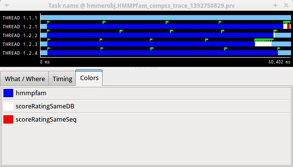
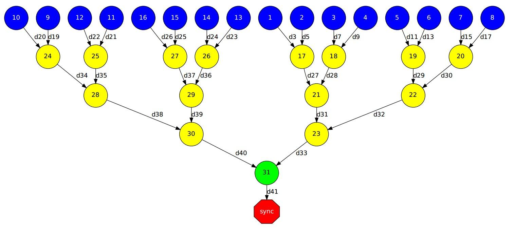
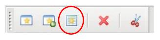

=======
Tracing
=======

COMPSs applications tracing
===========================

COMPSs Runtime has a built-in instrumentation system to generate
post-execution tracefiles of the applications’ execution. The tracefiles
contain different events representing the COMPSs master state, the
tasks’ execution state, and the data transfers (transfers’ information
is only available when using NIO adaptor), and are useful for both
visual and numerical performance analysis and diagnosis. The
instrumentation process essentially intercepts and logs different
events, so it adds overhead to the execution time of the application.

The tracing system uses Extrae to generate tracefiles of the execution
that, in turn, can be visualized with Paraver. Both tools are developed
and maintained by the Performance Tools team of the BSC and are
available on its web page
http://www.bsc.es/computer-sciences/performance-tools.

For each worker node and the master, Extrae keeps track of the events in
an intermediate format file (with *.mpit* extension). At the end of the
execution, all intermediate files are gathered and merged with Extrae’s
*mpi2prv* command in order to create the final tracefile, a Paraver
format file (.prv). See the visualization Section [sec:Visualization] of
this manual for further information about the Paraver tool.

When instrumentation is activated, Extrae outputs several messages
corresponding to the tracing initialization, intermediate files’
creation, and the merging process.

At present time, COMPSs tracing features two execution modes:

Basic,
    aimed at COMPSs applications developers

Advanced,
    for COMPSs developers and users with access to its source code or
    custom installations

Next sections describe the information provided by each mode and how to
use them.

Basic Mode
----------

This mode is aimed at COMPSs’ apps users and developers. It instruments
computing threads and some management resources providing information
about tasks’ executions, data transfers, and hardware counters if PAPI
is available (see PAPI counters Appendix [sec:papi] for more info).

Usage
~~~~~

In order to activate basic tracing one needs to provide one of the
following arguments to the execution command:

-  -t

-  --tracing

-  --tracing=basic

-  --tracing=true

Examples given:

.. code-block:: console

    $ runcompss --tracing application_name application_args

Figure [fig:basic\_trace] was generated as follows:

.. code-block:: console

    $ runcompss \
         --lang=java \
         --tracing \
         --classpath=/path/to/jar/kmeans.jar \
         kmeans.KMeans

When tracing is activated, Extrae generates additional output to help
the user ensure that instrumentation is turned on and working without
issues. On basic mode this is the output users should see when tracing
is working correctly:

.. code-block:: console

    *** RUNNING JAVA APPLICATION KMEANS
    Resolved: /path/to/jar/kmeans.jar:

    ----------------- Executing kmeans.Kmeans --------------------------

    Welcome to Extrae VERSION
    Extrae: Parsing the configuration file (/opt/COMPSs/Runtime/configuration/xml/tracing/extrae_basic.xml) begins
    Extrae: Tracing package is located on /opt/COMPSs/Dependencies/extrae/
    Extrae: Generating intermediate files for Paraver traces.
    Extrae: PAPI domain set to USER for HWC set 1
    Extrae: HWC set 1 contains following counters < PAPI_TOT_INS (0x80000032) PAPI_TOT_CYC (0x8000003b) PAPI_LD_INS (0x80000035) PAPI_SR_INS (0x80000036) > - changing every 500000000 nanoseconds
    Extrae: PAPI domain set to USER for HWC set 2
    Extrae: HWC set 2 contains following counters < PAPI_TOT_INS (0x80000032) PAPI_TOT_CYC (0x8000003b) PAPI_LD_INS (0x80000035) PAPI_SR_INS (0x80000036) PAPI_L2_DCM (0x80000002) > - changing every 500000000 nanoseconds
    WARNING: COMPSs Properties file is null. Setting default values
    [(751)    API]  -  Deploying COMPSs Runtime v<version>
    [(753)    API]  -  Starting COMPSs Runtime v<version>
    [(753)    API]  -  Initializing components
    [(1142)   API]  -  Ready to process tasks

    ...
    ...
    ...
    merger: Output trace format is: Paraver
    merger: Extrae VERSION
    mpi2prv: Assigned nodes < Marginis >
    mpi2prv: Assigned size per processor < <1 Mbyte >
    mpi2prv: File set-0/TRACE@Marginis.0000001904000000000000.mpit is object 1.1.1 on node Marginis assigned to processor 0
    mpi2prv: File set-0/TRACE@Marginis.0000001904000000000001.mpit is object 1.1.2 on node Marginis assigned to processor 0
    mpi2prv: File set-0/TRACE@Marginis.0000001904000000000002.mpit is object 1.1.3 on node Marginis assigned to processor 0
    mpi2prv: File set-0/TRACE@Marginis.0000001980000001000000.mpit is object 1.2.1 on node Marginis assigned to processor 0
    mpi2prv: File set-0/TRACE@Marginis.0000001980000001000001.mpit is object 1.2.2 on node Marginis assigned to processor 0
    mpi2prv: File set-0/TRACE@Marginis.0000001980000001000002.mpit is object 1.2.3 on node Marginis assigned to processor 0
    mpi2prv: File set-0/TRACE@Marginis.0000001980000001000003.mpit is object 1.2.4 on node Marginis assigned to processor 0
    mpi2prv: File set-0/TRACE@Marginis.0000001980000001000004.mpit is object 1.2.5 on node Marginis assigned to processor 0
    mpi2prv: Time synchronization has been turned off
    mpi2prv: A total of 9 symbols were imported from TRACE.sym file
    mpi2prv: 0 function symbols imported
    mpi2prv: 9 HWC counter descriptions imported
    mpi2prv: Checking for target directory existance... exists, ok!
    mpi2prv: Selected output trace format is Paraver
    mpi2prv: Stored trace format is Paraver
    mpi2prv: Searching synchronization points... done
    mpi2prv: Time Synchronization disabled.
    mpi2prv: Circular buffer enabled at tracing time? NO
    mpi2prv: Parsing intermediate files
    mpi2prv: Progress 1 of 2 ... 5% 10% 15% 20% 25% 30% 35% 40% 45% 50% 55% 60% 65% 70% 75% 80% 85% 90% 95% done
    mpi2prv: Processor 0 succeeded to translate its assigned files
    mpi2prv: Elapsed time translating files: 0 hours 0 minutes 0 seconds
    mpi2prv: Elapsed time sorting addresses: 0 hours 0 minutes 0 seconds
    mpi2prv: Generating tracefile (intermediate buffers of 838848 events)
             This process can take a while. Please, be patient.
    mpi2prv: Progress 2 of 2 ... 5% 10% 15% 20% 25% 30% 35% 40% 45% 50% 55% 60% 65% 70% 75% 80% 85% 90% 95% done
    mpi2prv: Warning! Clock accuracy seems to be in microseconds instead of nanoseconds.
    mpi2prv: Elapsed time merge step: 0 hours 0 minutes 0 seconds
    mpi2prv: Resulting tracefile occupies 991743 bytes
    mpi2prv: Removing temporal files... done
    mpi2prv: Elapsed time removing temporal files: 0 hours 0 minutes 0 seconds
    mpi2prv: Congratulations! ./trace/kmeans.Kmeans_compss_trace_1460456106.prv has been generated.
    [   API]  -  Execution Finished
    Extrae: Tracing buffer can hold 100000 events
    Extrae: Circular buffer disabled.
    Extrae: Warning! <dynamic-memory> tag will be ignored. This library does support instrumenting dynamic memory calls.
    Extrae: Warning! <input-output> tag will be ignored. This library does support instrumenting I/O calls.
    Extrae: Dynamic memory instrumentation is disabled.
    Extrae: Basic I/O memory instrumentation is disabled.
    Extrae: Parsing the configuration file (/opt/COMPSs/Runtime/scripts/user/../../configuration/xml/tracing/extrae_basic.xml) has ended
    Extrae: Intermediate traces will be stored in /home/kurtz/compss/tests_local/app10
    Extrae: Tracing mode is set to: Detail.
    Extrae: Successfully initiated with 1 tasks and 1 threads

It contains diverse information about the tracing, for example, Extrae
version used (``VERSION`` will be replaced by the actual number during
executions), the XML configuration file used (``extrae_basic.xml``), the
amount of threads instrumented (objects through 1.1.1 to 1.2.5),
available hardware counters (``PAPI_TOT_INS (0x80000032)`` ...
``PAPI_L3_TCM (0x80000008)`` ) or the name of the generated tracefile
(``./trace/kmeans.`` ``Kmeans_compss_trace_1460456106.prv``). When using
NIO communications adaptor with debug activated, the log of each worker
also contains the Extrae initialization information.

**N.B.** when using Python, COMPSs needs to perform an extra merging
step in order to add the Python-produced events to the main tracefile.
If Python events are not shown, check *runtime.log* file and search for
the following expected output of this merging process to find possible
errors:

.. code-block:: console

    [(9788)(2016-11-15 11:22:27,687)  Tracing]    @generateTrace -  Tracing: Generating trace
    [(9851)(2016-11-15 11:22:27,750)  Tracing]    @<init>        -  Trace's merger initialization successful
    [(9851)(2016-11-15 11:22:27,750)  Tracing]    @merge         -  Parsing master sync events
    [(9905)(2016-11-15 11:22:27,804)  Tracing]    @merge         -  Proceeding to merge task traces into master
    [(9944)(2016-11-15 11:22:27,843)  Tracing]    @merge         -  Merging finished,
    [(9944)(2016-11-15 11:22:27,843)  Tracing]    @merge         -  Temporal task folder removed.

Instrumented Threads
~~~~~~~~~~~~~~~~~~~~

Basic traces instrument the following threads:

-  Master node (3 threads)

   -  COMPSs runtime

   -  Task Dispatcher

   -  Access Processor

-  Worker node (1 + Computing Units)

   -  Main thread

   -  Number of threads available for computing

Information Available
~~~~~~~~~~~~~~~~~~~~~

The basic mode tracefiles contain three kinds of information:

Events,
    marking diverse situations such as the runtime start, tasks’
    execution or synchronization points.

Communications,
    showing the transfers and requests of the parameters needed by
    COMPSs tasks.

Hardware counters,
    of the execution obtained with Performance API (see PAPI counters
    appendix [sec:papi])

Trace Example
~~~~~~~~~~~~~

Figure [fig:basic\_trace] is a tracefile generated by the execution of a
k-means clustering algorithm. Each timeline contains information of a
different resource, and each event’s name is on the legend. Depending on
the number of computing threads specified for each worker, the number of
timelines varies. However the following threads are always shown:

Master - Thread 1.1.1,
    this timeline shows the actions performed by the main thread of
    the COMPSs application

Task Dispatcher - Thread 1.1.2,
    shows information about the state and scheduling of the tasks to
    be executed.

Access Processor - Thread 1.1.3,
    all the events related to the tasks’ parameters management, such
    as dependencies or transfers are shown in this thread.

Worker X Master - Thread 1.X.1,
    this thread is the master of each worker and handles the computing
    resources and transfers. Is is repeated for each available
    resource. All data events of the worker, such as requests,
    transfers and receives are marked on this timeline (when using the
    appropriate configurations).

Worker X Computing Unit Y - Thread 1.X.Y
    shows the actual tasks execution information and is repeated as
    many times as computing threads has the worker X

   Basic mode tracefile for a k-means algorithm visualized with
   compss\_runtime.cfg

Advanced Mode
-------------

This mode is for more advanced COMPSs’ users and developers who want
to customize further the information provided by the tracing or need
rawer information like pthreads calls or Java garbage collection. With
it, every single thread created during the execution is traced.
**N.B.:** The extra information provided by the advanced mode is only
available on the workers when using NIO adaptor.

Usage
~~~~~

In order to activate the advanced tracing add the following option to
the execution:

-  --tracing=advanced

Examples given:

.. code-block:: console

    $ runcompss --tracing=advanced application_name application_args

Figure [fig:advanced\_trace] was generated as follows:

.. code-block:: console

    $ runcompss \
         --lang=java \
         --tracing=advanced \
         --classpath=/path/to/jar/kmeans.jar \
         kmeans.KMeans

When advanced tracing is activated, the configuration file reported on
the output is *extrae\_advanced.xml*.

.. code-block:: console

    *** RUNNING JAVA APPLICATION KMEANS
    ...
    ...
    ...
    Welcome to Extrae VERSION
    Extrae: Parsing the configuration file (/opt/COMPSs/Runtime/scripts/user/../../configuration/xml/tracing/extrae_advanced.xml) begins

This is the default file used for advanced tracing. However, advanced
users can modify it in order to customize the information provided by
Extrae. The configuration file is read first by the master on the
*runcompss* script. When using NIO adaptor for communication, the
configuration file is also read when each worker is started (on
*persistent\_worker.sh* or *persistent\_worker\_starter.sh* depending on
the execution environment).

If the default file is modified, the changes always affect the master,
and also the workers when using NIO. Modifying the scripts which turn on
the master and the workers is possible to achieve different
instrumentations for master/workers. However, not all Extrae available
XML configurations work with COMPSs, some of them can make the runtime
or workers crash so modify them at your discretion and risk. More
information about instrumentation XML configurations on Extrae User
Guide at:
https://www.bsc.es/computer-sciences/performance-tools/trace-generation/extrae/extrae-user-guide.

Instrumented Threads
~~~~~~~~~~~~~~~~~~~~

Advanced mode instruments all the pthreads created during the
application execution. It contains all the threads shown on basic traces
plus extra ones used to call command-line commands, I/O streams managers
and all actions which create a new process. Due to the temporal nature
of many of this threads, they may contain little information or appear
just at specific parts of the execution pipeline.

Information Available
~~~~~~~~~~~~~~~~~~~~~

The advanced mode tracefiles contain the same information as the basic
ones:

Events,
    marking diverse situations such as the runtime start, tasks’
    execution or synchronization points.

Communications,
    showing the transfers and requests of the parameters needed by
    COMPSs tasks.

Hardware counters,
    of the execution obtained with Performance API (see PAPI counters
    appendix [sec:papi])

Trace Example
~~~~~~~~~~~~~

Figure [fig:advanced\_trace] shows the total completed instructions for
a sample program executed with the advanced tracing mode. Note that the
thread - resource correspondence described on the basic trace example is
no longer static and thus cannot be inferred. Nonetheless, they can be
found thanks to the named events shown in other configurations such as
*compss\_runtime.cfg*.

   Advanced mode tracefile for a testing program showing the total
   completed instructions

For further information about Extrae, please visit the following site:

http://www.bsc.es/computer-science/extrae

Custom Installation and Configuration
-------------------------------------

Custom Extrae
~~~~~~~~~~~~~

COMPSs uses the environment variable ``EXTRAE_HOME`` to get the
reference to its installation directory (by default:
``/opt/COMPSs/Dependencies/extrae`` ). However, if the variable is
already defined once the runtime is started, COMPSs will not override
it. User can take advantage of this fact in order to use custom extrae
installations. Just set the ``EXTRAE_HOME`` environment variable to
the directory where your custom package is, and make sure that it is
also set for the worker’s environment.
Be aware that using different Extrae packages can break the runtime
and executions so you may change it at your own risk.

Custom Configuration file
~~~~~~~~~~~~~~~~~~~~~~~~~

COMPSs offers the possibility to specify an extrae custom configuration
file in order to harness all the tracing capabilities further tailoring
which information about the execution is displayed. To do so just pass
the file as an execution parameter as follows:

-  --extrae\_config\_file=/path/to/config/file.xml

The configuration file must be in a shared disk between all COMPSs
workers because a file’s copy is not distributed among them, just the
path to that file.

Visualization
=============

Paraver is the BSC tool for trace visualization. Trace events are
encoded in Paraver format (.prv) by the Extrae tool. Paraver is a
powerful tool and allows users to show many views of the trace data
using different configuration files. Users can manually load, edit or
create configuration files to obtain different tracing views.

The following subsections explain how to load a trace file into Paraver,
open the task events view using an already predefined configuration
file, and how to adjust the view to display the data properly.

For further information about Paraver, please visit the following site:

http://www.bsc.es/computer-sciences/performance-tools/paraver

Trace Loading
-------------

The final trace file in Paraver format (.prv) is at the base log folder
of the application execution inside the trace folder. The fastest way to
open it is calling the Paraver binary directly using the tracefile name
as the argument.

.. code-block:: console

    $ wxparaver /path/to/trace/trace.prv

Configurations
--------------

To see the different events, counters and communications that the
runtime generates, diverse configurations are available with the COMPSs
installation. To open one of them, go to the “Load Configuration” option
in the main window and select “File”. The configuration files are under
the following path for the default installation
``/opt/COMPSs/Dependencies/`` ``paraver/cfgs/``. A detailed list of all
the available configurations can be found in Appendix [sec:configs].

The following guide uses the *compss\_tasks.cfg* as an example to
illustrate the basic usage of Paraver. After accepting the load of the
configuration file, another window appears showing the view. Figures
[fig:trace\_1] and [fig:trace\_2] show an example of this process.

   Paraver menu

   Trace file

View Adjustment
---------------

In a Paraver view, a red exclamation sign may appear in the bottom-left
corner (see Figure [fig:trace\_2] in the previous section). This means
that some event values are not being shown (because they are out of the
current view scope), so little adjustments must be made to view the
trace correctly:

-  Fit window: modifies the view scope to fit and display all the events
   in the current window.

   -  Right click on the trace window

   -  Choose the option Fit Semantic Scale / Fit Both

.. figure:: ./Figures/tracing/3.jpeg
   :alt: Paraver view adjustment: Fit window
   :width: 100.0%

   Paraver view adjustment: Fit window

-  View Event Flags: marks with a green flag all the emitted the events.

   -  Right click on the trace window

   -  Chose the option View / Event Flags

.. figure:: ./Figures/tracing/4.jpeg
   :alt: Paraver view adjustment: View Event Flags
   :width: 100.0%

   Paraver view adjustment: View Event Flags

-  Show Info Panel: display the information panel. In the tab “Colors”
   we can see the legend of the colors shown in the view.

   -  Right click on the trace window

   -  Check the Info Panel option

   -  Select the Colors tab in the panel

   Paraver view adjustment: Show info panel

-  Zoom: explore the tracefile more in-depth by zooming into the most
   relevant sections.

   -  Select a region in the trace window to see that region in detail

   -  Repeat the previous step as many times as needed

   -  The undo-zoom option is in the right click panel

   Paraver view adjustment: Zoom configuration

   Paraver view adjustment: Zoom configuration

Interpretation
==============

This section explains how to interpret a trace view once it has been
adjusted as described in the previous section.

-  The trace view has on its horizontal axis the execution time and on
   the vertical axis one line for the master at the top, and below it,
   one line for each of the workers.

-  In a line, the light blue color is associated with an idle state,
   i.e. there is no event at that time.

-  Whenever an event starts or ends a flag is shown.

-  In the middle of an event, the line shows a different color. Colors
   are assigned depending on the event type.

-  The info panel contains the legend of the assigned colors to each
   event type.

.. figure:: ./Figures/tracing/7.jpeg
   :alt: Trace interpretation

   Trace interpretation

Analysis
========

This section gives some tips to analyze a COMPSs trace from two
different points of view: graphically and numerically.

Graphical Analysis
------------------

The main concept is that computational events, the task events in this
case, must be well distributed among all workers to have a good
parallelism, and the duration of task events should be also balanced,
this means, the duration of computational bursts.

.. figure:: ./Figures/tracing/8.jpeg
   :alt: Basic trace view of a Hmmpfam execution.
   :width: 100.0%

   Basic trace view of a Hmmpfam execution.

In the previous trace view, all the tasks of type “hmmpfam” in dark blue
appear to be well distributed among the four workers, each worker
executes four “hmmpfam” tasks.

However, some workers finish earlier than the others, worker 1.2.3
finish the first and worker 1.2.1 the last. So there is an imbalance in
the duration of “hmmpfam” tasks. The programmer should analyze then
whether all the tasks process the same amount of input data and do the
same thing in order to find out the reason for such imbalance.

Another thing to highlight is that tasks of type “scoreRatingSameDB” are
not equally distributed among all the workers. Some workers execute more
tasks of this type than the others. To understand better what happens
here, one needs to take a look to the execution graph and also zoom in
the last part of the trace.

   Data dependencies graph of a Hmmpfam execution.

.. figure:: ./Figures/tracing/10.jpeg
   :alt: Zoomed in view of a Hmmpfam execution.
   :width: 100.0%

   Zoomed in view of a Hmmpfam execution.

There is only one task of type “scoreRatingSameSeq”. This task appears
in red in the trace (and in light-green in the graph). With the help of
the graph we see that the “scoreRatingSameSeq” task has dependences on
tasks of type “scoreRatingSameDB”, in white (or yellow).

When the last task of type “hmmpfam” (in dark blue) ends, the previous
dependencies are solved, and if we look at the graph, this means going
across a path of three dependencies of type “scoreRatingSameDB” (in
yellow). Moreover, because these are sequential dependencies (one
depends on the previous) no more than a worker can be used at the same
time to execute the tasks. This is the reason of why the last three task
of type “scoreRatingSameDB” (in white) are executed in worker 1.2.1
sequentially.

Numerical Analysis
------------------

Here we show another trace from a different parallel execution of the
Hmmer program.

.. figure:: ./Figures/tracing/11.jpeg
   :alt: Original sample trace interval corresponding to the obtained Histogram.
   :width: 100.0%

   Original sample trace interval corresponding to the obtained
   Histogram.

Paraver offers the possibility of having different histograms of the
trace events. Click the “New Histogram” button in the main window and
accept the default options in the “New Histogram” window that will
appear.

   Paraver Menu - New Histogram

After that, the following table is shown. In this case for each worker,
the time spent executing each type of task is shown. Task names appear
in the same color than in the trace view. The color of a cell in a row
corresponding to a worker ranges from light-green for lower values to
dark-blue for higher ones. This conforms a color based histogram.

.. figure:: ./Figures/tracing/13.jpeg
   :alt: Hmmpfam histogram corresponding to previous trace
   :width: 80.0%

   Hmmpfam histogram corresponding to previous trace

The previous table also gives, at the end of each column, some extra
statistical information for each type of tasks (as the total, average,
maximum or minimum values, etc.).

In the window properties of the main window, it is possible to change
the semantic of the statistics to see other factors rather than the
time, for example, the number of bursts.

.. figure:: ./Figures/tracing/14.jpeg
   :alt: Paraver histogram options menu
   :width: 80.0%

   Paraver histogram options menu

In the same way as before, the following table shows for each worker the
number of bursts for each type of task, this is, the number or tasks
executed of each type. Notice the gradient scale from light-green to
dark-blue changes with the new values.

   Hmmpfam histogram with the number of bursts

PAPI: Hardware Counters
=======================

The applications instrumentation supports hardware counters through the
performance API (PAPI). In order to use it, PAPI needs to be present on
the machine before installing COMPSs.

During COMPSs installation it is possible to check if PAPI has been
detected in the Extrae config report:

.. code-block:: console

    Package configuration for Extrae VERSION based on extrae/trunk rev. XXXX:
    -----------------------
    Installation prefix: /opt/COMPSs/Dependencies/extrae
    Cross compilation: no
    ...
    ...
    ...

    Performance counters: yes
      Performance API: PAPI
      PAPI home: /usr
      Sampling support: yes

**N.B.** PAPI detection is only performed in the machine where COMPSs is
installed. User is responsible of providing a valid PAPI installation to
the worker machines to be used (if they are different from the master),
otherwise workers will crash because of the missing *libpapi.so*.

PAPI installation and requirements depend on the OS. On Ubuntu 14.04 it
is available under textitpapi-tools package; on OpenSuse textitpapi and
textitpapi-dev. For more information check
https://icl.cs.utk.edu/projects/papi/wiki/Installing_PAPI.

Extrae only supports 8 active hardware counters at the same time. Both
basic and advanced mode have the same default counters list:

PAPI\_TOT\_INS
    Instructions completed

PAPI\_TOT\_CYC
    Total cycles

PAPI\_LD\_INS
    Load instructions

PAPI\_SR\_INS
    Store instructions

PAPI\_BR\_UCN
    Unconditional branch instructions

PAPI\_BR\_CN
    Conditional branch instructions

PAPI\_VEC\_SP
    Single precision vector/SIMD instructions

RESOURCE\_STALLS
    Cycles Allocation is stalled due to Resource Related reason

The XML config file contains a secondary set of counters. In order to
activate it just change the *starting-set-distribution* from 2 to 1
under the *cpu* tag. The second set provides the following information:

PAPI\_TOT\_INS
    Instructions completed

PAPI\_TOT\_CYC
    Total cycles

PAPI\_L1\_DCM
    Level 1 data cache misses

PAPI\_L2\_DCM
    Level 2 data cache misses

PAPI\_L3\_TCM
    Level 3 cache misses

PAPI\_FP\_INS
    Floating point instructions

To further customize the tracked counters, modify the XML to suit your
needs. To find the available PAPI counters on a given computer issue the
command *papi\_avail -a*. For more information about Extrae’s XML
configuration refer to
https://www.bsc.es/computer-sciences/performance-tools/trace-generation/extrae/extrae-user-guide.

Paraver: configurations
=======================

Tables [tab:paraver\_configs\_general], [tab:paraver\_configs\_python]
and [tab:paraver\_configs\_comm] provide information about the different
pre-build configurations that are distributed with COMPSs and that can
be found under the ``/opt/COMPSs/Dependencies/`` ``paraver/cfgs/``
folder. The *cfgs* folder contains all the basic views, the *python*
folder contains the configurations for Python events, and finally the
*comm* folder contains the configurations related to communications.

 
+-----------------------------------+------------------------------------------------------------------------+
| Configuration File Name           | Description                                                            |
+===================================+========================================================================+
| 2dp\_runtime\_state.cfg           | 2D plot of runtime state                                               |
+-----------------------------------+------------------------------------------------------------------------+
| 2dp\_tasks.cfg                    | 2D plot of tasks duration                                              |
+-----------------------------------+------------------------------------------------------------------------+
| 3dh\_duration\_runtime.cfg        | 3D Histogram of runtime execution                                      |
+-----------------------------------+------------------------------------------------------------------------+
| 3dh\_duration\_tasks.cfg          | 3D Histogram of tasks duration                                         |
+-----------------------------------+------------------------------------------------------------------------+
| compss\_runtime.cfg               | Shows COMPSs Runtime events (master and workers)                       |
+-----------------------------------+------------------------------------------------------------------------+
| compss\_tasks\_and\_runtime.cfg   | Shows COMPSs Runtime events (master and workers) and tasks execution   |
+-----------------------------------+------------------------------------------------------------------------+
| compss\_tasks.cfg                 | Shows tasks execution                                                  |
+-----------------------------------+------------------------------------------------------------------------+
| compss\_tasks\_numbers.cfg        | Shows tasks execution by task id                                       |
+-----------------------------------+------------------------------------------------------------------------+
| Interval\_between\_runtime.cfg    | Interval between runtime events                                        |
+-----------------------------------+------------------------------------------------------------------------+
| thread\_cpu.cfg                   | Shows the initial executing CPU.                                       |
+-----------------------------------+------------------------------------------------------------------------+

Table: General paraver configurations for COMPSs Applications

+-----------------------------------+---------------------------------------------------------------------------------------------------------------+
| Configuration File Name           | Description                                                                                                   |
+===================================+===============================================================================================================+
| 3dh\_events\_inside\_task.cfg     | 3D Histogram of python events                                                                                 |
+-----------------------------------+---------------------------------------------------------------------------------------------------------------+
| 3dh\_events\_inside\_tasks.cfg    | Events showing python information such as user function execution time, modules imports, or serializations.   |
+-----------------------------------+---------------------------------------------------------------------------------------------------------------+

Table: Available paraver configurations for Python events of COMPSs
Applications

+--------------------------------------------+-----------------------------------------------------------------------------+
| Configuration File Name                    | Description                                                                 |
+============================================+=============================================================================+
| sr\_bandwith.cfg                           | Send/Receive bandwith view for each node                                    |
+--------------------------------------------+-----------------------------------------------------------------------------+
| send\_bandwith.cfg                         | Send bandwith view for each node                                            |
+--------------------------------------------+-----------------------------------------------------------------------------+
| receive\_bandwith.cfg                      | Receive bandwith view for each node                                         |
+--------------------------------------------+-----------------------------------------------------------------------------+
| process\_bandwith.cfg                      | Send/Receive bandwith table for each node                                   |
+--------------------------------------------+-----------------------------------------------------------------------------+
| compss\_tasks\_scheduling\_transfers.cfg   | Task’s transfers requests for scheduling (gradient of tasks ID)             |
+--------------------------------------------+-----------------------------------------------------------------------------+
| compss\_tasksID\_transfers.cfg             | Task’s transfers request for each task (task with its IDs are also shown)   |
+--------------------------------------------+-----------------------------------------------------------------------------+
| compss\_data\_transfers.cfg                | Shows data transfers for each task’s parameter                              |
+--------------------------------------------+-----------------------------------------------------------------------------+
| communication\_matrix.cfg                  | Table view of communications between each node                              |
+--------------------------------------------+-----------------------------------------------------------------------------+

Table: Available paraver configurations for COMPSs Applications

User Events in Python
=====================

Users can emit custom events inside their python **tasks**. Thanks to
the fact that python isn’t a compiled language, users can emit events
inside their own tasks using the available extrae instrumentation object
because it is already imported.  

To emit an event first ``import pyextrae`` just use the call
``pyextrae.event(type, id)`` or ``pyextrae.eventand``
``counters (type, id)`` if you also want to emit PAPI hardware counters.
It is recommended to use a type number higher than 8000050 in order to
avoid type’s conflicts. This events will appear automatically on the
generated trace. In order to visualize them, take, for example,
``compss_runtime.cfg`` and go to
``Window Properties -> Filter -> Events`` ``-> Event Type`` and change
the value labeled *Types* for your custom events type. If you want to
name the events, you will need to manually add them to the .pcf file.
Paraver uses by default the .pcf with the same name as the tracefile so
if you add them to one, you can reuse it just by changing its name to
the tracefile.q  

More information and examples of common python usage can be found under
the default directory
``/opt/COMPSs/Dependencies/extrae/share/examples/PYTHON``.

.. [1]
   For more information: https://www.bsc.es/computer-sciences/extrae

.. [2]
   For more information:
   https://www.bsc.es/computer-sciences/performance-tools/paraver]
