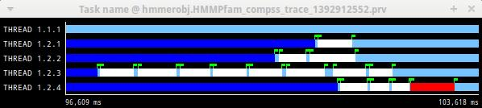
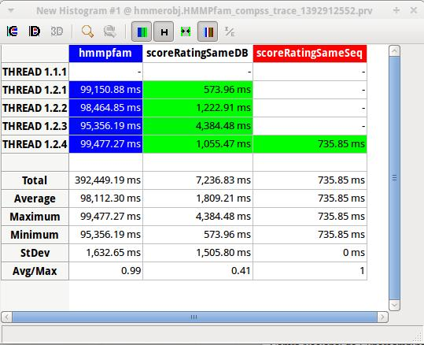
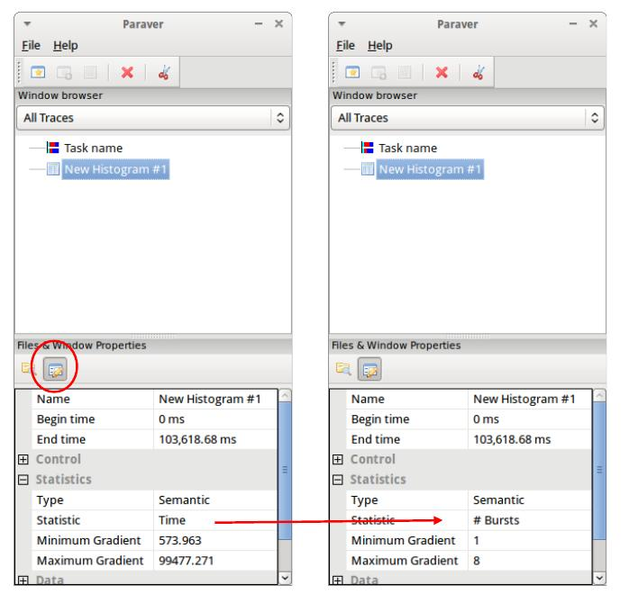

Analysis
========

This section gives some tips to analyze a COMPSs trace from two
different points of view: graphically and numerically.

Graphical Analysis
------------------

The main concept is that computational events, the task events in this
case, must be well distributed among all workers to have a good
parallelism, and the duration of task events should be also balanced,
this means, the duration of computational bursts.

.. figure:: ./Figures/8.jpeg
   :name: tracing_8
   :alt: Basic trace view of a Hmmpfam execution.
   :align: center
   :width: 60.0%

   Basic trace view of a Hmmpfam execution.

In the previous trace view, all the tasks of type “hmmpfam” in dark blue
appear to be well distributed among the four workers, each worker
executes four “hmmpfam” tasks.

However, some workers finish earlier than the others, worker 1.2.3
finish the first and worker 1.2.1 the last. So there is an imbalance in
the duration of “hmmpfam” tasks. The programmer should analyze then
whether all the tasks process the same amount of input data and do the
same thing in order to find out the reason for such imbalance.

Another thing to highlight is that tasks of type “scoreRatingSameDB” are
not equally distributed among all the workers. Some workers execute more
tasks of this type than the others. To understand better what happens
here, one needs to take a look to the execution graph and also zoom in
the last part of the trace.

.. figure:: ./Figures/9.jpeg
   :name: tracing_9
   :alt: Data dependencies graph of a Hmmpfam execution.
   :align: center
   :width: 60.0%

   Data dependencies graph of a Hmmpfam execution.

.. figure:: ./Figures/10.jpeg
   :name: tracing_10
   :alt: Zoomed in view of a Hmmpfam execution.
   :align: center
   :width: 60.0%

   Zoomed in view of a Hmmpfam execution.

There is only one task of type “scoreRatingSameSeq”. This task appears
in red in the trace (and in light-green in the graph). With the help of
the graph we see that the “scoreRatingSameSeq” task has dependences on
tasks of type “scoreRatingSameDB”, in white (or yellow).

When the last task of type “hmmpfam” (in dark blue) ends, the previous
dependencies are solved, and if we look at the graph, this means going
across a path of three dependencies of type “scoreRatingSameDB” (in
yellow). Moreover, because these are sequential dependencies (one
depends on the previous) no more than a worker can be used at the same
time to execute the tasks. This is the reason of why the last three task
of type “scoreRatingSameDB” (in white) are executed in worker 1.2.1
sequentially.

Numerical Analysis
------------------

Here we show another trace from a different parallel execution of the
Hmmer program.

   Original sample trace interval corresponding to the obtained Histogram.

Paraver offers the possibility of having different histograms of the
trace events. Click the “New Histogram” button in the main window and
accept the default options in the “New Histogram” window that will
appear.

.. figure:: ./Figures/12.jpeg
   :name: tracing_12
   :alt: Paraver Menu - New Histogram
   :align: center
   :width: 40.0%

   Paraver Menu - New Histogram

After that, the following table is shown. In this case for each worker,
the time spent executing each type of task is shown. Task names appear
in the same color than in the trace view. The color of a cell in a row
corresponding to a worker ranges from light-green for lower values to
dark-blue for higher ones. This conforms a color based histogram.

   Hmmpfam histogram corresponding to previous trace

The previous table also gives, at the end of each column, some extra
statistical information for each type of tasks (as the total, average,
maximum or minimum values, etc.).

In the window properties of the main window, it is possible to change
the semantic of the statistics to see other factors rather than the
time, for example, the number of bursts.

   Paraver histogram options menu

In the same way as before, the following table shows for each worker the
number of bursts for each type of task, this is, the number or tasks
executed of each type. Notice the gradient scale from light-green to
dark-blue changes with the new values.

.. figure:: ./Figures/15.jpeg
   :name: tracing_15
   :alt: Hmmpfam histogram with the number of bursts
   :align: center
   :width: 60.0%

   Hmmpfam histogram with the number of bursts
