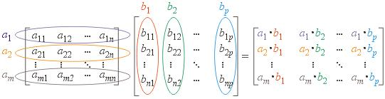
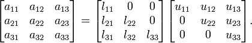
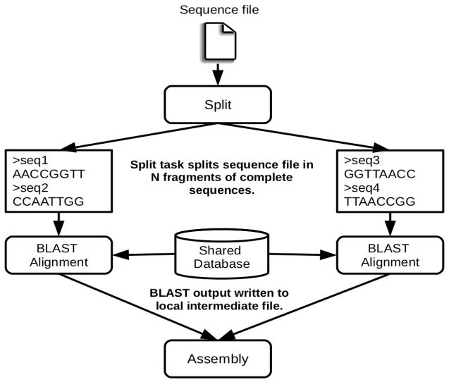

Java Sample applications
========================

The first two examples in this section are simple applications developed
in COMPSs to easily illustrate how to code, compile and run COMPSs
applications. These applications are executed locally and show different
ways to take advantage of all the COMPSs features.

The rest of the examples are more elaborated and consider the execution
in a cloud platform where the VMs mount a common storage on
**/sharedDisk** directory. This is useful in the case of applications
that require working with big files, allowing to transfer data only
once, at the beginning of the execution, and to enable the application
to access the data directly during the rest of the execution.

The Virtual Machine available at our webpage (http://compss.bsc.es/)
provides a development environment with all the applications listed in
the following sections. The codes of all the applications can be found
under the ``/home/compss/tutorial_apps/java/`` folder.

Hello World
-----------

The Hello Wolrd is a Java application that creates a task and prints a
Hello World! message. Its purpose is to clarify that the COMPSs tasks
output is redirected to the job files and it is **not** available at the
standard output.

Next we provide the important parts of the application’s code.

.. code-block:: java

    	// hello.Hello

    	public static void main(String[] args) throws Exception {
    		// Check and get parameters
    		if (args.length != 0) {
    			usage();
    			throw new Exception("[ERROR] Incorrect number of parameters");
    		}

    		// Hello World from main application
    		System.out.println("Hello World! (from main application)");

    		// Hello World from a task
    		HelloImpl.sayHello();
    	}

As shown in the main code, this application has no input arguments.

.. code-block:: java

    	// hello.HelloImpl

    	public static void sayHello() {
    		System.out.println("Hello World! (from a task)");
    	}

Remember that, to run with COMPSs, java applications must provide an
interface. For simplicity, in this example, the content of the interface
only declares the task which has no parameters:

.. code-block:: java

    	// hello.HelloItf

    	@Method(declaringClass = "hello.HelloImpl")
    	  void sayHello(
    	);

Notice that there is a first Hello World message printed from the main
code and, a second one, printed inside a task. When executing
sequentially this application users will be able to see both messages at
the standard output. However, when executing this application with
COMPSs, users will only see the message from the main code at the
standard output. The message printed from the task will be stored inside
the job log files.

Let’s try it. First we proceed to compile the code by running the
following instructions:

.. code-block:: console

    compss@bsc:~$ cd ~/tutorial_apps/java/hello/src/main/java/hello/
    compss@bsc:~/tutorial_apps/java/hello/src/main/java/hello$ javac *.java
    compss@bsc:~/tutorial_apps/java/hello/src/main/java/hello$ cd ..
    compss@bsc:~/tutorial_apps/java/hello/src/main/java$ jar cf hello.jar hello
    compss@bsc:~/tutorial_apps/java/hello/src/main/java$ mv hello.jar ~/tutorial_apps/java/hello/jar/

Alternatively, this example application is prepared to be compiled with
*maven*:

.. code-block:: console

    compss@bsc:~$ cd ~/tutorial_apps/java/hello/
    compss@bsc:~/tutorial_apps/java/hello$ mvn clean package

Once done, we can sequentially execute the application by directly
invoking the *jar* file.

.. code-block:: console

    compss@bsc:~$ cd ~/tutorial_apps/java/hello/jar/
    compss@bsc:~/tutorial_apps/java/hello/jar$ java -cp hello.jar hello.Hello
    Hello World! (from main application)
    Hello World! (from a task)

And we can also execute the application with COMPSs:

.. code-block:: console

    compss@bsc:~$ cd ~/tutorial_apps/java/hello/jar/
    compss@bsc:~/tutorial_apps/java/hello/jar$ runcompss -d hello.Hello
    [  INFO] Using default execution type: compss
    [  INFO] Using default location for project file: /opt/COMPSs/Runtime/configuration/xml/projects/default_project.xml
    [  INFO] Using default location for resources file: /opt/COMPSs/Runtime/configuration/xml/resources/default_resources.xml

    ----------------- Executing hello.Hello --------------------------

    WARNING: COMPSs Properties file is null. Setting default values
    [(928)    API]  -  Deploying COMPSs Runtime v<version>
    [(931)    API]  -  Starting COMPSs Runtime v<version>
    [(931)    API]  -  Initializing components
    [(1472)    API]  -  Ready to process tasks
    Hello World! (from main application)
    [(1474)    API]  -  Creating task from method sayHello in hello.HelloImpl
    [(1474)    API]  -  There is 0 parameter
    [(1477)    API]  -  No more tasks for app 1
    [(4029)    API]  -  Getting Result Files 1
    [(4030)    API]  -  Stop IT reached
    [(4030)    API]  -  Stopping AP...
    [(4031)    API]  -  Stopping TD...
    [(4161)    API]  -  Stopping Comm...
    [(4163)    API]  -  Runtime stopped
    [(4166)    API]  -  Execution Finished

    ------------------------------------------------------------

Notice that the COMPSs execution is using the *-d* option to allow the
job logging. Thus, we can check out the application jobs folder to look
for the task output.

.. code-block:: console

    compss@bsc:~$ cd ~/.COMPSs/hello.Hello_01/jobs/
    compss@bsc:~/.COMPSs/hello.Hello_01/jobs$ ls -1
    job1_NEW.err
    job1_NEW.out
    compss@bsc:~/.COMPSs/hello.Hello_01/jobs$ cat job1_NEW.out
    [JAVA EXECUTOR] executeTask - Begin task execution
    WORKER - Parameters of execution:
      * Method type: METHOD
      * Method definition: [DECLARING CLASS=hello.HelloImpl, METHOD NAME=sayHello]
      * Parameter types:
      * Parameter values:
    Hello World! (from a task)
    [JAVA EXECUTOR] executeTask - End task execution

Simple
------

The Simple application is a Java application that increases a counter by
means of a task. The counter is stored inside a file that is transferred
to the worker when the task is executed. Thus, the tasks inferface is
defined as follows:

.. code-block:: java

    	// simple.SimpleItf

    	@Method(declaringClass = "simple.SimpleImpl")
    	void increment(
    		@Parameter(type = Type.FILE, direction = Direction.INOUT) String file
    	);

Next we also provide the invocation of the task from the main code and
the increment’s method code.

.. code-block:: java

    	// simple.Simple

    	public static void main(String[] args) throws Exception {
    		// Check and get parameters
    		if (args.length != 1) {
    			usage();
    			throw new Exception("[ERROR] Incorrect number of parameters");
    		}
    		int initialValue = Integer.parseInt(args[0]);

    		// Write value
    		FileOutputStream fos = new FileOutputStream(fileName);
    		fos.write(initialValue);
    		fos.close();
    		System.out.println("Initial counter value is " + initialValue);

    		//Execute increment
    		SimpleImpl.increment(fileName);

    		// Write new value
    		FileInputStream fis = new FileInputStream(fileName);
    		int finalValue = fis.read();
    		fis.close();
    		System.out.println("Final counter value is " + finalValue);
    	}

.. code-block:: java

    	// simple.SimpleImpl

    	public static void increment(String counterFile) throws FileNotFoundException, IOException {
    		// Read value
    		FileInputStream fis = new FileInputStream(counterFile);
    		int count = fis.read();
    		fis.close();

    		// Write new value
    		FileOutputStream fos = new FileOutputStream(counterFile);
    		fos.write(++count);
    		fos.close();
    	}

Finally, to compile and execute this application users must run the
following commands:

.. code-block:: console

    compss@bsc:~$ cd ~/tutorial_apps/java/simple/src/main/java/simple/
    compss@bsc:~/tutorial_apps/java/simple/src/main/java/simple$ javac *.java
    compss@bsc:~/tutorial_apps/java/simple/src/main/java/simple$ cd ..
    compss@bsc:~/tutorial_apps/java/simple/src/main/java$ jar cf simple.jar simple
    compss@bsc:~/tutorial_apps/java/simple/src/main/java$ mv simple.jar ~/tutorial_apps/java/simple/jar/

    compss@bsc:~$ cd ~/tutorial_apps/java/simple/jar
    compss@bsc:~/tutorial_apps/java/simple/jar$ runcompss simple.Simple 1
    compss@bsc:~/tutorial_apps/java/simple/jar$ runcompss simple.Simple 1
    [  INFO] Using default execution type: compss
    [  INFO] Using default location for project file: /opt/COMPSs/Runtime/configuration/xml/projects/default_project.xml
    [  INFO] Using default location for resources file: /opt/COMPSs/Runtime/configuration/xml/resources/default_resources.xml

    ----------------- Executing simple.Simple --------------------------

    WARNING: COMPSs Properties file is null. Setting default values
    [(772)    API]  -  Starting COMPSs Runtime v<version>
    Initial counter value is 1
    Final counter value is 2
    [(3813)    API]  -  Execution Finished

    ------------------------------------------------------------

Increment
---------

The Increment application is a Java application that increases N times
three different counters. Each increase step is developed by a separated
task. The purpose of this application is to show parallelism between the
three counters.

Next we provide the main code of this application. The code inside the
*increment* task is the same than the previous example.

.. code-block:: java

    	// increment.Increment

    	public static void main(String[] args) throws Exception {
    		// Check and get parameters
    		if (args.length != 4) {
    			usage();
    			throw new Exception("[ERROR] Incorrect number of parameters");
    		}
    		int N = Integer.parseInt(args[0]);
    		int counter1 = Integer.parseInt(args[1]);
    		int counter2 = Integer.parseInt(args[2]);
    		int counter3 = Integer.parseInt(args[3]);

    		// Initialize counter files
    		System.out.println("Initial counter values:");
    		initializeCounters(counter1, counter2, counter3);

    		// Print initial counters state
    		printCounterValues();

    		// Execute increment tasks
    		for (int i = 0; i < N; ++i) {
    			IncrementImpl.increment(fileName1);
    			IncrementImpl.increment(fileName2);
    			IncrementImpl.increment(fileName3);
    		}

    		// Print final counters state (sync)
    		System.out.println("Final counter values:");
    		printCounterValues();
    	}

As shown in the main code, this application has 4 parameters that stand
for:

#. **N:** Number of times to increase a counter

#. **InitialValue1:** Initial value for counter 1

#. **InitialValue2:** Initial value for counter 2

#. **InitialValue3:** Initial value for counter 3

Next we will compile and run the Increment application with the *-g*
option to be able to generate the final graph at the end of the
execution.

.. code-block:: console

    compss@bsc:~$ cd ~/tutorial_apps/java/increment/src/main/java/increment/
    compss@bsc:~/tutorial_apps/java/increment/src/main/java/increment$ javac *.java
    compss@bsc:~/tutorial_apps/java/increment/src/main/java/increment$ cd ..
    compss@bsc:~/tutorial_apps/java/increment/src/main/java$ jar cf increment.jar increment
    compss@bsc:~/tutorial_apps/java/increment/src/main/java$ mv increment.jar ~/tutorial_apps/java/increment/jar/

    compss@bsc:~$ cd ~/tutorial_apps/java/increment/jar
    compss@bsc:~/tutorial_apps/java/increment/jar$ runcompss -g increment.Increment 10 1 2 3
    [  INFO] Using default execution type: compss
    [  INFO] Using default location for project file: /opt/COMPSs/Runtime/configuration/xml/projects/default_project.xml
    [  INFO] Using default location for resources file: /opt/COMPSs/Runtime/configuration/xml/resources/default_resources.xml

    ----------------- Executing increment.Increment --------------------------

    WARNING: COMPSs Properties file is null. Setting default values
    [(1028)    API]  -  Starting COMPSs Runtime v<version>
    Initial counter values:
    - Counter1 value is 1
    - Counter2 value is 2
    - Counter3 value is 3
    Final counter values:
    - Counter1 value is 11
    - Counter2 value is 12
    - Counter3 value is 13
    [(4403)    API]  -  Execution Finished

    ------------------------------------------------------------

By running the *compss_gengraph* command users can obtain the task
graph of the above execution. Next we provide the set of commands to
obtain the graph show in :numref:`increment_java`.

.. code-block:: console

    compss@bsc:~$ cd ~/.COMPSs/increment.Increment_01/monitor/
    compss@bsc:~/.COMPSs/increment.Increment_01/monitor$ compss_gengraph complete_graph.dot
    compss@bsc:~/.COMPSs/increment.Increment_01/monitor$ evince complete_graph.pdf

.. figure:: ./Figures/java/increment_graph.jpeg
   :name: increment_java
   :alt: Java increment tasks graph
   :align: center
   :width: 25.0%

   Java increment tasks graph

Matrix multiplication
---------------------

The Matrix Multiplication (Matmul) is a pure Java application that
multiplies two matrices in a direct way. The application creates 2
matrices of N x N size initialized with values, and multiply the
matrices by blocks.

This application provides three different implementations that only
differ on the way of storing the matrix:

#. **matmul.objects.Matmul** Matrix stored by means of objects

#. **matmul.files.Matmul** Matrix stored in files

#. **matmul.arrays.Matmul** Matrix represented by an array

   Matrix multiplication

In all the implementations the multiplication is implemented in the
multiplyAccumulative method that is thus selected as the task to be
executed remotely. As example, we we provide next the task
implementation and the tasks interface for the objects implementation.

.. code-block:: java

    	// matmul.objects.Block

    	public void multiplyAccumulative(Block a, Block b) {
    		for (int i = 0; i < M; i++) {
    			for (int j = 0; j < M; j++) {
    				for (int k = 0; k < M; k++) {
    					data[i][j] += a.data[i][k]*b.data[k][j];
    				}
    			}
    		}
    	}

.. code-block:: java

    	// matmul.objects.MatmulItf

    	@Method(declaringClass = "matmul.objects.Block")
    	void multiplyAccumulative(
    		@Parameter Block a,
    		@Parameter Block b
    	);

In order to run the application the matrix dimension (number of blocks)
and the dimension of each block have to be supplied. Consequently, any
of the implementations must be executed by running the following
command.

.. code-block:: console

    compss@bsc:~$ runcompss matmul.<IMPLEMENTATION_TYPE>.Matmul <matrix_dim> <block_dim>

Finally, we provide an example of execution for each implementation.

.. code-block:: console

    compss@bsc:~$ cd ~/tutorial_apps/java/matmul/jar/
    compss@bsc:~/tutorial_apps/java/matmul/jar$ runcompss matmul.objects.Matmul 8 4
    [  INFO] Using default execution type: compss
    [  INFO] Using default location for project file: /opt/COMPSs/Runtime/configuration/xml/projects/default_project.xml
    [  INFO] Using default location for resources file: /opt/COMPSs/Runtime/configuration/xml/resources/default_resources.xml

    ----------------- Executing matmul.objects.Matmul --------------------------

    WARNING: COMPSs Properties file is null. Setting default values
    [(887)    API]  -  Starting COMPSs Runtime v<version>
    [LOG] MSIZE parameter value = 8
    [LOG] BSIZE parameter value = 4
    [LOG] Allocating A/B/C matrix space
    [LOG] Computing Result
    [LOG] Main program finished.
    [(7415)    API]  -  Execution Finished

    ------------------------------------------------------------

.. code-block:: console

    compss@bsc:~$ cd ~/tutorial_apps/java/matmul/jar/
    compss@bsc:~/tutorial_apps/java/matmul/jar$ runcompss matmul.files.Matmul 8 4
    [  INFO] Using default execution type: compss
    [  INFO] Using default location for project file: /opt/COMPSs/Runtime/configuration/xml/projects/default_project.xml
    [  INFO] Using default location for resources file: /opt/COMPSs/Runtime/configuration/xml/resources/default_resources.xml

    ----------------- Executing matmul.files.Matmul --------------------------

    WARNING: COMPSs Properties file is null. Setting default values
    [(907)    API]  -  Starting COMPSs Runtime v<version>
    [LOG] MSIZE parameter value = 8
    [LOG] BSIZE parameter value = 4
    [LOG] Computing result
    [LOG] Main program finished.
    [(9925)    API]  -  Execution Finished

    ------------------------------------------------------------

.. code-block:: console

    compss@bsc:~$ cd ~/tutorial_apps/java/matmul/jar/
    compss@bsc:~/tutorial_apps/java/matmul/jar$ runcompss matmul.arrays.Matmul 8 4
    [  INFO] Using default execution type: compss
    [  INFO] Using default location for project file: /opt/COMPSs/Runtime/configuration/xml/projects/default_project.xml
    [  INFO] Using default location for resources file: /opt/COMPSs/Runtime/configuration/xml/resources/default_resources.xml

    ----------------- Executing matmul.arrays.Matmul --------------------------

    WARNING: COMPSs Properties file is null. Setting default values
    [(1062)    API]  -  Starting COMPSs Runtime v<version>
    [LOG] MSIZE parameter value = 8
    [LOG] BSIZE parameter value = 4
    [LOG] Allocating C matrix space
    [LOG] Computing Result
    [LOG] Main program finished.
    [(7811)    API]  -  Execution Finished

    ------------------------------------------------------------

Sparse LU decomposition
-----------------------

SparseLU multiplies two matrices using the factorization method of LU
decomposition, which factorizes a matrix as a product of a lower
triangular matrix and an upper one.

   Sparse LU decomposition

The matrix is divided into N x N blocks on where 4 types of operations
will be applied modifying the blocks: **lu0**, **fwd**, **bdiv** and
**bmod**. These four operations are implemented in four methods that are
selecetd as the tasks that will be executed remotely. In order to run
the application the matrix dimension has to be provided.

As the previous application, the sparseLU is provided in three different
implementations that only differ on the way of storing the matrix:

#. **sparseLU.objects.SparseLU** Matrix stored by means of objects

#. **sparseLU.files.SparseLU** Matrix stored in files

#. **sparseLU.arrays.SparseLU** Matrix represented by an array

Thus, the commands needed to execute the application is with each
implementation are:

.. code-block:: console

    compss@bsc:~$ cd tutorial_apps/java/sparseLU/jar/
    compss@bsc:~/tutorial_apps/java/sparseLU/jar$ runcompss sparseLU.objects.SparseLU 16 8
    [  INFO] Using default execution type: compss
    [  INFO] Using default location for project file: /opt/COMPSs/Runtime/configuration/xml/projects/default_project.xml
    [  INFO] Using default location for resources file: /opt/COMPSs/Runtime/configuration/xml/resources/default_resources.xml

    ----------------- Executing sparseLU.objects.SparseLU --------------------------

    WARNING: COMPSs Properties file is null. Setting default values
    [(1221)    API]  -  Starting COMPSs Runtime v<version>
    [LOG] Running with the following parameters:
    [LOG]  - Matrix Size: 16
    [LOG]  - Block Size:  8
    [LOG] Initializing Matrix
    [LOG] Computing SparseLU algorithm on A
    [LOG] Main program finished.
    [(13642)    API]  -  Execution Finished

    ------------------------------------------------------------

.. code-block:: console

    compss@bsc:~$ cd tutorial_apps/java/sparseLU/jar/
    compss@bsc:~/tutorial_apps/java/sparseLU/jar$ runcompss sparseLU.files.SparseLU 4 8
    [  INFO] Using default execution type: compss
    [  INFO] Using default location for project file: /opt/COMPSs/Runtime/configuration/xml/projects/default_project.xml
    [  INFO] Using default location for resources file: /opt/COMPSs/Runtime/configuration/xml/resources/default_resources.xml

    ----------------- Executing sparseLU.files.SparseLU --------------------------

    WARNING: COMPSs Properties file is null. Setting default values
    [(1082)    API]  -  Starting COMPSs Runtime v<version>
    [LOG] Running with the following parameters:
    [LOG]  - Matrix Size: 16
    [LOG]  - Block Size:  8
    [LOG] Initializing Matrix
    [LOG] Computing SparseLU algorithm on A
    [LOG] Main program finished.
    [(13605)    API]  -  Execution Finished

    ------------------------------------------------------------

.. code-block:: console

    compss@bsc:~$ cd tutorial_apps/java/sparseLU/jar/
    compss@bsc:~/tutorial_apps/java/sparseLU/jar$ runcompss sparseLU.arrays.SparseLU 8 8
    [  INFO] Using default execution type: compss
    [  INFO] Using default location for project file: /opt/COMPSs/Runtime/configuration/xml/projects/default_project.xml
    [  INFO] Using default location for resources file: /opt/COMPSs/Runtime/configuration/xml/resources/default_resources.xml

    ----------------- Executing sparseLU.arrays.SparseLU --------------------------

    WARNING: COMPSs Properties file is null. Setting default values
    [(1082)    API]  -  Starting COMPSs Runtime v<version>
    [LOG] Running with the following parameters:
    [LOG]  - Matrix Size: 16
    [LOG]  - Block Size:  8
    [LOG] Initializing Matrix
    [LOG] Computing SparseLU algorithm on A
    [LOG] Main program finished.
    [(13605)    API]  -  Execution Finished

    ------------------------------------------------------------

BLAST Workflow
--------------

BLAST is a widely-used bioinformatics tool for comparing primary
biological sequence information, such as the amino-acid sequences of
different proteins or the nucleotides of DNA sequences with sequence
databases, identifying sequences that resemble the query sequence above
a certain threshold. The work performed by the COMPSs Blast workflow is
computationally intensive and embarrassingly parallel.

   The COMPSs Blast workflow

The workflow describes the three blocks of the workflow implemented in
the **Split**, **Align** and **Assembly** methods. The second one is the
only method that is chosen to be executed remotely, so it is the unique
method defined in the interface file. The **Split** method chops the
query sequences file in N fragments, **Align** compares each sequence
fragment against the database by means of the Blast binary, and
**Assembly** combines all intermediate files into a single result file.

This application uses a database that will be on the shared disk space
avoiding transferring the entire database (which can be large) between
the virtual machines.

.. code-block:: console

    compss@bsc:~$ cp ~/workspace/blast/package/Blast.tar.gz /home/compss/
    compss@bsc:~$ tar xzf Blast.tar.gz

The command line to execute the workflow:

.. code-block:: console

    compss@bsc:~$ runcompss blast.Blast <debug> \
                                        <bin_location> \
                                        <database_file> \
                                        <sequences_file> \
                                        <frag_number> \
                                        <tmpdir> \
                                        <output_file>

Where:

-  **debug**: The debug flag of the application (true or false).

-  **bin_location**: Path of the Blast binary.

-  **database_file**: Path of database file; the shared disk
   **/sharedDisk/** is suggested to avoid big data transfers.

-  **sequences_file**: Path of sequences file.

-  **frag_number**: Number of fragments of the original sequence file,
   this number determines the number of parallel Align tasks.

-  **tmpdir**: Temporary directory (**/home/compss/tmp/**).

-  **output_file**: Path of the result file.

Example:

.. code-block:: console

    compss@bsc:~$ runcompss blast.Blast true \
                            /home/compss/tutorial_apps/java/blast/binary/blastall \
                            /sharedDisk/Blast/databases/swissprot/swissprot \
                            /sharedDisk/Blast/sequences/sargasso_test.fasta \
                            4 \
                            /tmp/ \
                            /home/compss/out.txt
