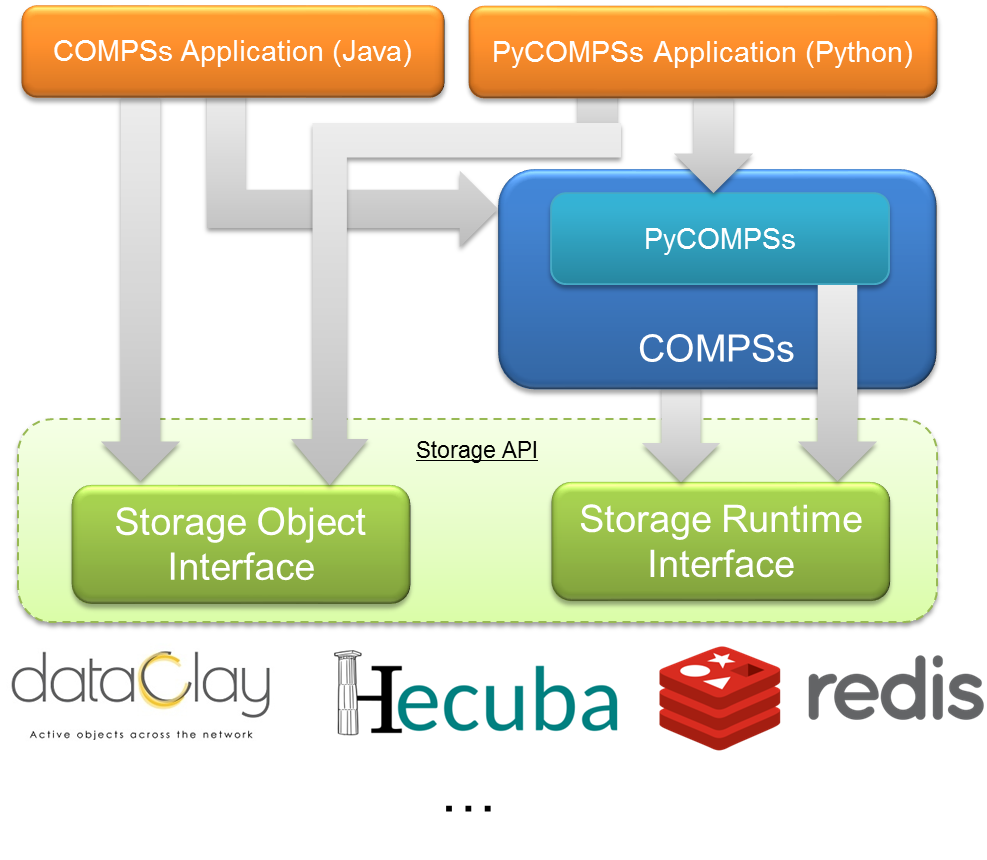

==================
Persistent Storage
==================

COMPSs is able to interact with Persistent Storage frameworks. To this end,
it is necessary to take some considerations in the application code and
on its execution.

Storage Integration
===================

COMPSs relies on a Storage API to enable the interation with persistent storage
frameworks (:numref:`storage_architecture`), which is composed by two main
modules: *Storage Object Interface* (SOI) and *Storage Runtime Interface* (SRI)



   COMPSs with persistent storage architecture

Any COMPSs application aimed at using a persistent storage framework has to
include calls to the SOI, and relies on COMPSs, which interacts with the
persistent storage framework through the SRI.
In addition, it must be taken into account that the execution of an application
using a persistent storage framework requires some specific flags in
``runcompss`` and ``enqueue_compss``.

Currently, there exists storage interfaces for dataClay_, Hecuba_ and Redis_.
They are thoroughly described from the developer and user point of view in
:ref:`COMPSs + dataClay`, :ref:`COMPSs + Hecuba` and :ref:`COMPSs + Redis` Sections.

The interface is open to any other storage framework by implementing the
required functionalities described in :ref:`Implement your own Storage interface for COMPSs`.

COMPSs + dataClay
=================

.. warning::
   To Be Done

Dependencies
------------

dataClay
````````

Other dependencies
``````````````````

Enabling COMPSs applications with dataClay
------------------------------------------

Java
````

Python
``````

C/C++
`````

.. warning::

    Unsupported language

Executing a COMPSs application with dataClay
--------------------------------------------

Launching using an existing dataClay deployment
```````````````````````````````````````````````

Launching on queue system based environments
````````````````````````````````````````````


COMPSs + Hecuba
===============

.. warning::
   To Be Done

Dependencies
------------

Hecuba
``````

Other dependencies
``````````````````

Enabling COMPSs applications with Hecuba
----------------------------------------

Java
````

.. warning::

    Unsupported language

Python
``````

C/C++
`````

.. warning::

    Unsupported language

Executing a COMPSs application with Hecuba
------------------------------------------

Launching using an existing Hecuba deployment
`````````````````````````````````````````````

Launching on queue system based environments
````````````````````````````````````````````


COMPSs + Redis
==============

COMPSs provides a built-in interface to use Redis as persistent storage
from COMPSs' applications.

.. note::
   We assume that COMPSs is already installed.
   See :ref:`Installation and Administration`

The next subsections focus on how to install the Redis utilities and
the storage API for COMPSs.

.. hint::
   It is advisable to read the Redis Cluster tutorial for beginners [1]_
   in order to understand all the terminology that is used.

Dependencies
------------

The required dependencies are:

* :ref:`Redis Server`

* :ref:`Redis Cluster script`

* :ref:`COMPSs-Redis Bundle`


Redis Server
````````````

``redis-server`` is the core Redis program. It allows to create
standalone Redis instances that may form part of a cluster in the
future. ``redis-server`` can be obtained by following these steps:

#. Go to ``https://redis.io/download`` and download the last stable
   version. This should download a ``redis-${version}.tar.gz`` file to
   your computer, where ``${version}`` is the current latest version.

#. Unpack the compressed file to some directory, open a terminal on it
   and then type ``sudo make install`` if you want to install Redis for
   all users. If you want to have it installed only for yourself you can
   simply type ``make redis-server``. This will leave the
   ``redis-server`` executable file inside the directory ``src``,
   allowing you to move it to a more convenient place. By *convenient
   place* we mean a folder that is in your ``PATH`` environment
   variable. It is advisable to not delete the uncompressed folder yet.

#. If you want to be sure that Redis will work well on your machine then
   you can type ``make test``. This will run a very exhaustive test
   suite on Redis features.

.. important::
    Do not delete the uncompressed folder yet.

Redis Cluster script
````````````````````

Redis needs an additional script to form a cluster from various Redis
instances. This script is called ``redis-trib.rb`` and can be found in
the same tar.gz file that contains the sources to compile
``redis-server`` in ``src/redis-trib.rb``. Two things must be done to
make this script work:

#. Move it to a convenient folder. By *convenient folder* we mean a
   folder that is in your ``PATH`` environment variable.

#. Make sure that you have Ruby and ``gem`` installed. Type
   ``gem install redis``.

#. In order to use COMPSs + Redis with Python you must also install the
   ``redis`` and ``redis-py-cluster`` PyPI packages.

   .. hint::
      It is also advisable to have the PyPI package ``hiredis``, which is a
      library that makes the interactions with the storage to go faster.

COMPSs-Redis Bundle
```````````````````

``COMPSs-Redis Bundle`` is a software package that contains the
following:

#. A java JAR file named ``compss-redisPSCO.jar``. This JAR contains the
   implementation of a Storage Object that interacts with a given Redis
   backend. We will discuss the details later.

#. A folder named ``scripts``. This folder contains a bunch of scripts
   that allows a COMPSs-Redis app to create a custom, in-place cluster
   for the application.

#. A folder named ``python`` that contains the Python equivalent to
   ``compss-redisPSCO.jar``

This package can be obtained from the COMPSs source as follows:

#. Go to ``trunk/utils/storage/redisPSCO``

#. Type ``./make_bundle``. This will leave a folder named
   ``COMPSs-Redis-bundle`` with all the bundle contents.


Enabling COMPSs applications with Redis
---------------------------------------

Java
````

This section describes how to develop Java applications with the
Redis storage. The application project should have the
dependency induced by ``compss-redisPSCO.jar`` satisfied.
That is, it should be included in the application's ``pom.xml`` if you are
using Maven, or it should be listed in the
dependencies section of the used development tool.

The application is almost identical to a regular COMPSs
application except for the presence of Storage Objects. A Storage
Object is an object that it is capable to interact with the storage
backend. If a custom object extends the Redis Storage Object and
implements the Serializable interface then it will be ready to be
stored and retrieved from a Redis database. An example signature could
be the following:

.. code-block:: java

    import storage.StorageObject;
    import java.io.Serializable;

      /**
      * A PSCO that contains a KD point
      */
      class RedisPoint
      extends StorageObject implements Serializable {

        // Coordinates of our point
        private double[] coordinates;
        /**
        * Write here your class-specific
        * constructors, attributes and methods.
        */
        double getManhattanDistance(RedisPoint other) {
          ...
        }
      }

The ``StorageObject`` object has some inherited methods that allow the
user to write custom objects that interact with the Redis backend. These
methods can be found in :numref:`storage_obj_methods`.


.. table:: Available methods from StorageObject
    :name: storage_obj_methods
    :widths: auto

    +---------------------------+---------+-----------------------------------------------------------------------------------------+
    | Name                      | Returns | Comments                                                                                |
    +===========================+=========+=========================================================================================+
    | makePersistent(String id) | Nothing | | Inserts the object in the database with the id.                                       |
    |                           |         | | If id is null, a random UUID will be computed instead.                                |
    +---------------------------+---------+-----------------------------------------------------------------------------------------+
    | deletePersistent()        | Nothing | | Removes the object from the storage.                                                  |
    |                           |         | | It does nothing if it was not already there.                                          |
    +---------------------------+---------+-----------------------------------------------------------------------------------------+
    | getID()                   | String  | | Returns the current object identifier if the object is not persistent (null instead). |
    +---------------------------+---------+-----------------------------------------------------------------------------------------+

.. caution::
   Redis Storage Objects that are used as INOUTs must be manually updated.
   This is due to the fact that COMPSs does not know the exact effects of
   the interaction between the object and the storage, so the runtime cannot
   know if it is necessary to call ``makePersistent`` after having used an
   INOUT or not (other storage approaches do live modifications to its storage
   objects). The followingexample illustrates this situation:

   .. code-block:: java

      /**
      * A is passed as INOUT
      */
      void accumulativePointSum(RedisPoint a, RedisPoint b) {
        // This method computes the coordinate-wise sum between a and b
        // and leaves the result in a
        for(int i=0; i<a.getCoordinates().length; ++i) {
          a.setComponent(i, a.getComponent(i) + b.getComponent(i));
        }
        // Delete the object from the storage and
        // re-insert the object with the same old identifier
        String objectIdentifier = a.getID();
        // Redis contains the old version of the object
        a.deletePersistent();
        // Now we will insert the updated one
        a.makePersistent(objectIdentifier);
      }


   If the last three statements were not present, the changes would never
   be reflected on the ``RedisPoint a`` object.

Python
``````

Redis is also available for Python. As happens with Java, we
first need to define a custom Storage Object. Let’s suppose that we want
to write an application that multiplies two matrices :math:`A`, and
:math:`B` by blocks. We can define a ``Block`` object that lets us store
and write matrix blocks in our Redis backend:

.. code-block:: python

      from storage.storage_object import StorageObject
      import storage.api

      class Block(StorageObject):
        def __init__(self, block):
            super(Block, self).__init__()
            self.block = block

        def get_block(self):
            return self.block

        def set_block(self, new_block):
            self.block = new_block


Let’s suppose that we are multiplying our matrices in the usual blocked
way:

.. code-block:: python

      for i in range(MSIZE):
        for j in range(MSIZE):
          for k in range(MSIZE):
            multiply(A[i][k], B[k][j], C[i][j])


Where :math:`A` and :math:`B` are ``Block`` objects and :math:`C` is a
regular Python object (e.g: a Numpy matrix), then we can define
``multiply`` as a task as follows:

.. code-block:: python

      @task(c = INOUT)
      def multiply(a_object, b_object, c, MKLProc):
          c += a_object.block * b_object.block


Let’s also suppose that we are interested to store the final result in
our storage. A possible solution is the following:

.. code-block:: python

      for i in range(MSIZE):
          for j in range(MSIZE):
              persist_result(C[i][j])


Where ``persist_result`` can be defined as a task as follows:

.. code-block:: python

      @task()
      def persist_result(obj):
          to_persist = Block(obj)
          to_persist.make_persistent()


This way is preferred for two main reasons:

* we avoid to bring the resulting matrix to the master node,
* and we can exploit the data locality by executing the task in the node
  where last version of ``obj`` is located.

C/C++
`````

.. warning::

    Unsupported language


Executing a COMPSs application with Redis
-----------------------------------------

Launching using an existing Redis Cluster
`````````````````````````````````````````

If there is already a running Redis Cluster on the node/s where the
COMPSs application will run then only the following steps must be
followed:

#. Create a ``storage_conf.cfg`` file that lists, one per line, the
   nodes where the storage is present. Only hostnames or IPs are needed,
   ports are not necessary here.

#. Add the flag ``--classpath=${path_to_COMPSs-redisPSCO.jar}`` to the
   ``runcompss`` command that launches the application.

#. Add the flag
   ``--storage_conf=${path_to_your_storage_conf_dot_cfg_file}`` to the
   ``runcompss`` command that launches the application.

#. If you are running a python app, also add the
   ``--pythonpath=${app_path}:${path_to_the_bundle_folder}/python``
   flag to the ``runcompss`` command that launches the application.

As usual, the ``project.xml`` and ``resources.xml`` files must be
correctly set. It must be noted that there can be Redis nodes that are
not COMPSs nodes (although **this is a highly unrecommended practice**).
As a requirement, **there must be at least one Redis instance on each
COMPSs node listening to the official Redis port 6379**\  [2]_. This is
required because nodes without running Redis instances would cause a
great amount of transfers (they will **always** need data that must be
transferred from another node). Also, any locality policy will likely
cause this node to have a very low workload, rendering it almost
useless.

Launching on queue system based environments
````````````````````````````````````````````

``COMPSs-Redis-Bundle`` also includes a collection of scripts that allow
the user to create an in-place Redis cluster with his/her COMPSs
application. These scripts will create a cluster using only the COMPSs
nodes provided by the queue system (e.g. SLURM, PBS, etc.).
Some parameters can be tuned by the user via a
``storage_props.cfg`` file. This file must have the following form:

.. code-block:: bash

      REDIS_HOME=some_path
      REDIS_NODE_TIMEOUT=some_nonnegative_integer_value
      REDIS_REPLICAS=some_nonnegative_integer_value


There are some observations regarding to this configuration file:

REDIS_HOME
   Must be equal to a path to some location that is
   **not** shared between nodes. This is the location where the Redis
   sandboxes for the instances will be created.

REDIS_NODE_TIMEOUT
   Must be a nonnegative integer number that
   represents the amount of milliseconds that must pass before Redis
   declares the cluster broken in the case that some instance is not
   available.

REDIS_REPLICAS
   Must be equal to a nonnegative integer. This value
   will represent the amount of replicas that a given shard will have.
   If possible, Redis will ensure that all replicas of a given shard
   will be on different nodes.

In order to run a COMPSs + Redis application on a queue system the user
must add the following flags to the ``enqueue_compss`` command:

#. ``--storage-home=${path_to_the_bundle_folder}`` This must point to
   the root of the COMPSs-Redis bundle.

#. ``--storage-props=${path_to_the_storage_props_file}`` This must point
   to the ``storage_props.cfg`` mentioned above.

#. ``--classpath=${path_to_COMPSs-redisPSCO.jar}`` As in the previous
   section, the JAR with the storage API must be specified.

#. If you are running a Python application, also add the
   ``--pythonpath=${app_path}:${path_to_the_bundle_folder}`` flag

.. caution::
    As a requirement, the supercomputer **MUST NOT** kill daemonized
    processes running on the provided computing nodes during the execution.


Implement your own Storage interface for COMPSs
===============================================

In order to implement an interface for a Storage framework, it is necessary to
implement the Java SRI (mandatory), and depending on the desired language,
implement the Python SRI and the specific SOI inheriting from the generic SOI
provided by COMPSs.


Generic Storage Object Interface
--------------------------------

:ref:`sco_object_definition` shows the functions that must exist in the storage
object interface, that enables the object that inherits it to interact with the
storage framework.

.. table:: SCO object definition
    :name: sco_object_definition
    :widths: auto

    +---------------------------+---------+-----------------------------------------------------------------------------------------+
    | Name                      | Returns | Comments                                                                                |
    +===========================+=========+=========================================================================================+
    | Constructor               | Nothing | | Instantiates the object.                                                              |
    +---------------------------+---------+-----------------------------------------------------------------------------------------+
    | get_by_alias(String id)   | Object  | | Retrieve the object with alias "name".                                                |
    +---------------------------+---------+-----------------------------------------------------------------------------------------+
    | makePersistent(String id) | Nothing | | Inserts the object in the storage framework with the id.                              |
    |                           |         | | If id is null, a random UUID will be computed instead.                                |
    +---------------------------+---------+-----------------------------------------------------------------------------------------+
    | deletePersistent()        | Nothing | | Removes the object from the storage.                                                  |
    |                           |         | | It does nothing if it was not already there.                                          |
    +---------------------------+---------+-----------------------------------------------------------------------------------------+
    | getID()                   | String  | | Returns the current object identifier if the object is not persistent (null instead). |
    +---------------------------+---------+-----------------------------------------------------------------------------------------+

For example, the **makePersistent** function is intended to store the object
content into the persistent storage, **deletePersistent** to remove it, and
**getID** to provide the object identifier.

.. important::
   An object will be considered persisted if the ``getID`` function retrieves
   something different from ``None``.

This interface must be implemented in the target language desired (e.g. Java or Python).


Generic Storage Runtime Interfaces
----------------------------------

:ref:`java_api` shows the functions that must exist in the storage
runtime interface, that enables the COMPSs runtime to interact with the
storage framework.

.. table:: Java API
    :name: java_api
    :widths: auto

    +----------------------------------------+--------------+---------------------------------------------+------------------------------------------------------------------------------------------------------------------------------------------------------+
    | Name                                   | Returns      | Comments                                    | Signature                                                                                                                                            |
    +========================================+==============+=============================================+======================================================================================================================================================+
    | | init(String storage_conf)            | Nothing      | | Do any initialization action before       | public static void init(String storageConf) throws StorageException {}                                                                               |
    |                                        |              | | starting to execute the application.      |                                                                                                                                                      |
    |                                        |              | | Receives the storage configuration        |                                                                                                                                                      |
    |                                        |              | | file path defined in the ``runcompss``    |                                                                                                                                                      |
    |                                        |              | | or ``enqueue_composs`` command.           |                                                                                                                                                      |
    +----------------------------------------+--------------+---------------------------------------------+------------------------------------------------------------------------------------------------------------------------------------------------------+
    | | finish()                             | Nothing      | | Do any finalization action after          | public static void finish() throws StorageException                                                                                                  |
    |                                        |              | | executing the application.                |                                                                                                                                                      |
    +----------------------------------------+--------------+---------------------------------------------+------------------------------------------------------------------------------------------------------------------------------------------------------+
    | | getLocations(String id)              | List<String> | | Retrieve the locations where a particular | public static List<String> getLocations(String id) throws StorageException                                                                           |
    |                                        |              | | object is from its identifier.            |                                                                                                                                                      |
    +----------------------------------------+--------------+---------------------------------------------+------------------------------------------------------------------------------------------------------------------------------------------------------+
    | | getByID(String id)                   | Object       | | Retrieve an object from its identifier.   | public static Object getByID(String id) throws StorageException                                                                                      |
    |                                        |              |                                             |                                                                                                                                                      |
    +----------------------------------------+--------------+---------------------------------------------+------------------------------------------------------------------------------------------------------------------------------------------------------+
    | | newReplica(String id,                | String       | | Create a new replica of an object in the  | public static void newReplica(String id, String hostName) throws StorageException                                                                    |
    | |            String hostName)          |              | | storage framework.                        |                                                                                                                                                      |
    +----------------------------------------+--------------+---------------------------------------------+------------------------------------------------------------------------------------------------------------------------------------------------------+
    | | newVersion(String id,                | String       | | Create a new version of an object in the  | public static String newVersion(String id, String hostName) throws StorageException                                                                  |
    | |            String hostname)          |              | | storage framework.                        |                                                                                                                                                      |
    +----------------------------------------+--------------+---------------------------------------------+------------------------------------------------------------------------------------------------------------------------------------------------------+
    | | consolidateVersion(String id)        | Nothing      | | Consolidate a version of an object in the | public static void consolidateVersion(String idFinal) throws StorageException                                                                        |
    |                                        |              | | storage framework.                        |                                                                                                                                                      |
    +----------------------------------------+--------------+---------------------------------------------+------------------------------------------------------------------------------------------------------------------------------------------------------+
    | | executeTask(String id, ...)          | String       | | Execute the task into the datastore.      | public static String executeTask(String id, String descriptor, Object[] values, String hostName, CallbackHandler callback) throws StorageException   |
    |                                        |              |                                             |                                                                                                                                                      |
    +----------------------------------------+--------------+---------------------------------------------+------------------------------------------------------------------------------------------------------------------------------------------------------+
    | | getResult(CallbackEvent event())     | Object       | | Retrieve the result of the execution into | public static Object getResult(CallbackEvent event) throws StorageException                                                                          |
    |                                        |              | | the storage framework.                    |                                                                                                                                                      |
    +----------------------------------------+--------------+---------------------------------------------+------------------------------------------------------------------------------------------------------------------------------------------------------+

This functions enable the COMPSs runtime to keep the data consistency through
the distributed execution.

In addition, :ref:`python_api` shows the functions that must exist in the storage
runtime interface, that enables the COMPSs Python binding to interact with the
storage framework. It is only necessary if the target language is Python.

.. table:: Python API
    :name: python_api
    :widths: auto

    +---------------------------+---------+-----------------------------------------------------------------------------------+-------------------------------------------------------------------------------+
    | Name                      | Returns | Comments                                                                          | Signature                                                                     |
    +===========================+=========+===================================================================================+===============================================================================+
    | init(String storage_conf) | Nothing | | Do any initialization action before starting to execute the application.        | | def initWorker(config_file_path=None, \*\*kwargs)                           |
    |                           |         | | Receives the storage configuration file path defined in the ``runcompss`` or    | |     # Does not return                                                       |
    |                           |         | | ``enqueue_composs`` command.                                                    |                                                                               |
    +---------------------------+---------+-----------------------------------------------------------------------------------+-------------------------------------------------------------------------------+
    | finish()                  | Nothing | | Do any finalization action after executing the application.                     | | def finishWorker(\*\*kwargs)                                                |
    |                           |         |                                                                                   | |     # Does not return                                                       |
    +---------------------------+---------+-----------------------------------------------------------------------------------+-------------------------------------------------------------------------------+
    | getByID(String id)        | Object  | | Retrieve an object from its identifier.                                         | | def getByID(id)                                                             |
    |                           |         |                                                                                   | |     # Returns the object with Id ‘id’                                       |
    +---------------------------+---------+-----------------------------------------------------------------------------------+-------------------------------------------------------------------------------+
    | TaskContext               | Context | | Define a task context (task enter/exit actions).                                | | class TaskContext(object):                                                  |
    |                           |         |                                                                                   | |                                                                             |
    |                           |         |                                                                                   | |     def __init__(self, logger, values, config_file_path=None, \*\*kwargs):  |
    |                           |         |                                                                                   | |         self.logger = logger                                                |
    |                           |         |                                                                                   | |         self.values = values                                                |
    |                           |         |                                                                                   | |         self.config_file_path = config_file_path                            |
    |                           |         |                                                                                   | |                                                                             |
    |                           |         |                                                                                   | |     def __enter__(self):                                                    |
    |                           |         |                                                                                   | |         # Do something for task prolog                                      |
    |                           |         |                                                                                   | |                                                                             |
    |                           |         |                                                                                   | |     def __exit__(self, type, value, traceback):                             |
    |                           |         |                                                                                   | |         # Do something for task epilog                                      |
    +---------------------------+---------+-----------------------------------------------------------------------------------+-------------------------------------------------------------------------------+


Storage Interface usage
-----------------------

Using ``runcompss``
```````````````````
The first consideration is to deploy the storage framework, and then follow the next
steps:

#. Create a ``storage_conf.cfg`` file with the configuation required by
   the ``init`` SRIs functions.

#. Add the flag ``--classpath=${path_to_SRI.jar}`` to the ``runcompss`` command.

#. Add the flag ``--storage_conf="path to storage_conf.cfg file`` to the ``runcompss`` command.

#. If you are running a Python app, also add the
   ``--pythonpath=${app_path}:${path_to_the_bundle_folder}/python``
   flag to the ``runcompss`` command.

As usual, the ``project.xml`` and ``resources.xml`` files must be
correctly set. It must be noted that there can be nodes that are
not COMPSs nodes (although **this is a highly unrecommended** practice since
they will **always** need data that must be transferred from another node).
Also, any locality policy will likely cause this node to have a very low workload.

Using ``enqueue_compss``
````````````````````````
In order to run a COMPSs + your storage on a queue system the user
must add the following flags to the ``enqueue_compss`` command:

#. ``--storage-home=${path_to_the_user_storage_folder}`` This must point to
   the root of the user storage folder, where the scripts for starting (``storage_init.sh``) and
   stopping (``storage_stop.sh``) the storage framework must exist.

   * ``storage_init.sh`` is called before the application execution and it
      is intended to deploy the storage framework within the nodes provided
      by the queuing system. The parameters that receives are (in order):

      JOBID
         The job identifier provided by the queuing system.

      MASTER_NODE
         The name of the master node considered by COMPSs.

      STORAGE_MASTER_NODE
         The name of the node to be considere the master for the Storage framework.

      WORKER_NODES
         The set of nodes provided by the queuing system that will be considered
         as worker nodes by COMPSs.

      NETWORK
         Network interface (e.g. ib0)

      STORAGE_PROPS
         Storage properties file path (defined as ``enqueue_compss`` flag).

      VARIABLES_TO_BE_SOURCED
         If environment variables for the Storage framework need to be defined
         COMPSs provides an empty file to be filled by the ``storage_init.sh``
         script, that will be sourced afterwards. This file is cleaned inmediately
         after sourcing it.

   * ``storage_stop.sh`` is called after the application execution and it
      is intended to stop the storage framework within the nodes provided
      by the queuing system. The parameters that receives are (in order):

      JOBID
         The job identifier provided by the queuing system.

      MASTER_NODE
         The name of the master node considered by COMPSs.

      STORAGE_MASTER_NODE
         The name of the node to be considere the master for the Storage framework.

      WORKER_NODES
         The set of nodes provided by the queuing system that will be considered
         as worker nodes by COMPSs.

      NETWORK
         Network interface (e.g. ib0)

      STORAGE_PROPS
         Storage properties file path (defined as ``enqueue_compss`` flag).


#. ``--storage-props=${path_to_the_storage_props_file}`` This must point
   to the ``storage_props.cfg`` specific for the storage framework that
   will be used by the start and stop scripts provided in the ``--storage-home``
   path.

#. ``--classpath=${path_to_SRI.jar}`` As in the previous section, the JAR with
   the Java SRI must be specified.

#. If you are running a Python application, also add the
   ``--pythonpath=${app_path}:${path_to_the_user_storage_folder}`` flag, where
   the SOI for Python must exist.


.. _dataClay: https://www.bsc.es/research-and-development/software-and-apps/software-list/dataclay

.. _Hecuba: https://www.bsc.es/research-and-development/software-and-apps/software-list/hecuba

.. _Redis: https://redis.io/

.. [1]
   https://redis.io/topics/cluster-tutorial

.. [2]
   https://en.wikipedia.org/wiki/List_of_TCP_and_UDP_port_numbers


.. figure:: /Logos/bsc_logo.jpg
   :width: 40.0%
   :align: center
