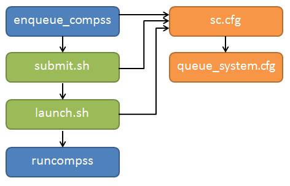

Supercomputers
==============

The COMPSs Framework can be installed in any Supercomputer by installing
its packages as in a normal distribution. The packages are ready to be
reallocated so the administrators can choose the right location for the
COMPSs installation.

However, if the administrators are not willing to install COMPSs through
the packaging system, we also provide a **COMPSs zipped file**
containing a pre-build script to easily install COMPSs. Next subsections
provide further information about this process.

Prerequisites
-------------

In order to successfully run the installation script some dependencies
must be present on the target machine. Administrators must provide the
correct installation and environment of the following software:

-  Autotools

-  BOOST

-  Java 8 JRE

The following environment variables must be defined:

-  JAVA_HOME

-  BOOST_CPPFLAGS

The tracing system can be enhanced with:

-  PAPI, which provides support for harware counters

-  MPI, which speeds up the tracing merge (and enables it for huge
   traces)

Installation
------------

To perform the COMPSs Framework installation please execute the
following commands:

.. code-block:: console

     $ # Check out the last COMPSs release
     $ wget http://compss.bsc.es/repo/sc/stable/COMPSs_<version>.tar.gz

     $ # Unpackage COMPSs
     $ tar -xvzf COMPSs_<version>.tar.gz

     $ # Install COMPSs at your preferred target location
     $ cd COMPSs
     $ ./install <targetDir> [<supercomputer.cfg>]

     $ # Clean downloaded files
     $ rm -r COMPSs
     $ rm COMPSs_<version>.tar.gz

The installation script will create a COMPSs folder inside the given
``<targetDir>`` so the final COMPSs installation will be placed under
the ``<targetDir>/COMPSs`` folder.

.. attention::
   If the ``<targetDir>/COMPSs`` folder already exists it will be **automatically erased**.

  After completing the previous steps, administrators must ensure that
the nodes have passwordless ssh access. If it is not the case, please
contact the COMPSs team at support-compss@bsc.es.

  The COMPSs package also provides a *compssenv* file that loads the
required environment to allow users work more easily with COMPSs. Thus,
after the installation process we recomend to source the
``<targetDir>/COMPSs/compssenv`` into the users *.bashrc*.

  Once done, remember to log out and back in again to end the
installation process.

Configuration
-------------

To maintain the portability between different environments, COMPSs has a
pre-built structure of scripts to execute applications in Supercomputers.
For this purpose, users must use the ``enqueue_compss`` script provided in the
COMPSs installation and specify the supercomputer configuration with
``--sc_cfg`` flag.

When installing COMPSs for a supercomputer, system administrators must define
a configuration file for the specific Supercomputer parameters.
This document gives and overview about how to modify the configuration files
in order to customize the enqueue_compss for a specific queue system and
supercomputer.
As overview, the easier way to proceed when creating a new configuration is to
modify one of the configurations provided by COMPSs. System sdministrators can
find configurations for **LSF**, **SLURM**, **PBS** and **SGE** as well as
several examples for Supercomputer configurations in
``<installation_dir>/Runtime/scripts/queues``.
For instance, the configuration for the *MareNostrum IV* Supercomputer and the
*Slurm* queue system, can be used as base file for  new supercomputer and queue
system cfgs. Sysadmins can modify these files by changing the flags,
parameters, paths and default values that corresponds to your supercomputer.
Once, the files have been modified, they must be copied to the queues folder
to make them available to the users. The following paragraph describe more
in detail the scripts and configuration files
If you need help, contact support-compss@bsc.es.

COMPSs Queue structure overview
~~~~~~~~~~~~~~~~~~~~~~~~~~~~~~~

All the scripts and cfg files shown in :numref:`queue_structure` are located
in the ``<installation_dir>/Runtime/scripts/`` folder.
``enqueue_compss`` and ``launch_compss`` (**launch.sh in the figure**) are in
the user subfolder and ``submit.sh`` and the ``cfgs`` are located in queues.
There are two types of cfg files: the *queue system cfg* files, which are
located in ``queues/queue_systems``; and the *supercomputers cfg* files, which
are located in ``queues/supercomputers``.

   Structure of COMPSs queue scripts. In Blue user scripts, in Green
   queue scripts and in Orange system dependant scripts

Configuration Files
~~~~~~~~~~~~~~~~~~~

The cfg files contain a set of bash variables which are used by the other scripts.
On the one hand, the queue system cfgs contain the variables to indicate the
commands used by the system to submit and spawn processes, the commands or
variables to get the allocated nodes and the directives to indicate the number
of nodes, processes, etc.
Below you can see an example of the most important variable definition for Slurm

.. code-block:: bash

    # Submission command (submit.sh)
    SUBMISSION_CMD="sbatch"
    SUBMISSION_PIPE="< "
    ...
    # Variables to define the directives as #${QUEUE_CMD} ${ARG_*}${QUEUE_SEPARATOR}value (submit.sh)
    QUEUE_CMD="SBATCH"
    QUEUE_SEPARATOR=""
    QARG_JOB_NAME="--job-name="
    QARG_JOB_OUT="-o"
    QARG_JOB_ERROR="-e"
    QARG_WD="--workdir="
    QARG_WALLCLOCK="-t"
    QARG_NUM_NODES="-N"
    QARG_NUM_PROCESSES="-n"
    ...
    #vars to customize the commands know job id and allocated nodes (submit.sh)
    ENV_VAR_JOB_ID="SLURM_JOB_ID"
    ENV_VAR_NODE_LIST="SLURM_JOB_NODELIST"
    HOSTLIST_CMD="scontrol show hostname"
    HOSTLIST_TREATMENT="| awk {' print \$1 '} | sed -e 's/\.[^\ ]*//g'"
    ...
    #vars to customize worker process spawn inside the job (launch_compss)
    LAUNCH_CMD="srun"
    LAUNCH_PARAMS="-n1 -N1 --nodelist="
    LAUNCH_SEPARATOR=""
    CMD_SEPARATOR=""

To adapt this script to your queue system, you just need to change the variable
value to the command, argument or value required in your system.
If you find that some of this variables are not available in your system, leave it empty.

On the other hand, the supercomputers cfg files contains a set of variables to
indicate the queue system used by a supercomputer, paths where the shared disk
is mounted, the default values that COMPSs will set in the project and resources
files when they are not set by the user and flags to indicate if a functionality
is available or not in a supercomputer. The following lines show examples of this
variables for the *MareNostrum IV* supercomputer.

.. code-block:: bash

    QUEUE_SYSTEM="slurm"

    # Default values enqueue_compss
    DEFAULT_EXEC_TIME=10
    DEFAULT_NUM_NODES=2
    DEFAULT_QUEUE=default
    DEFAULT_CPUS_PER_NODE=48
    DEFAULT_NODE_MEMORY_SIZE=92
    DEFAULT_MASTER_WORKING_DIR=.
    MINIMUM_NUM_NODES=1
    MINIMUM_CPUS_PER_NODE=1
    ...
    # Enabling/disabling queue system features
    DISABLE_QARG_MEMORY=true
    DISABLE_QARG_CONSTRAINTS=false
    DISABLE_QARG_QOS=false
    DISABLE_QARG_OVERCOMMIT=true
    DISABLE_QARG_CPUS_PER_TASK=false
    HETEROGENEOUS_MULTIJOB=false
    ...
    #Paths
    SCRATCH_DIR="/scratch/tmp"
    GPFS_PREFIX="/gpfs/"
    ...
    #Other values
    REMOTE_EXECUTOR="none" #disable the ssh spawn at runtime
    NETWORK_INFINIBAND_SUFFIX="-ib0" #hostname suffix to add in order to use infiniband
    NETWORK_DATA_SUFFIX="-data" #hostname suffix to add in order to use infiniband
    MASTER_NAME_CMD=hostname #command to know the mastername

To adapt this script to your supercomputer, you just need to change the
variables to commands paths or values which are set in your system.
If you find that some of this values are not available in your system,
leave them empty or as they are in the MareNostrum IV.

How are cfg files used in scripts?
~~~~~~~~~~~~~~~~~~~~~~~~~~~~~~~~~~

The ``submit.sh`` is in charge of getting some of the arguments from
``enqueue_compss``, generating the a temporal job submission script for the
*queue_system* (function *create_normal_tmp_submit*) and performing the
submission in the scheduler (function *submit*).
The functions used in ``submit.sh`` are implemented in ``common.sh``.
If you look at the code of this script, you will see that most of the code is
customized by a set of bash vars which are mainly defined in the cfg files.

For instance the submit command is customized in the following way:

.. code-block:: bash

    eval ${SUBMISSION_CMD} ${SUBMISSION_PIPE}${TMP_SUBMIT_SCRIPT}

Where ``${SUBMISSION_CMD}`` and ``${SUBMISSION_PIPE}`` are defined in the
``queue_system.cfg``. So, for the case of Slurm, at execution time it is
translated to something like ``sbatch < /tmp/tmp_submit_script``

The same approach is used for the queue system directives defined in the
submission script or in the command to get the assigned host list.

The following lines show the examples in these cases.

.. code-block:: bash

    #${QUEUE_CMD} ${QARG_JOB_NAME}${QUEUE_SEPARATOR}${job_name}

In the case of Slurm in MN, it generates something like ``#SBATCH --job-name=COMPSs``

.. code-block:: bash

    host_list=\$(${HOSTLIST_CMD} \$${ENV_VAR_NODE_LIST}${env_var_suffix} ${HOSTLIST_TREATMENT})

The same approach is used in the ``launch_compss`` script where it is using
the defined vars to customize the *project.xml* and *resources.xml* file
generation and spawning the master and worker processes in the assigned resources.

At first, you should not need to modify any script. The goal of the cfg files
is that sysadmins just require to modify the supercomputers cfg, and in the
case that the used queue system is not in the *queue_systems*, folder it
should create a new one for the new one.

If you think that some of the features of your system are not supported in
the current implementation, please contact us at support-compss@bsc.es.
We will discuss how it should be incorporated in the scripts.

Post installation
-----------------

To check that COMPSs Framework has been successfully installed you may
run:

.. code-block:: console

     $ # Check the COMPSs version
     $ runcompss -v
     COMPSs version <version>

For queue system executions, COMPSs provides several prebuild queue
scripts than can be accessible throgh the *enqueue\_compss* command.
Users can check the available options by running:

.. code-block:: console

    $ enqueue_compss -h

    Usage: enqueue_compss [queue_system_options] [COMPSs_options]
              application_name [application_arguments]

    * Options:
      General:
        --help, -h                              Print this help message
        --heterogeneous                         Indicates submission is going to be heterogeneous
                                                Default: Disabled
      Queue system configuration:
        --sc_cfg=<name>                         SuperComputer configuration file to use. Must exist inside queues/cfgs/
                                                Default: default

      Submission configuration:
      General submision arguments:
        --exec_time=<minutes>                   Expected execution time of the application (in minutes)
                                                Default: 10
        --job_name=<name>                       Job name
                                                Default: COMPSs
        --queue=<name>                          Queue name to submit the job. Depends on the queue system.
                                                For example (MN3): bsc_cs | bsc_debug | debug | interactive
                                                Default: default
        --reservation=<name>                    Reservation to use when submitting the job.
                                                Default: disabled
        --constraints=<constraints>             Constraints to pass to queue system.
                                                Default: disabled
        --qos=<qos>                             Quality of Service to pass to the queue system.
                                                Default: default
        --cpus_per_task                         Number of cpus per task the queue system must allocate per task.
                                                Note that this will be equal to the cpus_per_node in a worker node and
                                                equal to the worker_in_master_cpus in a master node respectively.
                                                Default: false
        --job_dependency=<jobID>                Postpone job execution until the job dependency has ended.
                                                Default: None
        --storage_home=<string>                 Root installation dir of the storage implementation
                                                Default: null
        --storage_props=<string>                Absolute path of the storage properties file
                                                Mandatory if storage_home is defined
      Normal submission arguments:
        --num_nodes=<int>                       Number of nodes to use
                                                Default: 2
        --num_switches=<int>                    Maximum number of different switches. Select 0 for no restrictions.
                                                Maximum nodes per switch: 18
                                                Only available for at least 4 nodes.
                                                Default: 0
      Heterogeneous submission arguments:
        --type_cfg=<file_location>              Location of the file with the descriptions of node type requests
                                                File should follow the following format:
                                                type_X(){
                                                  cpus_per_node=24
                                                  node_memory=96
                                                  ...
                                                }
                                                type_Y(){
                                                  ...
                                                }
        --master=<master_node_type>             Node type for the master
                                                (Node type descriptions are provided in the --type_cfg flag)
        --workers=type_X:nodes,type_Y:nodes     Node type and number of nodes per type for the workers
                                                (Node type descriptions are provided in the --type_cfg flag)
      Launch configuration:
        --cpus_per_node=<int>                   Available CPU computing units on each node
                                                Default: 48
        --gpus_per_node=<int>                   Available GPU computing units on each node
                                                Default: 0
        --fpgas_per_node=<int>                  Available FPGA computing units on each node
                                                Default: 0
        --fpga_reprogram="<string>              Specify the full command that needs to be executed to reprogram the FPGA with
                                                the desired bitstream. The location must be an absolute path.
                                                Default:
        --max_tasks_per_node=<int>              Maximum number of simultaneous tasks running on a node
                                                Default: -1
        --node_memory=<MB>                      Maximum node memory: disabled | <int> (MB)
                                                Default: disabled
        --network=<name>                        Communication network for transfers: default | ethernet | infiniband | data.
                                                Default: infiniband

        --prolog="<string>"                     Task to execute before launching COMPSs (Notice the quotes)
                                                If the task has arguments split them by "," rather than spaces.
                                                This argument can appear multiple times for more than one prolog action
                                                Default: Empty
        --epilog="<string>"                     Task to execute after executing the COMPSs application (Notice the quotes)
                                                If the task has arguments split them by "," rather than spaces.
                                                This argument can appear multiple times for more than one epilog action
                                                Default: Empty

        --master_working_dir=<path>             Working directory of the application
                                                Default: .
        --worker_working_dir=<name | path>      Worker directory. Use: scratch | gpfs | <path>
                                                Default: scratch

        --worker_in_master_cpus=<int>           Maximum number of CPU computing units that the master node can run as worker. Cannot exceed cpus_per_node.
                                                Default: 24
        --worker_in_master_memory=<int> MB      Maximum memory in master node assigned to the worker. Cannot exceed the node_memory.
                                                Mandatory if worker_in_master_cpus is specified.
                                                Default: 50000
        --jvm_worker_in_master_opts="<string>"  Extra options for the JVM of the COMPSs Worker in the Master Node.
                                                Each option separed by "," and without blank spaces (Notice the quotes)
                                                Default:
        --container_image=<path>                Runs the application by means of a container engine image
                                                Default: Empty
        --container_compss_path=<path>          Path where compss is installed in the container image
                                                Default: /opt/COMPSs
        --container_opts="<string>"             Options to pass to the container engine
                                                Default: empty
        --elasticity=<max_extra_nodes>          Activate elasticity specifiying the maximum extra nodes (ONLY AVAILABLE FORM SLURM CLUSTERS WITH NIO ADAPTOR)
                                                Default: 0

        --jupyter_notebook=<path>,              Swap the COMPSs master initialization with jupyter notebook from the specified path.
        --jupyter_notebook                      Default: false

      Runcompss configuration:

      Tools enablers:
        --graph=<bool>, --graph, -g             Generation of the complete graph (true/false)
                                                When no value is provided it is set to true
                                                Default: false
        --tracing=<level>, --tracing, -t        Set generation of traces and/or tracing level ( [ true | basic ] | advanced | scorep | arm-map | arm-ddt | false)
                                                True and basic levels will produce the same traces.
                                                When no value is provided it is set to true
                                                Default: false
        --monitoring=<int>, --monitoring, -m    Period between monitoring samples (milliseconds)
                                                When no value is provided it is set to 2000
                                                Default: 0
        --external_debugger=<int>,
        --external_debugger                     Enables external debugger connection on the specified port (or 9999 if empty)
                                                Default: false

      Runtime configuration options:
        --task_execution=<compss|storage>       Task execution under COMPSs or Storage.
                                                Default: compss
        --storage_impl=<string>                 Path to an storage implementation. Shortcut to setting pypath and classpath. See Runtime/storage in your installation folder.
        --storage_conf=<path>                   Path to the storage configuration file
                                                Default: null
        --project=<path>                        Path to the project XML file
                                                Default: /apps/COMPSs/2.6.pr/Runtime/configuration/xml/projects/default_project.xml
        --resources=<path>                      Path to the resources XML file
                                                Default: /apps/COMPSs/2.6.pr/Runtime/configuration/xml/resources/default_resources.xml
        --lang=<name>                           Language of the application (java/c/python)
                                                Default: Inferred is possible. Otherwise: java
        --summary                               Displays a task execution summary at the end of the application execution
                                                Default: false
        --log_level=<level>, --debug, -d        Set the debug level: off | info | debug
                                                Warning: Off level compiles with -O2 option disabling asserts and __debug__
                                                Default: off

      Advanced options:
        --extrae_config_file=<path>             Sets a custom extrae config file. Must be in a shared disk between all COMPSs workers.
                                                Default: null
        --comm=<ClassName>                      Class that implements the adaptor for communications
                                                Supported adaptors: es.bsc.compss.nio.master.NIOAdaptor | es.bsc.compss.gat.master.GATAdaptor
                                                Default: es.bsc.compss.nio.master.NIOAdaptor
        --conn=<className>                      Class that implements the runtime connector for the cloud
                                                Supported connectors: es.bsc.compss.connectors.DefaultSSHConnector
                                                                    | es.bsc.compss.connectors.DefaultNoSSHConnector
                                                Default: es.bsc.compss.connectors.DefaultSSHConnector
        --streaming=<type>                      Enable the streaming mode for the given type.
                                                Supported types: FILES, OBJECTS, PSCOS, ALL, NONE
                                                Default: null
        --streaming_master_name=<str>           Use an specific streaming master node name.
                                                Default: null
        --streaming_master_port=<int>           Use an specific port for the streaming master.
                                                Default: null
        --scheduler=<className>                 Class that implements the Scheduler for COMPSs
                                                Supported schedulers: es.bsc.compss.scheduler.fullGraphScheduler.FullGraphScheduler
                                                                    | es.bsc.compss.scheduler.fifoScheduler.FIFOScheduler
                                                                    | es.bsc.compss.scheduler.resourceEmptyScheduler.ResourceEmptyScheduler
                                                Default: es.bsc.compss.scheduler.loadbalancing.LoadBalancingScheduler
        --scheduler_config_file=<path>          Path to the file which contains the scheduler configuration.
                                                Default: Empty
        --library_path=<path>                   Non-standard directories to search for libraries (e.g. Java JVM library, Python library, C binding library)
                                                Default: Working Directory
        --classpath=<path>                      Path for the application classes / modules
                                                Default: Working Directory
        --appdir=<path>                         Path for the application class folder.
                                                Default: /home/user
        --pythonpath=<path>                     Additional folders or paths to add to the PYTHONPATH
                                                Default: /home/user
        --base_log_dir=<path>                   Base directory to store COMPSs log files (a .COMPSs/ folder will be created inside this location)
                                                Default: User home
        --specific_log_dir=<path>               Use a specific directory to store COMPSs log files (no sandbox is created)
                                                Warning: Overwrites --base_log_dir option
                                                Default: Disabled
        --uuid=<int>                            Preset an application UUID
                                                Default: Automatic random generation
        --master_name=<string>                  Hostname of the node to run the COMPSs master
                                                Default:
        --master_port=<int>                     Port to run the COMPSs master communications.
                                                Only for NIO adaptor
                                                Default: [43000,44000]
        --jvm_master_opts="<string>"            Extra options for the COMPSs Master JVM. Each option separed by "," and without blank spaces (Notice the quotes)
                                                Default:
        --jvm_workers_opts="<string>"           Extra options for the COMPSs Workers JVMs. Each option separed by "," and without blank spaces (Notice the quotes)
                                                Default: -Xms1024m,-Xmx1024m,-Xmn400m
        --cpu_affinity="<string>"               Sets the CPU affinity for the workers
                                                Supported options: disabled, automatic, user defined map of the form "0-8/9,10,11/12-14,15,16"
                                                Default: automatic
        --gpu_affinity="<string>"               Sets the GPU affinity for the workers
                                                Supported options: disabled, automatic, user defined map of the form "0-8/9,10,11/12-14,15,16"
                                                Default: automatic
        --fpga_affinity="<string>"              Sets the FPGA affinity for the workers
                                                Supported options: disabled, automatic, user defined map of the form "0-8/9,10,11/12-14,15,16"
                                                Default: automatic
        --fpga_reprogram="<string>"             Specify the full command that needs to be executed to reprogram the FPGA with the desired bitstream. The location must be an absolute path.
                                                Default:
        --task_count=<int>                      Only for C/Python Bindings. Maximum number of different functions/methods, invoked from the application, that have been selected as tasks
                                                Default: 50
        --input_profile=<path>                  Path to the file which stores the input application profile
                                                Default: Empty
        --output_profile=<path>                 Path to the file to store the application profile at the end of the execution
                                                Default: Empty
        --PyObject_serialize=<bool>             Only for Python Binding. Enable the object serialization to string when possible (true/false).
                                                Default: false
        --persistent_worker_c=<bool>            Only for C Binding. Enable the persistent worker in c (true/false).
                                                Default: false
        --enable_external_adaptation=<bool>     Enable external adaptation. This option will disable the Resource Optimizer.
                                                Default: false
        --python_interpreter=<string>           Python interpreter to use (python/python2/python3).
                                                Default: python Version: 2
        --python_propagate_virtual_environment=<true>  Propagate the master virtual environment to the workers (true/false).
                                                       Default: true
        --python_mpi_worker=<false>             Use MPI to run the python worker instead of multiprocessing. (true/false).
                                                Default: false

    * Application name:

        For Java applications:   Fully qualified name of the application
        For C applications:      Path to the master binary
        For Python applications: Path to the .py file containing the main program

    * Application arguments:

        Command line arguments to pass to the application. Can be empty.

If none of the pre-build queue configurations adapts to your
infrastructure (lsf, pbs, slurm, etc.) please contact the COMPSs team at
support-compss@bsc.es to find out a solution.

If you are willing to test the COMPSs Framework installation you can
run any of the applications available at our application repository
http://compss.bsc.es/projects/bar. We suggest to run the java simple
application following the steps listed inside its *README* file.

For further information about either the installation or the usage
please check the *README* file inside the COMPSs package.
