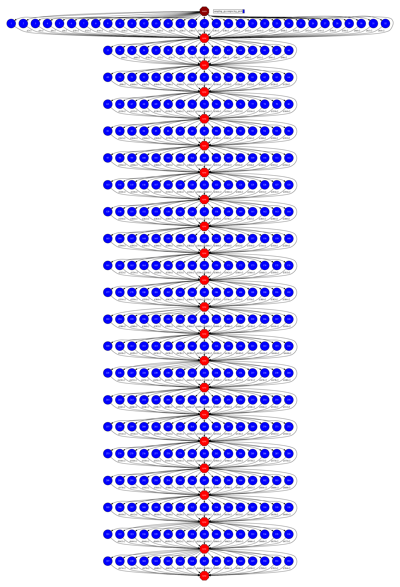

Integration with emcee
----------------------

PyCOMPSs can also be used with `emcee <https://emcee.readthedocs.io/>`_ in order
to enable its execution in distributed environments.

Usage
~~~~~

Enabling *emcee* with PyCOMPSs is easy.
Assuming that you have *emcee* and COMPSs installed, there are two requirements:

1. Define the sampling function as task
2. Import the PyCOMPSs map module
   (``from pycompss.functions import map as pycompss_pool``) and use it in
   the EnsembleSampler pool parameter.

Sample Application
~~~~~~~~~~~~~~~~~~

The following code (:numref:`code_emcee_pycompss`) shows how to enable *emcee*
applications with PyCOMPSs, highlighting the modifications required.

.. code-block:: python
    :name: code_emcee_pycompss
    :caption: emcee with PyCOMPSs application example (sampling_pycompss.py)
    :emphasize-lines: 17,27

    import time
    import numpy as np
    import emcee
    from pycompss.api.task import task
    from pycompss.functions import map as pycompss_pool

    def execution_params():
        """Define execution parameters."""
        np.random.seed(42)
        initial = np.random.randn(32, 5)
        nwalkers, ndim = initial.shape
        nsteps = 10
        return initial, nwalkers, ndim, nsteps

    @task(returns=1)
    def log_prob(theta):
        """Sampling function to apply."""
        time.sleep(0.2)  # Computation load simulation
        return -0.5 * np.sum(theta**2)

    def emcee_pycompss(params):
        """emcee usage with PyCOMPSs."""
        initial, nwalkers, ndim, nsteps = params
        sampler = emcee.EnsembleSampler(nwalkers, ndim, log_prob, pool=pycompss_pool)
        start = time.time()
        result = sampler.run_mcmc(initial, nsteps, progress=True)
        end = time.time()
        print("PyCOMPSs took {0:.1f} seconds".format(end - start))
        return result

    if __name__ == "__main__":
          params = execution_params()
          result_pycompss = emcee_pycompss(params)

.. TIP::

    The integration is not limited to its usage with the ``pycompss_pool``.
    It is possible to define more tasks and invoke them from the
    ``emcee_pycompss`` function in order to parallelize any preprocessing
    of the ``initial`` data or any postprocessing of the ``result``.

Execution
~~~~~~~~~

An *emcee* application parallelized with PyCOMPSs **MUST** be executed as
any COMPSs application (for full description about the execution environments
and options please check the
:ref:`Sections/03_Execution:|:rocket:| Execution` Section.).

For example, we can run :numref:`code_emcee_pycompss` locally (using the
PyCOMPSs CLI) with the following script:

.. code-block:: bash

  pycompss run \
    --graph \
    sampling_pycompss.py

The execution output is:

.. code-block:: console

    [ INFO ] Inferred PYTHON language
    [ INFO ] Using default location for project file: /opt/COMPSs//Runtime/configuration/xml/projects/default_project.xml
    [ INFO ] Using default location for resources file: /opt/COMPSs//Runtime/configuration/xml/resources/default_resources.xml
    [ INFO ] Using default execution type: compss

    ----------------- Executing sampling_pycompss.py --------------------------

    WARNING: COMPSs Properties file is null. Setting default values
    [(647)    API]  -  Starting COMPSs Runtime v2.10.rc2205 (build 20220527-0842.r791bf7461bad1a1fab8f45853be7ba1c28b7bf93)
    100%|XXXXXXXXXXXXXXXXXXXXXXXXXXXXXXXXXXXXXXXXXXXXXXXXXXXXXXXXXXXXXXXXXXXXXXXXXXXXXXXXXXXXXXXXXXXXXXXXXXXXXXXXXXXXXXXXXXXXXXXXXXXXXXXXXXXXXXXXXXXXXXXXXXXXXXXXXXXXXXXXXXXXXXXXXXXXXX| 10/10 [00:25<00:00,  2.51s/it]
    PyCOMPSs took 31.8 seconds
    [(34243)    API]  -  Execution Finished

    ------------------------------------------------------------

And the task dependency graph achieved:

   Task dependency graph of the :numref:`code_emcee_pycompss` execution

.. TIP::

   The larger the ``initial`` array, the more parallelism can be achieved
   (larger width in the task dependency graph enabling to be executed in more
   resources).

   If the ``nsteps`` is increased, the more iterations will be performed
   (larger height in the task dependency graph).
