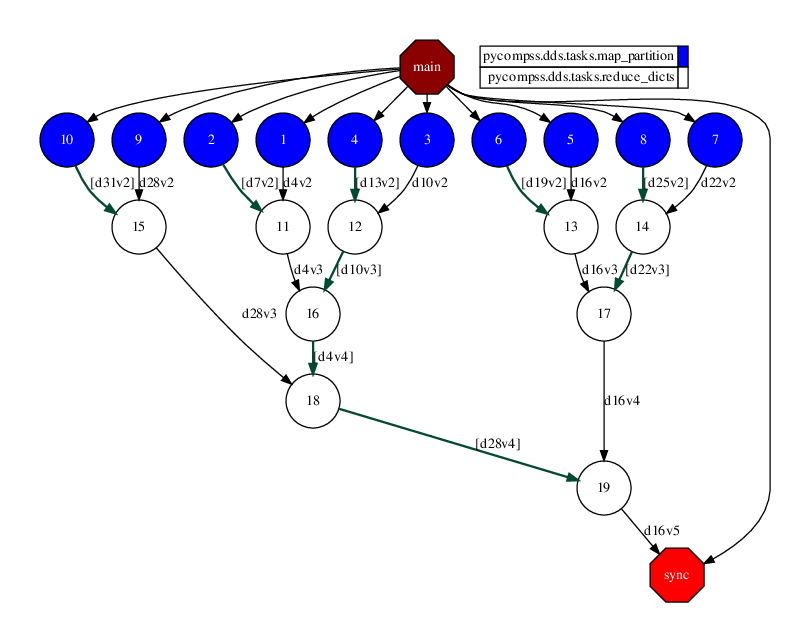

Wordcount
---------

The Wordcount application is a Python application that reads a set of
files and counts the amount of different words on them. In this example,
we provide the wordcount implementation using the DDS interface:

.. code-block:: python
    :name: code_wordcount_dds_pycompss
    :caption: Wordcount application using DDS interface (``wordcount_dds.py``)

    import sys
    import time
    from pycompss.dds import DDS

    def word_count():
        """Word count using DDS.

        :return: None
        """
        path_file = sys.argv[1]
        start = time.time()

        results = (
            DDS()
            .load_files_from_dir(path_file)
            .flat_map(lambda x: x[1].split())
            .map(lambda x: "".join(e for e in x if e.isalnum()))
            .count_by_value(as_dict=True)
        )

        print("Results: " + str(results))
        print("Elapsed Time: ", time.time() - start)

    if __name__ == "__main__":
        word_count()

The wordcount application can be executed by invoking the ``runcompss`` command
with the application file name and a path which contains a set of files.

The following lines provide an example of its execution before generating
a random dataset using the `lorem-text <https://pypi.org/project/lorem-text/>`_ package.

.. code-block:: console

    compss@bsc:~$ pip install lorem-text
    compss@bsc:~$ mkdir dataset
    compss@bsc:~$ for i in {1..10}; do lorem_text --words 100 > dataset/$i.txt; done
    compss@bsc:~$ runcompss --graph wordcount_dds.py $(pwd)/dataset/
    [ INFO ] Inferred PYTHON language
    [ INFO ] Using default location for project file: /opt/COMPSs//Runtime/configuration/xml/projects/default_project.xml
    [ INFO ] Using default location for resources file: /opt/COMPSs//Runtime/configuration/xml/resources/default_resources.xml
    [ INFO ] Using default execution type: compss

    ----------------- Executing wordcount.py --------------------------

    WARNING: COMPSs Properties file is null. Setting default values
    [(688)    API]  -  Starting COMPSs Runtime v3.2.rc2308 (build 20230807-0826.rababfc59af07237e625a2cb93b033ae427343b5f)
    Results: {'error': 5, 'illo': 4, 'in': 7, 'aliquam': 5, 'corporis': 7, 'cupiditate': 5, 'quam': 6, 'at': 5, 'sit': 5, 'quos': 9, 'iusto': 5, 'laboriosam': 8, 'deserunt': 7, 'dolorum': 6, 'saepe': 8, 'vel': 7, 'doloremque': 7, 'nam': 8, 'maiores': 10, 'animi': 4, 'enim': 5, 'debitis': 7, 'rerum': 3, 'ea': 6, 'incidunt': 5, 'quaerat': 8, 'quidem': 4, 'voluptates': 7, 'voluptatibus': 6, 'nesciunt': 5, 'voluptatem': 7, 'repellendus': 5, 'reprehenderit': 5, 'eos': 4, 'eum': 6, 'a': 6, 'qui': 6, 'sapiente': 7, 'molestiae': 3, 'adipisci': 7, 'fuga': 4, 'alias': 6, 'tempore': 6, 'quasi': 4, 'nemo': 8, 'autem': 6, 'sint': 6, 'corrupti': 6, 'est': 5, 'dolores': 4, 'architecto': 5, 'tempora': 8, 'aliquid': 6, 'modi': 4, 'quis': 4, 'nihil': 4, 'magnam': 6, 'exercitationem': 5, 'possimus': 6, 'blanditiis': 7, 'totam': 8, 'explicabo': 4, 'eaque': 5, 'esse': 3, 'minus': 3, 'similique': 5, 'natus': 8, 'facilis': 5, 'perferendis': 7, 'ipsam': 4, 'inventore': 6, 'earum': 6, 'quas': 5, 'sequi': 9, 'asperiores': 6, 'nisi': 9, 'repellat': 6, 'vero': 5, 'necessitatibus': 7, 'veniam': 8, 'ipsum': 4, 'magni': 6, 'porro': 9, 'accusamus': 3, 'aspernatur': 4, 'ex': 6, 'tenetur': 6, 'ducimus': 5, 'unde': 8, 'officia': 4, 'assumenda': 6, 'quo': 7, 'fugiat': 4, 'labore': 7, 'quibusdam': 4, 'nostrum': 5, 'voluptatum': 5, 'laborum': 5, 'sed': 6, 'officiis': 7, 'ut': 6, 'consequatur': 6, 'obcaecati': 6, 'quia': 6, 'cumque': 6, 'amet': 6, 'numquam': 4, 'harum': 5, 'reiciendis': 7, 'doloribus': 5, 'eligendi': 4, 'neque': 6, 'non': 3, 'sunt': 7, 'rem': 5, 'deleniti': 7, 'et': 6, 'beatae': 4, 'dolore': 6, 'dolor': 4, 'dolorem': 5, 'quisquam': 6, 'voluptas': 4, 'dignissimos': 6, 'maxime': 6, 'laudantium': 6, 'consectetur': 5, 'optio': 7, 'eius': 9, 'provident': 5, 'vitae': 6, 'molestias': 8, 'praesentium': 5, 'nulla': 6, 'ratione': 6, 'iste': 7, 'accusantium': 5, 'quod': 4, 'ipsa': 4, 'distinctio': 5, 'delectus': 7, 'ad': 7, 'placeat': 6, 'expedita': 4, 'eveniet': 4, 'ab': 3, 'aut': 7, 'hic': 5, 'voluptate': 4, 'culpa': 6, 'dicta': 7, 'fugit': 5, 'nobis': 3, 'libero': 5, 'pariatur': 4, 'quae': 4, 'repudiandae': 4, 'aperiam': 6, 'itaque': 6, 'commodi': 3, 'iure': 6, 'impedit': 7, 'mollitia': 5, 'velit': 7, 'ullam': 7, 'odit': 5, 'perspiciatis': 4, 'atque': 4, 'soluta': 4, 'consequuntur': 2, 'suscipit': 5, 'id': 4, 'excepturi': 3, 'temporibus': 4, 'cum': 4, 'veritatis': 6, 'minima': 5, 'illum': 4, 'recusandae': 2, 'odio': 3, 'facere': 3, 'omnis': 2}
    Elapsed Time:  3.6448779106140137
    [(7198)    API]  -  Execution Finished

    ------------------------------------------------------------

:numref:`wordcount_dds_python` depicts the generated task dependency graph. The dataset
reading can be identified in the 10 blue tasks, while the white tasks conform a
reduction that accumulates the amount of word appearances.

   Python wordcount using DDS interface tasks graph
