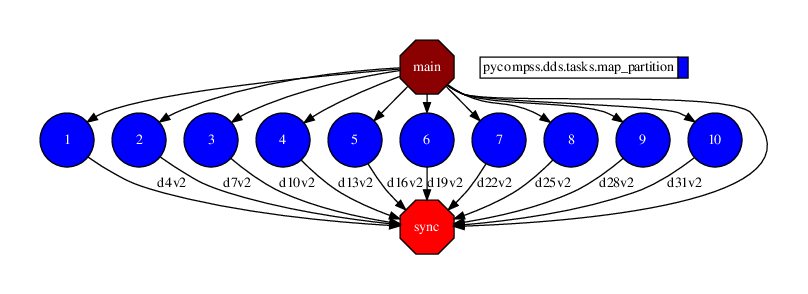

Pi estimation
-------------

The Pi estimation application is a Python application that estimates the value of
pi by "throwing darts" at a circle. In this example, we provide the Pi estimation
implementation using the DDS interface:

*Example is taken from: https://spark.apache.org/examples.html*

.. code-block:: python
    :name: code_pi_estimation_dds_pycompss
    :caption: Pi estimation application using DDS interface (``pi_estimation_dds.py``)

    from pycompss.dds import DDS

    def inside(_):
        """Check if inside.

        :returns: If inside.
        """
        import random

        rand_x = random.random()
        rand_y = random.random()
        return (rand_x * rand_x) + (rand_y * rand_y) < 1

    def pi_estimation():
        """Pi estimation.

        Example is taken from: https://spark.apache.org/examples.html

        :returns: The estimated pi value.
        """
        print("Estimating Pi by 'throwing darts' algorithm.")
        tries = 100000
        print(f"Number of tries: {tries}")

        count = DDS().load(range(0, tries), 10).filter(inside).count()
        rough_pi = 4.0 * count / tries
        print(f"Pi is roughly {rough_pi}")
        return rough_pi

    if __name__ == "__main__":
        _ = pi_estimation()

The Pi estimation application does not require any specific parameter and
can be executed by invoking the ``runcompss`` command directly.

The following lines provide an example of its execution.

.. code-block:: console

    compss@bsc:~$ runcompss --graph pi_estimation_dds.py
    [ INFO ] Inferred PYTHON language
    [ INFO ] Using default location for project file: /opt/COMPSs//Runtime/configuration/xml/projects/default_project.xml
    [ INFO ] Using default location for resources file: /opt/COMPSs//Runtime/configuration/xml/resources/default_resources.xml
    [ INFO ] Using default execution type: compss

    ----------------- Executing pi_estimation.py --------------------------

    WARNING: COMPSs Properties file is null. Setting default values
    [(847)    API]  -  Starting COMPSs Runtime v3.2.rc2308 (build 20230807-0826.rababfc59af07237e625a2cb93b033ae427343b5f)
    Estimating Pi by 'throwing darts' algorithm.
    Number of tries: 100000
    Pi is roughly 3.13608
    [(7710)    API]  -  Execution Finished

    ------------------------------------------------------------

:numref:`pi_estimation_dds_python` depicts the generated task dependency graph.

   Python Pi estimation using DDS interface tasks graph
