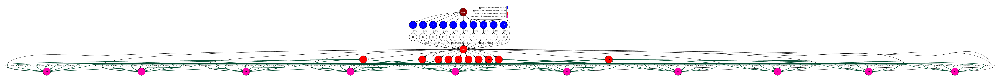

Terasort
--------

The Terasort application is a Python application is a well-known benchmark that aims to sort
large data files as fast as possible.
In this example, we provide the Terasort implementation using the DDS interface:

.. code-block:: python
    :name: terasort_dds_pycompss
    :caption: Terasort application using DDS interface (``terasort_dds.py``)

    import sys
    import time
    from pycompss.dds import DDS

    def files_to_pairs(element):
        """Pair files.

        :param element: String of elements.
        :returns: List of pairs.
        """
        tuples = []
        lines = element[1].split("\n")
        for _l in lines:
            if not _l:
                continue
            k_v = _l.split(",")
            tuples.append(tuple(k_v))

        return tuples

    def terasort():
        """Terasort.

        :returns: None.
        """
        dir_path = sys.argv[1]
        dest_path = sys.argv[2]

        start_time = time.time()

        _ = (
            DDS()
            .load_files_from_dir(dir_path)
            .flat_map(files_to_pairs)
            .sort_by_key()
            .save_as_text_file(dest_path)
        )

        elapsed_time = time.time() - start_time
        print(f"Elapsed Time {elapsed_time} (s)")

    if __name__ == "__main__":
        terasort()

The Terasort application can be executed by invoking the ``runcompss`` command
with the application file name and two parameters: an input path which contains a set of files
and an output dataset path where to store the sorted result files.

The following lines provide an example of its execution before generating
a random dataset using the `lorem-text <https://pypi.org/project/lorem-text/>`_ package.

.. code-block:: console

    compss@bsc:~$ pip install lorem-text
    compss@bsc:~$ mkdir dataset
    compss@bsc:~$ for i in {1..10}; do for j in {1..100}; do echo "$(lorem_text --words 1),$RANDOM" >> dataset/$i.txt; done; done
    compss@bsc:~$ mkdir result
    compss@bsc:~$ runcompss --graph terasort_dds.py $(pwd)/dataset/ $(pwd)/result/
    [ INFO ] Inferred PYTHON language
    [ INFO ] Using default location for project file: /opt/COMPSs//Runtime/configuration/xml/projects/default_project.xml
    [ INFO ] Using default location for resources file: /opt/COMPSs//Runtime/configuration/xml/resources/default_resources.xml
    [ INFO ] Using default execution type: compss

    ----------------- Executing terasort.py --------------------------

    WARNING: COMPSs Properties file is null. Setting default values
    [(885)    API]  -  Starting COMPSs Runtime v3.2.rc2308 (build 20230807-0826.rababfc59af07237e625a2cb93b033ae427343b5f)
    Elapsed Time 4.1502251625061035 (s)
    [(8103)    API]  -  Execution Finished

    ------------------------------------------------------------
    compss@bsc:~$ tree result
    result/
    ├── 00000
    ├── 00001
    ├── 00002
    ├── 00003
    ├── 00004
    ├── 00005
    ├── 00006
    ├── 00007
    ├── 00008
    └── 00009

    0 directories, 10 files

:numref:`terasort_dds_python` depicts the generated task dependency graph.

   Python Terasort using DDS interface tasks graph