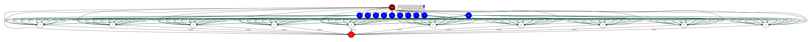

Inverted indexing
-----------------

The Inverted indexing application is a Python application that creates an index data
structure storing a mapping from content (e.g. words, numbers, etc.) to its locations in
a set of documents. This structure seems like a hashmap that directs the word to a
document.
In this example, we provide the inverted indexing implementation using the DDS interface:

.. code-block:: python
    :name: code_inverted_indexing_dds_pycompss
    :caption: Inverted indexing application using DDS interface (``inverted_indexing_dds.py``)

    import sys
    import time
    from pycompss.dds import DDS

    def _invert_files(pair):
        """Invert files.

        :param pair: Pair.
        :results: List of items.
        """
        res = {}
        for word in pair[1].split():
            res[word] = [pair[0]]
        return list(res.items())

    def inverted_indexing():
        """Inverted indexing.

        :results: None.
        """
        path = sys.argv[1]
        start_time = time.time()
        result = (
            DDS()
            .load_files_from_dir(path)
            .flat_map(_invert_files)
            .reduce_by_key(lambda a, b: a + b)
            .collect()
        )
        elapsed_time = time.time() - start_time
        for word in result:
            print(f"{word[0]} - {word[1]}")
        print(f"Elapsed Time {elapsed_time} (s)")

    if __name__ == "__main__":
        inverted_indexing()

The inverted indexing application can be executed by invoking the ``runcompss`` command
with the folder path which contains a set of input files.

The following lines provide an example of its execution before generating
a random dataset using the `lorem-text <https://pypi.org/project/lorem-text/>`_ package.

.. code-block:: console

    compss@bsc:~$ pip install lorem-text
    compss@bsc:~$ mkdir dataset
    compss@bsc:~$ for i in {1..10}; do for j in {1..100}; do echo "$(lorem_text --words 20)" >> dataset/$i.txt; done; done
    compss@bsc:~$ runcompss --graph inverted_indexing_dds.py $(pwd)/dataset/
    [ INFO ] Inferred PYTHON language
    [ INFO ] Using default location for project file: /opt/COMPSs//Runtime/configuration/xml/projects/default_project.xml
    [ INFO ] Using default location for resources file: /opt/COMPSs//Runtime/configuration/xml/resources/default_resources.xml
    [ INFO ] Using default execution type: compss

    ----------------- Executing inverted_indexing.py --------------------------

    WARNING: COMPSs Properties file is null. Setting default values
    [(650)    API]  -  Starting COMPSs Runtime v3.2.rc2308 (build 20230810-0858.rababfc59af07237e625a2cb93b033ae427343b5f)
    reprehenderit - ['/home/user/dataset/1.txt', '/home/user/dataset/10.txt', '/home/user/dataset/2.txt', '/home/user/dataset/3.txt', '/home/user/dataset/4.txt', '/home/user/dataset/5.txt', '/home/user/dataset/6.txt', '/home/user/dataset/7.txt', '/home/user/dataset/9.txt']
    deserunt - ['/home/user/dataset/1.txt', '/home/user/dataset/10.txt', '/home/user/dataset/3.txt', '/home/user/dataset/4.txt', '/home/user/dataset/8.txt']
    placeat - ['/home/user/dataset/1.txt', '/home/user/dataset/10.txt', '/home/user/dataset/2.txt', '/home/user/dataset/4.txt', '/home/user/dataset/7.txt']
    nam - ['/home/user/dataset/1.txt', '/home/user/dataset/10.txt', '/home/user/dataset/8.txt']
    provident - ['/home/user/dataset/1.txt', '/home/user/dataset/10.txt', '/home/user/dataset/2.txt', '/home/user/dataset/3.txt', '/home/user/dataset/5.txt', '/home/user/dataset/8.txt']
    quos - ['/home/user/dataset/1.txt', '/home/user/dataset/3.txt', '/home/user/dataset/4.txt', '/home/user/dataset/5.txt', '/home/user/dataset/6.txt', '/home/user/dataset/7.txt', '/home/user/dataset/9.txt']
    dignissimos - ['/home/user/dataset/1.txt', '/home/user/dataset/10.txt', '/home/user/dataset/4.txt', '/home/user/dataset/5.txt', '/home/user/dataset/7.txt', '/home/user/dataset/9.txt']
    excepturi - ['/home/user/dataset/1.txt', '/home/user/dataset/10.txt', '/home/user/dataset/3.txt', '/home/user/dataset/5.txt']
    nostrum - ['/home/user/dataset/1.txt', '/home/user/dataset/10.txt', '/home/user/dataset/6.txt', '/home/user/dataset/9.txt']
    sit - ['/home/user/dataset/10.txt', '/home/user/dataset/5.txt', '/home/user/dataset/7.txt', '/home/user/dataset/9.txt']
    numquam - ['/home/user/dataset/10.txt', '/home/user/dataset/2.txt', '/home/user/dataset/3.txt', '/home/user/dataset/4.txt', '/home/user/dataset/6.txt', '/home/user/dataset/7.txt', '/home/user/dataset/9.txt']
    nesciunt - ['/home/user/dataset/10.txt', '/home/user/dataset/2.txt', '/home/user/dataset/3.txt', '/home/user/dataset/5.txt', '/home/user/dataset/9.txt']
    doloremque - ['/home/user/dataset/10.txt', '/home/user/dataset/2.txt', '/home/user/dataset/5.txt', '/home/user/dataset/6.txt']
    similique - ['/home/user/dataset/10.txt', '/home/user/dataset/2.txt', '/home/user/dataset/3.txt', '/home/user/dataset/5.txt', '/home/user/dataset/9.txt']
    eius - ['/home/user/dataset/10.txt', '/home/user/dataset/3.txt', '/home/user/dataset/6.txt']
    necessitatibus - ['/home/user/dataset/10.txt']
    praesentium - ['/home/user/dataset/10.txt', '/home/user/dataset/4.txt', '/home/user/dataset/9.txt']
    mollitia - ['/home/user/dataset/10.txt', '/home/user/dataset/7.txt', '/home/user/dataset/9.txt']
    corporis - ['/home/user/dataset/10.txt', '/home/user/dataset/2.txt', '/home/user/dataset/3.txt', '/home/user/dataset/4.txt', '/home/user/dataset/5.txt', '/home/user/dataset/6.txt', '/home/user/dataset/8.txt', '/home/user/dataset/9.txt']
    sequi - ['/home/user/dataset/2.txt', '/home/user/dataset/4.txt']
    inventore - ['/home/user/dataset/3.txt', '/home/user/dataset/6.txt', '/home/user/dataset/8.txt']
    voluptate - ['/home/user/dataset/3.txt', '/home/user/dataset/4.txt', '/home/user/dataset/5.txt', '/home/user/dataset/6.txt', '/home/user/dataset/7.txt', '/home/user/dataset/8.txt']
    quis - ['/home/user/dataset/4.txt', '/home/user/dataset/8.txt']
    illo - ['/home/user/dataset/7.txt', '/home/user/dataset/9.txt']
    assumenda - ['/home/user/dataset/1.txt', '/home/user/dataset/2.txt', '/home/user/dataset/4.txt', '/home/user/dataset/6.txt', '/home/user/dataset/8.txt']
    consequuntur - ['/home/user/dataset/1.txt', '/home/user/dataset/2.txt', '/home/user/dataset/4.txt', '/home/user/dataset/8.txt']
    odit - ['/home/user/dataset/1.txt', '/home/user/dataset/2.txt', '/home/user/dataset/3.txt', '/home/user/dataset/5.txt', '/home/user/dataset/6.txt', '/home/user/dataset/8.txt', '/home/user/dataset/9.txt']
    amet - ['/home/user/dataset/1.txt', '/home/user/dataset/2.txt', '/home/user/dataset/5.txt', '/home/user/dataset/7.txt', '/home/user/dataset/9.txt']
    aliquam - ['/home/user/dataset/1.txt', '/home/user/dataset/3.txt', '/home/user/dataset/4.txt', '/home/user/dataset/5.txt', '/home/user/dataset/8.txt', '/home/user/dataset/9.txt']
    a - ['/home/user/dataset/1.txt', '/home/user/dataset/3.txt', '/home/user/dataset/6.txt', '/home/user/dataset/7.txt', '/home/user/dataset/9.txt']
    perferendis - ['/home/user/dataset/1.txt', '/home/user/dataset/2.txt', '/home/user/dataset/5.txt', '/home/user/dataset/6.txt', '/home/user/dataset/8.txt', '/home/user/dataset/9.txt']
    delectus - ['/home/user/dataset/1.txt', '/home/user/dataset/2.txt', '/home/user/dataset/3.txt', '/home/user/dataset/4.txt', '/home/user/dataset/6.txt']
    at - ['/home/user/dataset/1.txt', '/home/user/dataset/10.txt', '/home/user/dataset/6.txt', '/home/user/dataset/8.txt']
    accusantium - ['/home/user/dataset/10.txt', '/home/user/dataset/3.txt', '/home/user/dataset/6.txt', '/home/user/dataset/8.txt']
    non - ['/home/user/dataset/10.txt', '/home/user/dataset/5.txt', '/home/user/dataset/6.txt', '/home/user/dataset/8.txt']
    accusamus - ['/home/user/dataset/10.txt', '/home/user/dataset/3.txt', '/home/user/dataset/6.txt', '/home/user/dataset/8.txt']
    ullam - ['/home/user/dataset/10.txt', '/home/user/dataset/2.txt', '/home/user/dataset/4.txt', '/home/user/dataset/5.txt', '/home/user/dataset/7.txt']
    magni - ['/home/user/dataset/10.txt', '/home/user/dataset/2.txt', '/home/user/dataset/6.txt', '/home/user/dataset/8.txt']
    facere - ['/home/user/dataset/2.txt', '/home/user/dataset/5.txt']
    reiciendis - ['/home/user/dataset/2.txt', '/home/user/dataset/3.txt', '/home/user/dataset/4.txt', '/home/user/dataset/5.txt', '/home/user/dataset/7.txt', '/home/user/dataset/8.txt']
    eos - ['/home/user/dataset/2.txt', '/home/user/dataset/3.txt', '/home/user/dataset/4.txt', '/home/user/dataset/6.txt']
    expedita - ['/home/user/dataset/2.txt', '/home/user/dataset/3.txt', '/home/user/dataset/7.txt', '/home/user/dataset/9.txt']
    sunt - ['/home/user/dataset/2.txt', '/home/user/dataset/7.txt', '/home/user/dataset/8.txt']
    neque - ['/home/user/dataset/4.txt', '/home/user/dataset/6.txt', '/home/user/dataset/7.txt', '/home/user/dataset/8.txt']
    velit - ['/home/user/dataset/4.txt', '/home/user/dataset/6.txt', '/home/user/dataset/7.txt', '/home/user/dataset/8.txt']
    aperiam - ['/home/user/dataset/1.txt', '/home/user/dataset/10.txt', '/home/user/dataset/2.txt', '/home/user/dataset/6.txt']
    perspiciatis - ['/home/user/dataset/1.txt', '/home/user/dataset/10.txt', '/home/user/dataset/4.txt', '/home/user/dataset/5.txt', '/home/user/dataset/7.txt', '/home/user/dataset/8.txt']
    cumque - ['/home/user/dataset/1.txt', '/home/user/dataset/3.txt', '/home/user/dataset/6.txt', '/home/user/dataset/9.txt']
    adipisci - ['/home/user/dataset/1.txt', '/home/user/dataset/10.txt', '/home/user/dataset/3.txt', '/home/user/dataset/4.txt', '/home/user/dataset/8.txt', '/home/user/dataset/9.txt']
    atque - ['/home/user/dataset/1.txt', '/home/user/dataset/10.txt', '/home/user/dataset/2.txt', '/home/user/dataset/4.txt', '/home/user/dataset/5.txt', '/home/user/dataset/8.txt']
    architecto - ['/home/user/dataset/1.txt', '/home/user/dataset/10.txt', '/home/user/dataset/3.txt', '/home/user/dataset/7.txt', '/home/user/dataset/8.txt']
    animi - ['/home/user/dataset/1.txt', '/home/user/dataset/3.txt', '/home/user/dataset/4.txt', '/home/user/dataset/5.txt', '/home/user/dataset/7.txt', '/home/user/dataset/8.txt', '/home/user/dataset/9.txt']
    quasi - ['/home/user/dataset/1.txt', '/home/user/dataset/10.txt', '/home/user/dataset/3.txt']
    unde - ['/home/user/dataset/1.txt', '/home/user/dataset/2.txt', '/home/user/dataset/4.txt', '/home/user/dataset/6.txt', '/home/user/dataset/7.txt', '/home/user/dataset/9.txt']
    beatae - ['/home/user/dataset/1.txt', '/home/user/dataset/3.txt', '/home/user/dataset/7.txt']
    esse - ['/home/user/dataset/10.txt', '/home/user/dataset/7.txt']
    suscipit - ['/home/user/dataset/10.txt', '/home/user/dataset/2.txt', '/home/user/dataset/3.txt', '/home/user/dataset/6.txt']
    quo - ['/home/user/dataset/10.txt', '/home/user/dataset/4.txt', '/home/user/dataset/5.txt', '/home/user/dataset/7.txt']
    harum - ['/home/user/dataset/2.txt', '/home/user/dataset/3.txt', '/home/user/dataset/4.txt', '/home/user/dataset/6.txt', '/home/user/dataset/8.txt', '/home/user/dataset/9.txt']
    libero - ['/home/user/dataset/2.txt', '/home/user/dataset/3.txt', '/home/user/dataset/6.txt', '/home/user/dataset/7.txt', '/home/user/dataset/9.txt']
    error - ['/home/user/dataset/3.txt', '/home/user/dataset/5.txt', '/home/user/dataset/6.txt', '/home/user/dataset/7.txt']
    quidem - ['/home/user/dataset/3.txt', '/home/user/dataset/4.txt', '/home/user/dataset/5.txt', '/home/user/dataset/6.txt', '/home/user/dataset/8.txt']
    iusto - ['/home/user/dataset/4.txt', '/home/user/dataset/7.txt', '/home/user/dataset/9.txt']
    tempora - ['/home/user/dataset/6.txt', '/home/user/dataset/8.txt']
    aspernatur - ['/home/user/dataset/7.txt']
    maxime - ['/home/user/dataset/1.txt', '/home/user/dataset/3.txt']
    dolores - ['/home/user/dataset/1.txt', '/home/user/dataset/6.txt', '/home/user/dataset/7.txt', '/home/user/dataset/9.txt']
    quam - ['/home/user/dataset/1.txt', '/home/user/dataset/10.txt', '/home/user/dataset/4.txt', '/home/user/dataset/5.txt', '/home/user/dataset/7.txt', '/home/user/dataset/8.txt', '/home/user/dataset/9.txt']
    aliquid - ['/home/user/dataset/1.txt', '/home/user/dataset/10.txt', '/home/user/dataset/7.txt']
    ad - ['/home/user/dataset/1.txt', '/home/user/dataset/2.txt', '/home/user/dataset/3.txt']
    est - ['/home/user/dataset/10.txt', '/home/user/dataset/2.txt', '/home/user/dataset/5.txt', '/home/user/dataset/9.txt']
    ipsum - ['/home/user/dataset/10.txt', '/home/user/dataset/2.txt', '/home/user/dataset/4.txt', '/home/user/dataset/6.txt', '/home/user/dataset/9.txt']
    et - ['/home/user/dataset/10.txt', '/home/user/dataset/2.txt', '/home/user/dataset/3.txt', '/home/user/dataset/4.txt', '/home/user/dataset/7.txt']
    doloribus - ['/home/user/dataset/3.txt', '/home/user/dataset/5.txt', '/home/user/dataset/7.txt', '/home/user/dataset/8.txt', '/home/user/dataset/9.txt']
    quibusdam - ['/home/user/dataset/4.txt', '/home/user/dataset/5.txt', '/home/user/dataset/6.txt', '/home/user/dataset/7.txt', '/home/user/dataset/9.txt']
    obcaecati - ['/home/user/dataset/4.txt', '/home/user/dataset/7.txt']
    voluptas - ['/home/user/dataset/6.txt', '/home/user/dataset/8.txt', '/home/user/dataset/9.txt']
    itaque - ['/home/user/dataset/7.txt', '/home/user/dataset/9.txt']
    optio - ['/home/user/dataset/1.txt', '/home/user/dataset/10.txt', '/home/user/dataset/2.txt', '/home/user/dataset/3.txt', '/home/user/dataset/4.txt', '/home/user/dataset/8.txt']
    tempore - ['/home/user/dataset/1.txt', '/home/user/dataset/10.txt', '/home/user/dataset/2.txt', '/home/user/dataset/3.txt', '/home/user/dataset/5.txt', '/home/user/dataset/7.txt']
    fugiat - ['/home/user/dataset/1.txt', '/home/user/dataset/10.txt', '/home/user/dataset/6.txt', '/home/user/dataset/7.txt', '/home/user/dataset/9.txt']
    corrupti - ['/home/user/dataset/1.txt', '/home/user/dataset/10.txt', '/home/user/dataset/2.txt', '/home/user/dataset/5.txt', '/home/user/dataset/6.txt', '/home/user/dataset/8.txt', '/home/user/dataset/9.txt']
    nihil - ['/home/user/dataset/1.txt', '/home/user/dataset/10.txt', '/home/user/dataset/2.txt', '/home/user/dataset/5.txt', '/home/user/dataset/6.txt', '/home/user/dataset/7.txt']
    qui - ['/home/user/dataset/1.txt', '/home/user/dataset/2.txt', '/home/user/dataset/3.txt', '/home/user/dataset/5.txt', '/home/user/dataset/6.txt', '/home/user/dataset/7.txt', '/home/user/dataset/9.txt']
    temporibus - ['/home/user/dataset/1.txt', '/home/user/dataset/2.txt', '/home/user/dataset/3.txt', '/home/user/dataset/5.txt', '/home/user/dataset/7.txt']
    vitae - ['/home/user/dataset/1.txt', '/home/user/dataset/10.txt', '/home/user/dataset/3.txt', '/home/user/dataset/6.txt']
    autem - ['/home/user/dataset/1.txt', '/home/user/dataset/10.txt', '/home/user/dataset/2.txt', '/home/user/dataset/4.txt', '/home/user/dataset/8.txt', '/home/user/dataset/9.txt']
    possimus - ['/home/user/dataset/10.txt', '/home/user/dataset/4.txt', '/home/user/dataset/7.txt']
    totam - ['/home/user/dataset/10.txt', '/home/user/dataset/5.txt', '/home/user/dataset/6.txt', '/home/user/dataset/7.txt', '/home/user/dataset/9.txt']
    quas - ['/home/user/dataset/10.txt', '/home/user/dataset/6.txt', '/home/user/dataset/7.txt', '/home/user/dataset/8.txt']
    voluptatibus - ['/home/user/dataset/10.txt', '/home/user/dataset/4.txt', '/home/user/dataset/5.txt', '/home/user/dataset/7.txt', '/home/user/dataset/9.txt']
    officia - ['/home/user/dataset/10.txt', '/home/user/dataset/3.txt', '/home/user/dataset/5.txt']
    cum - ['/home/user/dataset/2.txt', '/home/user/dataset/4.txt', '/home/user/dataset/6.txt', '/home/user/dataset/8.txt', '/home/user/dataset/9.txt']
    recusandae - ['/home/user/dataset/2.txt', '/home/user/dataset/4.txt', '/home/user/dataset/5.txt', '/home/user/dataset/6.txt', '/home/user/dataset/8.txt']
    dolor - ['/home/user/dataset/2.txt', '/home/user/dataset/3.txt', '/home/user/dataset/5.txt', '/home/user/dataset/7.txt', '/home/user/dataset/9.txt']
    eligendi - ['/home/user/dataset/3.txt', '/home/user/dataset/5.txt', '/home/user/dataset/6.txt', '/home/user/dataset/8.txt']
    laborum - ['/home/user/dataset/4.txt', '/home/user/dataset/8.txt']
    ratione - ['/home/user/dataset/4.txt', '/home/user/dataset/7.txt']
    ex - ['/home/user/dataset/5.txt', '/home/user/dataset/6.txt', '/home/user/dataset/7.txt', '/home/user/dataset/8.txt', '/home/user/dataset/9.txt']
    dolorem - ['/home/user/dataset/1.txt', '/home/user/dataset/2.txt', '/home/user/dataset/5.txt', '/home/user/dataset/7.txt', '/home/user/dataset/8.txt']
    sapiente - ['/home/user/dataset/1.txt', '/home/user/dataset/10.txt', '/home/user/dataset/5.txt', '/home/user/dataset/7.txt']
    alias - ['/home/user/dataset/1.txt', '/home/user/dataset/3.txt', '/home/user/dataset/5.txt', '/home/user/dataset/7.txt', '/home/user/dataset/8.txt', '/home/user/dataset/9.txt']
    earum - ['/home/user/dataset/1.txt', '/home/user/dataset/2.txt', '/home/user/dataset/3.txt', '/home/user/dataset/4.txt', '/home/user/dataset/6.txt', '/home/user/dataset/9.txt']
    in - ['/home/user/dataset/1.txt', '/home/user/dataset/10.txt', '/home/user/dataset/4.txt', '/home/user/dataset/5.txt', '/home/user/dataset/6.txt', '/home/user/dataset/8.txt']
    veritatis - ['/home/user/dataset/1.txt', '/home/user/dataset/2.txt', '/home/user/dataset/4.txt', '/home/user/dataset/7.txt']
    distinctio - ['/home/user/dataset/10.txt', '/home/user/dataset/2.txt', '/home/user/dataset/3.txt', '/home/user/dataset/6.txt', '/home/user/dataset/7.txt', '/home/user/dataset/9.txt']
    maiores - ['/home/user/dataset/10.txt', '/home/user/dataset/2.txt', '/home/user/dataset/7.txt', '/home/user/dataset/9.txt']
    fugit - ['/home/user/dataset/10.txt', '/home/user/dataset/2.txt', '/home/user/dataset/6.txt', '/home/user/dataset/8.txt']
    nisi - ['/home/user/dataset/2.txt', '/home/user/dataset/3.txt', '/home/user/dataset/9.txt']
    vero - ['/home/user/dataset/2.txt', '/home/user/dataset/8.txt']
    commodi - ['/home/user/dataset/2.txt', '/home/user/dataset/8.txt', '/home/user/dataset/9.txt']
    exercitationem - ['/home/user/dataset/3.txt', '/home/user/dataset/5.txt', '/home/user/dataset/6.txt', '/home/user/dataset/8.txt']
    minus - ['/home/user/dataset/6.txt', '/home/user/dataset/8.txt']
    tenetur - ['/home/user/dataset/1.txt', '/home/user/dataset/10.txt', '/home/user/dataset/4.txt', '/home/user/dataset/6.txt', '/home/user/dataset/7.txt']
    dolorum - ['/home/user/dataset/1.txt', '/home/user/dataset/10.txt', '/home/user/dataset/2.txt', '/home/user/dataset/4.txt', '/home/user/dataset/5.txt', '/home/user/dataset/6.txt', '/home/user/dataset/7.txt', '/home/user/dataset/8.txt', '/home/user/dataset/9.txt']
    rerum - ['/home/user/dataset/1.txt', '/home/user/dataset/10.txt', '/home/user/dataset/3.txt', '/home/user/dataset/5.txt', '/home/user/dataset/6.txt']
    voluptatem - ['/home/user/dataset/1.txt']
    minima - ['/home/user/dataset/10.txt', '/home/user/dataset/4.txt', '/home/user/dataset/5.txt', '/home/user/dataset/7.txt', '/home/user/dataset/8.txt', '/home/user/dataset/9.txt']
    ab - ['/home/user/dataset/10.txt', '/home/user/dataset/2.txt', '/home/user/dataset/3.txt', '/home/user/dataset/4.txt', '/home/user/dataset/5.txt', '/home/user/dataset/8.txt', '/home/user/dataset/9.txt']
    debitis - ['/home/user/dataset/2.txt', '/home/user/dataset/9.txt']
    asperiores - ['/home/user/dataset/3.txt', '/home/user/dataset/4.txt', '/home/user/dataset/6.txt', '/home/user/dataset/9.txt']
    illum - ['/home/user/dataset/4.txt', '/home/user/dataset/6.txt', '/home/user/dataset/7.txt', '/home/user/dataset/8.txt']
    fuga - ['/home/user/dataset/4.txt', '/home/user/dataset/8.txt']
    deleniti - ['/home/user/dataset/5.txt', '/home/user/dataset/6.txt']
    eaque - ['/home/user/dataset/6.txt']
    magnam - ['/home/user/dataset/1.txt', '/home/user/dataset/4.txt', '/home/user/dataset/7.txt']
    saepe - ['/home/user/dataset/1.txt', '/home/user/dataset/10.txt', '/home/user/dataset/4.txt', '/home/user/dataset/7.txt', '/home/user/dataset/9.txt']
    odio - ['/home/user/dataset/1.txt', '/home/user/dataset/10.txt', '/home/user/dataset/4.txt', '/home/user/dataset/6.txt']
    quia - ['/home/user/dataset/1.txt', '/home/user/dataset/4.txt', '/home/user/dataset/7.txt', '/home/user/dataset/8.txt']
    ducimus - ['/home/user/dataset/1.txt', '/home/user/dataset/2.txt', '/home/user/dataset/7.txt', '/home/user/dataset/9.txt']
    voluptatum - ['/home/user/dataset/1.txt', '/home/user/dataset/10.txt', '/home/user/dataset/2.txt', '/home/user/dataset/7.txt', '/home/user/dataset/9.txt']
    quod - ['/home/user/dataset/1.txt', '/home/user/dataset/10.txt', '/home/user/dataset/3.txt', '/home/user/dataset/5.txt', '/home/user/dataset/7.txt', '/home/user/dataset/9.txt']
    facilis - ['/home/user/dataset/1.txt', '/home/user/dataset/4.txt', '/home/user/dataset/5.txt', '/home/user/dataset/7.txt', '/home/user/dataset/8.txt']
    repellat - ['/home/user/dataset/1.txt', '/home/user/dataset/10.txt', '/home/user/dataset/2.txt', '/home/user/dataset/3.txt', '/home/user/dataset/5.txt', '/home/user/dataset/8.txt']
    explicabo - ['/home/user/dataset/1.txt', '/home/user/dataset/5.txt', '/home/user/dataset/6.txt', '/home/user/dataset/8.txt']
    ipsam - ['/home/user/dataset/1.txt', '/home/user/dataset/3.txt', '/home/user/dataset/4.txt', '/home/user/dataset/5.txt', '/home/user/dataset/8.txt']
    nemo - ['/home/user/dataset/10.txt', '/home/user/dataset/3.txt', '/home/user/dataset/4.txt', '/home/user/dataset/5.txt', '/home/user/dataset/6.txt']
    eum - ['/home/user/dataset/10.txt', '/home/user/dataset/2.txt', '/home/user/dataset/4.txt', '/home/user/dataset/5.txt', '/home/user/dataset/7.txt', '/home/user/dataset/8.txt']
    molestiae - ['/home/user/dataset/10.txt', '/home/user/dataset/4.txt', '/home/user/dataset/6.txt']
    incidunt - ['/home/user/dataset/10.txt', '/home/user/dataset/2.txt', '/home/user/dataset/3.txt', '/home/user/dataset/4.txt', '/home/user/dataset/6.txt', '/home/user/dataset/9.txt']
    aut - ['/home/user/dataset/10.txt', '/home/user/dataset/2.txt', '/home/user/dataset/6.txt', '/home/user/dataset/7.txt', '/home/user/dataset/8.txt', '/home/user/dataset/9.txt']
    porro - ['/home/user/dataset/10.txt', '/home/user/dataset/2.txt', '/home/user/dataset/5.txt', '/home/user/dataset/6.txt', '/home/user/dataset/7.txt']
    voluptates - ['/home/user/dataset/10.txt', '/home/user/dataset/3.txt', '/home/user/dataset/4.txt', '/home/user/dataset/6.txt', '/home/user/dataset/7.txt', '/home/user/dataset/8.txt']
    molestias - ['/home/user/dataset/10.txt', '/home/user/dataset/2.txt', '/home/user/dataset/4.txt', '/home/user/dataset/5.txt', '/home/user/dataset/7.txt', '/home/user/dataset/8.txt']
    repudiandae - ['/home/user/dataset/2.txt']
    consectetur - ['/home/user/dataset/2.txt', '/home/user/dataset/4.txt']
    soluta - ['/home/user/dataset/2.txt', '/home/user/dataset/3.txt', '/home/user/dataset/4.txt', '/home/user/dataset/7.txt', '/home/user/dataset/9.txt']
    dolore - ['/home/user/dataset/2.txt', '/home/user/dataset/5.txt', '/home/user/dataset/7.txt', '/home/user/dataset/8.txt', '/home/user/dataset/9.txt']
    modi - ['/home/user/dataset/3.txt', '/home/user/dataset/4.txt', '/home/user/dataset/5.txt', '/home/user/dataset/8.txt']
    sed - ['/home/user/dataset/3.txt', '/home/user/dataset/4.txt', '/home/user/dataset/8.txt', '/home/user/dataset/9.txt']
    omnis - ['/home/user/dataset/4.txt', '/home/user/dataset/5.txt', '/home/user/dataset/9.txt']
    enim - ['/home/user/dataset/1.txt', '/home/user/dataset/10.txt', '/home/user/dataset/2.txt', '/home/user/dataset/3.txt', '/home/user/dataset/4.txt', '/home/user/dataset/5.txt', '/home/user/dataset/8.txt', '/home/user/dataset/9.txt']
    ipsa - ['/home/user/dataset/1.txt', '/home/user/dataset/3.txt', '/home/user/dataset/4.txt', '/home/user/dataset/5.txt', '/home/user/dataset/8.txt']
    veniam - ['/home/user/dataset/1.txt', '/home/user/dataset/10.txt', '/home/user/dataset/7.txt', '/home/user/dataset/8.txt']
    ut - ['/home/user/dataset/1.txt', '/home/user/dataset/4.txt', '/home/user/dataset/5.txt', '/home/user/dataset/8.txt']
    labore - ['/home/user/dataset/1.txt', '/home/user/dataset/10.txt', '/home/user/dataset/3.txt', '/home/user/dataset/4.txt', '/home/user/dataset/5.txt', '/home/user/dataset/8.txt']
    quisquam - ['/home/user/dataset/1.txt', '/home/user/dataset/2.txt', '/home/user/dataset/3.txt', '/home/user/dataset/4.txt', '/home/user/dataset/8.txt']
    rem - ['/home/user/dataset/10.txt', '/home/user/dataset/4.txt', '/home/user/dataset/8.txt']
    nulla - ['/home/user/dataset/10.txt', '/home/user/dataset/3.txt', '/home/user/dataset/5.txt', '/home/user/dataset/7.txt', '/home/user/dataset/9.txt']
    blanditiis - ['/home/user/dataset/10.txt', '/home/user/dataset/2.txt', '/home/user/dataset/3.txt', '/home/user/dataset/5.txt', '/home/user/dataset/7.txt']
    ea - ['/home/user/dataset/2.txt', '/home/user/dataset/5.txt', '/home/user/dataset/6.txt', '/home/user/dataset/7.txt', '/home/user/dataset/8.txt', '/home/user/dataset/9.txt']
    natus - ['/home/user/dataset/2.txt', '/home/user/dataset/4.txt', '/home/user/dataset/5.txt', '/home/user/dataset/8.txt', '/home/user/dataset/9.txt']
    vel - ['/home/user/dataset/3.txt', '/home/user/dataset/4.txt', '/home/user/dataset/5.txt']
    hic - ['/home/user/dataset/4.txt', '/home/user/dataset/8.txt', '/home/user/dataset/9.txt']
    iste - ['/home/user/dataset/4.txt', '/home/user/dataset/7.txt', '/home/user/dataset/9.txt']
    iure - ['/home/user/dataset/6.txt', '/home/user/dataset/7.txt', '/home/user/dataset/8.txt']
    laudantium - ['/home/user/dataset/1.txt', '/home/user/dataset/2.txt', '/home/user/dataset/3.txt', '/home/user/dataset/6.txt', '/home/user/dataset/9.txt']
    cupiditate - ['/home/user/dataset/1.txt', '/home/user/dataset/10.txt', '/home/user/dataset/3.txt', '/home/user/dataset/4.txt', '/home/user/dataset/5.txt', '/home/user/dataset/7.txt']
    nobis - ['/home/user/dataset/1.txt', '/home/user/dataset/2.txt', '/home/user/dataset/5.txt', '/home/user/dataset/9.txt']
    consequatur - ['/home/user/dataset/1.txt', '/home/user/dataset/10.txt']
    eveniet - ['/home/user/dataset/1.txt', '/home/user/dataset/4.txt']
    culpa - ['/home/user/dataset/10.txt', '/home/user/dataset/2.txt', '/home/user/dataset/3.txt', '/home/user/dataset/4.txt', '/home/user/dataset/5.txt', '/home/user/dataset/6.txt', '/home/user/dataset/7.txt']
    id - ['/home/user/dataset/10.txt', '/home/user/dataset/2.txt', '/home/user/dataset/5.txt', '/home/user/dataset/6.txt']
    pariatur - ['/home/user/dataset/10.txt', '/home/user/dataset/2.txt', '/home/user/dataset/5.txt', '/home/user/dataset/8.txt']
    repellendus - ['/home/user/dataset/10.txt', '/home/user/dataset/2.txt', '/home/user/dataset/3.txt', '/home/user/dataset/5.txt']
    quaerat - ['/home/user/dataset/2.txt', '/home/user/dataset/5.txt']
    officiis - ['/home/user/dataset/2.txt', '/home/user/dataset/3.txt', '/home/user/dataset/4.txt', '/home/user/dataset/7.txt', '/home/user/dataset/8.txt']
    laboriosam - ['/home/user/dataset/2.txt', '/home/user/dataset/3.txt', '/home/user/dataset/6.txt', '/home/user/dataset/7.txt', '/home/user/dataset/8.txt', '/home/user/dataset/9.txt']
    sint - ['/home/user/dataset/2.txt', '/home/user/dataset/3.txt', '/home/user/dataset/5.txt', '/home/user/dataset/6.txt', '/home/user/dataset/7.txt', '/home/user/dataset/8.txt', '/home/user/dataset/9.txt']
    quae - ['/home/user/dataset/3.txt', '/home/user/dataset/5.txt', '/home/user/dataset/8.txt']
    impedit - ['/home/user/dataset/3.txt', '/home/user/dataset/5.txt', '/home/user/dataset/7.txt', '/home/user/dataset/9.txt']
    dicta - ['/home/user/dataset/4.txt', '/home/user/dataset/6.txt', '/home/user/dataset/8.txt', '/home/user/dataset/9.txt']
    Elapsed Time 4.351373672485352 (s)
    [(7340)    API]  -  Execution Finished

    ------------------------------------------------------------

:numref:`inverted_indexing_dds_python` depicts the generated task dependency graph.

   Python inverted indexing using DDS interface tasks graph
