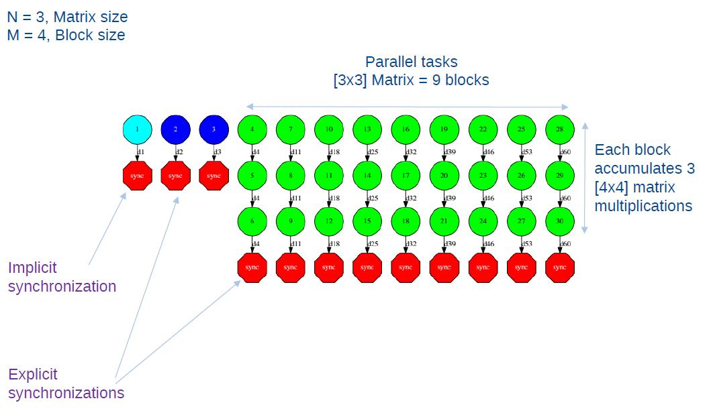

C/C++ Binding
=============

COMPSs provides a binding for C and C++ applications. The new C++
version in the current release comes with support for objects as task
parameters and the use of class methods as tasks.

Programming Model
-----------------

Task Selection
~~~~~~~~~~~~~~

As in Java the user has to provide a task selection by means of an
interface. In this case the interface file has the same name as the main
application file plus the suffix "idl", i.e. Matmul.idl, where the main
file is called Matmul.cc.

.. code-block:: C
    :name: matmul_idl
    :caption: Matmul.idl

    interface Matmul
    {
          // C functions
          void initMatrix(inout Matrix matrix,
                          in int mSize,
                          in int nSize,
                          in double val);

          void multiplyBlocks(inout Block block1,
                              inout Block block2,
                              inout Block block3);
    };

The syntax of the interface file is shown in the previous code. Tasks
can be declared as classic C function prototypes, this allow to keep the
compatibility with standard C applications. In the example, initMatrix
and multiplyBlocks are functions declared using its prototype, like in a
C header file, but this code is C++ as they have objects as parameters
(objects of type Matrix, or Block).

The grammar for the interface file is:

.. code-block:: text

    ["static"] return-type task-name ( parameter {, parameter }* );

    return-type = "void" | type

    ask-name = <qualified name of the function or method>

    parameter = direction type parameter-name

    direction = "in" | "out" | "inout"

    type = "char" | "int" | "short" | "long" | "float" | "double" | "boolean" |
           "char[<size>]" | "int[<size>]" | "short[<size>]" | "long[<size>]" |
           "float[<size>]" | "double[<size>]" | "string" | "File" | class-name

    class-name = <qualified name of the class>

Main Program
~~~~~~~~~~~~

:numref:`matrix_multiplication` shows an example of matrix multiplication written in C++.

.. code-block:: C
    :name: matrix_multiplication
    :caption: Matrix multiplication

    #include "Matmul.h"
    #include "Matrix.h"
    #include "Block.h"
    int N; //MSIZE
    int M; //BSIZE
    double val;
    int main(int argc, char **argv)
    {
          Matrix A;
          Matrix B;
          Matrix C;

          N = atoi(argv[1]);
          M = atoi(argv[2]);
          val = atof(argv[3]);

          compss_on();

          A = Matrix::init(N,M,val);

          initMatrix(&B,N,M,val);
          initMatrix(&C,N,M,0.0);

          cout << "Waiting for initialization...\n";

          compss_wait_on(B);
          compss_wait_on(C);

          cout << "Initialization ends...\n";

          C.multiply(A, B);

          compss_off();
          return 0;
    }

The developer has to take into account the following rules:

#. A header file with the same name as the main file must be included,
   in this case **Matmul.h**. This header file is automatically
   generated by the binding and it contains other includes and
   type-definitions that are required.

#. A call to the **compss_on** binding function is required to turn on
   the COMPSs runtime.

#. As in C language, out or inout parameters should be passed by
   reference by means of the "**&**" operator before the parameter name.

#. Synchronization on a parameter can be done calling the
   **compss_wait_on** binding function. The argument of this function
   must be the variable or object we want to synchronize.

#. There is an **implicit synchronization** in the init method of
   Matrix. It is not possible to know the address of "A" before exiting
   the method call and due to this it is necessary to synchronize before
   for the copy of the returned value into "A" for it to be correct.

#. A call to the **compss_off** binding function is required to turn
   off the COMPSs runtime.

Binding API
~~~~~~~~~~~

Besides the aforementioned **compss_on**, **compss_off** and
**compss_wait_on** functions, the C/C++ main program can make use of a
variety of other API calls to better manage the synchronization of data
generated by tasks. These calls are as follows:

void compss_ifstream(char \* filename, ifstream* \ & \* ifs)
   Given an uninitialized input stream *ifs* and a file *filename*, this
   function will synchronize the content of the file and initialize
   *ifs* to read from it.

void compss_ofstream(char \* filename, ofstream* \ & \* ofs)
   Behaves the same way as *compss_ifstream*, but in this case the
   opened stream is an output stream, meaning it will be used to write
   to the file.

FILE\* compss_fopen(char \* file_name, char \* mode)
   Similar to the C/C++ *fopen* call. Synchronizes with the last version of file
   *file_name* and returns the FILE\* pointer to further reference it.
   As the mode parameter it takes the same that can be used in *fopen*
   (*r, w, a, r+, w+* and *a+*).

void compss_wait_on(T\** \ & \* obj) or T compss_wait_on(T* \ & \* obj)
   Synchronizes for the last version of object obj, meaning that
   the execution will stop until the value of *obj* up to that point of
   the code is received (and thus all tasks that can modify it have
   ended).

void compss_delete_file(char \* file_name)
   Makes an asynchronous delete of file *filename*. When all previous tasks have
   finished updating the file, it is deleted.

void compss_delete_object(T\** \ & \* obj)
   Makes an asynchronous delete of an object. When all previous tasks have
   finished updating the object, it is deleted.

void compss_barrier()
   Similarly to the Python binding, performs
   an explicit synchronization without a return. When a
   *compss_barrier* is encountered, the execution will not continue
   until all the tasks submitted before the *compss_barrier* have
   finished.

Functions file
~~~~~~~~~~~~~~

The implementation of the tasks in a C or C++ program has to be provided
in a functions file. Its name must be the same as the main file followed
by the suffix "-functions". In our case Matmul-functions.cc.

.. code-block:: C

    #include "Matmul.h"
    #include "Matrix.h"
    #include "Block.h"

    void initMatrix(Matrix *matrix,int mSize,int nSize,double val){
         *matrix = Matrix::init(mSize, nSize, val);
    }

    void multiplyBlocks(Block *block1,Block *block2,Block *block3){
         block1->multiply(*block2, *block3);
    }

In the previous code, class methods have been encapsulated inside a
function. This is useful when the class method returns an object or a
value and we want to avoid the explicit synchronization when returning
from the method.

Additional source files
~~~~~~~~~~~~~~~~~~~~~~~

Other source files needed by the user application must be placed under
the directory "**src**". In this directory the programmer must provide a
**Makefile** that compiles such source files in the proper way. When the
binding compiles the whole application it will enter into the src
directory and execute the Makefile.

It generates two libraries, one for the master application and another
for the worker application. The directive COMPSS_MASTER or
COMPSS_WORKER must be used in order to compile the source files for
each type of library. Both libraries will be copied into the lib
directory where the binding will look for them when generating the
master and worker applications.

Class Serialization
~~~~~~~~~~~~~~~~~~~

In case of using an object as method parameter, as callee or as return
of a call to a function, the object has to be serialized. The
serialization method has to be provided inline in the header file of the
object’s class by means of the "**boost**" library. The next listing
contains an example of serialization for two objects of the Block class.

.. code-block:: C

    #ifndef BLOCK_H
    #define BLOCK_H

    #include    <vector>
    #include    <boost/archive/text_iarchive.hpp>
    #include    <boost/archive/text_oarchive.hpp>
    #include    <boost/serialization/serialization.hpp>
    #include    <boost/serialization/access.hpp>
    #include    <boost/serialization/vector.hpp>

    using namespace std;
    using namespace boost;
    using namespace serialization;

    class Block {
    public:
        Block(){};
        Block(int bSize);
        static Block *init(int bSize, double initVal);
        void multiply(Block block1, Block block2);
        void print();

    private:
        int M;
        std::vector< std::vector< double > > data;

        friend class::serialization::access;
        template<class Archive>
        void serialize(Archive & ar, const unsigned int version) {
            ar & M;
            ar & data;
        }
    };
    #endif

For more information about serialization using "boost" visit the related
documentation at `www.boost.org <www.boost.org>`.

Method - Task
~~~~~~~~~~~~~

A task can be a C++ class method. A method can return a value, modify
the *this* object, or modify a parameter.

If the method has a return value there will be an implicit
synchronization before exit the method, but for the *this* object and
parameters the synchronization can be done later after the method has
finished.

This is because the *this* object and the parameters can be accessed
inside and outside the method, but for the variable where the returned
value is copied to, it can’t be known inside the method.

.. code-block:: C

    #include "Block.h"

    Block::Block(int bSize) {
           M = bSize;
           data.resize(M);
           for (int i=0; i<M; i++) {
                  data[i].resize(M);
           }
    }

    Block *Block::init(int bSize, double initVal) {
           Block *block = new Block(bSize);
           for (int i=0; i<bSize; i++) {
                  for (int j=0; j<bSize; j++) {
                         block->data[i][j] = initVal;
                  }
           }
           return block;
    }

    #ifdef COMPSS_WORKER

    void Block::multiply(Block block1, Block block2) {
           for (int i=0; i<M; i++) {
                  for (int j=0; j<M; j++) {
                         for (int k=0; k<M; k++) {
                                data[i][j] += block1.data[i][k] * block2.data[k][j];
                         }
                  }
           }
           this->print();
    }

    #endif

    void Block::print() {
           for (int i=0; i<M; i++) {
                  for (int j=0; j<M; j++) {
                         cout << data[i][j] << " ";
                  }
                  cout << "\r\n";
           }
    }

Task Constraints
~~~~~~~~~~~~~~~~

The C/C++ binding also supports the definition of task constraints. The
task definition specified in the IDL file must be decorated/annotated
with the *@Constraints*. Below, you can find and example of how to
define a task with a constraint of using 4 cores. The list of
constraints which can be defined for a task can be found in
Section [sec:Constraints]

.. code-block:: text

    interface Matmul
    {
          @Constraints(ComputingUnits = 4)
          void multiplyBlocks(inout Block block1,
                              in Block block2,
                              in Block block3);

    };

Task Versions
~~~~~~~~~~~~~

Another COMPSs functionality supported in the C/C++ binding is the
definition of different versions for a tasks. The following code shows
an IDL file where a function has two implementations, with their
corresponding constraints. It show an example where the
*multiplyBlocks_GPU* is defined as a implementation of *multiplyBlocks*
using the annotation/decoration *@Implements*. It also shows how to set
a processor constraint which requires a GPU processor and a CPU core for
managing the offloading of the computation to the GPU.

.. code-block:: text

    interface Matmul
    {
            @Constraints(ComputingUnits=4);
            void multiplyBlocks(inout Block block1,
                                in Block block2,
                                in Block block3);

            // GPU implementation
            @Constraints(processors={
                   @Processor(ProcessorType=CPU, ComputingUnits=1)});
                   @Processor(ProcessorType=GPU, ComputingUnits=1)});
            @Implements(multiplyBlocks);
            void multiplyBlocks_GPU(inout Block block1,
                                    in Block block2,
                                    in Block block3);

    };

Use of programming models inside tasks
--------------------------------------

To improve COMPSs performance in some cases, C/C++ binding offers the
possibility to use programming models inside tasks. This feature allows
the user to exploit the potential parallelism in their application’s
tasks.

OmpSs
~~~~~

COMPSs C/C++ binding supports the use of the programming model OmpSs. To
use OmpSs inside COMPSs tasks we have to annotate the implemented tasks.
The implementation of tasks was described in section
[sec:functionsfile]. The following code shows a COMPSs C/C++ task
without the use of OmpSs.

.. code-block:: C

    void compss_task(int* a, int N) {
      int i;
      for (i = 0; i < N; ++i) {
      	a[i] = i;
      }
    }

This code will assign to every array element its position in it. A
possible use of OmpSs is the following.

.. code-block:: C

    void compss_task(int* a, int N) {
      int i;
      for (i = 0; i < N; ++i) {
       #pragma omp task
       {
        a[i] = i;
       }
      }
    }

This will result in the parallelization of the array initialization, of
course this can be applied to more complex implementations and the
directives offered by OmpSs are much more. You can find the
documentation and specification in https://pm.bsc.es/ompss.

There’s also the possibility to use a newer version of the OmpSs
programming model which introduces significant improvements, OmpSs-2.
The changes at user level are minimal, the following image shows the
array initialization using OmpSs-2.

.. code-block:: C

    void compss_task(int* a, int N) {
        int i;

        for (i = 0; i < N; ++i) {
         #pragma oss task
         {
          a[i] = i;
         }
        }
    }

Documentation and specification of OmpSs-2 can be found in
https://pm.bsc.es/ompss-2.

Application Compilation
-----------------------

To compile user’s applications with the C/C++ binding two commands are
used: The "\ **compss_build_app**\ ’ command allows to compile
applications for a single architecture, and the
"**compss_build_app_multi_arch**" command for multiple
architectures. Both commands must be executed in the directory of the
main application code.

Single architecture
~~~~~~~~~~~~~~~~~~~

The user command "**compss_build_app**" compiles both master and
worker for a single architecture (e.g. x86-64, armhf, etc). Thus,
whether you want to run your application in Intel based machine or ARM
based machine, this command is the tool you need.

Therefore, let’s see two examples, first, the application is going to be
build for the native architecture, in our case *x86-64*, and then for a
target architecture, for instance *armhf*. Please note that to use cross
compilation features and multiple architecture builds, you need to do
the proper installation of COMPSs, find more information in the builders
README.

When the target is the native architecture, the command to execute is
very simple;

.. code-block:: console

    $~/matmul_objects> compss_build_app Matmul
    [ INFO ] Java libraries are searched in the directory: /usr/lib/jvm/java-1.8.0-openjdk-amd64//jre/lib/amd64/server
    [ INFO ] Boost libraries are searched in the directory: /usr/lib/

    ...

    [Info] The target host is: x86_64-linux-gnu

    Building application for master...
    g++ -g -O3 -I. -I/Bindings/c/share/c_build/worker/files/ -c Block.cc Matrix.cc
    ar rvs libmaster.a Block.o Matrix.o
    ranlib libmaster.a

    Building application for workers...
    g++ -DCOMPSS_WORKER -g -O3 -I. -I/Bindings/c/share/c_build/worker/files/ -c Block.cc -o Block.o
    g++ -DCOMPSS_WORKER -g -O3 -I. -I/Bindings/c/share/c_build/worker/files/ -c Matrix.cc -o Matrix.o
    ar rvs libworker.a Block.o Matrix.o
    ranlib libworker.a

    ...

    Command successful.

In order to build an application for a different architecture e.g.
*armhf*, an environment must be provided, indicating the compiler used
to cross-compile, and also the location of some COMPSs dependencies such
as java or boost which must be compliant with the target architecture.
This environment is passed by flags and arguments;

.. code-block:: console

    $~/matmul_objects> compss_build_app --cross-compile --cross-compile-prefix=arm-linux-gnueabihf- --java_home=/usr/lib/jvm/java-1.8.0-openjdk-armhf Matmul
    [ INFO ] Java libraries are searched in the directory: /usr/lib/jvm/java-1.8.0-openjdk-armhf/jre/lib/arm/server
    [ INFO ] Boost libraries are searched in the directory: /usr/lib/
    [ INFO ] You enabled cross-compile and the prefix to be used is: arm-linux-gnueabihf-

    ...

    [ INFO ] The target host is: arm-linux-gnueabihf

    Building application for master...
    g++ -g -O3 -I. -I/Bindings/c/share/c_build/worker/files/ -c Block.cc Matrix.cc
    ar rvs libmaster.a Block.o Matrix.o
    ranlib libmaster.a

    Building application for workers...
    g++ -DCOMPSS_WORKER -g -O3 -I. -I/Bindings/c/share/c_build/worker/files/ -c Block.cc -o Block.o
    g++ -DCOMPSS_WORKER -g -O3 -I. -I/Bindings/c/share/c_build/worker/files/ -c Matrix.cc -o Matrix.o
    ar rvs libworker.a Block.o Matrix.o
    ranlib libworker.a

    ...

    Command successful.

*[The previous outputs have been cut for simplicity]*

The **--cross-compile** flag is used to indicate the users desire to
cross-compile the application. It enables the use of
**--cross-compile-prefix** flag to define the prefix for the
cross-compiler. Setting $CROSS_COMPILE environment variable will also
work (in case you use the environment variable, the prefix passed by
arguments is overrided with the variable value). This prefix is added to
*$CC* and *$CXX* to be used by the user *Makefile* and lastly by the
*GNU toolchain* . Regarding java and boost, **--java_home** and
**--boostlib** flags are used respectively. In this case, users can
also use teh *$JAVA_HOME* and *$BOOST_LIB* variables to indicate the
java and boost for the target architecture. Note that these last
arguments are purely for linkage, where *$LD_LIBRARY_PATH* is used by
*Unix/Linux* systems to find libraries, so feel free to use it if you
want to avoid passing some environment arguments.

Multiple architectures
~~~~~~~~~~~~~~~~~~~~~~

The user command "**compss_build_app_multi_arch**" allows a to
compile an application for several architectures. Users are able to
compile both master and worker for one or more architectures.
Environments for the target architectures are defined in a file
specified by ***c*\ fg** flag. Imagine you wish to build your
application to run the master in your Intel-based machine and the worker
also in your native machine and in an ARM-based machine, without this
command you would have to execute several times the command for a single
architecture using its cross compile features. With the multiple
architecture command is done in the following way.

.. code-block:: console

    $~/matmul_objects> compss_build_app_multi_arch --master=x86_64-linux-gnu --worker=arm-linux-gnueabihf,x86_64-linux-gnu Matmul

    [ INFO ] Using default configuration file: /opt/COMPSs/Bindings/c/cfgs/compssrc.
    [ INFO ] Java libraries are searched in the directory: /usr/lib/jvm/java-1.8.0-openjdk-amd64/jre/lib/amd64/server
    [ INFO ] Boost libraries are searched in the directory: /usr/lib/

    ...

    Building application for master...
    g++ -g -O3 -I. -I/Bindings/c/share/c_build/worker/files/ -c Block.cc Matrix.cc
    ar rvs libmaster.a Block.o Matrix.o
    ranlib libmaster.a

    Building application for workers...
    g++ -DCOMPSS_WORKER -g -O3 -I. -I/Bindings/c/share/c_build/worker/files/ -c Block.cc -o Block.o
    g++ -DCOMPSS_WORKER -g -O3 -I. -I/Bindings/c/share/c_build/worker/files/ -c Matrix.cc -o Matrix.o
    ar rvs libworker.a Block.o Matrix.o
    ranlib libworker.a

    ...

    Command successful. # The master for x86_64-linux-gnu compiled successfuly

    ...

    [ INFO ] Java libraries are searched in the directory: /usr/lib/jvm/java-1.8.0-openjdk-armhf/jre/lib/arm/server
    [ INFO ] Boost libraries are searched in the directory: /opt/install-arm/libboost

    ...

    Building application for master...
    arm-linux-gnueabihf-g++ -g -O3 -I. -I/Bindings/c/share/c_build/worker/files/ -c Block.cc Matrix.cc
    ar rvs libmaster.a Block.o Matrix.o
    ranlib libmaster.a

    Building application for workers...
    arm-linux-gnueabihf-g++ -DCOMPSS_WORKER -g -O3 -I. -I/Bindings/c/share/c_build/worker/files/ -c Block.cc -o Block.o
    arm-linux-gnueabihf-g++ -DCOMPSS_WORKER -g -O3 -I. -I/Bindings/c/share/c_build/worker/files/ -c Matrix.cc -o Matrix.o
    ar rvs libworker.a Block.o Matrix.o
    ranlib libworker.a

    ...

    Command successful. # The worker for arm-linux-gnueabihf compiled successfuly

    ...

    [ INFO ] Java libraries are searched in the directory: /usr/lib/jvm/java-1.8.0-openjdk-amd64/jre/lib/amd64/server
    [ INFO ] Boost libraries are searched in the directory: /usr/lib/

    ...

    Building application for master...
    g++ -g -O3 -I. -I/Bindings/c/share/c_build/worker/files/ -c Block.cc Matrix.cc
    ar rvs libmaster.a Block.o Matrix.o
    ranlib libmaster.a

    Building application for workers...
    g++ -DCOMPSS_WORKER -g -O3 -I. -I/Bindings/c/share/c_build/worker/files/ -c Block.cc -o Block.o
    g++ -DCOMPSS_WORKER -g -O3 -I. -I/Bindings/c/share/c_build/worker/files/ -c Matrix.cc -o Matrix.o
    ar rvs libworker.a Block.o Matrix.o
    ranlib libworker.a

    ...

    Command successful. # The worker for x86_64-linux-gnu compiled successfuly

*[The previous output has been cut for simplicity]*

Building for single architectures would lead to a directory structure
quite different than the one obtained using the script for multiple
architectures. In the single architecture case, only one master and one
worker directories are expected. In the multiple architectures case, one
master and one worker is expected per architecture.

.. code-block:: text

    .
    |-- arm-linux-gnueabihf
    |   `-- worker
    |       `-- gsbuild
    |           `-- autom4te.cache
    |-- src
    |-- x86_64-linux-gnu
    |   |-- master
    |   |   `-- gsbuild
    |   |       `-- autom4te.cache
    |   `-- worker
    |       `-- gsbuild
    |           `-- autom4te.cache
    `-- xml

    (Note than only directories are shown).

Using OmpSs
~~~~~~~~~~~

As described in section [sec:ompss] applications can use OmpSs and
OmpSs-2 programming models. The compilation process differs a little bit
compared with a normal COMPSs C/C++ application. Applications using
OmpSs must be compiled using the ``--ompss`` option in the
compss_build_app command.

.. code-block:: console

    $~/matmul_objects> compss_build_app --ompss Matmul

Executing the previous command will start the compilation of the
application. Sometimes due to configuration issues OmpSs can not be
found, the option ``--with_ompss=/path/to/ompss`` specifies the OmpSs
path that the user wants to use in the compilation.

Applications using OmpSs-2 are similarly compiled. The options to
compile with OmpSs-2 are ``--ompss-2`` and ``--with_ompss-2=/path/to/ompss-2``

.. code-block:: console

    $~/matmul_objects> compss_build_app --with_ompss-2=/home/mdomingu/ompss-2 --ompss-2 Matmul

Remember that additional source files can be used in COMPSs C/C++
applications, if the user expects OmpSs or OmpSs-2 to be used in those
files she, must be sure that the files are properly compiled with OmpSs
or OmpSs-2.

Application Execution
---------------------

The following environment variables must be defined before executing a
COMPSs C/C++ application:

JAVA_HOME
   Java JDK installation directory (e.g. /usr/lib/jvm/java-8-openjdk/)

After compiling the application, two directories, master and worker, are
generated. The master directory contains a binary called as the main
file, which is the master application, in our example is called Matmul.
The worker directory contains another binary called as the main file
followed by the suffix "-worker", which is the worker application, in
our example is called Matmul-worker.

The ``runcompss`` script has to be used to run the application:

.. code-block:: console

    $ runcompss \
                --lang=c \
                -g \
                /home/compss/tutorial_apps/c/matmul_objects/master/Matmul 3 4 2.0

The complete list of options of the runcompss command is available in
Section :ref:`Sections/03_App_Execution/01_Executing:Executing COMPSs applications`.
.

Task Dependency Graph
---------------------

:numref:`matmul_exec_graph` depicts the task dependency graph for
the Matmul application in its object version with 3x3 blocks matrices,
each one containing a 4x4 matrix of doubles. Each block in the result
matrix accumulates three block multiplications, i.e. three
multiplications of 4x4 matrices of doubles.

The light blue circle corresponds to the initialization of matrix "A" by
means of a method-task and it has an implicit synchronization inside.
The dark blue circles correspond to the other two initializations by
means of function-tasks; in this case the synchronizations are explicit
and must be provided by the developer after the task call. Both implicit
and explicit synchronizations are represented as red circles.

Each green circle is a partial matrix multiplication of a set of 3. One
block from matrix "A" and the correspondent one from matrix "B". The
result is written in the right block in "C" that accumulates the partial
block multiplications. Each multiplication set has an explicit
synchronization. All green tasks are method-tasks and they are executed
in parallel.

   Matmul Execution Graph.
