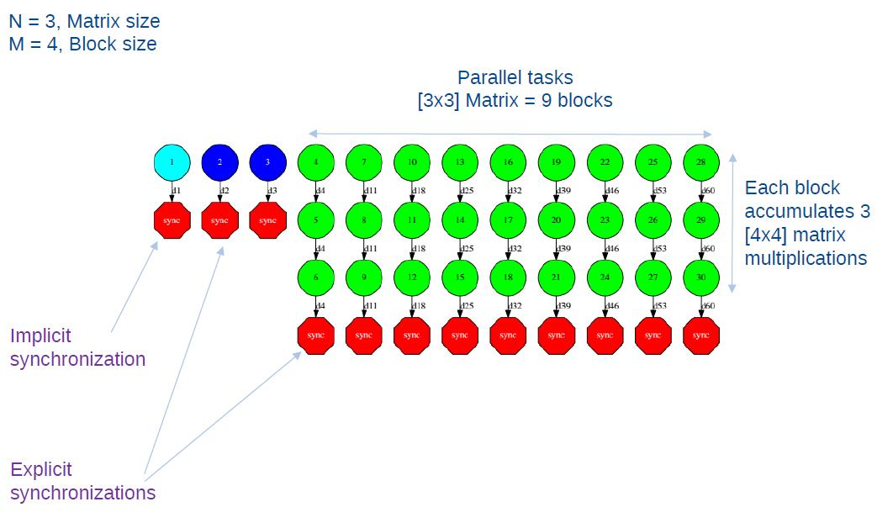

Task Dependency Graph
---------------------

:numref:`matmul_exec_graph` depicts the task dependency graph for
the Matmul application in its object version with 3x3 blocks matrices,
each one containing a 4x4 matrix of doubles. Each block in the result
matrix accumulates three block multiplications, i.e. three
multiplications of 4x4 matrices of doubles.

The light blue circle corresponds to the initialization of matrix "A" by
means of a method-task and it has an implicit synchronization inside.
The dark blue circles correspond to the other two initializations by
means of function-tasks; in this case the synchronizations are explicit
and must be provided by the developer after the task call. Both implicit
and explicit synchronizations are represented as red circles.

Each green circle is a partial matrix multiplication of a set of 3. One
block from matrix "A" and the correspondent one from matrix "B". The
result is written in the right block in "C" that accumulates the partial
block multiplications. Each multiplication set has an explicit
synchronization. All green tasks are method-tasks and they are executed
in parallel.

   Matmul Execution Graph.
