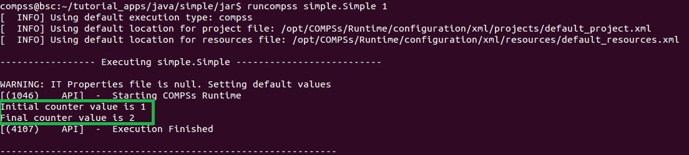

Results and logs
================

Results
-------

When executing a COMPSs application we consider different type of
results:

-  **Application Output:** Output generated by the application.

-  **Application Files:** Files used or generated by the application.

-  **Tasks Output:** Output generated by the tasks invoked from the application.

Regarding the application output, COMPSs will preserve the application
output but will add some pre and post output to indicate the COMPSs
Runtime state. :numref:`simple_java_stdout` shows the standard output
generated by the execution of the Simple Java application. The green box
highlights the application ``stdout`` while the rest of the output is
produced by COMPSs.

   Output generated by the execution of the *Simple* Java application with COMPSs

Regarding the application files, COMPSs **does not modify** any of them
and thus, the results obtained by executing the application with COMPSs
are the same than the ones generated by the sequential execution of the
application.

Regarding the tasks output, COMPSs introduces some modifications due
to the fact that tasks can be executed in remote machines. After the
execution, COMPSs stores the *stdout* and the *stderr* of each job (a
task execution) inside the
**``/home/$USER/.COMPSs/$APPNAME/$EXEC_NUMBER/jobs/``** directory of
the main application node.

:numref:`hello_seq` and :numref:`hello_compss` show an example of the
results obtained from the execution of the *Hello* Java application.
While :numref:`hello_seq` provides the output of the sequential
execution of the application (without COMPSs), :numref:`hello_compss`
provides the output of the equivalent COMPSs
execution. Please note that the sequential execution produces the
``Hello World! (from a task)`` message in the ``stdout`` while the
COMPSs execution stores the message inside the ``job1_NEW.out`` file.

.. figure:: ./Figures/hello_seq_stdout.jpeg
   :name: hello_seq
   :alt: Sequential execution of the *Hello* java application
   :align: center
   :width: 60.0%

   Sequential execution of the *Hello* java application

   COMPSs execution of the *Hello* java application

Logs
----

COMPSs includes three log levels for running applications but users can
modify them or add more levels by editing the logger files under the
``/opt/COMPSs/Runtime/configuration`` ``/log/`` folder. Any of these log
levels can be selected by adding the ``--log_level=<debug | info | off>``
flag to the ``runcompss`` command. The default value is ``off``.

The logs generated by the ``NUM_EXEC`` execution of the application APP
by the user USER are stored under
``/home/$USER/.COMPSs/$APP/$EXEC_NUMBER/`` folder (from this point on:
**base log folder**). The ``EXEC_NUMBER`` execution number is
automatically used by COMPSs to prevent mixing the logs of data of
different executions.

When running COMPSs with **log level off** only the errors are reported.
This means that the *base log folder* will contain two empty files
(``runtime.log`` and ``resources.log``) and one empty folder (``jobs``).
If somehow the application has failed, the ``runtime.log`` and/or the
``resources.log`` will not be empty and a new file per failed job will
appear inside the ``jobs`` folder to store the ``stdout`` and the
``stderr``. :numref:`simple_log_off` shows the logs generated by
the execution of the Simple java application (without errors) in **off**
mode.

.. figure:: ./Figures/simple_log_off.jpeg
   :name: simple_log_off
   :alt: Structure of the logs folder for the Simple java application in **off** mode
   :align: center
   :width: 25.0%

   Structure of the logs folder for the Simple java application in **off** mode

When running COMPSs with **log level info** the *base log folder* will
contain two files (``runtime.log`` and ``resources.log``) and one folder
(``jobs``). The ``runtime.log`` file contains the execution information
retrieved from the master resource, including the file transfers and the
job submission details. The ``resources.log`` file contains information
about the available resources such as the number of processors of each
resource (slots), the information about running or pending tasks in the
resource queue and the created and destroyed resources. The jobs folder
will be empty unless there has been a failed job. In this case it will
store, for each failed job, one file for the ``stdout`` and another for
the ``stderr``. As an example, :numref:`simple_log_info` shows the
logs generated by the same execution than the previous case but with
**info** mode.

.. figure:: ./Figures/simple_log_info.jpeg
   :name: simple_log_info
   :alt: Structure of the logs folder for the Simple java application in **info** mode
   :align: center
   :width: 25.0%

   Structure of the logs folder for the Simple java application in **info** mode

The ``runtime.log`` and ``resources.log`` are quite large files, thus
they should be only checked by advanced users. For an easier
interpretation of these files the COMPSs Framework includes a monitor
tool. For further information about the COMPSs Monitor please check
:ref:`Sections/03_App_Execution/03_Tools:COMPSs Monitor`.

:numref:`simple_runtimelog` and :numref:`simple_resourceslog` provide
the content of these two files generated by the execution of the
*Simple* java application.

.. figure:: ./Figures/simple_runtimelog.jpeg
   :name: simple_runtimelog
   :alt: runtime.log generated by the execution of the *Simple* java application
   :align: center
   :width: 95.0%

   runtime.log generated by the execution of the *Simple* java
   application

.. figure:: ./Figures/simple_resourceslog.jpeg
   :name: simple_resourceslog
   :alt: resources.log generated by the execution of the *Simple* java application
   :align: center
   :width: 80.0%

   resources.log generated by the execution of the *Simple* java application

Running COMPSs with **log level debug** generates the same files as the
info log level but with more detailed information. Additionally, the
``jobs`` folder contains two files per **submitted** job; one for the
``stdout`` and another for the ``stderr``. In the other hand, the COMPSs
Runtime state is printed out on the ``stdout``.
:numref:`simple_log_debug` shows the logs generated by the same execution
than the previous cases but with **debug** mode.

The runtime.log and the resources.log files generated in this mode can
be **extremely large**. Consequently, the users should take care of
their quota and manually erase these files if needed.

   Structure of the logs folder for the Simple java application in **debug** mode

When running Python applications a ``pycompss.log`` file is written
inside the *base log folder* containing debug information about the
specific calls to PyCOMPSs.

Furthermore, when running ``runcompss`` with additional flags (such as
monitoring or tracing) additional folders will appear inside the *base
log folder*. The meaning of the files inside these folders is explained
in :ref:`Sections/03_App_Execution/03_Tools:COMPSs Tools`.
