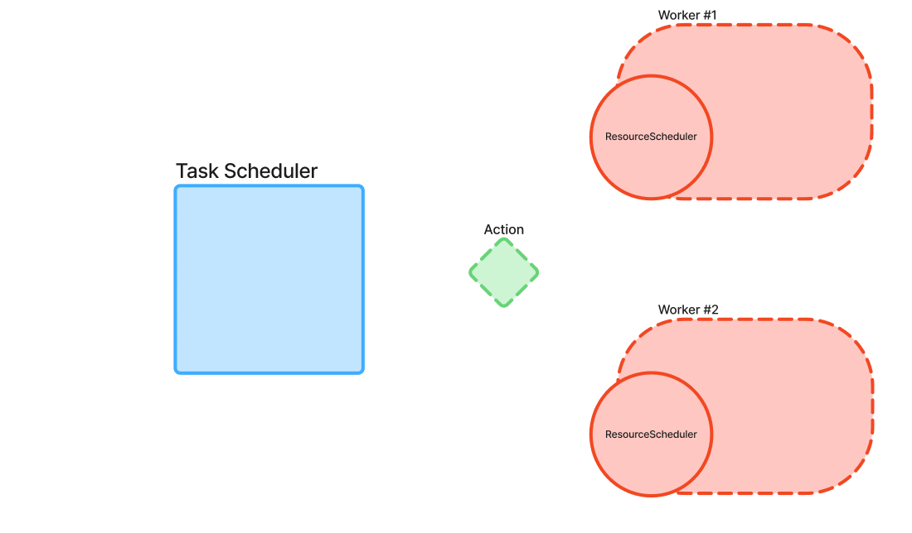

Schedulers
===========

This documentation provides an in-depth overview of the COMPSs scheduling system.
It explains how tasks are managed and scheduled within the runtime. Additionally, COMPSs 
offers a variety of scheduling strategies—each designed with a specific function and purpose—that 
will be described in detail in later sections.

Purpose and objectives
----------------------

The COMPSs schedulers are responsible for dynamically assigning tasks to available computational resources (workers) while respecting task dependencies, resource constraints, and user-defined priorities. This ensures that applications execute efficiently regardless of the underlying hardware or system load.

* Optimize Task Execution: Improve overall execution times by carefully balancing the load across multiple resources.
* Adapt to Changing Conditions: Dynamically reassign and reschedule tasks based on real-time resource availability and system state.
* Facilitate Extensibility: Provide a framework that allows for different scheduling strategies—each with its unique trade-offs—to be integrated and used according to specific execution scenarios.

Scheduling Architecture Overview
--------------------------------

The COMPSs scheduling architecture is based on a two-level model that separates global task orchestration from local resource management:

* TaskScheduler: 
    * Receiving new tasks (referred to as allocatable actions).
    * Determining the best candidate resources based on multiple scoring metrics (e.g., task priority, resource availability, data locality).
    * Coordinating with resource schedulers to ensure that tasks are executed when their dependencies are satisfied.

* ResourceScheduler:
    * Maintains a list of tasks currently running on the resource.
    * Manages a priority queue for tasks that are blocked (due to insufficient local resources or pending dependencies).
    * Calculates detailed scores for tasks based on current local conditions.

Provided Schedulers and Strategies
-------------------------------------------

COMPSs provides a wide range of scheduler implementations, each made to be used in different execution scenarios and performance objectives. These schedulers are organized into three main families, each employing unique strategies to manage task dependencies and resource constraints. In this section, we detail these families, explain their characteristics, and discuss their typical use cases, so that a COMPSs user is able to select the one they want to use.

Order Strict Schedulers
***********************

Order strict schedulers enforce a strict execution order based on task priorities once a task becomes dependency-free. Only the dependency-free task with the higher priority (score) is eligible for execution, even if there are free resources available that could otherwise run lower-priority tasks.

**Key Characteristics:**
  * Strict Priority Enforcement: No task overtakes a higher-priority dependency-free task.
  * Predictable Execution Order: Tasks are generally scheduled in a First-In-First-Out (FIFO) manner, based on their generation order.

Flag to use it: ``--scheduler=es.bsc.compss.scheduler.orderstrict.fifo.FifoTS``

**Use Cases:**
This family is ideal when it is critical to maintain a strict task order, ensuring that high-priority tasks are executed as soon as they become eligible, regardless of resource availability.

Lookahead Schedulers
********************

Lookahead schedulers also assign priorities to tasks as they become dependency-free. However, they provide more flexibility by allowing tasks with a lower priority to be executed if resources are insufficient to run the highest-priority task immediately. This approach can improve resource utilization and overall throughput in certain conditions.

**Variants and Key Strategies:**

* FIFO and LIFO Variants:
    * FIFO (First-In, First-Out):
         * Tasks are scheduled in the order they are generated.
         * Flag: ``--scheduler=es.bsc.compss.scheduler.lookahead.fifo.FifoTS``
    * LIFO (Last-In, First-Out):
         * Tasks are scheduled in the inverse order of their arrival.
         * Flag: ``--scheduler=es.bsc.compss.scheduler.lookahead.lifo.LifoTS``
* Locality-Based Variant:
    * Prioritizes tasks based on data locality first, then uses FIFO order for tie-breaking.
    * Flag: ``--scheduler=es.bsc.compss.scheduler.lookahead.locality.LocalityTS``
    * *Commonly used as the default scheduler for runcompss executions, where data locality can significantly impact performance.*
* Successors-Based Variants:

  These variants give higher priority to tasks that become dependency-free as a result of predecessor tasks' completion. This "successor" approach is designed to accelerate the overall workflow by quickly unlocking subsequent tasks.

    * Locality-Enhanced Successors:
         * Prioritizes the successors of a completed task, then considers data locality, and finally the task generation order.
         * If there are no weights defined for the parameters, it takes into account the number of parameters in each node.
         * This scheduler doesn't take into account the size of the data nor the transfer speed.
         * Flag: ``--scheduler=es.bsc.compss.scheduler.lookahead.successors.locality.LocalityTS``
         * *Typically used for local disk executions on supercomputers (SCs).*
    * FIFO/LIFO Successors:
         * Variants that, after prioritizing successors, schedule tasks in either FIFO or LIFO order.
         * FIFO Flag: ``--scheduler=es.bsc.compss.scheduler.lookahead.successors.fifo.FifoTS``
         * LIFO Flag: ``--scheduler=es.bsc.compss.scheduler.lookahead.successors.lifo.LifoTS``
    * Multi-Threaded Successors Variants:
         * These versions (prefixed with ``mt``) are designed for multi-threaded scheduling, enhancing scheduling throughput:
         * Flags:
             *  ``--scheduler=es.bsc.compss.scheduler.lookahead.mt.successors.locality.LocalityTS``
             *  ``--scheduler=es.bsc.compss.scheduler.lookahead.mt.successors.fifo.FifoTS``
             *  ``--scheduler=es.bsc.compss.scheduler.lookahead.mt.successors.lifo.LifoTS``
    * Constraint-Aware Successors:
         * Prioritize successors, then consider the tasks based on its resource constraints (e.g., computing units), and finally apply FIFO order.
         * Default Flag: ``--scheduler=es.bsc.compss.scheduler.lookahead.successors.constraintsfifo.ConstraintsFifoTS``
         * Multi-Threaded: ``--scheduler=es.bsc.compss.scheduler.lookahead.mt.successors.constraintsfifo.ConstraintsFifoTS``

**Use Cases:**
Lookahead schedulers are beneficial when balancing strict prioritization with overall resource utilization. They are particularly useful in environments where resource availability can be a bottleneck, and allowing lower-priority tasks to run prevents idle resources and increases throughput.

Full Graph Schedulers
*********************

Full graph schedulers take a global view of the entire application's task graph. They not only consider data dependencies but also explicitly manage resource dependencies among tasks. These schedulers dynamically redefine resource dependencies to optimize execution based on multiple objectives.

**Key Characteristics:**
  * Global Optimization: Considers the complete task graph rather than only dependency-free tasks.
  * Multi-Objective Function: Often employs a multi-objective function that balances execution time, energy consumption, and cost.
  * Flag: ``scheduler=es.bsc.compss.scheduler.fullgraph.multiobjective.MOScheduler``

**Use Cases:**
Full graph schedulers are best suited for complex workflows where a global optimization can yield significant improvements. Their comprehensive approach is ideal in scenarios where trade-offs between execution time, energy, and cost are critical, although this may come at the expense of higher computational overhead during scheduling.

Table with the provided schedulers within the COMPSs release:

.. table:: Schedulers
    :name: schedulers description

    +------------------------------------------------------------------------------------+-----------------+------------------------------------------------------------------+-------------------------------------------+
    | **Class name**                                                                     | **Family**      | **Description**                                                  | **Comments**                              |
    +====================================================================================+=================+==================================================================+===========================================+
    | es.bsc.compss.scheduler.orderstrict.fifo.FifoTS                                    | order-strict    | Prioritizes task generation order (FIFO).                        |                                           |
    +------------------------------------------------------------------------------------+-----------------+------------------------------------------------------------------+-------------------------------------------+
    | es.bsc.compss.scheduler.lookahead.fifo.FifoTS                                      | lookahead       | Prioritizes task generation order (FIFO).                        |                                           |
    +------------------------------------------------------------------------------------+-----------------+------------------------------------------------------------------+-------------------------------------------+
    | es.bsc.compss.scheduler.lookahead.lifo.LifoTS                                      | lookahead       | Prioritizes task generation order (LIFO).                        |                                           |
    +------------------------------------------------------------------------------------+-----------------+------------------------------------------------------------------+-------------------------------------------+
    | es.bsc.compss.scheduler.lookahead.locality.LocalityTS                              | lookahead       | Prioritizes data location and then (FIFO) task generation.       | Default on runcompss executions           |
    +------------------------------------------------------------------------------------+-----------------+------------------------------------------------------------------+-------------------------------------------+
    | es.bsc.compss.scheduler.lookahead.successors.locality.LocalityTS                   | lookahead       | Prioritizes the successors of the ended task, then the data      | Default for local disk executions on SCs  |
    |                                                                                    | - successors    | locality on the worker and then the generation order.            |                                           |
    +------------------------------------------------------------------------------------+-----------------+------------------------------------------------------------------+-------------------------------------------+
    | es.bsc.compss.scheduler.lookahead.mt.successors.locality.LocalityTS                | lookahead       | Prioritizes the successors of the ended task, then the data      | Multi-threaded implementation.            |
    |                                                                                    | - successors    | locality on the worker and then the generation order.            |                                           |
    +------------------------------------------------------------------------------------+-----------------+------------------------------------------------------------------+-------------------------------------------+
    | es.bsc.compss.scheduler.lookahead.successors.fifo.FifoTS                           | lookahead       | Prioritizes the successors of the ended task, and then the       |                                           |
    |                                                                                    | - successors    | generation order.                                                |                                           |
    +------------------------------------------------------------------------------------+-----------------+------------------------------------------------------------------+-------------------------------------------+
    | es.bsc.compss.scheduler.lookahead.mt.successors.fifo.FifoTS                        | lookahead       | Prioritizes the successors of the ended task, and then the       | Multi-threaded implementation.            |
    |                                                                                    | - successors    | generation order.                                                | Default for shared disk executions on SCs |
    +------------------------------------------------------------------------------------+-----------------+------------------------------------------------------------------+-------------------------------------------+
    | es.bsc.compss.scheduler.lookahead.successors.lifo.LifoTS                           | lookahead       | Prioritizes the successors of the ended task, and then the       |                                           |
    |                                                                                    | - successors    | inverse generation order.                                        |                                           |
    +------------------------------------------------------------------------------------+-----------------+------------------------------------------------------------------+-------------------------------------------+
    | es.bsc.compss.scheduler.lookahead.mt.successors.lifo.LifoTS                        | lookahead       | Prioritizes the successors of the ended task, and then the       | Multi-threaded implementation.            |
    |                                                                                    | - successors    | inverse generation order.                                        |                                           |
    +------------------------------------------------------------------------------------+-----------------+------------------------------------------------------------------+-------------------------------------------+
    | es.bsc.compss.scheduler.lookahead.successors.constraintsfifo.ConstraintsFifoTS     | lookahead       | Prioritizes the successors of the ended task, then the task      |                                           |
    |                                                                                    | - successors    | constraints (computing_units) and then generation order (FIFO).  |                                           |
    +------------------------------------------------------------------------------------+-----------------+------------------------------------------------------------------+-------------------------------------------+
    | es.bsc.compss.scheduler.lookahead.mt.successors.constraintsfifo.ConstraintsFifoTS  | lookahead       | Prioritizes the successors of the ended task, then the task      | Multi-threaded implementation             |
    |                                                                                    | - successors    | constraints (computing_units) and then generation order (FIFO).  |                                           |
    +------------------------------------------------------------------------------------+-----------------+------------------------------------------------------------------+-------------------------------------------+
    | es.bsc.compss.scheduler.fullgraph.multiobjective.MOScheduler                       | full graph      | Based on a multi-objective function (time, energy, cost).        |                                           |
    +------------------------------------------------------------------------------------+-----------------+------------------------------------------------------------------+-------------------------------------------+

Specifying the ``--scheduler=<class>`` option when launching a COMPSs execution with
``enqueue_compss`` or ``runcompss`` selects the scheduler that will drive the execution.
In the case of having an agents deployment, the option indicates the scheduler used by
that agent; agents deployment allows combining different scheduling strategies by
setting up a different policy on each agent.

.. rubric:: Optimizing using previous task profiles

COMPSs leverages task execution profiles and configurable parameters to optimize scheduling decisions throughout an application’s lifecycle. These profiles capture key performance metrics (such as average, minimum, and maximum execution times) for each task implementation, enabling the scheduler to estimate resource usage and execution duration accurately. At startup, users can provide an input profile file using the ``--input_profile=<path>`` option, which allows the scheduler to utilize historical performance data from the very beginning, thereby improving early task assignment decisions. As tasks are executed, the scheduler dynamically updates these profiles and incorporates this information into its scoring functions, which penalize slower implementations. Upon completion, the updated profiles are saved via the ``--output_profile=<path>`` option, creating a continuous learning loop that adapts to changes in resource performance and workload characteristics over time. This integration of execution profiles not only enhances scheduling accuracy but also improves load balancing and overall resource utilization, leading to more predictable and efficient distributed execution of tasks.
