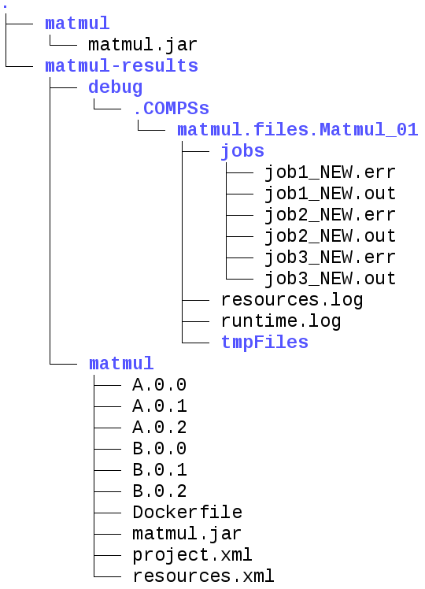

.. spelling:word-list::

   dir

Docker
======

What is Docker?
---------------

Docker is an open-source project that automates the deployment of
applications inside software containers, by providing an additional
layer of abstraction and automation of operating-system-level
virtualization on Linux. In addition to the Docker container engine,
there are other Docker tools that allow users to create complex
applications (Docker-Compose) or to manage a cluster of Docker
containers (Docker Swarm).

COMPSs supports running a distributed application in a Docker Swarm
cluster.

Requirements
------------

In order to use COMPSs with Docker, some requirements must be fulfilled:

-  Have **Docker** and **Docker-Compose** installed in your local
   machine.

-  Have an available **Docker Swarm cluster** and its Swarm manager IP
   and Port to access it remotely.

-  A **Docker Hub account**. Docker Hub is an online repository for Docker
   images. We don’t currently support another sharing method besides
   uploading to Docker Hub, so you will need to create a personal
   account. This has the advantage that it takes very little time either
   upload or download the needed images, since it will reuse the
   existing layers of previous images (for example the COMPSs base
   image).

Execution in Docker
-------------------

The runcompss-docker execution workflow uses Docker-Compose, which is
in charge of spawning the different application containers into the
Docker Swarm manager. Then the Docker Swarm manager schedules the
containers to the nodes and the application starts running.
The COMPSs master and workers will run in the nodes Docker Swarm
decides. To see where the masters and workers are located in runtime,
you can use:

.. code-block:: console

    $ docker -H '<swarm_manager_ip:swarm_port>' ps -a

The execution of an application using Docker containers with COMPSs
**consists of 2 steps**:

Execution step 1: Creation of the application image
~~~~~~~~~~~~~~~~~~~~~~~~~~~~~~~~~~~~~~~~~~~~~~~~~~~

The very first step to execute a COMPSs application in Docker is
creating your application Docker image.

This must be done **only once** for every new application, and then
you can run it as many times as needed. If the application is updated
for whatever reason, this step must be done again to create and share
the updated image.

In order to do this, you must use the **compss_docker_gen_image**
tool, which is available in the standard COMPSs application. This tool
is the responsible of taking your application, create the needed
image, and upload it to Docker Hub to share it.

The image is created injecting your application into a COMPSs base
image. This base image is available in Docker Hub. In case you need it,
you can pull it using the following command:

.. code-block:: console

    $ docker pull compss/compss

The **compss_docker_gen_image** script receives 2 parameters:

--c, --context-dir
   Specifies the **context directory** path of the application. This
   path **MUST BE ABSOLUTE**, not relative. The context directory is a
   local directory that **must contain the needed binaries and input
   files of the app (if any)**. In its simplest case, it will contain
   the executable file (a .jar for example). Keep the
   context-directory as lightest as possible.

   For example: **--context-dir=’/home/compss-user/my-app-dir’** (where
   ’my-app-dir’ contains ’app.jar’, ’data1.dat’ and ’data2.csv’). For
   more details, this context directory will be recursively copied into
   a COMPSs base image. Specifically, it will create all the path down
   to the context directory inside the image.

--image-name
   Specifies a name for the created image. It **MUST** have this format:
   ’DOCKERHUB-USERNAME/image-name’.
   The *DOCKERHUB_USERNAME* must be the username of your personal
   Docker Hub account.
   The *image_name* can be whatever you want, and will be used as the
   identifier for the image in Docker Hub. This name will be the one
   you will use to execute the application in Docker.
   For example, if my Docker Hub username is john123 and I want my
   image to be named “my-image-app”:
   ``--image-name=“john123/my-image-app”``.

   As stated before, this is needed to share your container application
   image with the nodes that need it. Image tags are also supported (for
   example "john123/my-image-app:1.23).

.. IMPORTANT::

   After creating the image, be sure to write down the absolute
   context-directory and the absolute CLASSPATH (the absolute path to the
   executable jar). You will need it to run the application using
   ``runcompss-docker``. In addition, if you plan on distributing the
   application, you can use the Docker Hub image’s information tab to
   write them, so the application users can retrieve them.

Execution step 2: Run the application
~~~~~~~~~~~~~~~~~~~~~~~~~~~~~~~~~~~~~

To execute COMPSs in a Docker Swarm cluster, you must use the
``runcompss-docker`` command, instead of ``runcompss``.

The command ``runcompss-docker`` has some **additional arguments**
that will be needed by COMPSs to run your application in a distributed
Docker Swarm cluster environment. The rest of typical arguments
(CLASSPATH for example) will be delegated to runcompss command.

These additional arguments must go before the typical runcompss
arguments. The runcompss-docker additional arguments are:

--w, --worker-containers
    Specifies the number of **worker containers** the app will execute
    on. One more container will be created to host the **master**. If you
    have enough nodes in the Swarm cluster, each container will be
    executed by one node. This is the default schedule strategy used by
    Swarm.
    For example: ``--worker-containers=3``

--s, --swarm-manager
    Specifies the Swarm manager IP and Port (format: IP:Port).
    For example: ``--swarm-manager=’129.114.108.8:4000’``

--i, --image-name
    Specify the image name of the application image in Docker Hub.
    Remember you must generate this with compss_docker_gen_image
    Remember as well that the format must be:
    ’DOCKERHUB_USERNAME/APP_IMAGE_NAME:TAG’ (the :TAG is optional).
    For example: ``--image-name=’john123/my-compss-application:1.9’``

--c, --context-dir
    Specifies the **context directory** of the app. It must be specified
    by the application image provider.
    For example: ``--context-dir=’/home/compss-user/my-app-context-dir’``

As **optional** arguments:

--c-cpu-units
    Specifies the number of cpu units used by each container (default value is 4).
    For example: ``*--c-cpu-units:=16``

--c-memory
    Specifies the physical memory used by each container in GB (default value is 8 GB).
    For example, in this case, each container would use as maximum 32 GB
    of physical memory: ``--c-memory=32``

Here is the **format** you must use with ``runcompss-docker`` command:

.. code-block:: console

    $ runcompss-docker --worker-containers=N \
                       --swarm-manager='<ip>:<port>' \
                       --image-name='DOCKERHUB_USERNAME/image_name' \
                       --context-dir='CTX_DIR' \
                       [rest of classic runcompss args]

Or alternatively, in its shortest form:

.. code-block:: console

    $ runcompss-docker --w=N --s='<ip>:<port>' --i='DOCKERHUB_USERNAME/image_name' --c='CTX_DIR' \
                       [rest of classic runcompss args]

Execution with TLS
------------------

If your cluster uses **TLS** or has been created using
**Docker-Machine**, you will have to **export two environment
variables** before using runcompss-docker:

On one hand, **DOCKER_TLS_VERIFY** environment variable will tell
Docker that you are using TLS:

.. code-block:: bash

    export DOCKER_TLS_VERIFY="1"

On the other hand, **DOCKER_CERT_PATH** variable will tell Docker
where to find your TLS certificates. As an example:

.. code-block:: bash

    export DOCKER_CERT_PATH="/home/compss-user/.docker/machine/machines/my-manager-node"

In case you have created your cluster using docker-machine, in order to
know what your *DOCKER_CERT_PATH* is, you can use this command:

.. code-block:: console

    $ docker-machine env my-swarm-manager-node-name | grep DOCKER_CERT_PATH

In which *swarm-manager-node-name* must be changed by the name
docker-machine has assigned to your swarm manager node.
With these environment variables set, you are ready to use
``runcompss-docker`` in a cluster using TLS.

Execution results
-----------------

The execution results will be retrieved from the master container of
your application.

If your context-directory name is **’matmul’**, then your results will
be saved in the **’matmul-results’** directory, which will be located
in the same directory you executed runcompss-docker on.

Inside the **’matmul-results’** directory you will have:

-  A folder named **’matmul’** with all the result files that were in
   the same directory as the executable when the application execution
   ended. More precisely, this will contain the context-directory state
   right after finishing your application execution.
   Additionally, and for more advanced debug purposes, you will have
   some intermediate files created by runcompss-docker (Dockerfile,
   project.xml, resources.xml), in case you want to check for more
   complex errors or details.

-  A folder named **’debug’**, which (in case you used the runcompss
   debug option (**-d**)), will contain the **’.COMPSs’** directory,
   which contains another directory in which there are the typical debug
   files runtime.log, jobs, etc.
   Remember **.COMPSs** is a **hidden** directory, take this into
   account if you do **ls** inside the debug directory (add the **-a**
   option).

To make it simpler, we provide a **tree visualization** of an example of
what your directories should look like after the execution. In this case
we executed the **Matmul example application** that we provide you:

   Result and log folders of a *Matmul* execution with COMPSs and Docker

Execution examples
------------------

Next we will use the *Matmul* application as an example of a Java
application running with COMPSs and Docker.

Imagine we have our Matmul application in ``/home/john/matmul`` and
inside the ``matmul`` directory we only have the file ``matmul.jar``.

We have created a Docker Hub account with username ’john123’.

The first step will be creating the image:

.. code-block:: console

    $ compss_docker_gen_image --context-dir='/home/john/matmul' \
                              --image-name='john123/matmul-example'

Now, we write down the context-dir (``/home/john/matmul``) and the
CLASSPATH (``/home/john/matmul/matmul.jar``). We do this because they will be
needed for future executions.
Since the image is created and uploaded, we won’t need to do this step
anymore.

Now we are going to execute our Matmul application in a Docker cluster.

Take as assumptions:

-  We will use **5 worker docker containers**.

-  The **swarm-manager ip** will be 129.114.108.8, with the Swarm
   manager listening to the **port** 4000.

-  We will use **debug (-d)**.

-  Finally, as we would do with the typical runcompss, we specify the
   **main class** name and its **parameters** (16 and 4 in this case).

In addition, we know from the former step that the image name is
``john123/matmul-example``, the **context directory** is
``/home/john/matmul``, and the CLASSPATH is
``/home/john/matmul/matmul.jar``. And this is how you would run
``runcompss-docker``:

.. code-block:: console

    $ runcompss-docker --worker-containers=5 \
                       --swarm-manager='129.114.108.8:4000' \
                       --context-dir='/home/john/matmul' \
                       --image-name='john123/matmul-example' \
                       --classpath=/home/john/matmul/matmul.jar \
                       -d \
                       matmul.objects.Matmul 16 4

Here we show another example using the short arguments form, with the
KMeans example application, that is also provided as an example COMPSs
application to you:

First step, create the image once:

.. code-block:: console

    $ compss_docker_gen_image --context-dir='/home/laura/apps/kmeans' \
                              --image-name='laura-67/my-kmeans'

And now execute with 30 worker containers, and Swarm located in
’110.3.14.159:26535’.

.. code-block:: console

    $ runcompss-docker --w=30 \
                       --s='110.3.14.159:26535' \
                       --c='/home/laura/apps/kmeans' \
                       --image-name='laura-67/my-kmeans' \
                       --classpath=/home/laura/apps/kmeans/kmeans.jar \
                       kmeans.KMeans
