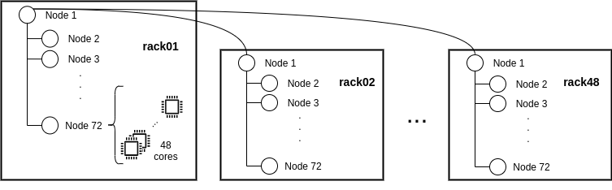

Supercomputers
==============

Similar to Section :ref:`Sections/03_Execution_Environments/03_Deployments/01_Master_worker/02_Supercomputers:Supercomputers` for Master-Worker deployments, this section is intended to walk you through the COMPSs usage with agents in Supercomputers. All the configuration and commands to install COMPSs on the Supercomputer, load the environment and submitting a job remain exactly the same as described in Sections :ref:`Sections/03_Execution_Environments/03_Deployments/01_Master_worker/02_Supercomputers:Supercomputers`.

The only difference to submit jobs with regards the COMPSs Master-Worker approach is to enact the ``agents`` option of the **enqueue_compss** command. When this option is enabled, the whole COMPSs deployment changes and, instead of deploying the COMPSs master in one node and workers in the remaining ones, it deploys an agent in each node provided by the queue system. When all the agents have been deployed, COMPSs' internal scripts handling the job execution will submit the operation using the REST API of the one of the agent. Although COMPSs agents allow any method of the application to be the starting point of the execution, to maintain the similarities between the scripts when deploying COMPSs following the Master-Worker or the Agents approaches, the execution will start with the main method of the class/module passed in as a parameter to the script. 

The main advantage of using the Agents approach in Supercomputers is the ability to define different topologies. For that purpose, the ``--agents`` option of the **enqueue_compss** script allows to choose two different options ``--agents=plain`` and ``--agents=tree``.

The ``Plain`` topology configures the deployment resembling the Master-worker approach. One of the agents is selected as the master an has all the other agents as workers where to offload tasks; the agents acting as workers also host a COMPSs runtime and, therefore, they can detect nested tasks on the tasks offloaded onto them. However, nested tasks will always be executed on the worker agent detecting them.

The ``Tree`` topology is the default topology when using agent deployments on Supercomputers. These option tries to create a three-layer topology that aims to exploit data locality and reduce the workload of the scheduling problem. Such topology consists in deploying an agent on each node managing only the resources available within the node. Then, the script groups all the nodes by rack and selects a representative node for each group that will orchestrate all the resources within it and offload tasks onto the other agents. Finally, the script picks one of these representative agents as the main agent of the hierarchy; this main agent is configured to be able to offload tasks onto the representative agents for all other racks; it will be onto this node that the script will call the main method of the execution. The following image depicts an example of such topology on MareNostrum.

To ensure that no resources are wasted waiting from the execution end until the wall clock limit, the **enqueue_compss** script submits the invocation enabling the ``--stop`` and ``--forward`` options to stop all the deployed agents for the execution. 