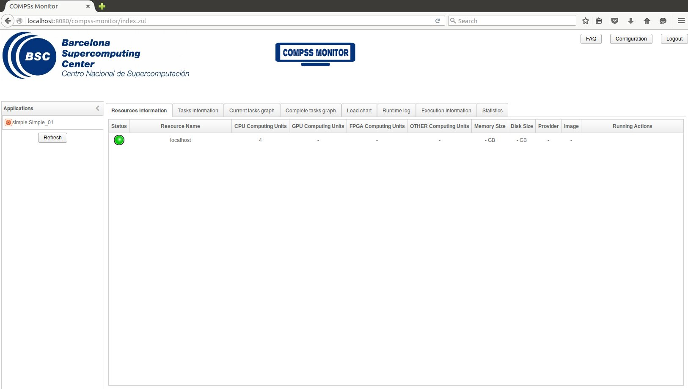

Local
*****

COMPSs Monitor is installed as a service and can be easily managed by running any of the
following commands:

.. code-block:: console

    compss@bsc:~$ /etc/init.d/compss-monitor usage
    Usage: compss-monitor {start | stop | reload | restart | try-restart | force-reload | status}

.. WARNING::

    The monitor is **NOT supported using agents**.

Service configuration
=====================

The COMPSs Monitor service can be configured by editing the
``/opt/COMPSs/Tools/monitor/apache-tomcat/conf/compss-monitor.conf`` file which contains
one line per property:

COMPSS_MONITOR
   Default directory to retrieve monitored applications
   (defaults to the ``.COMPSs`` folder inside the ``root`` user).

COMPSs_MONITOR_PORT
   Port where to run the compss-monitor web service (defaults to 8080).

COMPSs_MONITOR_TIMEOUT
   Web page timeout between browser and server (defaults to 20s).

Usage
=====

In order to use the COMPSs Monitor users need to start the service as
shown in :numref:`monitor_start`.

.. figure:: ./Figures/monitor_start.jpeg
   :name: monitor_start
   :alt: COMPSs Monitor start command
   :align: center

   COMPSs Monitor start command

.. TIP::

    The monitor can be started and stopped in multiple environments (local,
    docker and supercomputer) automatically using the CLI.
    Please check: :ref:`Sections/04_Ecosystem/09_CLI/02_Usage:Running the COMPSs monitor`

And use a web browser to open the specific URL:

.. code-block:: console

    compss@bsc:~$ firefox http://localhost:8080/compss-monitor &

The COMPSs Monitor allows to monitor applications from different users
and thus, users need to first login to access their applications. As
shown in :numref:`monitoring_interface`, the users can select any of
their executed or running COMPSs applications and display it.

   COMPSs monitoring interface

To enable **all** the COMPSs Monitor features, applications must run the
``runcompss`` command with the ``--log_level=debug`` and ``-m`` flag.
These flags allows the COMPSs Runtime to store special information inside
inside the ``log_base_folder`` under the ``monitor`` folder (see
:numref:`monitoring_interface` and :numref:`simple_logs_monitor`).
Only advanced users should modify or delete any of these files. If the
application that a user is trying to monitor has not been executed with
this flag, some of the COMPSs Monitor features will be disabled.

.. code-block:: console

    compss@bsc:~/tutorial_apps/java/simple/jar$ runcompss --log_level=debug -m simple.Simple 1
    [  INFO] Using default execution type: compss
    [  INFO] Using default location for project file: /opt/COMPSs/Runtime/configuration/xml/projects/default_project.xml
    [  INFO] Using default location for resources file: /opt/COMPSs/Runtime/configuration/xml/resources/default_resources.xml
    [  INFO] Using default language: java

    ----------------- Executing simple.Simple --------------------------

    WARNING: COMPSs Properties file is null. Setting default values
    [(799)    API]  -  Deploying COMPSs Runtime v<version>
    [(801)    API]  -  Starting COMPSs Runtime v<version>
    [(801)    API]  -  Initializing components
    [(1290)    API]  -  Ready to process tasks
    [(1293)    API]  -  Opening /home/compss/tutorial_apps/java/simple/jar/counter in mode OUT
    [(1338)    API]  -  File target Location: /home/compss/tutorial_apps/java/simple/jar/counter
    Initial counter value is 1
    [(1340)    API]  -  Creating task from method increment in simple.SimpleImpl
    [(1340)    API]  -  There is 1 parameter
    [(1341)    API]  -    Parameter 1 has type FILE_T
    Final counter value is 2
    [(4307)    API]  -  No more tasks for app 1
    [(4311)    API]  -  Getting Result Files 1
    [(4340)    API]  -  Stop IT reached
    [(4344)    API]  -  Stopping Graph generation...
    [(4344)    API]  -  Stopping Monitor...
    [(6347)    API]  -  Stopping AP...
    [(6348)    API]  -  Stopping TD...
    [(6509)    API]  -  Stopping Comm...
    [(6510)    API]  -  Runtime stopped
    [(6510)    API]  -  Execution Finished

    ------------------------------------------------------------

.. figure:: ./Figures/logs_with_monitor.jpeg
   :name: simple_logs_monitor
   :alt: Logs generated by the Simple java application with the monitoring flag enabled
   :align: center
   :width: 25.0%

   Logs generated by the Simple java application with the monitoring flag enabled
