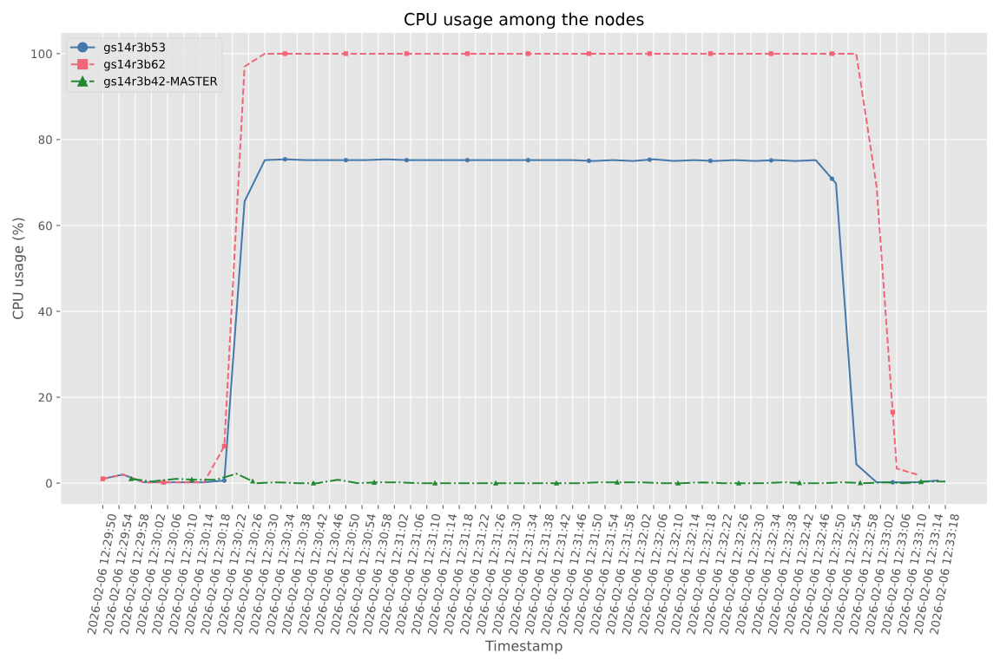

.. _resulting-crate:

Resulting crate
===============

Once the application has finished, a new sub-folder or zip file under the application's Working Directory
will be created with the name ``COMPSs_RO-Crate_[timestamp]/`` or ``COMPSs_RO-Crate_[timestamp].zip``, which is also known as *crate*. The contents of the
folder / zip file include detailed information of a COMPSs application execution (this is, the application together with
the datasets used for the run, logs, profiling, ...), and are:

- **Application Source Files:** as detailed by the user in the YAML configuration file,
  with the term ``sources``.
  The main source file and all auxiliary files that the application needs (e.g. ``.py``, ``.java``, ``.class``
  or ``.jar`` source code files, and also any installation, configuration, compilation or submission scripts, readme files, etc.)
  are included by the user. All application files are added to a sub-folder in the crate named ``application_sources/``, where
  the ``sources`` directory locations are included with their same folder tree structure, while the individual files included
  are added to the root of the ``application_sources/`` sub-folder in the crate.

- **Application Datasets:** when ``data_persistence`` is set to ``True`` in the YAML configuration file, both
  the input and output datasets of the workflow are included in the crate. The input dataset are the files that the
  workflow needs to be run. The output dataset is formed by all the resulting files generated by the execution of the
  COMPSs application. A sub-folder ``dataset/`` with all related files copied will be created, and the sub-directories
  structure will be respected. If more than a single *root* path is detected, a set of folders will be
  provided inside the ``dataset/`` folder.

- **Profiling folder:** contains the plots of the resource usage of the nodes involved in the execution of the application.
  In this directory, the user can find a folder for every node, which contains the plots of the CPU and memory usage of the
  tasks executed in that node. When more than one node is involved in the execution,  the user can also find
  the CPU and memory usage plots aggregated for all the nodes.

- **Trace folder:** if a Paraver trace file is generated during the run, and ``trace_persistence: True`` is specified in the
  YAML file, this folder will contain the trace files that correspond to the run.

- **Logs folder:** if the debug mode is activated in the run, or in case some tasks fail, a folder named ``logs/`` will be included
  in the crate containing either all the logs related to task executions (debug) or only the logs of tasks that failed (in case
  of an execution failure).

- **complete_graph.svg:** the diagram of the workflow generated by the COMPSs runtime,
  as generated with the ``runcompss -g`` or ``--graph`` options.

- **ro-crate-info.yaml (or custom name):** the YAML workflow provenance configuration file.

- **compss-[job_id].out:** only when the execution is on a cluster. The standard output log of the job execution.

- **compss-[job_id].err:** only when the execution is on a cluster. The standard error log of the job execution.

- **ro-crate-metadata.json:** the RO-Crate JSON main file describing the contents of this directory (crate) in the
  RO-Crate specification format.

The ``ro-crate-metadata.json`` file is the central descriptor of the crate, written in the `RO-Crate specification <https://www.researchobject.org/ro-crate/>`_.
COMPSs crates support two different levels of the Workflow Run RO-Crate profile collection, each with different levels of detail:

Workflow Run Crate
------------------

This was the original profile supported by COMPSs. It provides a
**high-level description of the workflow execution**, and it focuses on the workflow as a single entity.

It contains:

- Information about the application, input datasets, and output datasets
- Execution context (e.g. submission command line, output profiles, job logs)

It is useful if you only need a broad overview of the workflow and its datasets without details of each internal step.

Provenance Run Crate
--------------------

The newly supported **Provenance Run Crate** profile extends the metadata with detailed information about each executed task.

In addition to the elements from the Workflow Run Crate, it now includes detailed
descriptions of:

- **Workflow steps**: each executed task is represented explicitly
- **Inputs and outputs of each step**: which files and datasets were consumed and produced
- **Task parameters**: the parameter values passed to each method
- **Output log files**: per task output and error logs (stored only in debug mode or if the task fails)
- **Resource usage**: overall and per computing node resource usage statistics (CPU and memory usage %, average and maximum),
  and detailed method statistics per resource (number of invocations, average, maximum and minimum execution time).
- **Enhanced Debugging**: Users can quickly diagnose issues combining the workflow diagram (``complete_graph.svg``) with
  the ``pycompss inspect`` tool that enables a quick search for information on the crate, together with the included
  error logs (both main application and task specific), which detail failures and their underlying causes.

.. TIP::
    Since its version ``3.4``, the ``PyCOMPSs CLI`` includes the capacity of inspecting RO-Crates with the
    ``pycompss inspect <crate_folder/ | crate.zip>`` command. Check the :ref:`Sections/04_Ecosystem/09_CLI/02_Usage:Inspect Workflow Provenance`
    Section for more details. The ``--verbose`` option makes it easier to explore the workflow execution in more detail.
    The ``--tasks`` option lists information about each task individually. The ``--data_assets`` option lists all the workflow's needed and generated
    datasets or files. The ``--failing_tasks`` option provides details on tasks that failed. The ``--methods`` option outputs task details
    only for the methods that their name match a certain pattern.

.. TIP::

    For the basic set of files always included for every application (i.e. ``complete_graph.svg``, ``ro-crate-info.yaml``,
    ``compss-[job_id].out``, ``compss-[job_id].err``), the runtime generates a file checksum using the ``sha256`` algorithm,
    as specified inside the metadata file ``ro-crate-metadata.json``. This checksum can be used to verify the file integrity
    with the ``sha256sum`` command.

.. WARNING::

    The ``complete_graph.svg`` is automatically generated with the ``--provenance`` flag, but it it will not be generated
    automatically if your workflow's application edges are larger than 6500, to avoid large generation times.
    If you want to generate the diagram anyway, you can trigger the diagram generation manually with ``compss_gengraph``
    or ``pycompss gengraph``.

Profiling tool
--------------

When workflow provenance capture is enabled, the profiling tool is automatically activated. This tool collects the information
about the CPU and memory usage during the execution of the application, as well as detailed statistics on the methods run.

The profiling tool implements a fallback mechanism that allows to use different technologies based on the
architecture of the machine. By default, it uses ``psutil``, which is a cross-platform library for retrieving
information of the system utilization in Python. If on the machine it is not installed, the profiling tool
will try to use the ``top`` command, available on most Unix-like operating systems.
Finally, for some legacy systems, such as `Nord 4 <https://www.bsc.es/supportkc/docs/Nord4/overview/>`_, the
previous tools may not work properly, so the profiling tool will use a ``cgroup``-based approach to collect
the performance information. The selection of the right tool for the right architecture can be configured in
the ``profiler_config.json`` file, which is located in the COMPSs installation directory
``$COMPSS_HOME/Runtime/scripts/system/profiling/profiler_config.json``.
By default this is the content of the file:

.. code-block:: json
  :caption: Default profiler configuration file

    {
        "psutil": [
            "mn5",
            "darwin",
            "linux"
        ],
        "top": [
            "mn5",
            "darwin",
            "linux"
        ],
        "cgroup": [
            "mn5",
            "nord4"
        ]
    }

The profiling tool generates a set of ``csv`` files in a new folder called ``stats/`` of the log directory
(see Section :ref:`Sections/03_Execution/01_Local:Logs` for more details on where to locate these logs).
Here, the user can find a ``csv`` file corresponding to every node involved in the execution of the application,
which contains the CPU and memory usage information during the execution of tasks in that node.
A ``csv`` example is the following:

.. code-block::
   :caption: Example of CSV file generated by the profiling tool

    CPU,MEM,BYTE_SENT,BYTE_RECV,BYTE_READ_DISK,BYTE_WRITE_DISK,TIME_READ_DISK,TIME_WRITE_DISK,TIME
    0.2,15.0,95183,98705,0,20480,0,0,2026-01-09 11:01:03
    0.2,15.0,318053,322674,0,20480,0,0,2026-01-09 11:01:08
    0.2,15.0,32282,38744,0,16384,0,0,2026-01-09 11:01:13
    0.2,15.0,38690,43424,0,4096,0,0,2026-01-09 11:01:18
    5.0,15.8,2869504,4889920,0,45056,0,1,2026-01-09 11:01:23
    94.0,17.5,3593340,980947,2826240,1003520,12,0,2026-01-09 11:01:28
    100,17.5,23196,28816,151552,127741952,29,899,2026-01-09 11:01:33
    100,17.5,279244,82911,0,9789440,0,14,2026-01-09 11:01:38
    100,17.5,76262,39312,0,36864,0,0,2026-01-09 11:01:43

Every record of the ``csv`` file represents a snapshot of the resource usage at a certain moment of the execution.
The interval between snapshots is determined by the ``COMPSS_PROFILING_INTERVAL`` environment variable, which by
default is set to **5 seconds**.

.. TIP::

    Users can export the value of ``COMPSS_PROFILING_INTERVAL`` environment variable to a higher value to
    reduce the profiling overhead, based on the needs of the application and the system. The value expected is
    an integer, in seconds.

Finally, in the ``stats/`` folder, the Workflow Provenance uses the ``csv`` file to generate the plots of the
resource usage of CPU and memory of the application during its execution. These plots are included in the
RO-Crate and can be found in the ``profiling/`` folder of the crate. In this directory the user can find a
folder for every node, which contains the plots of the CPU and memory usage of the tasks executed in that node.
Also, when more than one node is involved in the execution, CPU and memory usage plots aggregated for all the
nodes are included. The profiling plots can be useful to detect potential bottlenecks in the application,
inefficient resource usage, and to quickly understand the resource usage of the application during its execution.
This is an example of the tree structure of the profiling folder that the user can find in the crate:

.. code-block:: console
  :caption: Example of the tree structure of the profiling folder in the crate

  profiling/
  ├── gs09r1b04-MASTER
  │   ├── cpu.svg
  │   └── mem.svg
  ├── gs09r1b36
  │   ├── cpu.svg
  │   └── mem.svg
  ├── gs09r1b55
  │   ├── cpu.svg
  │   └── mem.svg
  ├── cpu_nodes.svg
  └── mem_nodes.svg

Here is an example of the aggregated CPU and memory usage plots:

    CPU usage plot

.. figure:: ./Figures/Profiling_memory.png
    :name: Memory usage plot
    :align: center
    :alt: Memory usage plot
    :scale: 75%

    Memory usage plot