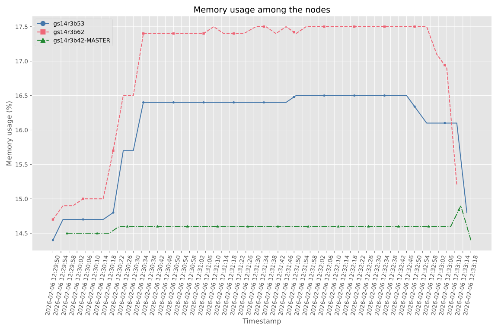

Profiling tool
====================

When the provenance is enabled, the profiling tool is automatically activated. This tool collects the information about the CPU and memory usage during the execution of the application. 

The profiling tool implements a fallback mechanism that allows to use different technologies based on the architecture of the machine. By default, it uses ``psutil``, which is a cross-platform library for retrieving information of the system utilization in Python. If on the machine it is not installed, the profiling tool will try to use ``top`` command, which is available on most Unix-like operating systems. Finally, for some legacy systems, such as `Nord 4 <https://www.bsc.es/supportkc/docs/Nord4/overview/>`_, the previous tools may not work properly, so the profiling tool will use a ``cgroup``-based approach to collect the performance information. The selection of the right tool for the right architecture can be configured in the ``profiler_config.json`` file, which is located in the COMPSs installation directory ``compss/runtime/scripts/system/profiling/profiler_config.json``. By default this is the content of the file:

.. code-block:: json

    {
        "psutil": [
            "mn5",
            "darwin",
            "linux"
        ],
        "top": [
            "mn5",
            "darwin",
            "linux"
        ],
        "cgroup": [
            "mn5",
            "nord4"
        ]
    }

The profiling tool generates the ``csv`` files in a new folder called ``stats/`` of the log directory (see Section :ref:`Sections/03_Execution/01_Local:Logs`
for more details on where to locate these logs). Here, the user can find a ``csv`` file correspondent to every node involved in the execution of the application, which contains the CPU and memory usage information of the tasks executed in that node. A ``csv`` example is the following:

.. code-block:: csv

    CPU,MEM,BYTE_SENT,BYTE_RECV,BYTE_READ_DISK,BYTE_WRITE_DISK,TIME_READ_DISK,TIME_WRITE_DISK,TIME
    0.2,15.0,95183,98705,0,20480,0,0,2026-01-09 11:01:03
    0.2,15.0,318053,322674,0,20480,0,0,2026-01-09 11:01:08
    0.2,15.0,32282,38744,0,16384,0,0,2026-01-09 11:01:13
    0.2,15.0,38690,43424,0,4096,0,0,2026-01-09 11:01:18
    5.0,15.8,2869504,4889920,0,45056,0,1,2026-01-09 11:01:23
    94.0,17.5,3593340,980947,2826240,1003520,12,0,2026-01-09 11:01:28
    100,17.5,23196,28816,151552,127741952,29,899,2026-01-09 11:01:33
    100,17.5,279244,82911,0,9789440,0,14,2026-01-09 11:01:38
    100,17.5,76262,39312,0,36864,0,0,2026-01-09 11:01:43

Every record of the ``csv`` file represents a snapshot of the resource usage at a certain moment of the execution. The interval between snapshots is determined by the ``COMPSS_PROFILING_INTERVAL`` environment variable, which by default is set to **5 seconds**. 

.. TIP::
    The user can export the value of ``COMPSS_PROFILING_INTERVAL`` environment variable to a higher value to reduce the profiling overhead, based on the needs of the application and the system. The information collected in these files is used to generate the resource usage plots that are included in the provenance crate. In the ``stats/`` folder, the user can also find a file called ``stats.json``, which contains the main statistics of the resource usage of the environment and tasks in json format. 

Finally, in the ``stats/`` folder, the Workflow Provenance uses the ``csv`` file to generate the plots of the resource usage of CPU and memory of the application during its execution. These plots are generated in ``svg`` format and they are generated in the ``stats/plots`` folder. These plots are included in the RO-Crate and can be found in the ``profiling/`` folder of the crate. In this directory the user can find a folder for every node, which contains the plots of the CPU and memory usage of the tasks executed in that node. Also, when more than one node is involved in the execution, CPU and memory usage plots aggregated for all the nodes are included. Here is an example of the aggregated CPU and memory usage plots:

.. figure:: ../Figures/Profiling_CPU.png
    :name: CPU usage plot
    :align: center
    :alt: CPU usage plot
    :scale: 75%

    CPU usage plot

    Memory usage plot