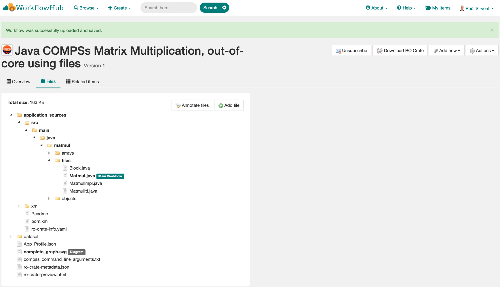
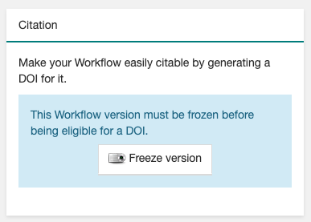
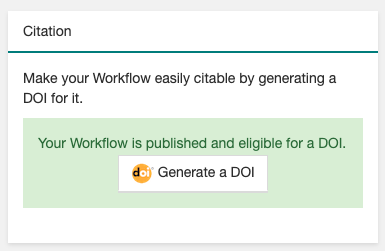

Publish at WorkflowHub
======================

.. _publish_wfhub:

Publish and cite your results
-----------------------------

Once the provenance metadata for your COMPSs application has been generated, you have the possibility of publishing
your results (i.e. both the workflow and the workflow run) in `WorkflowHub <https://workflowhub.eu/>`_, the FAIR
workflow registry, where a DOI can be generated and used as a persistent identifier to cite your experiment in a
scientific paper. Detailed documentation on how to use the WorkflowHub web
site can be found in their `Documentation <https://about.workflowhub.eu/docs/>`_ section.

The steps to achieve the publication of a COMPSs execution are:

- Pack the resulting crate sub-directory (i.e. ``COMPSs_RO-Crate_[timestamp]/``) in a zip file. The ``ro-crate-metadata.json``
  file must be at the root level of this zip file. Example:

.. code-block:: console

    $ cd COMPSs_RO-Crate_20250514_153121/
    $ zip -r ~/Desktop/crate.zip *

- `Login <https://workflowhub.eu/login?return_to=%2Fsignup>`_ or `create an account <https://workflowhub.eu/signup>`_
  in the WorfklowHub registry. You can use your GitHub credentials to easily log in.

- Before being able to contribute workflows to the registry, you need to join a WorkflowHub Team. You can either create
  your own team, or join an existing one, as shown in the following Figure. For testing purposes, you can join the
  `COMPSs Tutorials <https://workflowhub.eu/projects/223>`_ team.

.. figure:: ./Figures/JoinOrCreate.jpg
   :name: Join or Create a Team at WorkflowHub
   :alt: Join or Create
   :align: center
   :width: 90.0%

   Join or Create a Team at WorkflowHub

- Once you belong to a Team, you will be able to use the big ``Contribute`` button at the WorkflowHub home page.

    - Alternatively, the menu ``Create`` at the top of the web page can be used, selecting ``Workflow``.

- Select the third tab ``Upload/Import Workflow RO-Crate`` tab, ``Local file``, and browse your computer to select the zip file
  prepared previously. Click ``Register``.

- Review that the information automatically obtained from the workflow provenance is correct.

    - Select the ``Teams`` that this workflow will belong to (mandatory).
    - Select the visibility and teams' permissions for your workflow in the ``Sharing`` section (for both general public, and for the WorkflowHub Teams where this workflow will be added).
    - Click ``Register`` again.

.. WARNING::

    WorkflowHub Teams may have default sharing policies defined when they are created. Thus, when linking your
    workflow to a team, you can select if you want to apply the Team's default policy or not.

.. TIP::

    The crate (i.e. folder ``COMPSs_RO-Crate_[timestamp]/``) can also be uploaded to GitHub, and then imported from
    WorkflowHub using the second tab option ``Import Git Repository``. See an example here: https://workflowhub.eu/workflows/1076

After these steps, the main summary page of your workflow will be shown, where three main tabs can be selected
(see https://doi.org/10.48546/workflowhub.workflow.484.1 to check out an example directly at WorkflowHub):

- **Overview**: where the workflow type, workflow description, and workflow diagram are shown.

.. figure:: ./Figures/WH_overview.png
   :name: Overview
   :alt: Overview
   :align: center
   :width: 90.0%

   Overview tab information

- **Files**: where you can browse the uploaded content of the crate (see :ref:`resulting-crate`
  for details on the crate structure).

   Files tab information

- **Related items**: where you can find any other entities related to this workflow (i.e. ``People``, ``Spaces``,
  ``Teams``, ``Publications``, ``Presentations``, ``Collections``, ...)

At this point, before freezing and generating a DOI for the workflow, you may consider if **remote datasets** need
to be added to the workflow. See Section :ref:`large_dataset_wfhub`
for a detailed guide on how to do that.

If everything is correct, the next step is to **generate a DOI** (i.e. a persistent identifier) for your workflow.
The necessary steps to achieve this are:

.. WARNING::

    Before generating a DOI for your workflow results, **make sure everything uploaded is correct and in its final version**,
    since a DOI is ment to be a permanent reference, and, once generated, erasing a DOI is not easy.

- Freeze your workflow version, either from the ``Overview`` tab, ``Citation`` box, ``Freeze version`` button, or from the
  ``Actions`` menu, ``Freeze version``.

   Freeze button in the Citation box

- Once frozen, a new ``Generate a DOI`` button will appear in the ``Citation`` box. This can be also found in the
  ``Actions`` menu, ``Generate a DOI``. Finish the generation by clicking ``Mint DOI``.

   Generate a DOI button in the Citation box

- The final generated DOI for the workflow results can be found in the ``Citation`` box. The format of the citation
  can be changed from the dropdown menu inside the box, which has a large number of styles available. One of the most
  commonly used is the ``BibTeX generic citation style``.

.. figure:: ./Figures/WH_citation.png
   :name: Citation
   :alt: Citation
   :align: center
   :width: 25.0%

   Resulting text in the Citation box, to be used in bibliography

.. WARNING::

    If no Authors are provided in the YAML configuration file, it won't be possible to generate a DOI.
    See Section :ref:`yaml-config`

You can see some examples on previous published workflows:

- **Java COMPSs Matrix Multiplication (using COMPSs 3.2):** https://doi.org/10.48546/workflowhub.workflow.484.1

- **PyCOMPSs WordCount Example (using COMPSs 3.3):** https://doi.org/10.48546/workflowhub.workflow.635.1

- **PyCOMPSs Matrix Multiplication, out-of-core using files. Example using DIRECTORY parameters executed at laptop,
  data persistence True (using COMPSs 3.3.1):** https://doi.org/10.48546/workflowhub.workflow.1046.1

.. TIP::

    When writing the ``description`` term of your YAML configuration file (see Section :ref:`yaml-config`)
    you can use Markdown language to get a fancier description in WorkflowHub. You can find a Markdown language guide
    `in this site <https://simplemde.com/markdown-guide>`_, and an example on how to write it at the YAML configuration files
    of the previously provided examples (i.e. in their included ``ro-crate-info.yaml`` files).

New version of a Workflow
^^^^^^^^^^^^^^^^^^^^^^^^^

It is obvious that, as the development of a specific workflow progresses, new versions of what conceptually is the same workflow will be
created. In addition, even if the code remains unchanged, new execution results of the application may also want to be shared
for including them in papers as DOI references (i.e. same algorithm, using different inputs, generating different outputs).
Therefore, a recommended practice is to use the ``New version`` feature of the WorkflowHub portal, so the same workflow
page will contain different versions / executions of the same COMPSs application. This is achieved using:

- Step 1: Update the code of your COMPSs application, and generate a new run with previous or new results, activating workflow
  provenance generation.
- Step 2: Open the previously existing workflow at WorkflowHub.
- Step 3: Select ``Actions`` -> ``New version``.

    - If your workflow was imported from RO-Crate, select ``Upload/Import Workflow RO-Crate`` to upload workflow provenance.
    - If you imported the workflow from GitHub, once you have committed your changes / results, select ``Import Git Repository``.
      This action will import the latest commit in the repository to WorkflowHub.

Once these steps are finished, the ``Overview`` tab of the workflow will show a new entry at the bottom of the page, in
the ``Version History`` section of the page. An example can be seen here: https://workflowhub.eu/workflows/1076

.. TIP::

    Notice that DOIs can be generated for each of the different versions of the uploaded workflow, so all of them can
    be properly shared.

.. _large_dataset_wfhub:

Large datasets
^^^^^^^^^^^^^^

As mentioned earlier, whenever a workflow uses or produces a very large dataset, it should not include the data as persistent
(i.e. directly included in the crate), but reference it as a **remote dataset**. A rule of thumb is that, if the workflow
includes less than ~100 MB of files, it can be included as a persistent dataset. However, for cases where data assets
are hundreds of MBs or even several GBs, the remote dataset option must be used. Some external repositories commonly
used to share large datasets are:

- `Zenodo <https://zenodo.org/>`_ up to 50 GB per dataset.
- `FigShare <https://figshare.com/>`_ up to 5 TB per dataset.

.. WARNING::

    The addition of remote datasets must be done before freezing the workflow version and generating the DOI for citation.

- Step 1: execute your application adding manually as ``inputs`` or ``outputs`` the remote dataset reference (i.e. an
  https URL reference such as ``https://zenodo.org/records/10782431/files/lysozyme_datasets.zip``), and most likely with
  ``data_persitence: False``.

    - See Section :ref:`yaml-config`.

- Step 2: upload the workflow run in WorkflowHub.

    - As described in previous Section :ref:`publish_wfhub`.

- Step 3: add the remote file as a reference in the workflow files:

    - ``Files`` tab -> ``Add File`` -> ``Remote URL``.
    - Paste the remote URL (e.g. ``https://zenodo.org/records/10782431/files/lysozyme_datasets.zip``).
    - Specify the file path in the crate (e.g. ``remote_dataset/lysozyme_datasets.zip``).

Examples on workflows with remote datasets can be found at:

- **PyCOMPSs Probabilistic Tsunami Forecast (PTF) - Boumerdes-2003 earthquake and tsunami test-case:** https://doi.org/10.48546/workflowhub.workflow.779.1

- **PyCOMPSs Probabilistic Tsunami Forecast (PTF) - Kos-Bodrum 2017 earthquake and tsunami test-case:** https://doi.org/10.48546/workflowhub.workflow.781.1

.. TIP::

    While the most common choice should be to use ``data_persistence: False`` to avoid including any datasets, a mix of
    automatically included small datasets, and remote large datasets can be achieved when using ``data_persistence: True``.
    In any case, if data is persisted, the content of the ``dataset/`` folder in the crate cannot be modified (i.e. remove
    files), because that would invalidate the correctness of the metadata.

Manual re-execution
-------------------

While the standard way to re-execute a previously published workflow would be through the Reproducibility Service (see Section :ref:`rs`),
we here detail how to manually achieve the re-execution of a COMPSs workflow available at WorkflowHub (e.g. to **reproduce** the results: submit the same
workflow with the same inputs, and obtain the same results). To illustrate this process, we will use different examples:

- **PyCOMPSs: Matrix multiplication with data persistence:** https://doi.org/10.48546/workflowhub.workflow.838.1

- **PyCOMPSs: Matrix multiplication without data persistence:** https://doi.org/10.48546/workflowhub.workflow.839.1

- **Java COMPSs Matrix Multiplication, out-of-core using files, reproducible example, data persistence True:** https://doi.org/10.48546/workflowhub.workflow.1086.1

- **Java COMPSs Matrix Multiplication, out-of-core using files, reproducible example, data persistence False, MareNostrum V:** https://doi.org/10.48546/workflowhub.workflow.1088.1

.. tab-set::

  .. tab-item:: WITH data persistence

    When ``data_persistence`` is enabled, input and output datasets required or generated by the workflow are included in the crate.
    This makes reproducibility easier, but it is only convenient when datasets are of a reasonable size (e.g. tenths of MBs).

    .. tab-set::

      .. tab-item:: PyCOMPSs application

        - Click the DOI link of the workflow you want to re-execute (e.g. https://doi.org/10.48546/workflowhub.workflow.838.1).
        - Click on ``Download RO-Crate``. The crate of the corresponding workflow will be downloaded to your machine (e.g. in ``~/Downloads/``).
        - Move and unzip the file in a new folder.

        .. code-block:: console

          $ mkdir ~/workflow-838-1/
          $ mv ~/Downloads/workflow-838-1.crate.zip ~/workflow-838-1/
          $ cd ~/workflow-838-1/
          $ unzip workflow-838-1.crate.zip

        - Create a ``new_outputs/`` folder to avoid overwriting the included ``dataset/outputs/``.

        .. code-block:: console

          $ mkdir new_outputs/

        - Inspect the submission command, and re-execute the application adapting the flags and parameters. Avoid overwriting the original outputs of the application.

        .. code-block:: console

          $ cat compss_submission_command_line.txt
            runcompss --provenance=matmul_reproducibility.yaml --python_interpreter=/Users/rsirvent/.pyenv/shims/python3 --cpu_affinity=disabled src/matmul_files.py inputs/ outputs/
          $ runcompss application_sources/src/matmul_files.py dataset/inputs/ new_outputs/

        - Once the execution is finished, compare the new outputs generated with the outputs included in the crate.

        .. code-block:: console

          $ diff new_outputs/ dataset/outputs/

      .. tab-item:: Java COMPSs application

        - Click the DOI link of the workflow you want to re-execute (e.g. https://doi.org/10.48546/workflowhub.workflow.1086.1).
        - Click on ``Download RO-Crate``. The crate of the corresponding workflow will be downloaded to your machine (e.g. in ``~/Downloads/``).
        - Move and unzip the file in a new folder.

        .. code-block:: console

          $ mkdir ~/workflow-1086-1/
          $ mv ~/Downloads/workflow-684-1.crate.zip ~/workflow-1086-1/
          $ cd ~/workflow-1086-1/
          $ unzip workflow-1086-1.crate.zip

        - Create a ``new_outputs/`` folder to avoid overwriting the included ``dataset/outputs/``.

        .. code-block:: console

          $ mkdir new_outputs/

        - If needed, generate a ``jar`` file from the ``.java`` source files. Either using Maven:

        .. code-block:: console

          $ cd application_sources/
          $ mvn clean package
          $ cd ..

        or compiling the sources with ``javac``.

        .. code-block:: console

          $ cd application_sources/
          $ find * -name "*.java" > sources.txt
          $ javac -d bin/ @sources.txt
          $ jar cf jar/matmul.jar bin/
          $ cd ..

        - Inspect the submission command, and re-execute the application adapting the flags and parameters. Avoid overwriting the original outputs of the application.

        .. code-block:: console

          $ cat compss_submission_command_line.txt
            runcompss --python_interpreter=/Users/rsirvent/.pyenv/shims/python3 --cpu_affinity=disabled --provenance=java_matmul_reproducible.yaml --classpath=jar/matmul.jar matmul.files.Matmul inputs/ outputs/
          $ runcompss --classpath=application_sources/jar/matmul.jar matmul.files.Matmul dataset/inputs/ new_outputs/

        - Once the execution is finished, compare the new outputs generated with the outputs included in the crate.

        .. code-block:: console

          $ diff new_outputs/ dataset/outputs/

  .. tab-item:: WITHOUT data persistence

    When ``data_persistence`` is disabled, the common use case is to re-execute the application in the exact same machine where
    the original run was made (e.g. a supercomputer or a cluster). This may be required for reproducing applications that need
    specific hardware to run, or to avoid moving large datasets to a different machine by using the machine where data
    is located.

    .. tab-set::

      .. tab-item:: PyCOMPSs application

        - Click the DOI link of the workflow you want to re-execute (e.g. https://doi.org/10.48546/workflowhub.workflow.839.1).
        - Click on ``Download RO-Crate``. The crate of the corresponding workflow will be downloaded to your machine (e.g. in ``~/Downloads/``).
        - Move and unzip the file in a new folder in the target machine (i.e. the machine where the workflow was executed
          or where the datasets are accessible from, e.g. ``glogin2.bsc.es``).

        .. code-block:: console

          $ scp ~/Downloads/workflow-839-1.crate.zip bsc019057@glogin2.bsc.es:~
            workflow-839-1.crate.zip                            100%   19KB 333.4KB/s   00:00
          $ ssh bsc019057@glogin2.bsc.es

          $ mkdir ~/workflow-839-1/
          $ mv ~/workflow-839-1.crate.zip ~/workflow-839-1/
          $ cd ~/workflow-839-1/
          $ unzip workflow-839-1.crate.zip

        - Create a new_outputs/ folder for your re-execution results.

        .. code-block:: console

          $ mkdir new_outputs/

        - Inspect the submission command to understand the flags passed to submit the application.

        .. code-block:: console

          $ cat compss_submission_command_line.txt
            enqueue_compss --provenance=matmul_reproducibility_no_persistence.yaml --project_name=bsc19 --qos=gp_debug --num_nodes=1 --job_name=matmul-DP --lang=python --log_level=debug --summary --exec_time=5 /home/bsc/bsc019057/WorkflowHub/reproducible_matmul/src/matmul_files.py inputs/ outputs/

        - Inspect the ``ro-crate-metadata.json`` metadata file.

            - Search for the ``CreateAction`` section, ``object`` term to see location of input files.
            - Search for the ``CreateAction`` section, ``result`` term to see location of output files.
            - You need to ensure you have the corresponding permissions to access the specified locations.
            - Optionally, you can verify the ``contentSize`` and ``dateModified`` for each input file, to ensure the
              files in the path referenced match the ones used when the application was originally run.

        - Re-execute the application adapting the flags and parameters to submit the application. Avoid overwriting the original outputs of the application.

        .. code-block:: console

          $ enqueue_compss --project_name=bsc19 --qos=gp_debug --num_nodes=1 --job_name=matmul-DP --lang=python --log_level=debug --summary --exec_time=5 $(pwd)/application_sources/src/matmul_files.py /gpfs/home/bsc/bsc019057/WorkflowHub/reproducible_matmul/inputs/ new_outputs/

        - Once the execution is finished, compare the new outputs generated with the outputs referenced in the crate.

        .. code-block:: console

          $ diff new_outputs/ /gpfs/home/bsc/bsc019057/WorkflowHub/reproducible_matmul/outputs/

      .. tab-item:: Java COMPSs application

        - Click the DOI link of the workflow you want to re-execute (e.g. https://doi.org/10.48546/workflowhub.workflow.1088.1).
        - Click on ``Download RO-Crate``. The crate of the corresponding workflow will be downloaded to your machine (e.g. in ``~/Downloads/``).
        - Move and unzip the file in a new folder in the target machine (i.e. the machine where the workflow was executed
          or where the datasets are accessible from, e.g. ``glogin2.bsc.es``).

        .. code-block:: console

          $ scp ~/Downloads/workflow-1088-1.crate.zip bsc019057@glogin2.bsc.es:~
            workflow-1088-1.crate.zip                            100%   19KB 333.4KB/s   00:00
          $ ssh bsc019057@glogin2.bsc.es

          $ mkdir ~/workflow-1088-1/
          $ mv ~/workflow-1088-1.crate.zip ~/workflow-1088-1/
          $ cd ~/workflow-1088-1/
          $ unzip workflow-1088-1.crate.zip

        - Create a new_outputs/ folder for your re-execution results.

        .. code-block:: console

          $ mkdir new_outputs/

        - If needed, generate a ``jar`` file from the ``.java`` source files. Either using Maven:

        .. code-block:: console

          $ cd application_sources/
          $ mvn clean package
          $ cd ..

        or compiling the sources with ``javac``.

        .. code-block:: console

          $ cd application_sources/
          $ find * -name "*.java" > sources.txt
          $ javac -d bin/ @sources.txt
          $ jar cf jar/matmul.jar bin/
          $ cd ..

        - Inspect the submission command to understand the flags passed to submit the application.

        .. code-block:: console

          $ cat compss_submission_command_line.txt
            enqueue_compss --provenance=java_matmul_reproducible_mn5.yaml --project_name=bsc19 --qos=gp_debug --num_nodes=1 --job_name=matmul --summary --exec_time=5 --classpath=jar/matmul.jar matmul.files.Matmul /gpfs/projects/bsc19/bsc019057/matmul_java_datasets/inputs/ /gpfs/projects/bsc19/bsc019057/matmul_java_datasets/outputs/

        - Inspect the ``ro-crate-metadata.json`` metadata file.

            - Search for the ``CreateAction`` section, ``object`` term to see location of input files.
            - Search for the ``CreateAction`` section, ``result`` term to see location of output files.
            - You need to ensure you have the corresponding permissions to access the specified locations.
            - Optionally, you can verify the ``contentSize`` and ``dateModified`` for each input file, to ensure the
              files in the path referenced match the ones used when the application was originally run.

        - Re-execute the application adapting the flags and parameters to submit the application. Avoid overwriting the original outputs of the application.

        .. code-block:: console

          $ enqueue_compss --project_name=bsc19 --qos=gp_debug --num_nodes=1 --job_name=matmul --summary --exec_time=5 --classpath=application_sources/jar/matmul.jar matmul.files.Matmul /gpfs/projects/bsc19/bsc019057/matmul_java_datasets/inputs/ new_outputs/

        - Once the execution is finished, compare the new outputs generated with the outputs referenced in the crate.

        .. code-block:: console

          $ diff new_outputs/ /gpfs/projects/bsc19/bsc019057/matmul_java_datasets/outputs

  .. tab-item:: With REMOTE datasets

    For large or extremely large datasets (e.g. hundreds of MBs, several GBs), the most convenient way is to upload them
    to a public dataset repository (e.g. `Zenodo <https://zenodo.org/>`_) and reference them as ``remote datasets`` related
    to the workflow. See Section :ref:`large_dataset_wfhub`
    to learn this process more in detail.

    Remote datasets may be commonly included in applications that set ``data_persistence`` to ``False``. The idea is that the files
    that were not originally persisted are packaged and uploaded to an external repository. However, remote files can also be added
    manually using the WorkflowHub interface for any kind of application, thus not only applications without persisted data
    may include remote datasets. Because of that, we will describe here the preliminary step of downloading and preparing
    remote datasets, but the execution process will be the one described in the corresponding tab in this table (i.e. with
    or without data persistence, using PyCOMPSs or Java COMPSs).

    - Click the DOI link of the workflow you want to re-execute (e.g. **Lysozyme in Water with REMOTE DATASET**).
    - Download any remote dataset referenced as such:

      - Browse the ``Files`` tab of the workflow in WorkflowHub.
    - Place the datasets in your preferred location, for instance a sub-folder ``remote_dataset/`` inside the downloaded workflow
      folder.
    - Go to your corresponding reexecution tab, and follow the instructions. Fix any path needed with the newly
      ``remote_dataset/`` created path.

.. WARNING::

    If the application includes hardcoded paths, they will need to be manually modified in the code. However, in most
    of the cases, if the application has relative paths hardcoded, the ``application_sources/`` folder could be used as
    the working directory (i.e. the folder from where you run your COMPSs application).

As seen in the examples above, the steps to reproduce a COMPSs workflow vary depending if the
crate package downloaded includes the datasets (i.e. it
has a ``dataset/`` sub-folder). This is achieved when ``data_persistence`` is set to ``True`` in the
YAML configuration file. Thus, the data preparation step will change depending on the availability of the dataset
needed for the workflow execution. In addition, any external third party software used in the application (e.g.
simulators, auxiliary libraries and packages, ...), must be made available in the new execution environment. For
simplicity, we will not go into the details on how to deal with this environment preparation and we will assume the
target environment has all software dependencies ready to be used.

While the reproducibility process of a COMPSs workflow is quite manual at the moment, we plan to automate it using
workflow provenance with the COMPSs CLI (see Section :ref:`Sections/04_Ecosystem/09_CLI:|:magic_wand:| CLI`). Anyway, reproducing
executions in the same machine as the one in the published run (e.g. using the same supercomputer) should be quite straightforward,
since the metadata may include references to the location of the inputs and outputs of the workflow. Therefore, the only
requirement to reproduce a run would be to have access granted to the location where the inputs are.
