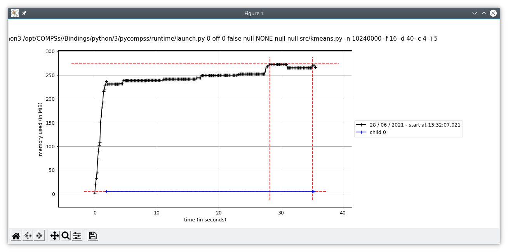

Memory Profiling
================

COMPSs also provides a mechanism to show the memory usage over time when
running Python applications.
This is particularly useful when memory issues happen
(e.g. memory exhausted -- causing the application crash), or performance
analysis (e.g. problem size scalability).

To this end, the ``runcompss`` and ``enqueue_compss`` commands provide the
``--python_memory_profile`` flag, which provides a set of files (one per node used
in the application execution) where the memory used during the execution is
recorded at the end of the application.
They are generated in the same folder where the execution has been launched.

.. IMPORTANT::

    The ``memory-profiler`` package is mandatory in order to use the
    ``--python_memory_profile`` flag.

    It can be easily installed with pip:

    .. code-block:: console

        $ python -m pip install memory-profiler --user

.. TIP::

   If you want to store from the memory profiler in a different folder, export
   the ``COMPSS_WORKER_PROFILE_PATH`` with the destination path:

   .. code-block:: console

       $ export COMPSS_WORKER_PROFILE_PATH=/path/to/destination

When ``--python_memory_profile`` is included, a file with name
``mprofile_<DATE_TIME>.dat`` is generated for the master memory profiling,
while for the workers they are named ``<WORKER_NODE_NAME>.dat``.
These files can be displayed with the ``mprof`` tool:

.. code-block:: console

    $ mprof plot <FILE>.dat

   mprof plot example

Advanced profiling
------------------

For a more fine grained memory profiling and analysing the **workers** memory
usage, PyCOMPSs provides the ``@profile`` decorator. This decorator is able
to display the memory usage per line of the code.
It can be imported from the PyCOMPSs functions module:

.. code-block:: python

    from pycompss.functions.profile import profile

This decorator can be placed over any function:

Over the ``@task`` decorator (or over the decorator stack of a task)
  This will display the memory usage in the master (through standard output).

Under the ``@task`` decorator:
  This will display the memory used by the actual task in the worker.
  The memory usage will be shown through standard output, so it is mandatory
  to enable debug (``--log_level=debug``) and check the job output file from
  ``.COMPSs/<app_folder>/jobs/``.

Over a non task function:
  Will display the memory usage of the function in the master (through standard output).

By default, the ``@profile`` decorator reports the memory usage line by line:

.. code-block:: text

   Line #    Mem usage    Increment  Occurrences   Line Contents
   =============================================================
        7     53.3 MiB     53.3 MiB           1   @task(returns=1)
        8                                         @profile()
        9                                         def increment(value):
       10     61.0 MiB      7.7 MiB           1       a = [1] * (10 ** 6)
       11     83.7 MiB     22.7 MiB           1       b = [2] * (value * 10 ** 6)
       12    312.6 MiB    228.9 MiB           1       c = [3] * (value * 10 ** 7)
       13    289.9 MiB    -22.7 MiB           1       del b
       14    289.9 MiB      0.0 MiB           1       return value + 1

But this information can be reduce to show only the peak memory usage of
each task by setting ``full_report=False`` in the ``@profile`` decorator
(``@profile(full_report=False)``). More specifically, the profiling information
reported will be a one-liner per task showing: the file that contains the task,
the task name and the peak memory usage.

.. code-block:: text

    /path/to/increment.py increment 312.6 MiB

.. TIP::

    It is possible to redirect the profiling output to a single file by
    exporting the ``COMPSS_PROFILING_FILE`` environment variable with the
    path to the destination file.

    Please, remind that this variable needs to be available in the worker
    if the ``@profile`` decorator is used to report the memory usage of the
    tasks. Consequently, consider the usage of the ``--env_script`` flag
    in the ``runcompss`` command defining a script that exports the
    ``COMPSS_PROFILING_FILE`` in order to make it available in the workers
    in local executions.
