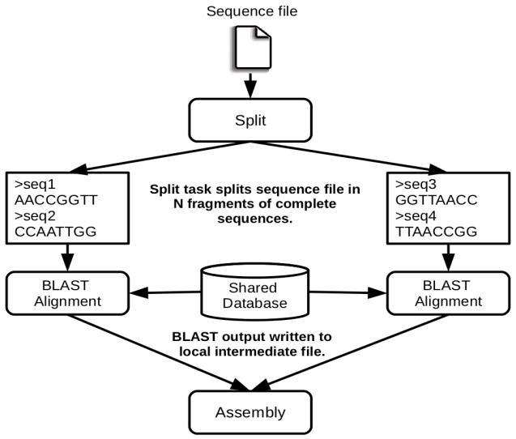

BLAST Workflow
**************

BLAST is a widely-used bioinformatics tool for comparing primary
biological sequence information, such as the amino-acid sequences of
different proteins or the nucleotides of DNA sequences with sequence
databases, identifying sequences that resemble the query sequence above
a certain threshold. The work performed by the COMPSs Blast workflow is
computationally intensive and embarrassingly parallel.

   The COMPSs Blast workflow

The workflow describes the three blocks of the workflow implemented in
the **Split**, **Align** and **Assembly** methods. The second one is the
only method that is chosen to be executed remotely, so it is the unique
method defined in the interface file. The **Split** method chops the
query sequences file in N fragments, **Align** compares each sequence
fragment against the database by means of the Blast binary, and
**Assembly** combines all intermediate files into a single result file.

This application uses a database that will be on the shared disk space
avoiding transferring the entire database (which can be large) between
the virtual machines.

.. code-block:: console

    compss@bsc:~$ cp ~/workspace/blast/package/Blast.tar.gz /home/compss/
    compss@bsc:~$ tar xzf Blast.tar.gz

The command line to execute the workflow:

.. code-block:: console

    compss@bsc:~$ runcompss blast.Blast <debug> \
                                        <bin_location> \
                                        <database_file> \
                                        <sequences_file> \
                                        <frag_number> \
                                        <tmpdir> \
                                        <output_file>

Where:

-  **debug**: The debug flag of the application (true or false).

-  **bin_location**: Path of the Blast binary.

-  **database_file**: Path of database file; the shared disk
   **/sharedDisk/** is suggested to avoid big data transfers.

-  **sequences_file**: Path of sequences file.

-  **frag_number**: Number of fragments of the original sequence file,
   this number determines the number of parallel Align tasks.

-  **tmpdir**: Temporary directory (**/home/compss/tmp/**).

-  **output_file**: Path of the result file.

Example:

.. code-block:: console

    compss@bsc:~$ runcompss blast.Blast true \
                            /home/compss/tutorial_apps/java/blast/binary/blastall \
                            /sharedDisk/Blast/databases/swissprot/swissprot \
                            /sharedDisk/Blast/sequences/sargasso_test.fasta \
                            4 \
                            /tmp/ \
                            /home/compss/out.txt
