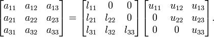

Sparse LU decomposition
***********************

SparseLU multiplies two matrices using the factorization method of LU
decomposition, which factorizes a matrix as a product of a lower
triangular matrix and an upper one.

   Sparse LU decomposition

The matrix is divided into N x N blocks on where 4 types of operations
will be applied modifying the blocks: **lu0**, **fwd**, **bdiv** and
**bmod**. These four operations are implemented in four methods that are
selected as the tasks that will be executed remotely. In order to run
the application the matrix dimension has to be provided.

As the previous application, the sparseLU is provided in three different
implementations that only differ on the way of storing the matrix:

#. **sparseLU.objects.SparseLU** Matrix stored by means of objects

#. **sparseLU.files.SparseLU** Matrix stored in files

#. **sparseLU.arrays.SparseLU** Matrix represented by an array

Thus, the commands needed to execute the application is with each
implementation are:

.. code-block:: console

    compss@bsc:~$ cd tutorial_apps/java/sparseLU/jar/
    compss@bsc:~/tutorial_apps/java/sparseLU/jar$ runcompss sparseLU.objects.SparseLU 16 8
    [  INFO] Using default execution type: compss
    [  INFO] Using default location for project file: /opt/COMPSs/Runtime/configuration/xml/projects/default_project.xml
    [  INFO] Using default location for resources file: /opt/COMPSs/Runtime/configuration/xml/resources/default_resources.xml

    ----------------- Executing sparseLU.objects.SparseLU --------------------------

    WARNING: COMPSs Properties file is null. Setting default values
    [(1221)    API]  -  Starting COMPSs Runtime v<version>
    [LOG] Running with the following parameters:
    [LOG]  - Matrix Size: 16
    [LOG]  - Block Size:  8
    [LOG] Initializing Matrix
    [LOG] Computing SparseLU algorithm on A
    [LOG] Main program finished.
    [(13642)    API]  -  Execution Finished

    ------------------------------------------------------------

.. code-block:: console

    compss@bsc:~$ cd tutorial_apps/java/sparseLU/jar/
    compss@bsc:~/tutorial_apps/java/sparseLU/jar$ runcompss sparseLU.files.SparseLU 4 8
    [  INFO] Using default execution type: compss
    [  INFO] Using default location for project file: /opt/COMPSs/Runtime/configuration/xml/projects/default_project.xml
    [  INFO] Using default location for resources file: /opt/COMPSs/Runtime/configuration/xml/resources/default_resources.xml

    ----------------- Executing sparseLU.files.SparseLU --------------------------

    WARNING: COMPSs Properties file is null. Setting default values
    [(1082)    API]  -  Starting COMPSs Runtime v<version>
    [LOG] Running with the following parameters:
    [LOG]  - Matrix Size: 16
    [LOG]  - Block Size:  8
    [LOG] Initializing Matrix
    [LOG] Computing SparseLU algorithm on A
    [LOG] Main program finished.
    [(13605)    API]  -  Execution Finished

    ------------------------------------------------------------

.. code-block:: console

    compss@bsc:~$ cd tutorial_apps/java/sparseLU/jar/
    compss@bsc:~/tutorial_apps/java/sparseLU/jar$ runcompss sparseLU.arrays.SparseLU 8 8
    [  INFO] Using default execution type: compss
    [  INFO] Using default location for project file: /opt/COMPSs/Runtime/configuration/xml/projects/default_project.xml
    [  INFO] Using default location for resources file: /opt/COMPSs/Runtime/configuration/xml/resources/default_resources.xml

    ----------------- Executing sparseLU.arrays.SparseLU --------------------------

    WARNING: COMPSs Properties file is null. Setting default values
    [(1082)    API]  -  Starting COMPSs Runtime v<version>
    [LOG] Running with the following parameters:
    [LOG]  - Matrix Size: 16
    [LOG]  - Block Size:  8
    [LOG] Initializing Matrix
    [LOG] Computing SparseLU algorithm on A
    [LOG] Main program finished.
    [(13605)    API]  -  Execution Finished

    ------------------------------------------------------------
