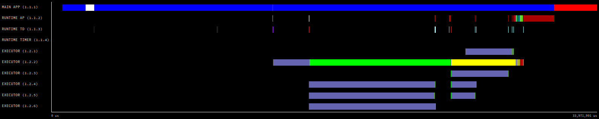

COMPSs applications tracing
===========================

COMPSs Runtime has a built-in instrumentation system to generate
post-execution tracefiles of the applications' execution. The tracefiles
contain different events representing the COMPSs master state, the
tasks' execution state, and the data transfers (transfers' information
is only available when using NIO adaptor), and are useful for both
visual and numerical performance analysis and diagnosis. The
instrumentation process essentially intercepts and logs different
events, so it adds overhead to the execution time of the application.

The tracing system uses Extrae [1]_ to generate tracefiles of the execution
that, in turn, can be visualized with Paraver [2]_. Both tools are developed
and maintained by the Performance Tools team of the BSC and are
available on its web page
http://www.bsc.es/computer-sciences/performance-tools.

Extrae keeps track of the events in an intermediate format file (with *.mpit*
extension). At the end of the execution, all these files can bee gathered
and merged with Extrae's ``mpi2prv`` command to create the final tracefile, a Paraver
format file (.prv). See the :ref:`Sections/05_Tools/03_Tracing/02_Visualization:Visualization`
Section for further information about the Paraver tool.

For further information about Extrae, please visit the following site:
http://www.bsc.es/computer-science/extrae

When tracing is enabled, Extrae instruments computing threads and some resources
management operations to provide information about tasks' executions, data
transfers, and, if PAPI is available (see
:ref:`Sections/05_Tools/03_Tracing/05_Papi:PAPI: Hardware Counters` for more info),
hardware counters.

Activate Tracing
----------------
By default, the tracing is disabled for any COMPSs execution. However,
all the scripts that start a COMPSs execution (``runcompss``,
``enqueue_compss`` and ``compss_agent_start`` ) have an option to
activate the tracing for that the execution. The user activates it by
providing one of the following arguments to the corresponding script.

-  ``-t``

-  ``--tracing``

-  ``--tracing=true``

Example:

.. code-block:: console

    $ runcompss --tracing application_name application_args

When tracing is activated, Extrae generates additional output to help
the user ensure that instrumentation is turned on and working without
issues. This output contains diverse information about the tracing
system as shown in the following example and its running.
Extrae version used (``VERSION`` will be replaced by the
actual number during executions), the XML configuration file used
(``/opt/COMPSs/Runtime/configuration/xml/tracing/extrae_basic.xml``
-- if using python, the ``extrae_python_worker.xml`` located in the
same folder will be used in the workers), the amount of threads
instrumented (objects through 1.1.1 to 1.2.7), available hardware
counters (``PAPI_TOT_INS (0x80000032)`` ... ``PAPI_L3_TCM (0x80000008)``
) or the name of the generated tracefile (``./trace/``
``kmeans.py_compss.prv``). When debug is activated, the log of each
worker also contains the Extrae initialization information.

.. TIP::
    The application used for this example is
    :ref:`Sections/07_Sample_Applications/02_Python/03_KMeans:KMeans`.
    The trace generated by this execution is depicted in :numref:`basic_trace`.

.. code-block:: console

    $ runcompss --tracing --generate_trace=false kmeans.py -n 102400000 -f 8 -d 3 -c 8 -i 10
    [ INFO ] Inferred PYTHON language
    [ INFO ] Using default location for project file: /opt/COMPSs//Runtime/configuration/xml/projects/default_project.xml
    [ INFO ] Using default location for resources file: /opt/COMPSs//Runtime/configuration/xml/resources/default_resources.xml
    [ INFO ] Using default execution type: compss

    ----------------- Executing kmeans.py --------------------------

    Welcome to Extrae 3.8.3
    Extrae: Parsing the configuration file (/home/user/.COMPSs/kmeans.py_01/cfgfiles/extrae.xml) begins
    Extrae: Warning! <trace> tag has no <home> property defined.
    Extrae: Generating intermediate files for Paraver traces.
    Extrae: PAPI domain set to ALL for HWC set 1
    Extrae: HWC set 1 contains following counters < PAPI_TOT_INS (0x80000032) PAPI_TOT_CYC (0x8000003b) PAPI_L1_DCM (0x80000000) PAPI_L2_DCM (0x80000002) PAPI_L3_TCM (0x80000008) PAPI_BR_INS (0x80000037) PAPI_BR_MSP (0x8000002e) RESOURCE_STALLS (0x4000002e) > - never changes
    Extrae: Tracing buffer can hold 100000 events
    Extrae: Circular buffer disabled.
    Extrae: Warning! <input-output> tag will be ignored. This library does not support instrumenting I/O calls.
    Extrae: Dynamic memory instrumentation is disabled.
    Extrae: Basic I/O memory instrumentation is disabled.
    Extrae: System calls instrumentation is disabled.
    Extrae: Parsing the configuration file (/home/user/.COMPSs/kmeans.py_01/cfgfiles/extrae.xml) has ended
    Extrae: Intermediate traces will be stored in /home/user/.COMPSs/kmeans.py_01/trace
    Extrae: Tracing mode is set to: Detail.
    Extrae: Error! Hardware counter PAPI_TOT_INS (0x80000032) cannot be added in set 1 (task 0, thread 0)
    Extrae: Error! Hardware counter PAPI_TOT_CYC (0x8000003b) cannot be added in set 1 (task 0, thread 0)
    Extrae: Error! Hardware counter PAPI_L1_DCM (0x80000000) cannot be added in set 1 (task 0, thread 0)
    Extrae: Error! Hardware counter PAPI_L2_DCM (0x80000002) cannot be added in set 1 (task 0, thread 0)
    Extrae: Error! Hardware counter PAPI_L3_TCM (0x80000008) cannot be added in set 1 (task 0, thread 0)
    Extrae: Error! Hardware counter PAPI_BR_INS (0x80000037) cannot be added in set 1 (task 0, thread 0)
    Extrae: Error! Hardware counter PAPI_BR_MSP (0x8000002e) cannot be added in set 1 (task 0, thread 0)
    Extrae: Error! Hardware counter RESOURCE_STALLS (0x4000002e) cannot be added in set 1 (task 0, thread 0)
    Extrae: Error when setting domain for eventset 1
    Extrae: PAPI_start failed to start eventset 1 on thread 0! (error = -1)
    Extrae: Successfully initiated with 1 tasks and 1 threads

    WARNING: COMPSs Properties file is null. Setting default values
    [(732)    API]  -  Starting COMPSs Runtime v2.10.rc2205 (build 20220525-1503.re74c11cbc6c248a6c5745edaf3a4a47c2c9d0c7e)
    Generation/Load done
    Starting kmeans
    Doing iteration #1/10
    Doing iteration #2/10
    Doing iteration #3/10
    Doing iteration #4/10
    Doing iteration #5/10
    Doing iteration #6/10
    Doing iteration #7/10
    Doing iteration #8/10
    Doing iteration #9/10
    Doing iteration #10/10
    Ending kmeans
    -----------------------------------------
    -------------- RESULTS ------------------
    -----------------------------------------
    Initialization time: 114.582741
    KMeans time: 140.148499
    Total time: 254.731240
    -----------------------------------------
    CENTRES:
    [[0.69757475 0.74511351 0.48157611]
     [0.54683653 0.20274669 0.2117475 ]
     [0.24194863 0.74448094 0.75633981]
     [0.21854362 0.67072938 0.23273541]
     [0.77272546 0.68522249 0.16245965]
     [0.22683962 0.23359743 0.67203863]
     [0.75351606 0.73746265 0.83339847]
     [0.75838884 0.23805883 0.71538748]]
    -----------------------------------------
    Extrae: Intermediate raw trace file created : /home/user/.COMPSs/kmeans.py_01/trace/set-0/TRACE@bsccs189.0000082523000000000002.mpit
    Extrae: Intermediate raw trace file created : /home/user/.COMPSs/kmeans.py_01/trace/set-0/TRACE@bsccs189.0000082523000000000001.mpit
    Extrae: Intermediate raw trace file created : /home/user/.COMPSs/kmeans.py_01/trace/set-0/TRACE@bsccs189.0000082523000000000003.mpit
    Extrae: Intermediate raw trace file created : /home/user/.COMPSs/kmeans.py_01/trace/set-0/TRACE@bsccs189.0000082523000000000004.mpit
    Extrae: Intermediate raw trace file created : /home/user/.COMPSs/kmeans.py_01/trace/set-0/TRACE@bsccs189.0000082523000000000000.mpit
    Extrae: Intermediate raw sym file created : /home/user/.COMPSs/kmeans.py_01/trace/set-0/TRACE@bsccs189.0000082523000000000000.sym
    Extrae: Deallocating memory.
    Extrae: Application has ended. Tracing has been terminated.
    [(259804)    API]  -  Execution Finished
    Dismissing tracing package removal. Traces were requested but not generated.

    ------------------------------------------------------------

Trace Generation
----------------
At the end of a COMPSs application execution, each node involved in the
execution generates a package file containing all the output generated by
Extrae; the master node gathers all these files in the trace subfolder of
the log directory of the execution.

After that, an additional step to merge the Extrae output in these packages
and merge them into as single trace that can be opened with Paraver. This
step can be done by the scripts launching COMPSs right after the execution
of the application. To enable/disable this procedure, COMPSs scripts have
three additional options to control the trace generation. The ``generate_trace``
option allows to enable disable this process. By default, it is enabled in
``runcompss`` and ``compss_agent_start`` and disabled in ``enqueue_compss``
executions. Through the ``--trace_label`` option, the user set the name of
the resulting trace; and , with the ``--delete_trace_packages``, the user
specifies to the script whether the packages generated by the runtime should
be kept after completing the trace generation or if they must be deleted.

For those executions where the trace was not generated by the execution script,
COMPSs provides the ``compss_gentrace`` and ``enqueue_compss_gentrace`` scripts.
As with ``runcompss`` and ``enqueue_compss``, the ``compss_gentrace`` script
merges the trace while ``enqueue_compss_gentrace`` enqueues a job on a queue
system that will do the same.

.. code-block:: console

    ~/.COMPSs/kmeans.py_01/trace$ compss_gentrace --trace_name=trace
    [ INFO ] COMPSs Paraver trace generation.
    Traces:
      Input folder: /home/user/.COMPSs/kmeans.py_01/trace
      Output folder: /home/user/.COMPSs/kmeans.py_01/trace
      Trace name: trace

    Options:
      Custom threads: true
      Keep packages: false

    Logging:
      Level: off
      Folder: /home/user/.COMPSs/kmeans.py_01/trace
    merger: Output trace format is: Paraver
    merger: Extrae 3.8.3
    mpi2prv: Assigned nodes < bsccs189 >
    mpi2prv: Assigned size per processor < <1 Mbyte >
    mpi2prv: File /tmp/tmp.b9P6UYmIJ5/python/set-0/TRACE@bsccs189.0000082745000000000000.mpit is object 1.1.1 on node bsccs189 assigned to processor 0
    mpi2prv: File /tmp/tmp.b9P6UYmIJ5/python/set-0/TRACE@bsccs189.0000082747000000000000.mpit is object 2.1.1 on node bsccs189 assigned to processor 0
    mpi2prv: File /tmp/tmp.b9P6UYmIJ5/python/set-0/TRACE@bsccs189.0000082748000000000000.mpit is object 3.1.1 on node bsccs189 assigned to processor 0
    mpi2prv: File /tmp/tmp.b9P6UYmIJ5/python/set-0/TRACE@bsccs189.0000082749000000000000.mpit is object 4.1.1 on node bsccs189 assigned to processor 0
    mpi2prv: File /tmp/tmp.b9P6UYmIJ5/python/set-0/TRACE@bsccs189.0000082750000000000000.mpit is object 5.1.1 on node bsccs189 assigned to processor 0
    mpi2prv: A total of 8 symbols were imported from /tmp/tmp.b9P6UYmIJ5/python/TRACE.sym file
    mpi2prv: 0 function symbols imported
    mpi2prv: 8 HWC counter descriptions imported
    mpi2prv: Checking for target directory existence... exists, ok!
    mpi2prv: Warning: Couldn't open /tmp/COMPSsWorker/f83c9da7-74c1-4703-b0d5-c980823b6422/localhost/python/.libseqtrace-subprocess.so for reading, addresses may not be translated.
    mpi2prv: Warning: Couldn't open /tmp/COMPSsWorker/f83c9da7-74c1-4703-b0d5-c980823b6422/localhost/python/.libseqtrace-subprocess.so for reading, addresses may not be translated.
    mpi2prv: Warning: Couldn't open /tmp/COMPSsWorker/f83c9da7-74c1-4703-b0d5-c980823b6422/localhost/python/.libseqtrace-subprocess.so for reading, addresses may not be translated.
    mpi2prv: Warning: Couldn't open /tmp/COMPSsWorker/f83c9da7-74c1-4703-b0d5-c980823b6422/localhost/python/.libseqtrace-subprocess.so for reading, addresses may not be translated.
    mpi2prv: Selected output trace format is Paraver
    mpi2prv: Stored trace format is Paraver
    mpi2prv: Searching synchronization points... done
    mpi2prv: Time Synchronization disabled.
    mpi2prv: Circular buffer enabled at tracing time? NO
    mpi2prv: Parsing intermediate files
    mpi2prv: Progress 1 of 2 ... 5% 10% 15% 20% 25% 30% 35% 40% 45% 50% 55% 60% 65% 70% 75% 80% 85% 90% 95% done
    mpi2prv: Processor 0 succeeded to translate its assigned files
    mpi2prv: Elapsed time translating files: 0 hours 0 minutes 0 seconds
    mpi2prv: Elapsed time sorting addresses: 0 hours 0 minutes 0 seconds
    mpi2prv: Generating tracefile (intermediate buffers of 1342156 events)
             This process can take a while. Please, be patient.
    mpi2prv: Progress 2 of 2 ... 5% 10% 15% 20% 25% 30% 35% 40% 45% 50% 55% 60% 65% 70% 75% 80% 85% 90% 95% done
    mpi2prv: Warning! Clock accuracy seems to be in microseconds instead of nanoseconds.
    mpi2prv: Elapsed time merge step: 0 hours 0 minutes 0 seconds
    mpi2prv: Resulting tracefile occupies 144040 bytes
    mpi2prv: Removing temporal files... done
    mpi2prv: Elapsed time removing temporal files: 0 hours 0 minutes 0 seconds
    mpi2prv: Congratulations! /home/user/.COMPSs/kmeans.py_01/trace/python//1_python_trace.prv has been generated.
    merger: Output trace format is: Paraver
    merger: Extrae 3.8.3
    mpi2prv: Assigned nodes < bsccs189 >
    mpi2prv: Assigned size per processor < 1 Mbytes >
    mpi2prv: File /home/user/.COMPSs/kmeans.py_01/trace/set-0/TRACE@bsccs189.0000082523000000000000.mpit is object 1.1.1 on node bsccs189 assigned to processor 0
    mpi2prv: File /home/user/.COMPSs/kmeans.py_01/trace/set-0/TRACE@bsccs189.0000082523000000000001.mpit is object 1.1.2 on node bsccs189 assigned to processor 0
    mpi2prv: File /home/user/.COMPSs/kmeans.py_01/trace/set-0/TRACE@bsccs189.0000082523000000000002.mpit is object 1.1.3 on node bsccs189 assigned to processor 0
    mpi2prv: File /home/user/.COMPSs/kmeans.py_01/trace/set-0/TRACE@bsccs189.0000082523000000000003.mpit is object 1.1.4 on node bsccs189 assigned to processor 0
    mpi2prv: File /home/user/.COMPSs/kmeans.py_01/trace/set-0/TRACE@bsccs189.0000082523000000000004.mpit is object 1.1.5 on node bsccs189 assigned to processor 0
    mpi2prv: File set-0/TRACE@bsccs189.0000082653000001000000.mpit is object 1.2.1 on node bsccs189 assigned to processor 0
    mpi2prv: File set-0/TRACE@bsccs189.0000082653000001000001.mpit is object 1.2.2 on node bsccs189 assigned to processor 0
    mpi2prv: File set-0/TRACE@bsccs189.0000082653000001000002.mpit is object 1.2.3 on node bsccs189 assigned to processor 0
    mpi2prv: File set-0/TRACE@bsccs189.0000082653000001000003.mpit is object 1.2.4 on node bsccs189 assigned to processor 0
    mpi2prv: File set-0/TRACE@bsccs189.0000082653000001000004.mpit is object 1.2.5 on node bsccs189 assigned to processor 0
    mpi2prv: File set-0/TRACE@bsccs189.0000082653000001000005.mpit is object 1.2.6 on node bsccs189 assigned to processor 0
    mpi2prv: A total of 8 symbols were imported from /home/user/.COMPSs/kmeans.py_01/trace/TRACE.sym file
    mpi2prv: 0 function symbols imported
    mpi2prv: 8 HWC counter descriptions imported
    mpi2prv: Checking for target directory existence... exists, ok!
    mpi2prv: Selected output trace format is Paraver
    mpi2prv: Stored trace format is Paraver
    mpi2prv: Searching synchronization points... done
    mpi2prv: Time Synchronization disabled.
    mpi2prv: Circular buffer enabled at tracing time? NO
    mpi2prv: Parsing intermediate files
    mpi2prv: Progress 1 of 2 ... 5% 10% 15% 20% 25% 30% 35% 40% 45% 50% 55% 60% 65% 70% 75% 80% 85% 90% 95% done
    mpi2prv: Processor 0 succeeded to translate its assigned files
    mpi2prv: Elapsed time translating files: 0 hours 0 minutes 0 seconds
    mpi2prv: Elapsed time sorting addresses: 0 hours 0 minutes 0 seconds
    mpi2prv: Generating tracefile (intermediate buffers of 610071 events)
             This process can take a while. Please, be patient.
    mpi2prv: Progress 2 of 2 ... 5% 10% 15% 20% 25% 30% 35% 40% 45% 50% 55% 60% 65% 70% 75% 80% 85% 90% 95% done
    mpi2prv: Warning! Clock accuracy seems to be in microseconds instead of nanoseconds.
    mpi2prv: Elapsed time merge step: 0 hours 0 minutes 0 seconds
    mpi2prv: Resulting tracefile occupies 327879 bytes
    mpi2prv: Removing temporal files... done
    mpi2prv: Elapsed time removing temporal files: 0 hours 0 minutes 0 seconds
    mpi2prv: Congratulations! /home/user/.COMPSs/kmeans.py_01/trace//trace.prv has been generated.

Information Available
---------------------

Tracefiles contain three kinds of information:

Events
    Marking diverse situations such as the runtime start, tasks'
    execution or synchronization points.

Communications
    Showing the transfers and requests of the parameters needed by
    COMPSs tasks.

Hardware counters
    Of the execution obtained with Performance API (see
    :ref:`Sections/05_Tools/03_Tracing/05_Papi:PAPI: Hardware Counters`)

Custom Threads
--------------
Although Paraver traces illustrate the events, communications and HW
counters for each Thread and processor in the system, it is hard to
identify what thread is performing each operation.

Currently, traces can show these threads:

- Master node / Agent

   - Application's main thread

   - Access Processor

   - Task Dispatcher

   - File System (High priority)

   - File System (Low priority)

   - Timer

   - Wall_Clock

   - Threads available for computing (executors)

- Worker node

   - Worker main thread

   - Worker File System (High priority)

   - Worker File System (Low priority)

   - Worker timer

   - Threads available for computing (executors)

To ease the identification of each thread, all trace-generating
scripts allow an option (``custom_threads``) that triggers a post-processing
of the resulting trace to identify which thread corresponds to each
runtime component and sort them as runtime thread or threads available
to run tasks (executors). By default, this additional step is enabled in all
trace-generating scripts.

Trace Example
-------------

:numref:`basic_trace` is a tracefile generated by the execution of a
k-means clustering algorithm. Each timeline contains information of a
different resource, and each event's name is on the legend. Depending on
the number of computing threads specified for each worker, the number of
timelines varies. However the following threads are always shown:

Master - Thread 1.1.1
    This timeline shows the actions performed by the main thread of
    the COMPSs application

Access Processor - Thread 1.1.2
    All the events related to the tasks' parameters management, such
    as dependencies or transfers are shown in this thread.

Task Dispatcher - Thread 1.1.3
    Shows information about the state and scheduling of the tasks to
    be executed.

Worker X Master - Thread X.1.1
    This thread is the master of each worker and handles the computing
    resources and transfers. It is repeated for each available
    resource. All data events of the worker, such as requests,
    transfers and receives are marked on this timeline (when using the
    appropriate configurations).

Worker X File system - Thread X.1.2
    This thread manages the synchronous file system operations (e.g. copy
    file) performed by the worker.

Worker X Timer - Thread X.1.3
    This thread manages the cancellation of the tasks when the wall-clock
    limit is reached.

Worker X Executor Y - Thread X.2.Y
    Shows the actual tasks execution information and is repeated as
    many times as computing threads has the worker X

.. figure:: ./Figures/basic.png
   :name: basic_trace
   :alt: tracefile for a k-means algorithm visualized with compss_runtime.cfg
   :align: center
   :width: 60.0%

   tracefile for a k-means algorithm visualized with compss_runtime.cfg

Trace for Agents
----------------------
Applications deployed as COMPSs Agents can also be traced. Unlike master-worker
COMPSs applications, where the trace contains the events for all the nodes
within the infrastructure, with the Agents approach, each Agent generates its
own trace.

To activate the tracing  the ``compss_agent_start`` command allows the ``-t``,
``--tracing`` and ``--tracing=<level>`` options with the same meaning as with
the master-worker approach. For example:

.. code-block:: console

    $ compss_agent_start \
        --hostname="COMPSsWorker01" \
        --pythonpath="~/python/path" \
        --log_dir="~/agent1/log" \
        --rest_port="46101" \
        --comm_port="46102" \
        -d -t \
        --project="~/project.xml" \
        --resources="~/resources.xml"&

Upon the completion of an operation submitted with the ``--stop`` flag, the agent stops
and generates a trace folder within his log folder, containing the prv, pcf and row files.

.. code-block:: console

    $ compss_agent_call_operation" \
      --lang="PYTHON" \
      --master_node="127.0.0.1" \
      --master_port="46101" \
      --method_name="kmeans" \
      --stop \
      "kmeans"

.. figure:: ./Figures/one_agent_trace.png
   :name: one_agent_trace
   :alt: Trace of one agent
   :align: center
   :width: 60.0%

When multiple agents are involved in an application's execution, the stop command must be forwarded to all the other agents with the ``--forward`` parameter.

.. code-block:: console

    $ compss_agent_call_operation" \
        --lang="PYTHON" \
        --master_node="127.0.0.1" \
        --master_port="46101" \
        --method_name="kmeans" \
        --stop \
        --forward_to="COMPSsWorker02:46201;COMPSsWorker03:46301" \
        "kmeans"

Upon the completion of the last operation submitted and the shutdown of all involved agents, all agent will have generated their own individual trace.

.. figure:: ./Figures/multiple_agent_trace_ag3.png
   :name: multiple_agent_trace_ag3
   :alt: Trace of 3 agents
   :align: center
   :width: 60.0%

In order to merge this traces the script ``compss_agent_merge_traces`` can be used.
The script takes as parameters the folders of the log dirs of the agents with the traces to merge.

.. code-block:: console

    $ compss_agent_merge_traces -h
    /opt/COMPSs/Runtime/scripts/user/compss_agent_merge_traces <options> <log_dir1> <log_dir2> <log_dir3> ...

    Merges the traces of the specified agents into a new trace created at the directory <output_dir>

    options:
            -h/--help                                       shows this message

            --output_dir=<output_dir>                       the directory where to store the merged traces

            -f/--force_override                             overrides output_dir if it already exists without asking

            --result_trace_name=<result_trace_name>         the name of the generated trace

Usage example:

.. code-block:: console

    $ compss_agent_merge_traces \
        --result_trace_name=merged_kmeans \
        ~/.COMPSs/1agent_python3_01/agent1 \
        ~/.COMPSs/1agent_python3_01/agent2 \
        ~/.COMPSs/1agent_python3_01/agent3

The script will put the merged trace in the specified ``output_dir`` or in the current directory inside a folder named ``compss_agent_merge_traces`` by default

Custom Installation and Configuration
-------------------------------------

Custom Extrae
~~~~~~~~~~~~~

COMPSs uses the environment variable ``EXTRAE_HOME`` to get the
reference to its installation directory (by default:
``/opt/COMPSs/Dependencies/extrae`` ). However, if the variable is
already defined once the runtime is started, COMPSs will not override
it. User can take advantage of this fact in order to use custom Extrae
installations. Just set the ``EXTRAE_HOME`` environment variable to
the directory where your custom package is, and make sure that it is
also set for the worker's environment.
Be aware that using different Extrae packages can break the runtime
and executions so you may change it at your own risk.

Custom Configuration file
~~~~~~~~~~~~~~~~~~~~~~~~~

COMPSs offers the possibility to specify an Extrae custom configuration
file in order to harness all the tracing capabilities further tailoring
which information about the execution is displayed (except for Python workers).
To do so just indicate the file as an execution parameter as follows:

``--extrae_config_file=/path/to/config/file.xml``

In addition, there is also the possibility to specify an Extrae custom
configuration file for the Python workers as follows:

``--extrae_config_file_python=/path/to/config/file_python.xml``

The configuration files must be in a shared disk between all COMPSs
workers because a file's copy is not distributed among them, just the
path to that file.

.. TIP::

    The default configuration files are in:

    * ``${COMPSS_HOME}/Runtime/configuration/xml/tracing/extrae_basic.xml``
    * ``${COMPSS_HOME}/Runtime/configuration/xml/tracing/extrae_python_worker.xml`` (when using Python)

    The can be taken as base for customization.

Two aspects that configuration files allow to customize are the directories
that Extrae will use as working directory and where it leaves the final mpit
files. By default, COMPSs configures Extrae to leave the traces within the
trace sub-directory within the execution log directory. to replicate this
behavior, custom configuration files can use the ``{{TRACE_OUTPUT_DIR}}``
term on the temporal-directory and final-directory attributes of the
configuration. At runtime, this term will be replaced by the actual log dir.

.. [1]
   For more information: https://www.bsc.es/computer-sciences/extrae

.. [2]
   For more information: https://www.bsc.es/computer-sciences/performance-tools/paraver
