Analysis
========

This section gives some tips to analyze a COMPSs trace from two
different points of view: graphically and numerically.

Graphical Analysis
------------------

The main concept is that computational events, the task events in this
case, must be well distributed among all workers to have a good
parallelism, and the duration of task events should be also balanced,
this means, the duration of computational bursts.

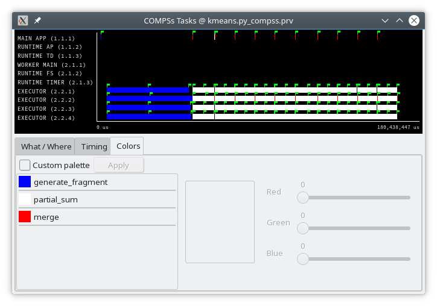

   Basic trace view of a Kmeans execution.

In the previous trace view, all the tasks of type "generate_fragment" in
dark blue appear to be well distributed among the four workers, each worker
executor executes two "generate_fragment" tasks.

Next, a set of "partial_sum" tasks, coloured in white, are distributed across
the four workers. In particular, eight "partial_sum" tasks are executed per
kmeans iteration, so each worker executor executes two "partial_sum" tasks
per iteration. This trace shows the execution of ten iterations.
Note that all "partial_sum" tasks are very similar in time. This means
that there is not much variability among them, and consequently not imbalance.

Finally, there is a "merge" task at the end of each iteration (coloured in red).
This task is executed by one of the worker executors, and gathers the result
from the previous eight "partial_sum" tasks.
This task can be better displayed thanks to zoom.

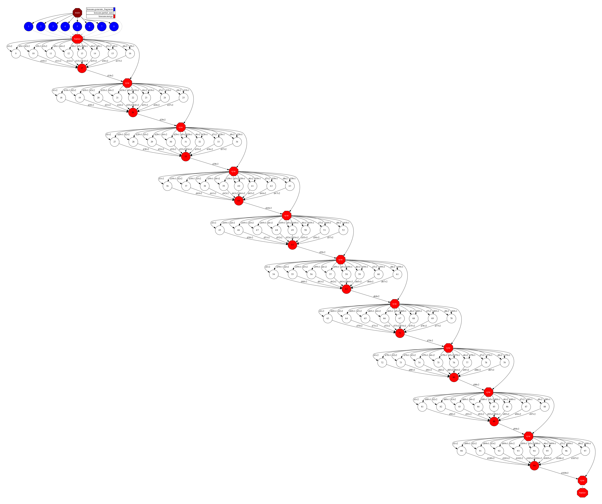

   Data dependencies graph of a Kmeans execution.

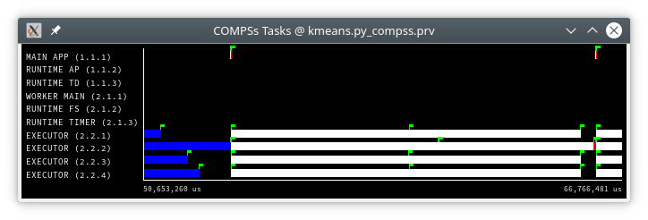

   Zoomed in view of a Kmeans execution (first iteration).

Numerical Analysis
------------------

Here we analize the Kmeans trace numerically.

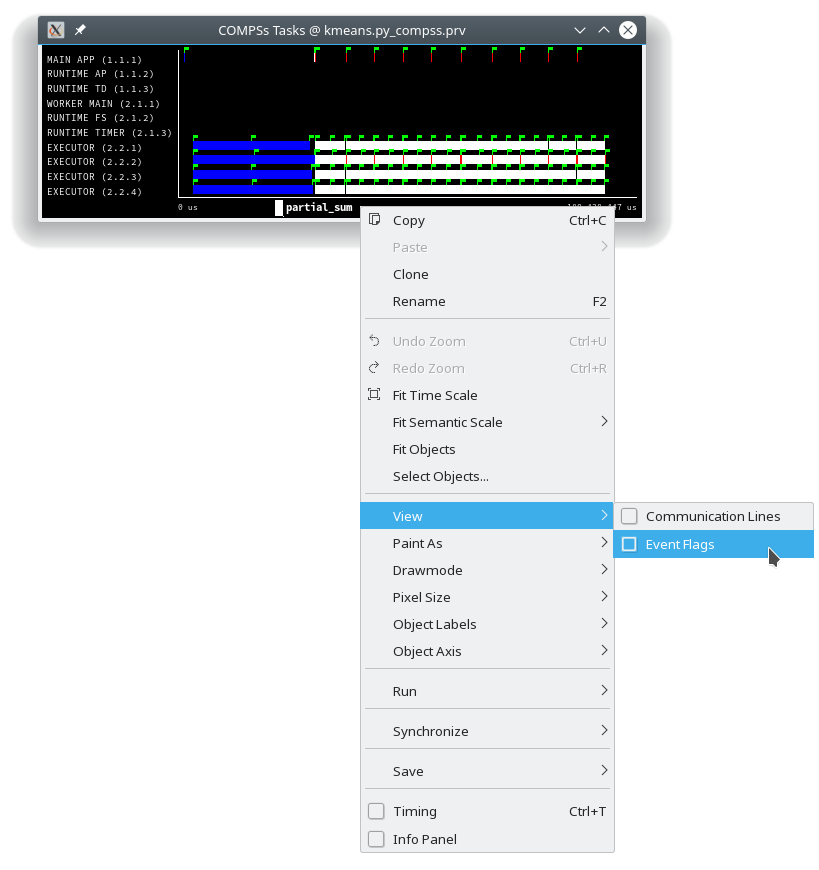

   Original sample trace of a Kmeans execution to be analyzed

Paraver offers the possibility of having different histograms of the
trace events. Click the "New Histogram" button in the main window and
accept the default options in the "New Histogram" window that will
appear.

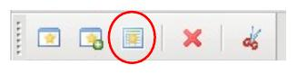

   Paraver Menu - New Histogram

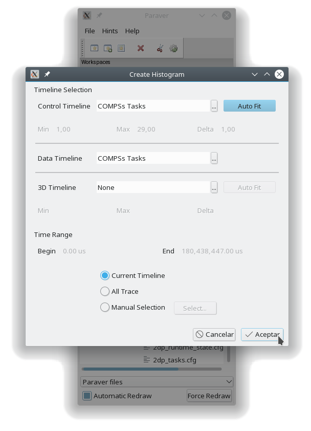

   Histogram configuration (Accept default values)

After that, the following table is shown. In this case for each worker,
the time spent executing each type of task is shown in gradient from light green
for lower values to dark-blue for higher ones.
The values coresponding to the colours and task names can be shown by clicking
in the gray magnifying glass button. And the task corresponding to each task
column can also be shown by clicking in the colur bars button.

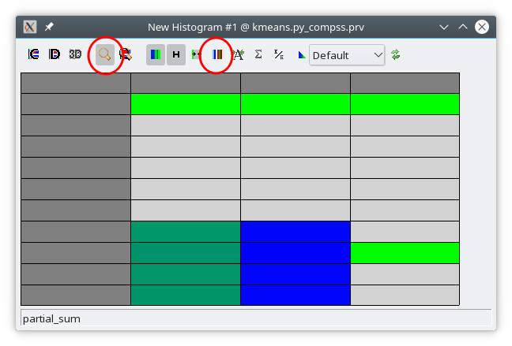

   Kmeans histogram corresponding to previous trace

The time spent executing each type of task is shown, and task names appear
in the same color than in the trace view. The color of the cells in a row
is kept, conforming a color based histogram.

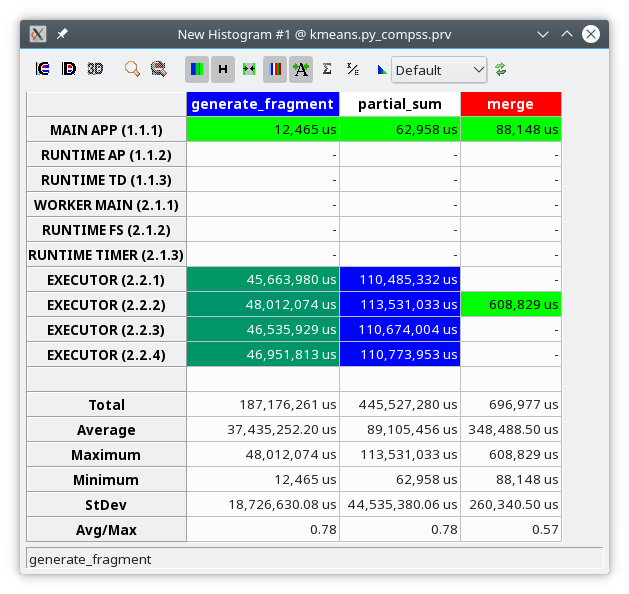

   Kmeans numerical histogram corresponding to previous trace

The previous table also gives, at the end of each column, some extra
statistical information for each type of tasks (as the total, average,
maximum or minimum values, etc.).

In the window properties of the main window (Button
:numref:`14_window_properties`), it is possible to change
the semantic of the statistics to see other factors rather than the
time, for example, the number of bursts (:numref:`15_select_bursts`).

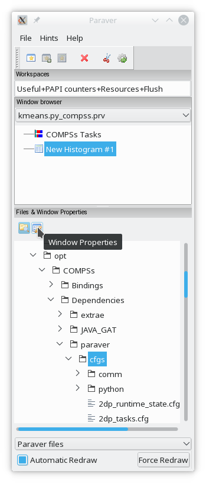

   Paraver window properties button

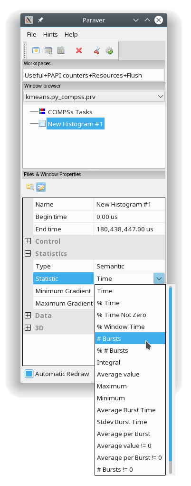

   Paraver histogram options menu

In the same way as before, the following table shows for each worker the
number of bursts for each type of task, this is, the number or tasks
executed of each type. Notice the gradient scale from light-green to
dark-blue changes with the new values.

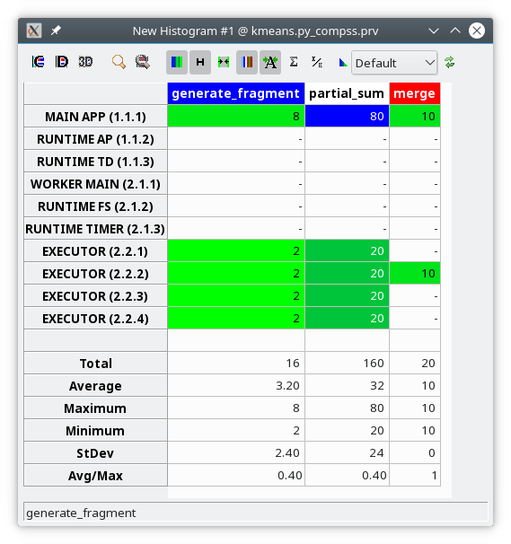

   Kmeans histogram with the number of bursts
