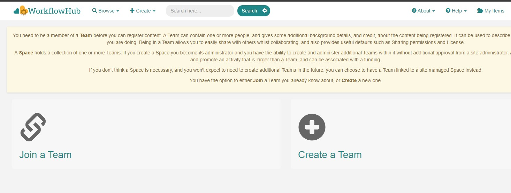
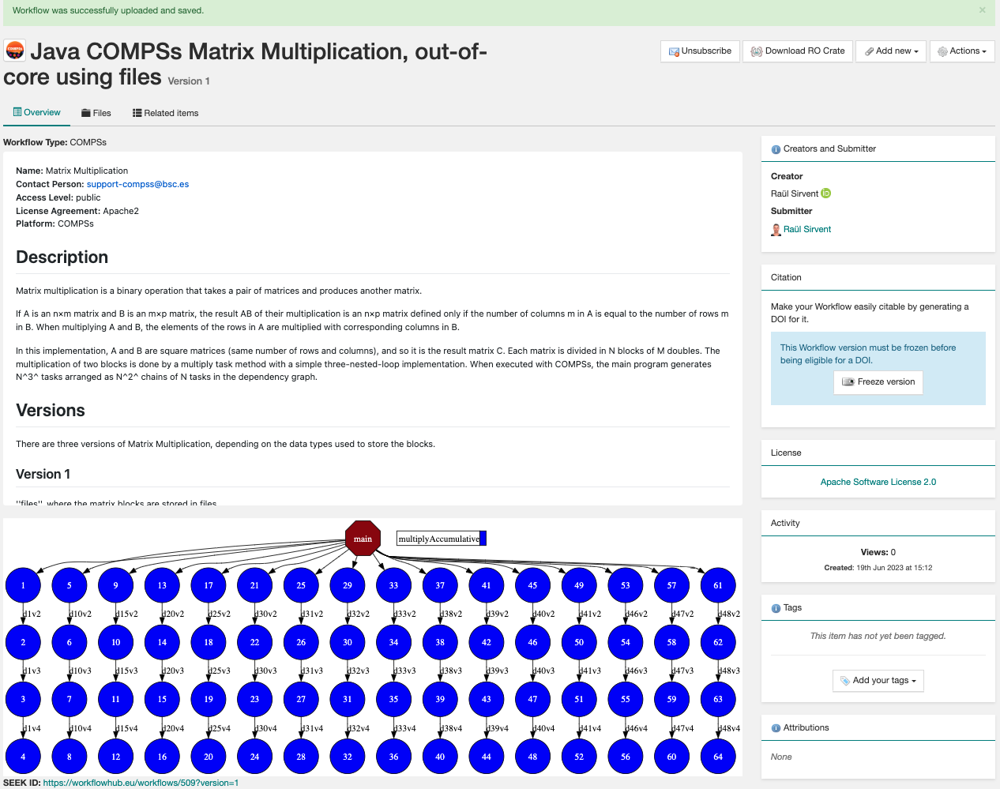
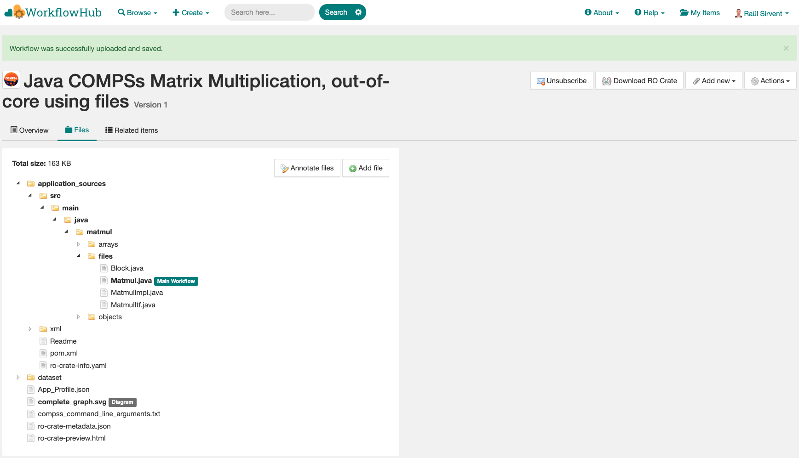
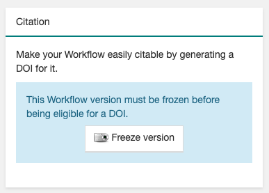
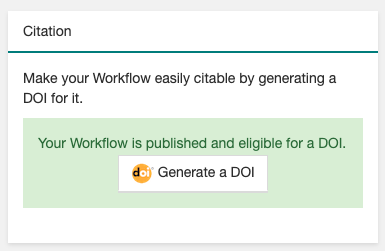
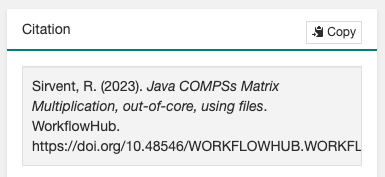

===================
Workflow Provenance
===================

The COMPSs runtime includes the capacity of recording details of the
application's execution as metadata, also known as *Workflow Provenance*. With workflow provenance, you are able to share
not only your workflow application (i.e. the source code) but also your workflow run (i.e. the datasets used as inputs, the outputs generated as
results, and details on the environment where the application was run). This is supported for both Python
and Java COMPSs applications. More technical details on how Provenance is generated in COMPSs using a lightweight approach
that does not introduce overhead to the workflow execution can be found in the paper:

- `Automatic, Efficient and Scalable Provenance Registration for FAIR HPC Workflows <http://dx.doi.org/10.1109/WORKS56498.2022.00006>`_ (`Slides <https://zenodo.org/record/7701868>`_)

Provenance information can be useful for a number of things, including **Governance, Reproducibility, Replicability, Traceability,
or Knowledge Extraction**, among others.
In our case, we have initially targeted workflow provenance recording to enable users to **publish research results** obtained with COMPSs as
artifacts that can be cited in scientific publications with their corresponding DOI as a persistent identifier.
See Section :ref:`Sections/05_Tools/04_Workflow_Provenance:Publish and cite your results with WorkflowHub` to learn
precisely how to do that. We see a growing number of scientific conferences requesting these reproducible artifacts, such as:

- `The Reproducibility Initiative at the International Conference for High Performance Computing, Networking, Storage, and Analysis (SC) <https://sc24.supercomputing.org/program/papers/reproducibility-initiative/>`_
- `Reproducibility at the International Conference on Parallel Processing (ICPP) <https://icpp2024.org/index.php?option=com_content&view=article&id=4&Itemid=108>`_
- `Call for Artifacts at the International European Conference on Parallel and Distributed Computing (EuroPar) <https://2024.euro-par.org/calls/artifacts/>`_
- `The ACM Special Interest Group on Management of Data (SIGMOD) Reproducibility Award <https://reproducibility.sigmod.org/reports.html>`_
- `Call for Artifacts at USENIX Conference on File and Storage Technologies (FAST) <https://www.usenix.org/conference/fast24/call-for-artifacts>`_
- And many more...

.. TIP::
    A step-by-step guide on how to share your COMPSs execution results in scientific papers can be found
    `here <https://zenodo.org/records/10046567>`_.

When the provenance option is activated, the runtime records every access
to a file or directory specified in the application, as well as its direction (IN,
OUT, INOUT). In addition to this, other information such as the parameters passed as inputs in the command line
that submitted the application, its source files, workflow diagram and task profiling statistics, authors and
their institutions, ... are also stored.
All this information is later used to record the workflow provenance
of your application using the `RO-Crate specification <https://www.researchobject.org/ro-crate/>`_, and with the assistance of
the `ro-crate-py library <https://github.com/ResearchObject/ro-crate-py>`_. RO-Crate is based on
JSON-LD (JavaScript Object Notation for Linked Data), is
much simpler than other standards and tools created to record Provenance, and
that is why it has been adopted in a number of `communities <https://www.researchobject.org/ro-crate/use_cases>`_.
Using RO-Crate to register the execution's information ensures
not only to register correctly the Provenance of a COMPSs application run, but
also compatibility with some existing portals that already embrace
RO-Crate as their core format for representing metadata, such as `WorkflowHub <https://workflowhub.eu/>`_. Our RO-Crate
format is compliant with the `Workflow RO-Crate Profile v1.0 <https://w3id.org/workflowhub/workflow-ro-crate/1.0>`_ and the
`Workflow Run Crate Profile v0.4 <https://w3id.org/ro/wfrun/workflow/0.4>`_.

---------------------
Software dependencies
---------------------

Provenance generation in COMPSs depends on the `ro-crate-py library <https://github.com/ResearchObject/ro-crate-py>`_,
thus, it must be installed before the provenance option can be used. Depending on the target system, different
options are available using ``pip``:

If the installation is in a laptop or machine you manage, you can use the command:

.. code-block:: console

    $ pip install rocrate

If you do not manage the target machine, you can install the library in your own user space using:

.. code-block:: console

    $ pip install rocrate --user

This would typically install the library in ``~/.local/``. Another option is to specify the target directory with:

.. code-block:: console

    $ pip install -t install_path rocrate

Our current implementation needs ``ro-crate-py`` version ``0.9.0`` or higher.

.. WARNING::

    If you are using a BSC cluster (MareNostrum, CTE-POWER, ...), ro-crate-py is already installed for a number of
    python versions at ``/apps/COMPSs/LIBRARIES/``, and COMPSs is configured to use it. Thus, you don't need
    to install ro-crate-py.

-----------------------
YAML configuration file
-----------------------

There are certain pieces of information which must be included when registering the provenance of a workflow that
the COMPSs runtime cannot automatically infer, such as the authors of an application. For specifying all these
fields that are needed to generate an RO-Crate but cannot be automatically obtained, we have created a simple YAML
structure where the user can specify them. By default, a YAML file named ``ro-crate-info.yaml`` will be expected in the
working directory (i.e. where the application is going to be run), but a different YAML file can be used by specifying
it with ``--provenance=my_yaml_file.yaml`` when activating workflow provenance generation.
The YAML file must follow the next template structure (notice later that only one term is mandatory, some other terms
are commonly used, and the rest of terms are for special cases):

.. code-block:: yaml

    COMPSs Workflow Information:
      name: Name of your COMPSs application
      description: Detailed description of your COMPSs application
      license: YourLicense-1.0
      sources: [/absolute_path_to/dir_1/, relative_path_to/dir_2/, main_file.py, relative_path/aux_file_1.py, /abs_path/aux_file_2.py]
      data_persistence: False
      software:
        - name: Software 1 name
          version: 1.1.1
          url: https://software1.org/
        - name: Software 2 name
          version: Software version description 2.2.2
          url: https://software2.org/

      # Optional, less commonly used
      inputs: [/abs_path_to/dir_1, rel_path_to/dir_2, file_1, rel_path/file_2, https://domain.to/file]
      outputs: [/abs_path_to/dir_1, rel_path_to/dir_2, file_1, rel_path/file_2, https://domain.to/file]
      sources_main_file: my_main_file.py

    Authors:
      - name: Author_1 Name
        e-mail: author_1@email.com
        orcid: https://orcid.org/XXXX-XXXX-XXXX-XXXX
        organisation_name: Institution_1 name
        ror: https://ror.org/XXXXXXXXX
      - name: Author_2 Name
        e-mail: author2@email.com
        orcid: https://orcid.org/YYYY-YYYY-YYYY-YYYY
        organisation_name: Institution_2 name
        ror: https://ror.org/YYYYYYYYY

    Agent:
      name: Name
      e-mail: agent@email.com
      orcid: https://orcid.org/XXXX-XXXX-XXXX-XXXX
      organisation_name: Agent Institution name
      ror: https://ror.org/XXXXXXXXX

.. WARNING::

    If no YAML file is provided, the runtime will fail to generate provenance, and will automatically generate an
    ``ro-crate-info_TEMPLATE.yaml`` file that the user can edit to add their details.

As you can see, there are three main blocks in the YAML:

- **COMPSs Workflow Information:** where details on the application are provided.

- **Authors:** where authors' details are given.

- **Agent:** the single person running the workflow in the computing resources.

COMPSs Workflow Information section
===================================

More specifically, in the **COMPSs Workflow Information** section, the most commonly used terms are:

- The ``name`` and ``description`` fields are free text, where a long name and description of
  the application must be provided.

- ``sources`` can be a single directory or file, or a list of directories or files where application source
  files can be found. The ``sources`` term here is used not only to describe files with source code (typically all
  ``.py`` files for Python applications, or ``.java``, ``.class``, ``.jar`` files for Java ones), but also any
  installation and configuration scripts, compilation scripts (Makefile, pom.xml, ...), submission scripts, readme
  files, ... that should be included with the application package. Our script
  will add ALL files (i.e. not only source files, but any file found) and sub-directories inside each of the directory
  paths specified. The sub-directories structure is respected
  when the files are added in the crate (inside a sub-directory ``application_sources/``). Both
  relative and absolute paths can be used. If the term ``sources`` is not specified, only the application's main file
  will be added as the corresponding source code if it can be found in the current working directory.

- The ``license`` field is preferred to be specified by providing an URL to the license, but a set of
  predefined strings are also supported, and can be found at the `SPDX License list site <https://spdx.org/licenses/>`_.

- ``data_persistence`` value is ``False`` by default. It is a boolean to indicate whether the workflow provenance
  generation should copy the workflow's input and output datasets to the crate (i.e. must be set to ``True``).
  Including the datasets is feasible for workflows where they are small enough to be sent back and forth between
  execution environments. When datasets are too large to be moved around (i.e. hundreds of MB), this field should be set
  to ``False``.

- ``software`` is used to manually describe the list of software dependencies (i.e. ``softwareRequirements`` in RO-Crate
  specification) this application
  has in order to be executed correctly. If the application requires certain packages / libraries / tools, they should be declared
  in this section. With this information recorded, metadata consumers will be able to react and install automatically
  these dependencies whenever a re-execution of the application is intended.

      - ``name`` is the full name of the external software used.
      - ``version`` can be a canonical version only (i.e. ``3.2.1``), or a much larger description (text).
        This should commonly include the output of ``tool --version`` command.
      - ``url`` where the software can be found.

From all these terms, only ``name`` is  mandatory, since the rest are not strictly required to generate workflow provenance with COMPSs.
However, it is important to include as much information as possible in order to correctly share your application and
results. Besides, missing information can lead to reduced features when using workflow provenance (e.g. if no ``Authors``
are specified, WorkflowHub will not allow to generate a DOI for the workflow execution).

.. TIP::

    It is very important that the ``sources`` term is correctly defined, since the
    runtime will only register information for the list of source files defined under this term.

.. TIP::
    Large datasets (i.e. hundreds of MBs) should be uploaded to public
    data repositories (e.g. `Zenodo <https://zenodo.org/>`_ up to 50 GB per dataset, `FigShare <https://figshare.com/>`_
    up to 5 TB per dataset) and included as ``https`` references with the ``inputs`` or ``outputs`` terms.

.. WARNING::

    When ``data_persistence`` is True, application datasets will be stored in a ``dataset/`` sub-directory in the resulting
    crate. The sub-folder structure will be build starting at the largest possible common path among files (e.g. if ``/path_1/inputs/A/A.txt``
    and ``/path_1/inputs/B/B.txt`` are used, they will be located at ``dataset/inputs/A/A.txt`` and ``dataset/inputs/B/B.txt``
    respectively. However, if ``/path_1/inputs/A/A.txt`` and ``/path_2/inputs/B/B.txt`` are used, the location will be
    ``dataset/A.txt`` and ``dataset/B.txt``, since files do not share a common path and are considered to be at different
    locations.

Also, some more optional terms are available, but less commonly used:

- ``inputs`` to manually include input parameters (files or directories) to the application, in addition to the ones
  detected. In order to include very large files in the crate without actually copying them, files from remote
  repositories can be referenced (e.g. ``https://zenodo.org/records/10782431/files/lysozyme_datasets.zip``)

- ``outputs`` to manually include output parameters (files or directories) to the application, in addition to the ones
  detected. In order to include very large files in the crate without actually copying them, files from remote
  repositories can be referenced (e.g. ``https://zenodo.org/records/10783183/files/results_2003_0521_boumardes_BS.tar.gz``)

- ``sources_main_file`` is an advanced feature very rarely used, to override the detected main file for the application.
  It defines the name of the main source file of the application, and may be specified if the user wants to select
  a particular file as such. The COMPSs runtime detects automatically the main source of an application, therefore, this is a way
  to override the detected file. The file can be specified with a relative path inside one of the
  directories listed in ``sources``. An absolute path can also be used.

.. WARNING::

    The term ``sources_main_file`` can only be used when ``sources`` is defined. While the runtime is able to detect
    automatically the main file from application execution, this would enable to modify the automatic selection in case
    of need.

Authors section
===============

In the **Authors** section (the whole section is optional), a single author or a list of authors can be provided. They
describe the individuals that wrote the source code of the application. For each Author:

- ``name``, ``e-mail`` and ``organisation_name`` are strings corresponding to the author's name, e-mail and their
  institution. They are free text, but the ``e-mail`` field must follow the ``user@domain.top`` format.

- ``orcid`` refers to the ORCID identifier of the author. The IDs can be found and created at https://orcid.org/

- ``ror`` refers to the Research Organization Registry (ROR) identifier for an institution.
  They can be found at http://ror.org/

.. TIP::

    If the machine where workflow provenance is generated has internet connectivity, by only providing the ``name`` or
    the ``orcid``, the generation script will search online for the rest of details of that Author (including details
    on its institution and e-mail if available). The information not found online can be manually added.
    An example follows.

.. code-block:: yaml

    COMPSs Workflow Information:
      name: COMPSs Matrix Multiplication, out-of-core using files
      description: Hypermatrix size 2x2 blocks, block size 2x2 elements
      license: Apache-2.0
      sources: [matmul_directory.py, matmul_tasks.py]
      data_persistence: True

    Authors:
      - name: Raül Sirvent
        e-mail: Raul.Sirvent@bsc.es
      - name: Nicolò Giacomini
      - name: Fernando Vazquez Novoa
        organisation_name: Barcelona Supercomputing Center
      - name: Cristian Cătălin Tatu
      - orcid: https://orcid.org/0000-0001-6401-6229
      - orcid: https://orcid.org/0000-0001-5081-7244
        organisation_name: Barcelona Supercomputing Center
      - name: Francesc Lordan
        ror: https://ror.org/05sd8tv96
      - name: Rocío Carratalá-Sáez

    Agent:
      name: Rosa M Badia
      e-mail: Rosa.M.Badia@upc.edu
      ror: https://ror.org/03mb6wj31

.. WARNING::

    If no ``orcid`` is found online or specified for an Author, they will not be listed as such. Their corresponding
    Organisation information will only be included if the Organisation's ``ror`` is found online or specified directly
    in the YAML configuration file.

.. TIP::

    It is very important that the ``orcid`` and ``ror`` terms are correctly defined, since they are
    used as unique identifiers for Persons and Organisations in the RO-Crate specification.

Agent section
=============

The **Agent** section has the same terms as the Authors section, but it specifically provides the details of the sole
person running the workflow, that can be different from the Authors. The whole section is optional and only a single
individual can be provided.

.. WARNING::

    If no Agent section is provided, the first Author will be considered by default as the agent executing the
    workflow.

Examples
========

In the following lines, we provide a YAML example for an out-of-core Matrix Multiplication PyCOMPSs application,
distributed with license Apache v2.0, with two source files, and authored by two persons from two different
institutions. Since no ``Agent`` is defined, the first author is considered as such by default. The ``data_persistence``
term is set to ``True``, to indicate the datasets should be included in the resulting crate.

.. code-block:: yaml

    COMPSs Workflow Information:
      name: COMPSs Matrix Multiplication, out-of-core using files
      description: Hypermatrix size 2x2 blocks, block size 2x2 elements
      license: Apache-2.0
      sources: [matmul_directory.py, matmul_tasks.py]
      data_persistence: True

    Authors:
      - name: Raül Sirvent
        e-mail: Raul.Sirvent@bsc.es
        orcid: https://orcid.org/0000-0003-0606-2512
        organisation_name: Barcelona Supercomputing Center
        ror: https://ror.org/05sd8tv96
      - name: Rosa M. Badia
        e-mail: Rosa.M.Badia@upc.edu
        orcid: https://orcid.org/0000-0003-2941-5499
        organisation_name: Universitat Politècnica de Catalunya
        ror: https://ror.org/03mb6wj31

Also, another example of a COMPSs Java K-means application, where the usage of ``sources`` including directories can be seen.
We add to the crate the sub-directories that contain the ``.jar`` and ``.java`` files. In this case,
an ``Agent`` is provided which is different from the person that wrote the application. The term ``data_persistence``
has been explicitly specified, but since the default value is ``False`` if not specified, it could be removed and still
obtain the same result.

.. code-block:: yaml

    COMPSs Workflow Information:
      name: COMPSs K-means
      description: K-means clustering is a method of cluster analysis that aims to partition ''n'' points into ''k''
        clusters in which each point belongs to the cluster with the nearest mean. It follows an iterative refinement
        strategy to find the centers of natural clusters in the data.
      license: https://opensource.org/licenses/Apache-2.0
      sources: [jar/, src/]
      data_persistence: False

    Authors:
      name: Raül Sirvent
      e-mail: Raul.Sirvent@bsc.es
      orcid: https://orcid.org/0000-0003-0606-2512
      organisation_name: Barcelona Supercomputing Center
      ror: https://ror.org/05sd8tv96

    Agent:
      name: Rosa M. Badia
      e-mail: Rosa.M.Badia@upc.edu
      orcid: https://orcid.org/0000-0003-2941-5499
      organisation_name: Universitat Politècnica de Catalunya
      ror: https://ror.org/03mb6wj31

An example of the **minimal YAML** that needs to be defined in order to publish your workflow in WorkflowHub is:

.. code-block:: yaml

    COMPSs Workflow Information:
      name: COMPSs K-means

.. TIP::

    While effectively the only mandatory field to be able to publish a workflow in WorkflowHub is ``name`` inside the **COMPSs
    Workflow Information** section, we encourage application owners to include all the fields detailed in the YAML in
    order to get all the benefits of recording workflow provenance. For instance, if no authors are included, it will
    not be possible to generate a DOI for the workflow.

--------------------
Recording activation
--------------------

The way of activating the recording of workflow provenance with COMPSs is very simple.
One must only enable the ``-p`` or ``--provenance`` flag when using ``runcompss``,
``enqueue_compss``, or ``pycompss run`` to run or submit a COMPSs application. It is important to highlight that the
``--provenance`` flag accepts a custom name for the YAML file with the application's details (see previous
Section :ref:`Sections/05_Tools/04_Workflow_Provenance:YAML configuration file`). This is
specified using the ``--provenance=my_yaml_file.yaml`` option, as shown in the ``runcompss`` help:
 
.. code-block:: console

    $ runcompss -h

    (...)
    --provenance=<yaml>,
    --provenance, -p    Generate COMPSs workflow provenance data in RO-Crate format using a YAML configuration file. Automatically activates --graph and --output_profile.
                        Default: ro-crate-info.yaml

.. WARNING::

    As stated in the help, provenance automatically activates both ``--graph`` and ``--output_profile`` options.
    Consider that the graph diagram generation can take some extra time at the end of the execution of your
    application, therefore, adjust the ``--exec_time`` accordingly.

In the case of extremely large workflows (e.g. a workflow
with tenths of thousands of task nodes, or tenths of thousands of files used as inputs or outputs), the extra time
needed to generate the workflow provenance with RO-Crate may be a problem in systems with strict run time constraints.
Besides, in the COMPSs specific case, workflows with a large number of edges can lead to large
workflow diagram generation time with ``compss_gengraph``.
In these cases, the workflow execution may end correctly, but the extra processing time needed to generate the
provenance may be larger than the specified execution time limit. This means that the process may be killed while
generating the provenance, therefore it won't be created correctly.

.. WARNING::
    As a failsafe, we automatically disable workflow diagram generation for workflows with more than 6500 edges.
    If you want to generate the diagram anyway, you can
    trigger the diagram generation manually with ``compss_gengraph`` or ``pycompss gengraph``.

For these extreme cases, our workflow provenance generation script can be triggered offline at any moment
after the workflow has executed correctly, thanks to our design. From the working directory of the application, the
following commands can be used:

.. code-block:: console

    $ $COMPSS_HOME/Runtime/scripts/utils/compss_gengraph svg $BASE_LOG_DIR/monitor/complete_graph.dot

    $ export PYTHONPATH=$COMPSS_HOME/Runtime/scripts/system/:$PYTHONPATH

    $ python3 $COMPSS_HOME/Runtime/scripts/system/provenance/generate_COMPSs_RO-Crate.py my_yaml_file.yaml $BASE_LOG_DIR/dataprovenance.log

In these commands, ``COMPSS_HOME`` is where your COMPSs installation is located, and ``BASE_LOG_DIR`` points to the path where the
application run logs are stored (see Section :ref:`Sections/03_Execution_Environments/03_Deployments/01_Master_worker/01_Local/02_Results_and_logs:Logs`
for more details on where to locate these logs). ``compss_gengraph``
generates the workflow diagram to be added to the crate, but if its generation time is a concern, or the user does not
want it to be included in the crate, the command can be skipped. The second command runs the
``generate_COMPSs_RO-Crate.py`` Python script, that uses the information provided by the user
in the ``my_yaml_file.yaml`` file (or ``ro-crate-info.yaml`` by default)
combined with the file accesses information registered by the COMPSs runtime in the ``dataprovenance.log`` file. The
result is a sub-directory ``COMPSs_RO-Crate_[uuid]/`` that contains the workflow provenance of the run (see next sub-section
for a detailed description of its content).

.. TIP::
    The workflow provenance generation script will produce in the standard output the precise commands to be used for the
    particular case of the application in use. An example on how the message would be printed follows:

    .. code-block:: console

        PROVENANCE | STARTING WORKFLOW PROVENANCE SCRIPT
        PROVENANCE | If needed, Provenance generation can be triggered by hand using the following commands:
            /apps/GPP/COMPSs/3.3.1/Runtime/scripts/utils/compss_gengraph svg /home/bsc/bsc019057/.COMPSs/4471214//monitor/complete_graph.dot
            export PYTHONPATH=/apps/GPP/COMPSs/3.3.1/Runtime/scripts/system/:$PYTHONPATH
            python3 -O /apps/GPP/COMPSs/3.3.1/Runtime/scripts/system/provenance/generate_COMPSs_RO-Crate.py FULL_SINGULARITY.yaml /home/bsc/bsc019057/.COMPSs/4471214//dataprovenance.log
        PROVENANCE | TIP for BSC cluster users: before triggering generation by hand, run first: salloc -p interactive
        ...

---------------
Resulting crate
---------------

Once the application has finished, a new sub-folder under the application's Working Directory
will be created with the name ``COMPSs_RO-Crate_[uuid]/``, which is also known as *crate*. The contents of the
folder include all the elements needed to record a COMPSs application execution (this is, the application together with
the datasets used for the run), and
are:

- **Application Source Files:** as detailed by the user in the YAML configuration file,
  with the term ``sources``.
  The main source file and all auxiliary files that the application needs (e.g. ``.py``, ``.java``, ``.class``
  or ``.jar`` source code files, and also any installation, configuration, compilation or submission scripts, readme files, etc...) are included
  by the user. All application files are added to a sub-folder in the crate named ``application_sources/``, where
  the ``sources`` directory locations are included with their same folder tree structure, while the individual files included
  are added to the root of the ``application_sources/`` sub-folder in the crate.

- **Application Datasets:** when ``data_persistence`` is set to ``True`` in the YAML configuration file, both
  the input and output datasets of the workflow are included in the crate. The input dataset are the files that the
  workflow needs to be run. The output dataset is formed by all the resulting files generated by the execution of the
  COMPSs application. A sub-folder ``dataset/`` with all related files copied will be created, and the sub-directories
  structure will be respected. If more than a single *root* path is detected, a set of folders will be
  provided inside the ``dataset/`` folder.

- **complete_graph.svg:** the diagram of the workflow generated by the COMPSs runtime,
  as generated with the ``runcompss -g`` or ``--graph`` options.

- **App_Profile.json (or custom name):** a set of task statistics of the application run recorded by the
  COMPSs runtime, as if the ``runcompss --output_profile=<path>`` option was enabled.
  It includes, for each resource and method executed: number of executions of the
  specific method, as well as maximum, average and minimum run time for the tasks.
  The name of the file can be customized using the ``--output_profile=<path>`` option. See also Section
  :ref:`Sections/03_Execution_Environments/01_Scheduling:Schedulers`.

- **compss_submission_command_line.txt:** stores the exact command line that was used to submit the application
  (i.e. ``runcompss`` or ``enqueue_compss``), including all the flags and parameters passed.
  This is especially important for reproducing a COMPSs
  application, since the workflow generated by the COMPSs runtime is created dynamically at run time, thus,
  input parameters could even potentially change the resulting workflow generated by the COMPSs runtime.

- **ro-crate-info.yaml (or custom name):** the YAML workflow provenance configuration file.

- **compss-[job_id].out:** only when the execution is on a cluster. The standard output log of the job execution.

- **compss-[job_id].err:** only when the execution is on a cluster. The standard error log of the job execution.

- **ro-crate-metadata.json:** the RO-Crate JSON main file describing the contents of
  this directory (crate) in the RO-Crate specification format. You can find examples at Section
  :ref:`Sections/05_Tools/04_Workflow_Provenance:Metadata examples`.

.. TIP::
    Since its version ``3.3.4``, the ``PyCOMPSs CLI`` includes the capacity of inspecting RO-Crates with the
    ``pycompss inspect [crate_folder/ | crate.zip]`` command. Check the :ref:`Sections/08_PyCOMPSs_CLI/02_Usage:Inspect Workflow Provenance`
    Section for more details.

.. TIP::

    For the basic set of files always included for every application (i.e. ``complete_graph.svg``, ``App_Profile.json``,
    ``compss_submission_command_line.txt``, ``ro-crate-info.yaml``, ``compss-[job_id].out``, ``compss-[job_id].err``),
    the runtime generates a file checksum using the ``sha256`` algorithm, as specified inside the metadata file
    ``ro-crate-metadata.json``. This checksum can be used to verify the file integrity with the ``sha256sum`` command.

.. WARNING::

    All previous file names (``complete_graph.svg``, ``App_Profile.json`` and ``compss_submission_command_line.txt``)
    are automatically used to generate new files when using the ``-p`` or ``--provenance`` option.
    Avoid using these file names among
    your own files to avoid unwanted overwritings. You can change the resulting ``App_Profile.json`` name by using
    the ``--output_profile=/path_to/file`` flag.

.. WARNING::

    The ``complete_graph.svg`` workflow diagram will not be generated automatically if your workflow's application
    edges are larger than 6500, to avoid large generation times. If you want to generate the diagram anyway, you can
    trigger the diagram generation manually with ``compss_gengraph`` or ``pycompss gengraph``.

------------------------------
Time statistics, log and debug
------------------------------

When provenance generation is activated, and after the application has finished, the workflow provenance generation
script will be automatically triggered. A number of log messages related to provenance can bee seen, which return
interesting information regarding the provenance generation process. They can all be filtered by doing a ``grep`` in
the output log of the application using the ``PROVENANCE`` expression.

.. code-block:: console

    PROVENANCE | Generating graph for Workflow Provenance
    PROVENANCE | Number of edges in the graph:        8
    Output file: /Users/rsirvent/.COMPSs/matmul_files.py_01//monitor/complete_graph.svg
    INFO: Generating Graph with legend
    DONE
    PROVENANCE | Ended generating graph for Workflow Provenance. TIME: 1 s

This first block indicates that the workflow diagram in SVG format is being generated. When this part finishes, the time
in seconds will be reported. As mentioned earlier, complex workflows can lead to large graph diagram generation times, and that
is why the number of edges in the graph is also reported. If the number is larger than 6500, the graph diagram generation won't
be triggered to avoid large generation times.

.. code-block:: console

    PROVENANCE | STARTING RO-CRATE GENERATION SCRIPT
    PROVENANCE | COMPSs version: 3.3.rc2402, out_profile: App_Profile.json, main_entity: /Users/rsirvent/COMPSs-DP/matmul_files/matmul_files.py
    PROVENANCE | COMPSs runtime detected inputs (12)
    PROVENANCE | COMPSs runtime detected outputs (4)
    PROVENANCE | dataprovenance.log processing TIME: 0.0001647472381591797 s

This second block shows the COMPSs version detected, the name of the file containing the execution profile of the
application, and the ``mainEntity`` detected (i.e. the source file that contains the main method from the COMPSs
application). Besides, it reports how many input and output data assets have been detected automatically by the COMPSs
runtime, and the time it took to run its analysis (i.e. the dataprovenance.log processing time).

.. code-block:: console

    PROVENANCE | Application source files detected (11)
    PROVENANCE | RO-Crate adding source files TIME: 0.055359840393066406 s
    PROVENANCE | RO-Crate adding input files TIME (Persistence: True): 0.0027692317962646484 s
    PROVENANCE | RO-Crate adding output files TIME (Persistence: True): 0.0006499290466308594 s

The third block first details how many source files have been detected from the ``sources`` term defined
in the ``ro-crate-info.yaml`` file. Then, it provides a set of times to understand if any overhead is caused by the
workflow provenance generation script. The first time is the time taken to add the files that are included
physically in the crate (this is, application source files, workflow diagram, ...). And the second and third are the times
spent by the script to add all input and output files, detailing if data persistence was established as ``True`` or ``False``.
If ``True``, the files are physically copied to the crate. If ``False``, only references to the location of the files are
included.

.. code-block:: console

    PROVENANCE | RO-Crate writing to disk TIME: 0.02508401870727539 s
    PROVENANCE | Workflow Provenance generation TOTAL EXECUTION TIME: 0.10874414443969727 s
    PROVENANCE | COMPSs Workflow Provenance successfully generated in sub-folder:
        COMPSs_RO-Crate_db892d40-7929-461e-b06a-1b2120008f4f/
    PROVENANCE | ENDED WORKFLOW PROVENANCE SCRIPT

The fourth and final block states the time taken to record the ``ro-crate-metadata.json`` file to disk, the total
execution time of the whole workflow provenance generation script, and the final message details the name of the
sub-folder where the RO-Crate package has been generated.

During the workflow provenance generation, some messages labeled as ``WARNING`` may appear. The situations reported
with warning messages are non-critical situations where some automatic decisions were taken by the generation script,
so the user should double check if the decision taken is correct. Some examples follow:

.. code-block:: console

    PROVENANCE | WARNING: A parent directory of a previously added sub-directory is being added. Some files will be traversed twice in: /Users/rsirvent/COMPSs-DP/matmul_files/in
    PROVENANCE | WARNING: A file addition was attempted twice: /Users/rsirvent/COMPSs-DP/matmul_files/in/A/A.0.0 in /Users/rsirvent/COMPSs-DP/matmul_files/in
    PROVENANCE | WARNING: 'Agent' not specified in TEST_DUPLICATED_SOURCES.yaml. First author selected by default.

.. TIP::
    In case of need for debugging the workflow provenance generation, an environment variable called ``COMPSS_PROV_DEBUG``
    has been defined to enable a larger amount of provenance generation output messages in order to detect any possible issues.
    Before the execution, users must define the variable using the command ``export COMPSS_PROV_DEBUG=True``.

-----------------
Using WorkflowHub
-----------------

Publish and cite your results with WorkflowHub
==============================================

Once the provenance metadata for your COMPSs application has been generated, you have the possibility of publishing
your results (i.e. both the workflow and the workflow run) in `WorkflowHub <https://workflowhub.eu/>`_, the FAIR
workflow registry, where a DOI can be generated and used as a persistent identifier to cite your experiment in a
scientific paper. Detailed documentation on how to use the WorkflowHub web
site can be found in their `Documentation <https://about.workflowhub.eu/docs/>`_ section.

The steps to achieve the publication of a COMPSs execution are:

- Pack the resulting crate sub-directory (i.e. ``COMPSs_RO-Crate_[uuid]/``) in a zip file. The ``ro-crate-metadata.json``
  file must be at the root level of this zip file. Example:

.. code-block:: console

    $ cd COMPSs_RO-Crate_891540ad-18ca-4e19-aeb4-66a237193d07/
    $ zip -r ~/Desktop/crate.zip *

- `Login <https://workflowhub.eu/login?return_to=%2Fsignup>`_ or `create an account <https://workflowhub.eu/signup>`_
  in the WorfklowHub registry. You can use your GitHub credentials to easily log in.

- Before being able to contribute workflows to the registry, you need to join a WorkflowHub Team. You can either create
  your own team, or join an existing one, as shown in the following Figure. For testing purposes, you can join the
  `COMPSs Tutorials <https://workflowhub.eu/projects/223>`_ team.

   Join or Create a Team at WorkflowHub

- Once you belong to a Team, you will be able to use the big ``Contribute`` button at the WorkflowHub home page.

    - Alternatively, the menu ``Create`` at the top of the web page can be used, selecting ``Workflow``.

- Select the third tab ``Upload/Import Workflow RO-Crate`` tab, ``Local file``, and browse your computer to select the zip file
  prepared previously. Click ``Register``.

- Review that the information automatically obtained from the workflow provenance is correct.

    - Select the ``Teams`` that this workflow will belong to (mandatory).
    - Select the visibility and teams' permissions for your workflow in the ``Sharing`` section (for both general public, and for the WorkflowHub Teams where this workflow will be added).
    - Click ``Register`` again.

.. WARNING::

    WorkflowHub Teams may have default sharing policies defined when they are created. Thus, when linking your
    workflow to a team, you can select if you want to apply the Team's default policy or not.

.. TIP::

    The crate (i.e. folder ``COMPSs_RO-Crate_[uuid]/``) can also be uploaded to GitHub, and then imported from
    WorkflowHub using the second tab option ``Import Git Repository``. See an example here: https://workflowhub.eu/workflows/1076

After these steps, the main summary page of your workflow will be shown, where three main tabs can be selected
(see https://doi.org/10.48546/workflowhub.workflow.484.1 to check out an example directly at WorkflowHub):

- **Overview**: where the workflow type, workflow description, and workflow diagram are shown.

   Overview tab information

- **Files**: where you can browse the uploaded content of the crate (see :ref:`Sections/05_Tools/04_Workflow_Provenance:Resulting crate`
  for details on the crate structure).

   Files tab information

- **Related items**: where you can find any other entities related to this workflow (i.e. ``People``, ``Spaces``,
  ``Teams``, ``Publications``, ``Presentations``, ``Collections``, ...)

At this point, before freezing and generating a DOI for the workflow, you may consider if **remote datasets** need
to be added to the workflow. See Section :ref:`Sections/05_Tools/04_Workflow_Provenance:Adding large dataset as remote in WorkflowHub`
for a detailed guide on how to do that.

If everything is correct, the next step is to **generate a DOI** (i.e. a persistent identifier) for your workflow.
The necessary steps to achieve this are:

.. WARNING::

    Before generating a DOI for your workflow results, **make sure everything uploaded is correct and in its final version**,
    since a DOI is ment to be a permanent reference, and, once generated, erasing a DOI is not easy.

- Freeze your workflow version, either from the ``Overview`` tab, ``Citation`` box, ``Freeze version`` button, or from the
  ``Actions`` menu, ``Freeze version``.

   Freeze button in the Citation box

- Once frozen, a new ``Generate a DOI`` button will appear in the ``Citation`` box. This can be also found in the
  ``Actions`` menu, ``Generate a DOI``. Finish the generation by clicking ``Mint DOI``.

   Generate a DOI button in the Citation box

- The final generated DOI for the workflow results can be found in the ``Citation`` box. The format of the citation
  can be changed from the dropdown menu inside the box, which has a large number of styles available. One of the most
  commonly used is the ``BibTeX generic citation style``.

   Resulting text in the Citation box, to be used in bibliography

.. WARNING::

    If no Authors are provided in the YAML configuration file, it won't be possible to generate a DOI.
    See Section :ref:`Sections/05_Tools/04_Workflow_Provenance:YAML configuration file`

You can see some examples on previous published workflows:

- **Java COMPSs Matrix Multiplication (using COMPSs 3.2):** https://doi.org/10.48546/workflowhub.workflow.484.1

- **PyCOMPSs WordCount Example (using COMPSs 3.3):** https://doi.org/10.48546/workflowhub.workflow.635.1

- **PyCOMPSs Matrix Multiplication, out-of-core using files. Example using DIRECTORY parameters executed at laptop,
  data persistence True (using COMPSs 3.3.1):** https://doi.org/10.48546/workflowhub.workflow.1046.1

.. TIP::

    When writing the ``description`` term of your YAML configuration file (see Section :ref:`Sections/05_Tools/04_Workflow_Provenance:YAML configuration file`)
    you can use Markdown language to get a fancier description in WorkflowHub. You can find a Markdown language guide
    `in this site <https://simplemde.com/markdown-guide>`_, and an example on how to write it at the YAML configuration files
    of the previously provided examples (i.e. in their included ``ro-crate-info.yaml`` files).

Creating a new version of a Workflow
------------------------------------

It is obvious that, as the development of a specific workflow progresses, new versions of what conceptually is the same workflow will be
created. In addition, even if the code remains unchanged, new execution results of the application may also want to be shared
for including them in papers as DOI references (i.e. same algorithm, using different inputs, generating different outputs).
Therefore, a recommended practice is to use the ``New version`` feature of the WorkflowHub portal, so the same workflow
page will contain different versions / executions of the same COMPSs application. This is achieved using:

- Step 1: Update the code of your COMPSs application, and generate a new run with previous or new results, activating workflow
  provenance generation.

- Step 2: Open the previously existing workflow at WorkflowHub.

- Step 3: Select ``Actions`` -> ``New version``.
    - If your workflow was imported from RO-Crate, select ``Upload/Import Workflow RO-Crate`` to upload workflow provenance.
    - If you imported the workflow from GitHub, once you have commited your changes / results, select ``Import Git Repository``.
      This action will import the latest commit in the repository to WorkflowHub.

Once these steps are finished, the ``Overview`` tab of the workflow will show a new entry at the bottom of the page, in
the ``Version History`` section of the page. An example can be seen here: https://workflowhub.eu/workflows/1076

.. TIP::

    Notice that DOIs can be generated for each of the different versions of the uploaded workflow, so all of them can
    be properly shared.

Adding large dataset as remote in WorkflowHub
---------------------------------------------

As mentioned earlier, whenever a workflow uses or produces a very large dataset, it should not include the data as persistent
(i.e. directly included in the crate), but reference it as a **remote dataset**. A rule of thumb is that, if the workflow
includes less than ~100 MB of files, it can be included as a persistent dataset. However, for cases where data assets
are hundreds of MBs or even several GBs, the remote dataset option must be used. Some external repositories commonly
used to share large datasets are:

- `Zenodo <https://zenodo.org/>`_ up to 50 GB per dataset.
- `FigShare <https://figshare.com/>`_ up to 5 TB per dataset.

.. WARNING::

    The addition of remote datasets must be done before freezing the workflow version and generating the DOI for citation.

- Step 1: execute your application adding manually as ``inputs`` or ``outputs`` the remote dataset reference (i.e. an
  https URL reference such as ``https://zenodo.org/records/10782431/files/lysozyme_datasets.zip``), and most likely with
  ``data_persitence: False``.

    - See Section :ref:`Sections/05_Tools/04_Workflow_Provenance:YAML configuration file`.
- Step 2: upload the workflow run in WorkflowHub.
    - As described in Section :ref:`Sections/05_Tools/04_Workflow_Provenance:Publish and cite your results with WorkflowHub`.

- Step 3: add the remote file as a reference in the workflow files:
    - ``Files`` tab -> ``Add File`` -> ``Remote URL``.
    - Paste the remote URL (e.g. ``https://zenodo.org/records/10782431/files/lysozyme_datasets.zip``).
    - Specify the file path in the crate (e.g. ``remote_dataset/lysozyme_datasets.zip``).

Examples on workflows with remote datasets can be found at:

- **PyCOMPSs Probabilistic Tsunami Forecast (PTF) - Boumerdes-2003 earthquake and tsunami test-case:** https://doi.org/10.48546/workflowhub.workflow.779.1

- **PyCOMPSs Probabilistic Tsunami Forecast (PTF) - Kos-Bodrum 2017 earthquake and tsunami test-case:** https://doi.org/10.48546/workflowhub.workflow.781.1

.. TIP::

    While the most common choice should be to use ``data_persistence: False`` to avoid including any datasets, a mix of
    automatically included small datasets, and remote large datasets can be achieved when using ``data_persistence: True``.
    In any case, if data is persisted, the content of the ``dataset/`` folder in the crate cannot be modified (i.e. remove
    files), because that would invalidate the correctness of the metadata.

Re-execute a COMPSs workflow published in WorkflowHub
=====================================================

Apart from sharing workflow runs as shown in earlier sections, the workflow execution published in WorkflowHub can be also used by other
individuals in order to **reproduce** the results (i.e. submit the same workflow with the same inputs, and obtain the same
results), therefore, other peers can verify the results of your experiments. To illustrate this process, we will use different examples:

- **PyCOMPSs: Matrix multiplication with data persistence:** https://doi.org/10.48546/workflowhub.workflow.838.1

- **PyCOMPSs: Matrix multiplication without data persistence:** https://doi.org/10.48546/workflowhub.workflow.839.1

- **Java COMPSs Matrix Multiplication, out-of-core using files, reproducible example, data persistence True:** https://doi.org/10.48546/workflowhub.workflow.1086.1

- **Java COMPSs Matrix Multiplication, out-of-core using files, reproducible example, data persistence False, MareNostrum V:** https://doi.org/10.48546/workflowhub.workflow.1088.1

.. tabs::

  .. tab:: WITH data persistence

    When ``data_persistence`` is enabled, input and output datasets required or generated by the workflow are included in the crate.
    This makes reproducibility easier, but it is only convenient when datasets are of a reasonable size (e.g. tenths of MBs).

    .. tabs::

      .. tab:: PyCOMPSs application

        - Click the DOI link of the workflow you want to re-execute (e.g. https://doi.org/10.48546/workflowhub.workflow.838.1).
        - Click on ``Download RO-Crate``. The crate of the corresponding workflow will be downloaded to your machine (e.g. in ``~/Downloads/``).
        - Move and unzip the file in a new folder.

        .. code-block:: console

          $ mkdir ~/workflow-838-1/
          $ mv ~/Downloads/workflow-838-1.crate.zip ~/workflow-838-1/
          $ cd ~/workflow-838-1/
          $ unzip workflow-838-1.crate.zip

        - Create a ``new_outputs/`` folder to avoid overwriting the included ``dataset/outputs/``.

        .. code-block:: console

          $ mkdir new_outputs/

        - Inspect the submission command, and re-execute the application adapting the flags and parameters. Avoid overwriting the original outputs of the application.

        .. code-block:: console

          $ cat compss_submission_command_line.txt
            runcompss --provenance=matmul_reproducibility.yaml --python_interpreter=/Users/rsirvent/.pyenv/shims/python3 --cpu_affinity=disabled src/matmul_files.py inputs/ outputs/
          $ runcompss application_sources/src/matmul_files.py dataset/inputs/ new_outputs/

        - Once the execution is finished, compare the new outputs generated with the outputs included in the crate.

        .. code-block:: console

          $ diff new_outputs/ dataset/outputs/

      .. tab:: Java COMPSs application

        - Click the DOI link of the workflow you want to re-execute (e.g. https://doi.org/10.48546/workflowhub.workflow.1086.1).
        - Click on ``Download RO-Crate``. The crate of the corresponding workflow will be downloaded to your machine (e.g. in ``~/Downloads/``).
        - Move and unzip the file in a new folder.

        .. code-block:: console

          $ mkdir ~/workflow-1086-1/
          $ mv ~/Downloads/workflow-684-1.crate.zip ~/workflow-1086-1/
          $ cd ~/workflow-1086-1/
          $ unzip workflow-1086-1.crate.zip

        - Create a ``new_outputs/`` folder to avoid overwriting the included ``dataset/outputs/``.

        .. code-block:: console

          $ mkdir new_outputs/

        - If needed, generate a ``jar`` file from the ``.java`` source files. Either using Maven:

        .. code-block:: console

          $ cd application_sources/
          $ mvn clean package
          $ cd ..

        or compiling the sources with ``javac``.

        .. code-block:: console

          $ cd application_sources/
          $ find * -name "*.java" > sources.txt
          $ javac -d bin/ @sources.txt
          $ jar cf jar/matmul.jar bin/
          $ cd ..

        - Inspect the submission command, and re-execute the application adapting the flags and parameters. Avoid overwriting the original outputs of the application.

        .. code-block:: console

          $ cat compss_submission_command_line.txt
            runcompss --python_interpreter=/Users/rsirvent/.pyenv/shims/python3 --cpu_affinity=disabled --provenance=java_matmul_reproducible.yaml --classpath=jar/matmul.jar matmul.files.Matmul inputs/ outputs/
          $ runcompss --classpath=application_sources/jar/matmul.jar matmul.files.Matmul dataset/inputs/ new_outputs/

        - Once the execution is finished, compare the new outputs generated with the outputs included in the crate.

        .. code-block:: console

          $ diff new_outputs/ dataset/outputs/

  .. tab:: WITHOUT data persistence

    When ``data_persistence`` is disabled, the common use case is to re-execute the application in the exact same machine where
    the original run was made (e.g. a supercomputer or a cluster). This may be required for reproducing applications that need
    specific hardware to run, or to avoid moving large datasets to a different machine by using the machine where data
    is located.

    .. tabs::

      .. tab:: PyCOMPSs application

        - Click the DOI link of the workflow you want to re-execute (e.g. https://doi.org/10.48546/workflowhub.workflow.839.1).
        - Click on ``Download RO-Crate``. The crate of the corresponding workflow will be downloaded to your machine (e.g. in ``~/Downloads/``).
        - Move and unzip the file in a new folder in the target machine (i.e. the machine where the workflow was executed
          or where the datasets are accessible from, e.g. ``glogin2.bsc.es``).

        .. code-block:: console

          $ scp ~/Downloads/workflow-839-1.crate.zip bsc019057@glogin2.bsc.es:~
            workflow-839-1.crate.zip                            100%   19KB 333.4KB/s   00:00
          $ ssh bsc019057@glogin2.bsc.es

          $ mkdir ~/workflow-839-1/
          $ mv ~/workflow-839-1.crate.zip ~/workflow-839-1/
          $ cd ~/workflow-839-1/
          $ unzip workflow-839-1.crate.zip

        - Create a new_outputs/ folder for your re-execution results.

        .. code-block:: console

          $ mkdir new_outputs/

        - Inspect the submission command to understand the flags passed to submit the application.

        .. code-block:: console

          $ cat compss_submission_command_line.txt
            enqueue_compss --provenance=matmul_reproducibility_no_persistence.yaml --project_name=bsc19 --qos=gp_debug --num_nodes=1 --job_name=matmul-DP --lang=python --log_level=debug --summary --exec_time=5 /home/bsc/bsc019057/WorkflowHub/reproducible_matmul/src/matmul_files.py inputs/ outputs/

        - Inspect the ``ro-crate-metadata.json`` metadata file.

            - Search for the ``CreateAction`` section, ``object`` term to see location of input files.
            - Search for the ``CreateAction`` section, ``result`` term to see location of output files.
            - You need to ensure you have the corresponding permissions to access the specified locations.
            - Optionally, you can verify the ``contentSize`` and ``dateModified`` for each input file, to ensure the
              files in the path referenced match the ones used when the application was originally run.

        - Re-execute the application adapting the flags and parameters to submit the application. Avoid overwriting the original outputs of the application.

        .. code-block:: console

          $ enqueue_compss --project_name=bsc19 --qos=gp_debug --num_nodes=1 --job_name=matmul-DP --lang=python --log_level=debug --summary --exec_time=5 $(pwd)/application_sources/src/matmul_files.py /gpfs/home/bsc/bsc019057/WorkflowHub/reproducible_matmul/inputs/ new_outputs/

        - Once the execution is finished, compare the new outputs generated with the outputs referenced in the crate.

        .. code-block:: console

          $ diff new_outputs/ /gpfs/home/bsc/bsc019057/WorkflowHub/reproducible_matmul/outputs/

      .. tab:: Java COMPSs application

        - Click the DOI link of the workflow you want to re-execute (e.g. https://doi.org/10.48546/workflowhub.workflow.1088.1).
        - Click on ``Download RO-Crate``. The crate of the corresponding workflow will be downloaded to your machine (e.g. in ``~/Downloads/``).
        - Move and unzip the file in a new folder in the target machine (i.e. the machine where the workflow was executed
          or where the datasets are accessible from, e.g. ``glogin2.bsc.es``).

        .. code-block:: console

          $ scp ~/Downloads/workflow-1088-1.crate.zip bsc019057@glogin2.bsc.es:~
            workflow-1088-1.crate.zip                            100%   19KB 333.4KB/s   00:00
          $ ssh bsc019057@glogin2.bsc.es

          $ mkdir ~/workflow-1088-1/
          $ mv ~/workflow-1088-1.crate.zip ~/workflow-1088-1/
          $ cd ~/workflow-1088-1/
          $ unzip workflow-1088-1.crate.zip

        - Create a new_outputs/ folder for your re-execution results.

        .. code-block:: console

          $ mkdir new_outputs/

        - If needed, generate a ``jar`` file from the ``.java`` source files. Either using Maven:

        .. code-block:: console

          $ cd application_sources/
          $ mvn clean package
          $ cd ..

        or compiling the sources with ``javac``.

        .. code-block:: console

          $ cd application_sources/
          $ find * -name "*.java" > sources.txt
          $ javac -d bin/ @sources.txt
          $ jar cf jar/matmul.jar bin/
          $ cd ..

        - Inspect the submission command to understand the flags passed to submit the application.

        .. code-block:: console

          $ cat compss_submission_command_line.txt
            enqueue_compss --provenance=java_matmul_reproducible_mn5.yaml --project_name=bsc19 --qos=gp_debug --num_nodes=1 --job_name=matmul --summary --exec_time=5 --classpath=jar/matmul.jar matmul.files.Matmul /gpfs/projects/bsc19/bsc019057/matmul_java_datasets/inputs/ /gpfs/projects/bsc19/bsc019057/matmul_java_datasets/outputs/

        - Inspect the ``ro-crate-metadata.json`` metadata file.

            - Search for the ``CreateAction`` section, ``object`` term to see location of input files.
            - Search for the ``CreateAction`` section, ``result`` term to see location of output files.
            - You need to ensure you have the corresponding permissions to access the specified locations.
            - Optionally, you can verify the ``contentSize`` and ``dateModified`` for each input file, to ensure the
              files in the path referenced match the ones used when the application was originally run.

        - Re-execute the application adapting the flags and parameters to submit the application. Avoid overwriting the original outputs of the application.

        .. code-block:: console

          $ enqueue_compss --project_name=bsc19 --qos=gp_debug --num_nodes=1 --job_name=matmul --summary --exec_time=5 --classpath=application_sources/jar/matmul.jar matmul.files.Matmul /gpfs/projects/bsc19/bsc019057/matmul_java_datasets/inputs/ new_outputs/

        - Once the execution is finished, compare the new outputs generated with the outputs referenced in the crate.

        .. code-block:: console

          $ diff new_outputs/ /gpfs/projects/bsc19/bsc019057/matmul_java_datasets/outputs

  .. tab:: With REMOTE datasets

    For large or extremely large datasets (e.g. hundreds of MBs, several GBs), the most convenient way is to upload them
    to a public dataset repository (e.g. `Zenodo <https://zenodo.org/>`_) and reference them as ``remote datasets`` related
    to the workflow. See Section :ref:`Sections/05_Tools/04_Workflow_Provenance:Adding large dataset as remote in WorkflowHub`
    to learn this process more in detail.

    Remote datasets may be commonly included in applications that set ``data_persistence`` to ``False``. The idea is that the files
    that were not originally persisted are packaged and uploaded to an external repository. However, remote files can also be added
    manually using the WorkflowHub interface for any kind of application, thus not only applications without persisted data
    may include remote datasets. Because of that, we will describe here the preliminary step of downloading and preparing
    remote datasets, but the execution process will be the one described in the corresponding tab in this table (i.e. with
    or without data persistence, using PyCOMPSs or Java COMPSs).

    - Click the DOI link of the workflow you want to re-execute (e.g. **Lysozyme in Water with REMOTE DATASET**).
    - Download any remote dataset referenced as such:

      - Browse the ``Files`` tab of the workflow in WorkflowHub.
    - Place the datasets in your preferred location, for instance a sub-folder ``remote_dataset/`` inside the downloaded workflow
      folder.
    - Go to your corresponding reexecution tab, and follow the instructions. Fix any path needed with the newly
      ``remote_dataset/`` created path.

.. WARNING::

    If the application includes hardcoded paths, they will need to be manually modified in the code. However, in most
    of the cases, if the application has relative paths hardcoded, the ``application_sources/`` folder could be used as
    the working directory (i.e. the folder from where you run your COMPSs application).

As seen in the examples above, the steps to reproduce a COMPSs workflow vary depending if the
crate package downloaded includes the datasets (i.e. it
has a ``dataset/`` sub-folder). This is achieved when ``data_persistence`` is set to ``True`` in the
YAML configuration file. Thus, the data preparation step will change depending on the availability of the dataset
needed for the workflow execution. In addition, any external third party software used in the application (e.g.
simulators, auxiliary libraries and packages, ...), must be made available in the new execution environment. For
simplicity, we will not go into the details on how to deal with this environment preparation and we will assume the
target environment has all software dependencies ready to be used.

While the reproducibility process of a COMPSs workflow is quite manual at the moment, we plan to automate it using
workflow provenance with the COMPSs CLI (see Section :ref:`Sections/08_PyCOMPSs_CLI:PyCOMPSs CLI`). Anyway, reproducing
executions in the same machine as the one in the published run (e.g. using the same supercomputer) should be quite straightforward,
since the metadata may include references to the location of the inputs and outputs of the workflow. Therefore, the only
requirement to reproduce a run would be to have access granted to the location where the inputs are.

-----------------
Metadata examples
-----------------

PyCOMPSs example (laptop execution)
===================================

In the RO-Crate specification, the root file containing the metadata referring to the crate created is named
``ro-crate-metadata.json``. In these lines, we show how to navigate an ``ro-crate-metadata.json``
file resulting from
a PyCOMPSs application execution in a laptop, specifically an out-of-core matrix multiplication example that includes matrices
``A`` and ``B`` as inputs in an ``inputs/`` sub-directory, and matrix ``C`` as the result of their multiplication
(which in the code is also passed as input, to have a matrix initialized with 0s). We also set the ``data_persistence``
term of the YAML configuration file to ``True`` to indicate we want the datasets to be included in the resulting
crate.
For all the specific details on the fields provided in the JSON file, please refer to the
`RO-Crate specification Website <https://www.researchobject.org/ro-crate/1.1/>`_.

The corresponding ``ro-crate-metadata.json`` can be found here:

- **PyCOMPSs Matrix Multiplication, out-of-core using files. Example using DIRECTORY parameters executed at laptop,
  data persistence True:** https://doi.org/10.48546/workflowhub.workflow.1046.1

Intuitively, if you search through the JSON file you can find several interesting terms:

- ``creator`` contains the list of authors, identified by their ORCID.

- ``publisher`` lists the organisations of the authors.

- ``hasPart`` in ``./`` lists all the files and directories this workflow needs and generates, and also the ones
  included in the crate. They are referenced with relative paths, since they are included in the crate.

- ``ComputationalWorkflow`` is the main file of the application (in the example, ``application_sources/matmul_directory.py``).
  Includes a reference to the generated workflow diagram in the ``image`` field.

- ``version`` contains the COMPSs specific version and build used to run this application. In the example: ``3.3``.
  This is a very important field to achieve reproducibility or replicability, since COMPSs features may vary their
  behaviour in different versions of the programming model runtime.

- ``CreateAction`` details the specific execution of the workflow, compliant with the Workflow Run Crate Profile.

  - The defined ``Agent`` is recorded as the ``agent``.

  - The ``description`` term records details on the host that ran the workflow (architecture, Operating System version).

  - The ``environment`` term includes references to the COMPSs and / or SLURM related environment variables used during the run.

  - The ``startTime`` and ``endTime`` terms include respectively the starting and ending time of the application as UTC time.

  - The ``object`` term makes reference to the input files or directories used by the workflow.

  - The ``result`` term references the output files or directories generated by the workflow.

We encourage the reader to navigate through this ``ro-crate-metadata.json`` file example to get familiar with its
contents. Many of the fields are easily and directly understandable.

Java COMPSs example (MareNostrum supercomputer execution)
=========================================================

In this second ``ro-crate-metadata.json`` example, we want to illustrate the workflow provenance result of a Java COMPSs
application execution in the MareNostrum V supercomputer. We show the execution of a matrix LU factorization
for out-of-core sparse matrices implemented with COMPSs and using the Java programming language. In this algorithm,
matrix ``A`` is both input and output of the workflow, since the factorization overwrites the original value of ``A``.
In addition, we have used a 4x4 blocks hyper-matrix (i.e. the matrix is divided in 16 blocks, that contain 16
elements each) and, if a block is all 0s, the corresponding file will not be
created in the file system (in the example, this happens for blocks ``A.0.3``, ``A.1.3``, ``A.3.0`` and ``A.3.1``). We
do not define the ``data_persistence`` option, which means it will be ``False``, and the datasets will not be included in
the resulting crate (i.e. only references to the location of files will be included in the metadata).

The corresponding ``ro-crate-metadata.json`` can be found here:

- **Java COMPSs LU Factorization for Sparse Matrices, MareNostrum V, 3 nodes,
  no data persistence:** https://doi.org/10.48546/workflowhub.workflow.1047.1

Apart from the terms already mentioned in the previous example (``creator``, ``publisher``, ``hasPart``,
``ComputationalWorkflow``, ``version``, ``CreateAction``), if we first observe the YAML configuration file:

.. code-block:: yaml

    COMPSs Workflow Information:
      name: Java COMPSs LU Factorization for Sparse Matrices, MareNostrum V, 3 nodes, no data persistence
      description: |
        ...
      license: Apache-2.0
      sources: [src, jar, xml, Readme, pom.xml]

    Authors:
      - name: Raül Sirvent
        e-mail: Raul.Sirvent@bsc.es
        orcid: https://orcid.org/0000-0003-0606-2512
        organisation_name: Barcelona Supercomputing Center
        ror: https://ror.org/05sd8tv96

We can see that we have specified several directories to be added as source files of the application:
the ``src`` folder that contains the
``.java`` and ``.class`` files, the ``jar`` folder with the ``sparseLU.jar`` file, and the ``xml`` folder with extra
xml configuration files. Besides, we also add the ``Readme`` and ``pom.xml``
so they are packed in the resulting crate. This example also shows that the script is able to select the correct
``SparseLU.java`` main file as the ``ComputationalWorkflow`` in the RO-Crate, even when in the ``sources`` three
files using the same file name exists (i.e. they implement 3 versions of the same algorithm: using files, arrays or
objects). Finally, since no ``Agent`` is defined, the first author will be considered as such. The resulting
tree for the source files is:

.. code-block:: console

    application_sources/
    |-- Readme
    |-- jar
    |   `-- sparseLU.jar
    |-- pom.xml
    |-- src
    |   `-- main
    |       `-- java
    |           `-- sparseLU
    |               |-- arrays
    |               |   |-- SparseLU.class
    |               |   |-- SparseLU.java
    |               |   |-- SparseLUImpl.class
    |               |   |-- SparseLUImpl.java
    |               |   |-- SparseLUItf.class
    |               |   `-- SparseLUItf.java
    |               |-- files
    |               |   |-- Block.class
    |               |   |-- Block.java
    |               |   |-- SparseLU.class
    |               |   |-- SparseLU.java
    |               |   |-- SparseLUImpl.class
    |               |   |-- SparseLUImpl.java
    |               |   |-- SparseLUItf.class
    |               |   `-- SparseLUItf.java
    |               `-- objects
    |                   |-- Block.class
    |                   |-- Block.java
    |                   |-- SparseLU.class
    |                   |-- SparseLU.java
    |                   |-- SparseLUItf.class
    |                   `-- SparseLUItf.java
    `-- xml
        |-- project.xml
        `-- resources.xml

    9 directories, 25 files

Since in this second example we do not add explicitly the input and output files of the workflow (i.e.
``data_persistence`` is set to ``False``) (in some cases, datasets could be extremely large),
our crate does not have a ``dataset`` sub-folder and only includes references to the files,
which are ment as pointers to where they can be found, rather than a publicly accessible URI references. Therefore,
in this Java COMPSs
example, files can be found in the ``gs05r2b06-ib0`` hostname, which is an internal hostname of MN5. This means that, for
reproducibility purposes, a new user would have to request access to the MN5 paths specified by the corresponding
URIs (i.e. ``/gpfs/home/bsc/bsc019057/...``).

The ``CreateAction`` term has also a richer set of information available from MareNostrum's SLURM workload manager. We
can see that both the ``id`` and the ``description`` terms include the ``SLURM_JOB_ID``, which can be used to see more
details and statistics on the job run from SLURM using the `User Portal <https://userportal.bsc.es/>`_ tool.
In addition, many more relevant environment variables are captured (specifically SLURM and COMPSs related),
which provide details on how the execution has been performed (i.e.
``SLURM_JOB_NODELIST``, ``SLURM_JOB_NUM_NODES``, ``SLURM_JOB_CPUS_PER_NODE``, ``COMPSS_MASTER_NODE``,
``COMPSS_WORKER_NODES``, among others).

