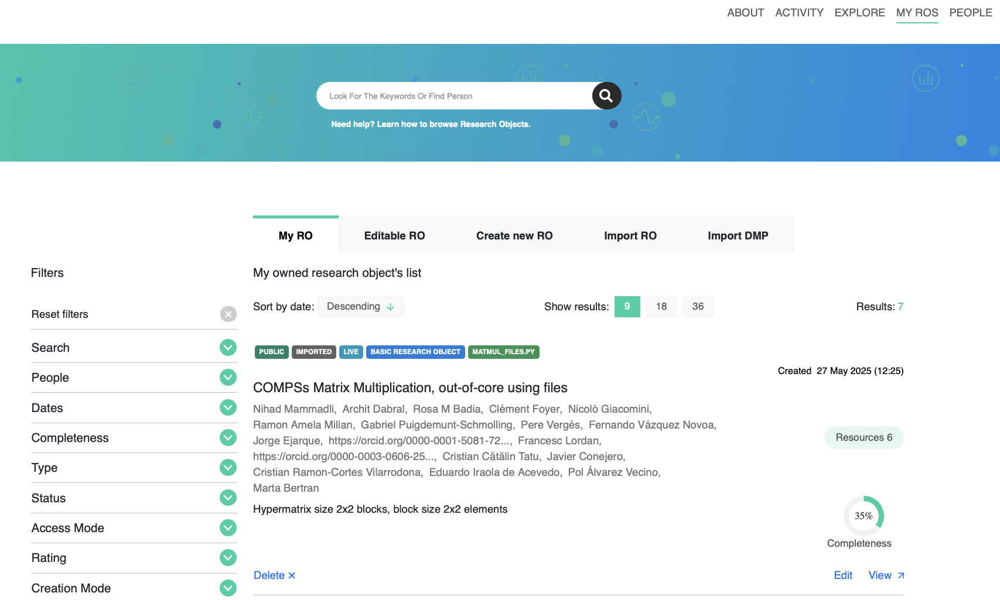
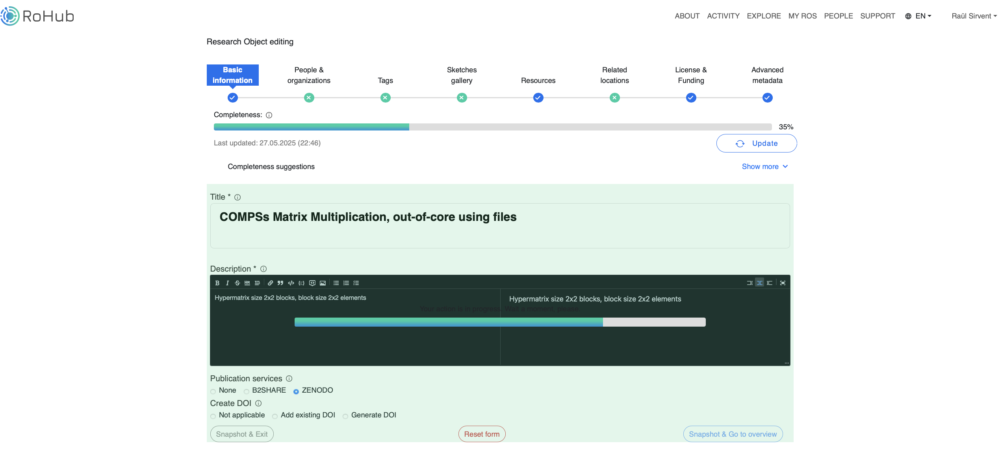
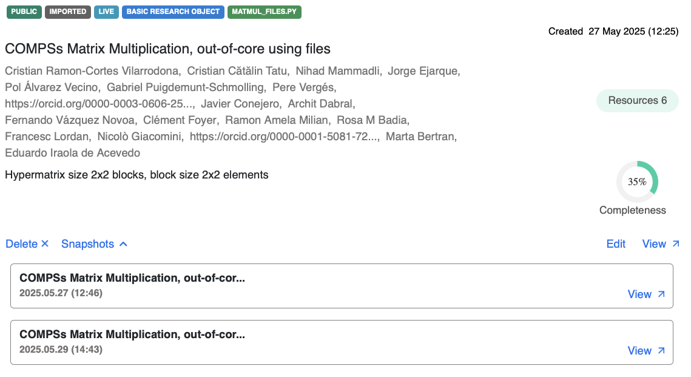
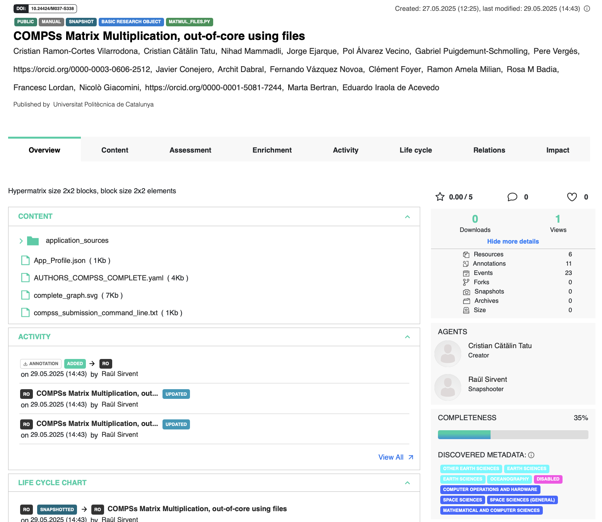

----------------
Publish at ROHub
----------------

Similarly as with WorkflowHub and Zenodo, once the provenance metadata for your COMPSs application has been generated, you have the possibility of publishing
your results (i.e. both the workflow and the workflow run) in `Research Object Hub <https://www.rohub.org>`_. ROHub is a Research Object management platform 
supporting the preservation and lifecycle management of scientific investigations, research campaigns and operational processes. As the only existing platform 
implementing natively the full research object model and paradigm, resources associated to a particular experiment are aggregated in a single digital entity 
(Research Object), and metadata relevant to understand and interpret the content is represented as semantic metadata that are user and machine readable.

A key feature of ROHub is that it natively supports importing RO-Crates, which is very convenient for the COMPSs workflow provenance recording mechanism.

Preliminary steps
-----------------

- Create your account at ROHub using the `Sing up <https://login.rohub.org>`_ interface.

- Log in to your account from the same interface.

Publication steps
-----------------

The steps to achieve the publication of a COMPSs execution at ROHub are:

- Pack the resulting crate sub-directory (i.e. ``COMPSs_RO-Crate_[timestamp]/``) in a zip file. Example:

.. code-block:: console

    $ cd COMPSs_RO-Crate_20250514_153121/
    $ zip -r ~/Desktop/crate.zip *

- Navigate to ``MY ROS`` -> ``Import RO``. Select the zip file created in the previous step and click ``Import``.

Once imported, the new record will appear under the ``MY ROS`` tab. You can ``View`` or ``Edit`` the record
in order to check that the metadata has been imported correctly, or to modify it if needed.

   My ROs list

In order to generate a DOI for your record, so you can reference it with a permanent id, you need to follow these steps:

- Search for the ``Toolbox`` section and click the ``Evolution`` option. Select ``Snapshot``.
- Optional: Choose if you want to share the record not only at ROHub but also at ``B2SHARE`` or ``Zenodo`` (you need to configure access tokens first in your user profile).
- Select ``Generate DOI`` option.
- Click ``Snapshot & Exit`` or ``Snapshot & Go to overview``, depending on your preference. 

The snapshot progress bar will appear as shown below:

   RO snapshot

Generating the snapshot may take a while. Once it is completed, go to ``MY ROS``, and in your record you will see a new ``Snapshots`` chooser.

   RO detail on snapshots available

Select ``View`` the snapshot and you will see the DOI available, like in the following example (record available at https://www.doi.org/10.24424/m037-s338 ):

   RO record example with DOI generated

ROHub includes other interesting features for your execution, such as assesment of the completeness or FAIRness of your RO. We encourage you to
visit the `Research Object Hub <https://www.rohub.org>`_ and investigate further all its possibilities.

