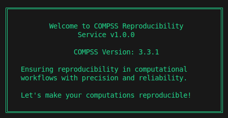

-----------------------
Reproducibility Service
-----------------------

This is an automatic reproducibility service designed to help reproduce COMPSs workflows on your local machine or on a cluster. Below are the prerequisites and instructions for proper functioning.

**Pre-requisites**

- COMPSs must be installed on your local machine, or the COMPSs module must be loaded on the cluster. For installation guidance, refer to the :ref:`Sections/01_Installation:Installation and Administration` Section.
- Ensure that all software dependencies for the experiment you wish to reproduce are satisfied on the machine where you want to resubmit the application.

**How to Use**

- Take the remote URL to a downloadable workflow RO-Crate (i.e., from WorkflowHub) or the local path to the RO-Crate (a folder or a zip file) and pass it as the first argument to the service:

  .. code-block:: console

     $ compss_reproducibility_service <link_or_path>

- The rest of the steps are self-explanatory and occur as interactions with the program, allowing the following features:

**Features**

1. **Provenance Generation**: The program prompts you for a provenance flag (``-p`` flag for ``runcompss``). It automatically fetches the experiment details from the metadata and only asks for the ``Agent`` details.

2. **New Dataset Feature**: If you want to reproduce the same experiment with a new dataset (i.e. replicability), simply provide the path to the new dataset.

   .. WARNING::
      The new dataset should follow the EXACT same directory structure as the old one for the paths to be correctly mapped.

3. **Flag Addition**: You can review the ``runcompss`` command line generated by the service and pass additional flags according to the needs of your new run.

4. **File Verification**: The service verifies file integrity against metadata such as file size or modification date. It generates a status table displaying the results of the verification.

   .. image:: ./Figures/RS_status_table.png
      :align: center
      :alt: Status Table
      :width: 90%

5. **Sub-directory Feature**: The service execution occurs in a separate subdirectory named ``reproducibility_service_{timestamp}/``, ensuring that it does not interfere with the current working directory (cwd).

6. **Results**: Any results generated by the experiment are stored in ``reproducibility_service_{timestamp}/Results/``. If provenance is requested, the generated RO-Crate is also stored in this directory.

7. **Logging**: Logs from the reproducibility service, such as ``err.log``, ``out.log``, and ``rs_log``, are stored in ``reproducibility_service_{timestamp}/log/``.

**Known Issues (or Future Plans)**

- Third-party software dependencies: neither automatic detection nor loading those dependencies on a cluster are yet implemented. Currently, they need to be solved manually by the user.
- No support for workflows with ``data_persistence = False`` with all datasets as remote files.

**Experiment Requirements**

1. If a folder path is provided in the ``compss_submission_command_line.txt``, the path should end with a ``/``.
2. The service does not support experiments with file paths hardcoded inside the original source code of the application, as these paths cannot be easily mapped.
3. The ``data_persistence = False`` examples are only supposed to work on the original cluster where paths related to the experiment are accessible (i.e., the new Agent may need to request access permissions).

**How to Use via Chameleon**

If you're unsure how to create an instance on Chameleon, please refer to the official documentation: `Chameleon Documentation <https://chameleoncloud.readthedocs.io/en/latest/index.html>`_.

To utilize this service or run any COMPSs experiments, you can create an instance of the Ubuntu 22.04 appliance with COMPSs 3.3.1 pre-installed. You can find the appliance here: `Ubuntu 22.04 with COMPSs 3.3.1 <https://www.chameleoncloud.org/appliances/121/>`_.

After successfully creating an instance of the appliance, execute the following command to set up the environment:

.. code-block:: console

   $ sudo ./working_scripts/basic_config.sh start

Once the setup is complete, you can proceed to run any COMPSs experiments of your choice.

.. TIP::
   Since Chameleon allows access to remote networks, you can directly clone the Reproducibility Service as well as the RO-Crate of the experiment you want to reproduce.

