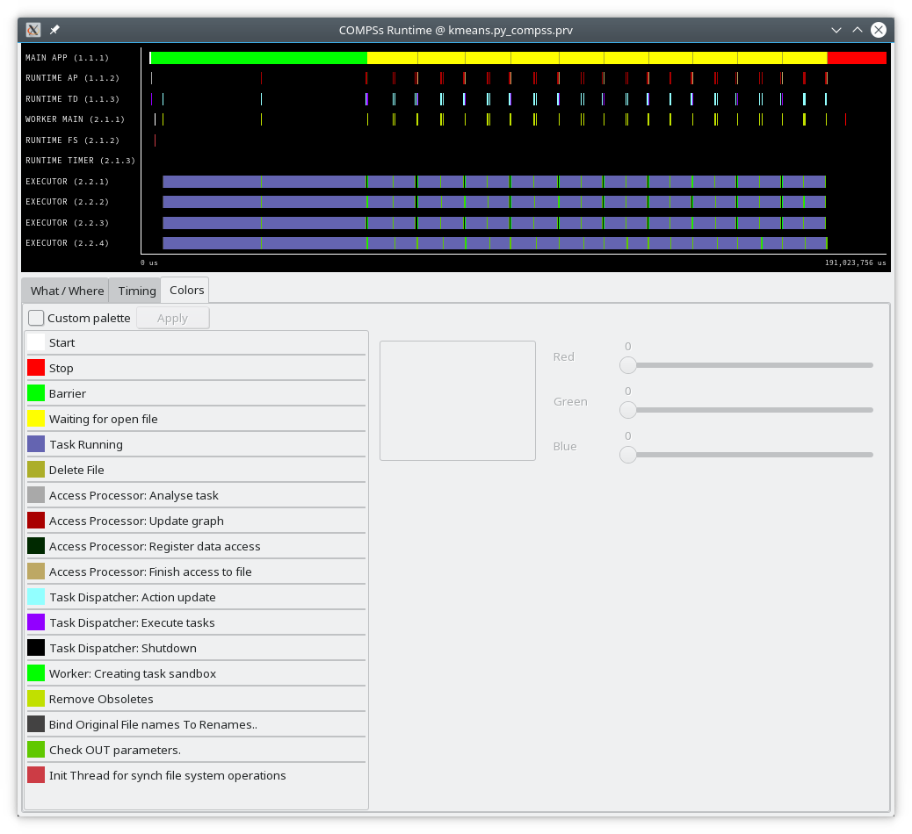
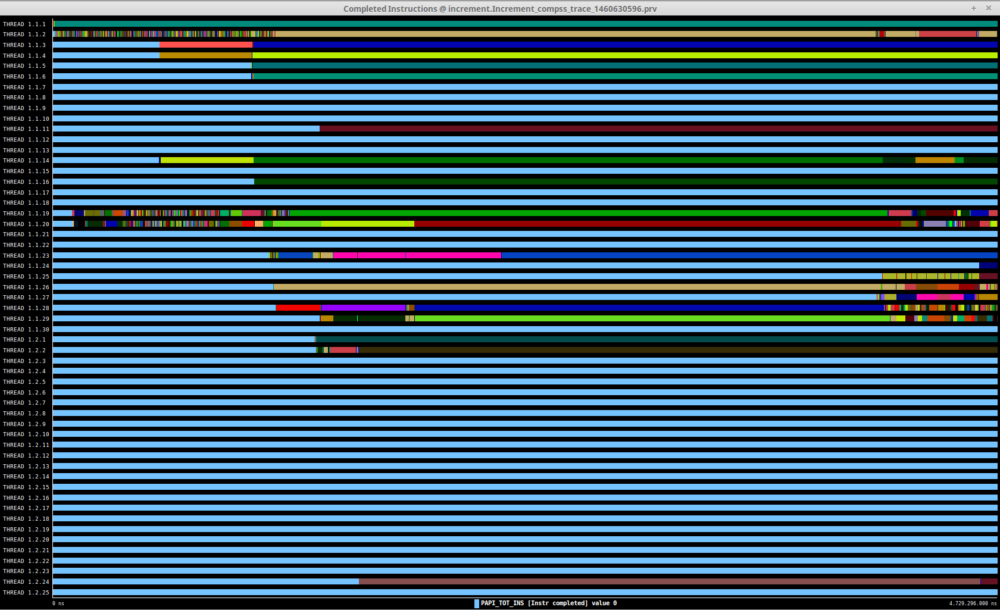

COMPSs applications tracing
===========================

COMPSs Runtime has a built-in instrumentation system to generate
post-execution tracefiles of the applications’ execution. The tracefiles
contain different events representing the COMPSs master state, the
tasks’ execution state, and the data transfers (transfers’ information
is only available when using NIO adaptor), and are useful for both
visual and numerical performance analysis and diagnosis. The
instrumentation process essentially intercepts and logs different
events, so it adds overhead to the execution time of the application.

The tracing system uses Extrae [1]_ to generate tracefiles of the execution
that, in turn, can be visualized with Paraver [2]_. Both tools are developed
and maintained by the Performance Tools team of the BSC and are
available on its web page
http://www.bsc.es/computer-sciences/performance-tools.

For each worker node and the master, Extrae keeps track of the events in
an intermediate format file (with *.mpit* extension). At the end of the
execution, all intermediate files are gathered and merged with Extrae’s
*mpi2prv* command in order to create the final tracefile, a Paraver
format file (.prv). See the :ref:`Sections/05_Tracing/02_Visualization:Visualization`
Section for further information about the Paraver tool.

When instrumentation is activated, Extrae outputs several messages
corresponding to the tracing initialization, intermediate files’
creation, and the merging process.

At present time, COMPSs tracing features two execution modes:

Basic
    Aimed at COMPSs applications developers

Advanced
    For COMPSs developers and users with access to its source code or
    custom installations

Next sections describe the information provided by each mode and how to
use them.

Basic Mode
----------

This mode is aimed at COMPSs’ apps users and developers. It instruments
computing threads and some management resources providing information
about tasks’ executions, data transfers, and hardware counters if PAPI
is available (see :ref:`Sections/05_Tracing/05_Papi:PAPI: Hardware Counters` for more info).

Basic Mode Usage
~~~~~~~~~~~~~~~~

In order to activate basic tracing one needs to provide one of the
following arguments to the execution command:

-  ``-t``

-  ``--tracing``

-  ``--tracing=basic``

-  ``--tracing=true``

Examples given:

.. code-block:: console

    $ runcompss --tracing application_name application_args

:numref:`basic_trace` was generated as follows:

.. code-block:: console

    $ runcompss \
         --lang=java \
         --tracing \
         --classpath=/path/to/jar/kmeans.jar \
         kmeans.KMeans

When tracing is activated, Extrae generates additional output to help
the user ensure that instrumentation is turned on and working without
issues. On basic mode this is the output users should see when tracing
is working correctly:

.. code-block:: console

    *** RUNNING JAVA APPLICATION KMEANS
    Resolved: /path/to/jar/kmeans.jar:

    ----------------- Executing kmeans.Kmeans --------------------------

    Welcome to Extrae VERSION
    Extrae: Parsing the configuration file (/opt/COMPSs/Runtime/configuration/xml/tracing/extrae_basic.xml) begins
    Extrae: Tracing package is located on /opt/COMPSs/Dependencies/extrae/
    Extrae: Generating intermediate files for Paraver traces.
    Extrae: PAPI domain set to USER for HWC set 1
    Extrae: HWC set 1 contains following counters < PAPI_TOT_INS (0x80000032) PAPI_TOT_CYC (0x8000003b) PAPI_LD_INS (0x80000035) PAPI_SR_INS (0x80000036) > - changing every 500000000 nanoseconds
    Extrae: PAPI domain set to USER for HWC set 2
    Extrae: HWC set 2 contains following counters < PAPI_TOT_INS (0x80000032) PAPI_TOT_CYC (0x8000003b) PAPI_LD_INS (0x80000035) PAPI_SR_INS (0x80000036) PAPI_L2_DCM (0x80000002) > - changing every 500000000 nanoseconds
    WARNING: COMPSs Properties file is null. Setting default values
    [(751)    API]  -  Deploying COMPSs Runtime v<version>
    [(753)    API]  -  Starting COMPSs Runtime v<version>
    [(753)    API]  -  Initializing components
    [(1142)   API]  -  Ready to process tasks

    ...
    ...
    ...
    merger: Output trace format is: Paraver
    merger: Extrae VERSION
    mpi2prv: Assigned nodes < Marginis >
    mpi2prv: Assigned size per processor < <1 Mbyte >
    mpi2prv: File set-0/TRACE@Marginis.0000001904000000000000.mpit is object 1.1.1 on node Marginis assigned to processor 0
    mpi2prv: File set-0/TRACE@Marginis.0000001904000000000001.mpit is object 1.1.2 on node Marginis assigned to processor 0
    mpi2prv: File set-0/TRACE@Marginis.0000001904000000000002.mpit is object 1.1.3 on node Marginis assigned to processor 0
    mpi2prv: File set-0/TRACE@Marginis.0000001980000001000000.mpit is object 1.2.1 on node Marginis assigned to processor 0
    mpi2prv: File set-0/TRACE@Marginis.0000001980000001000001.mpit is object 1.2.2 on node Marginis assigned to processor 0
    mpi2prv: File set-0/TRACE@Marginis.0000001980000001000002.mpit is object 1.2.3 on node Marginis assigned to processor 0
    mpi2prv: File set-0/TRACE@Marginis.0000001980000001000003.mpit is object 1.2.4 on node Marginis assigned to processor 0
    mpi2prv: File set-0/TRACE@Marginis.0000001980000001000004.mpit is object 1.2.5 on node Marginis assigned to processor 0
    mpi2prv: Time synchronization has been turned off
    mpi2prv: A total of 9 symbols were imported from TRACE.sym file
    mpi2prv: 0 function symbols imported
    mpi2prv: 9 HWC counter descriptions imported
    mpi2prv: Checking for target directory existance... exists, ok!
    mpi2prv: Selected output trace format is Paraver
    mpi2prv: Stored trace format is Paraver
    mpi2prv: Searching synchronization points... done
    mpi2prv: Time Synchronization disabled.
    mpi2prv: Circular buffer enabled at tracing time? NO
    mpi2prv: Parsing intermediate files
    mpi2prv: Progress 1 of 2 ... 5% 10% 15% 20% 25% 30% 35% 40% 45% 50% 55% 60% 65% 70% 75% 80% 85% 90% 95% done
    mpi2prv: Processor 0 succeeded to translate its assigned files
    mpi2prv: Elapsed time translating files: 0 hours 0 minutes 0 seconds
    mpi2prv: Elapsed time sorting addresses: 0 hours 0 minutes 0 seconds
    mpi2prv: Generating tracefile (intermediate buffers of 838848 events)
             This process can take a while. Please, be patient.
    mpi2prv: Progress 2 of 2 ... 5% 10% 15% 20% 25% 30% 35% 40% 45% 50% 55% 60% 65% 70% 75% 80% 85% 90% 95% done
    mpi2prv: Warning! Clock accuracy seems to be in microseconds instead of nanoseconds.
    mpi2prv: Elapsed time merge step: 0 hours 0 minutes 0 seconds
    mpi2prv: Resulting tracefile occupies 991743 bytes
    mpi2prv: Removing temporal files... done
    mpi2prv: Elapsed time removing temporal files: 0 hours 0 minutes 0 seconds
    mpi2prv: Congratulations! ./trace/kmeans.Kmeans_compss_trace_1460456106.prv has been generated.
    [   API]  -  Execution Finished
    Extrae: Tracing buffer can hold 100000 events
    Extrae: Circular buffer disabled.
    Extrae: Warning! <dynamic-memory> tag will be ignored. This library does support instrumenting dynamic memory calls.
    Extrae: Warning! <input-output> tag will be ignored. This library does support instrumenting I/O calls.
    Extrae: Dynamic memory instrumentation is disabled.
    Extrae: Basic I/O memory instrumentation is disabled.
    Extrae: Parsing the configuration file (/opt/COMPSs/Runtime/scripts/user/../../configuration/xml/tracing/extrae_basic.xml) has ended
    Extrae: Intermediate traces will be stored in /home/kurtz/compss/tests_local/app10
    Extrae: Tracing mode is set to: Detail.
    Extrae: Successfully initiated with 1 tasks and 1 threads

It contains diverse information about the tracing, for example, Extrae
version used (``VERSION`` will be replaced by the actual number during
executions), the XML configuration file used (``/opt/COMPSs/Runtime/configuration/xml/tracing/extrae_basic.xml``
-- if using python, the ``extrae_python_worker.xml`` located in the same folder will be used in the workers), the
amount of threads instrumented (objects through 1.1.1 to 1.2.5),
available hardware counters (``PAPI_TOT_INS (0x80000032)`` ...
``PAPI_L3_TCM (0x80000008)`` ) or the name of the generated tracefile
(``./trace/kmeans.`` ``Kmeans_compss_trace_1460456106.prv``). When using
NIO communications adaptor with debug activated, the log of each worker
also contains the Extrae initialization information.

.. TIP::

    The extrae configuration files used in basic mode are:

    * ``$COMPSS_HOME/Runtime/configuration/xml/tracing/extrae_basic.xml``
    * ``$COMPSS_HOME/Runtime/configuration/xml/tracing/extrae_python_worker.xml`` (when using Python)

.. IMPORTANT::

    COMPSs needs to perform an extra merging step when using Python
    in order to add the Python-produced events to the main tracefile.
    If Python events are not shown, check *runtime.log* file and search for
    the following expected output of this merging process to find possible
    errors:

    .. code-block:: console

        [(9788)(2016-11-15 11:22:27,687)  Tracing]    @generateTrace -  Tracing: Generating trace
        [(9851)(2016-11-15 11:22:27,750)  Tracing]    @<init>        -  Trace's merger initialization successful
        [(9851)(2016-11-15 11:22:27,750)  Tracing]    @merge         -  Parsing master sync events
        [(9905)(2016-11-15 11:22:27,804)  Tracing]    @merge         -  Proceeding to merge task traces into master
        [(9944)(2016-11-15 11:22:27,843)  Tracing]    @merge         -  Merging finished,
        [(9944)(2016-11-15 11:22:27,843)  Tracing]    @merge         -  Temporal task folder removed.

Instrumented Threads in Basic Mode
~~~~~~~~~~~~~~~~~~~~~~~~~~~~~~~~~~

Basic traces instrument the following threads:

-  Master node (3 threads)

   -  COMPSs runtime

   -  Task Dispatcher

   -  Access Processor

-  Worker node (1 + Computing Units)

   -  Main thread

   -  Number of threads available for computing

Information Available in Basic Traces
~~~~~~~~~~~~~~~~~~~~~~~~~~~~~~~~~~~~~

The basic mode tracefiles contain three kinds of information:

Events
    Marking diverse situations such as the runtime start, tasks’
    execution or synchronization points.

Communications
    Showing the transfers and requests of the parameters needed by
    COMPSs tasks.

Hardware counters
    Of the execution obtained with Performance API (see
    :ref:`Sections/05_Tracing/05_Papi:PAPI: Hardware Counters`)

Basic Trace Example
~~~~~~~~~~~~~~~~~~~

:numref:`basic_trace` is a tracefile generated by the execution of a
k-means clustering algorithm. Each timeline contains information of a
different resource, and each event’s name is on the legend. Depending on
the number of computing threads specified for each worker, the number of
timelines varies. However the following threads are always shown:

Master - Thread 1.1.1
    This timeline shows the actions performed by the main thread of
    the COMPSs application

Task Dispatcher - Thread 1.1.2
    Shows information about the state and scheduling of the tasks to
    be executed.

Access Processor - Thread 1.1.3
    All the events related to the tasks’ parameters management, such
    as dependencies or transfers are shown in this thread.

Worker X Master - Thread 1.X.1
    This thread is the master of each worker and handles the computing
    resources and transfers. It is repeated for each available
    resource. All data events of the worker, such as requests,
    transfers and receives are marked on this timeline (when using the
    appropriate configurations).

Worker X Computing Unit Y - Thread 1.X.Y
    Shows the actual tasks execution information and is repeated as
    many times as computing threads has the worker X

   Basic mode tracefile for a k-means algorithm visualized with compss_runtime.cfg

Advanced Mode
-------------

This mode is for more advanced COMPSs’ users and developers who want
to customize further the information provided by the tracing or need
rawer information like pthreads calls or Java garbage collection. With
it, every single thread created during the execution is traced.

.. IMPORTANT::

    The extra information provided by the advanced mode is only
    available on the workers when using NIO adaptor.

Advanced Mode Usage
~~~~~~~~~~~~~~~~~~~

In order to activate the advanced tracing add the following option to
the execution:

-  ``--tracing=advanced``

Examples given:

.. code-block:: console

    $ runcompss --tracing=advanced application_name application_args

:numref:`advanced_trace` was generated as follows:

.. code-block:: console

    $ runcompss \
         --lang=java \
         --tracing=advanced \
         --classpath=/path/to/jar/kmeans.jar \
         kmeans.KMeans

When advanced tracing is activated, the configuration file reported on
the output is ``$COMPSS_HOME/Runtime/configuration/xml/tracing/extrae_advanced.xml``.

.. code-block:: console

    *** RUNNING JAVA APPLICATION KMEANS
    ...
    ...
    ...
    Welcome to Extrae VERSION
    Extrae: Parsing the configuration file (/opt/COMPSs/Runtime/scripts/user/../../configuration/xml/tracing/extrae_advanced.xml) begins

This is the default file used for advanced tracing as well as
``extrae_python_worker.xml`` if using Python.
However, advanced users can modify it in order to customize the information
provided by Extrae. The configuration file is read first by the master on the
*runcompss* script. When using NIO adaptor for communication, the
configuration file is also read when each worker is started (on
*persistent_worker.sh* or *persistent_worker_starter.sh* depending on
the execution environment).

.. TIP::

    The extrae configuration files used in advanced mode are:

    * ``$COMPSS_HOME/Runtime/configuration/xml/tracing/extrae_advanced.xml``
    * ``$COMPSS_HOME/Runtime/configuration/xml/tracing/extrae_python_worker.xml`` (when using Python)

If the ``extrae_advanced.xml`` file is modified, the changes always affect the
master, and also the workers when using NIO. Modifying the scripts which turn
on the master and the workers is possible to achieve different
instrumentations for master/workers. However, not all Extrae available
XML configurations work with COMPSs, some of them can make the runtime
or workers crash so modify them at your discretion and risk. More
information about instrumentation XML configurations on Extrae User
Guide at:
https://www.bsc.es/computer-sciences/performance-tools/trace-generation/extrae/extrae-user-guide.

Instrumented Threads in Advanced Mode
~~~~~~~~~~~~~~~~~~~~~~~~~~~~~~~~~~~~~

Advanced mode instruments all the pthreads created during the
application execution. It contains all the threads shown on basic traces
plus extra ones used to call command-line commands, I/O streams managers
and all actions which create a new process. Due to the temporal nature
of many of this threads, they may contain little information or appear
just at specific parts of the execution pipeline.

Information Available in Advanced Traces
~~~~~~~~~~~~~~~~~~~~~~~~~~~~~~~~~~~~~~~~

The advanced mode tracefiles contain the same information as the basic
ones:

Events
    Marking diverse situations such as the runtime start, tasks’
    execution or synchronization points.

Communications
    Showing the transfers and requests of the parameters needed by
    COMPSs tasks.

Hardware counters
    Of the execution obtained with Performance API (see
    :ref:`Sections/05_Tracing/05_Papi:PAPI: Hardware Counters`)

Advanced Trace Example
~~~~~~~~~~~~~~~~~~~~~~

Figure :numref:`advanced_trace` shows the total completed instructions for
a sample program executed with the advanced tracing mode. Note that the
thread - resource correspondence described on the basic trace example is
no longer static and thus cannot be inferred. Nonetheless, they can be
found thanks to the named events shown in other configurations such as
*compss_runtime.cfg*.

   Advanced mode tracefile for a testing program showing the total completed instructions

For further information about Extrae, please visit the following site:

http://www.bsc.es/computer-science/extrae

Custom Installation and Configuration
-------------------------------------

Custom Extrae
~~~~~~~~~~~~~

COMPSs uses the environment variable ``EXTRAE_HOME`` to get the
reference to its installation directory (by default:
``/opt/COMPSs/Dependencies/extrae`` ). However, if the variable is
already defined once the runtime is started, COMPSs will not override
it. User can take advantage of this fact in order to use custom extrae
installations. Just set the ``EXTRAE_HOME`` environment variable to
the directory where your custom package is, and make sure that it is
also set for the worker’s environment.
Be aware that using different Extrae packages can break the runtime
and executions so you may change it at your own risk.

Custom Configuration file
~~~~~~~~~~~~~~~~~~~~~~~~~

COMPSs offers the possibility to specify an extrae custom configuration
file in order to harness all the tracing capabilities further tailoring
which information about the execution is displayed. To do so just pass
the file as an execution parameter as follows:

``--extrae_config_file=/path/to/config/file.xml``

The configuration file must be in a shared disk between all COMPSs
workers because a file’s copy is not distributed among them, just the
path to that file.

.. [1]
   For more information: https://www.bsc.es/computer-sciences/extrae

.. [2]
   For more information: https://www.bsc.es/computer-sciences/performance-tools/paraver
