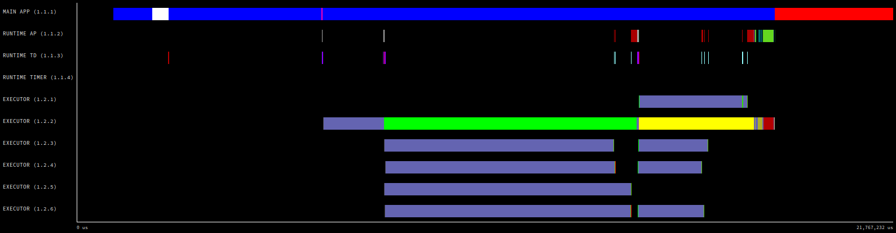
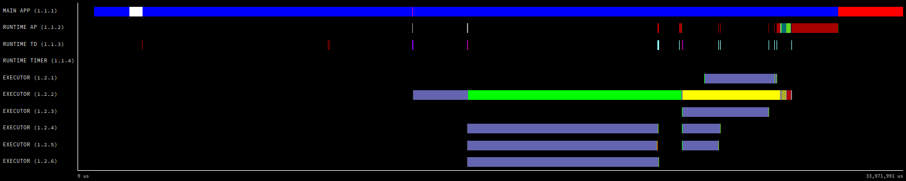
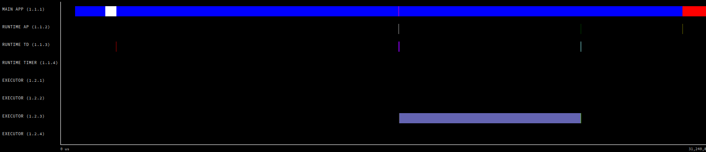
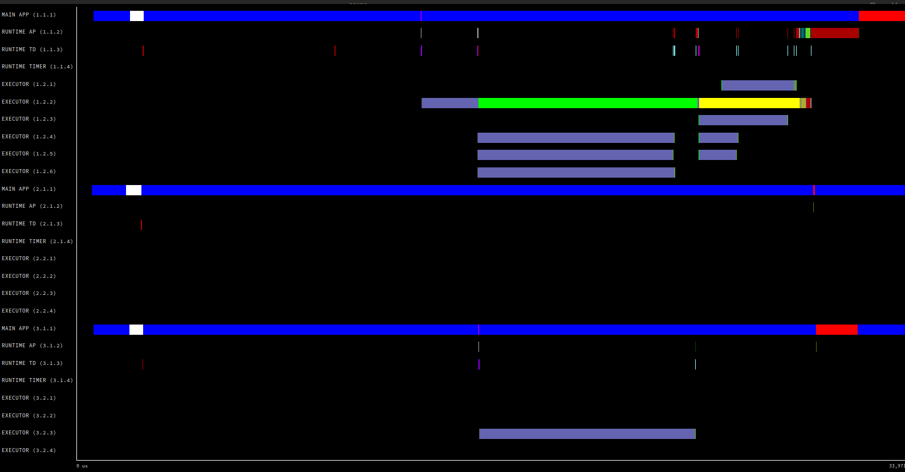

COMPSs applications tracing
===========================

COMPSs Runtime has a built-in instrumentation system to generate
post-execution tracefiles of the applications’ execution. The tracefiles
contain different events representing the COMPSs master state, the
tasks’ execution state, and the data transfers (transfers’ information
is only available when using NIO adaptor), and are useful for both
visual and numerical performance analysis and diagnosis. The
instrumentation process essentially intercepts and logs different
events, so it adds overhead to the execution time of the application.

The tracing system uses Extrae [1]_ to generate tracefiles of the execution
that, in turn, can be visualized with Paraver [2]_. Both tools are developed
and maintained by the Performance Tools team of the BSC and are
available on its web page
http://www.bsc.es/computer-sciences/performance-tools.

For each worker node and the master, Extrae keeps track of the events in
an intermediate format file (with *.mpit* extension). At the end of the
execution, all intermediate files are gathered and merged with Extrae’s
``mpi2prv`` command in order to create the final tracefile, a Paraver
format file (.prv). See the :ref:`Sections/05_Tracing/02_Visualization:Visualization`
Section for further information about the Paraver tool.

When instrumentation is activated, Extrae outputs several messages
corresponding to the tracing initialization, intermediate files’
creation, and the merging process.

At present time, COMPSs tracing features two execution modes:

Basic
    Aimed at COMPSs applications developers

Advanced
    For COMPSs developers and users with access to its source code or
    custom installations

Next sections describe the information provided by each mode and how to
use them.

Basic Mode
----------

This mode is aimed at COMPSs’ apps users and developers. It instruments
computing threads and some management resources providing information
about tasks’ executions, data transfers, and hardware counters if PAPI
is available (see :ref:`Sections/05_Tracing/05_Papi:PAPI: Hardware Counters` for more info).

Basic Mode Usage
~~~~~~~~~~~~~~~~

In order to activate basic tracing one needs to provide one of the
following arguments to the execution command:

-  ``-t``

-  ``--tracing``

-  ``--tracing=basic``

-  ``--tracing=true``

Example:

.. code-block:: console

    $ runcompss --tracing application_name application_args

When tracing is activated, Extrae generates additional output to help
the user ensure that instrumentation is turned on and working without
issues. On basic mode this is the output users should see when tracing
is working correctly:

.. code-block:: console

    $ runcompss --tracing kmeans.py -n 102400000 -f 8 -d 3 -c 8 -i 10

    [  INFO] Inferred PYTHON language
    [  INFO] Using default location for project file: /opt/COMPSs//Runtime/configuration/xml/projects/default_project.xml
    [  INFO] Using default location for resources file: /opt/COMPSs//Runtime/configuration/xml/resources/default_resources.xml
    [  INFO] Using default execution type: compss

    ----------------- Executing kmeans.py --------------------------

    Welcome to Extrae 3.8.3
    Extrae: Parsing the configuration file (/opt/COMPSs//Runtime/configuration/xml/tracing/extrae_basic.xml) begins
    Extrae: Warning! <trace> tag has no <home> property defined.
    Extrae: Generating intermediate files for Paraver traces.

    PAPI Error: Error finding event OFFCORE_RESPONSE_0:SNP_FWD, it is used in derived event PAPI_CA_ITV.
    Extrae: PAPI domain set to ALL for HWC set 1
    Extrae: HWC set 1 contains following counters < PAPI_TOT_INS (0x80000032) PAPI_TOT_CYC (0x8000003b) PAPI_L1_DCM (0x80000000) PAPI_L2_DCM (0x80000002) PAPI_L3_TCM (0x80000008) PAPI_BR_INS (0x80000037) PAPI_BR_MSP (0x8000002e) RESOURCE_STALLS (0x4000002f) > - never changes
    Extrae: Tracing buffer can hold 100000 events
    Extrae: Circular buffer disabled.
    Extrae: Warning! <input-output> tag will be ignored. This library does not support instrumenting I/O calls.
    Extrae: Dynamic memory instrumentation is disabled.
    Extrae: Basic I/O memory instrumentation is disabled.
    Extrae: System calls instrumentation is disabled.
    Extrae: Parsing the configuration file (/opt/COMPSs//Runtime/configuration/xml/tracing/extrae_basic.xml) has ended
    Extrae: Intermediate traces will be stored in /home/user/temp/documentation
    Extrae: Tracing mode is set to: Detail.
    Extrae: Error! Hardware counter PAPI_BR_INS (0x80000037) cannot be added in set 1 (task 0, thread 0)
    Extrae: Error! Hardware counter PAPI_BR_MSP (0x8000002e) cannot be added in set 1 (task 0, thread 0)
    Extrae: Error! Hardware counter RESOURCE_STALLS (0x4000002f) cannot be added in set 1 (task 0, thread 0)
    Extrae: Successfully initiated with 1 tasks and 1 threads

    PAPI Error: Error finding event OFFCORE_RESPONSE_0:SNP_FWD, it is used in derived event PAPI_CA_ITV.
    Extrae: Error! Hardware counter PAPI_BR_INS (0x80000037) cannot be added in set 1 (task 0, thread 0)
    Extrae: Error! Hardware counter PAPI_BR_MSP (0x8000002e) cannot be added in set 1 (task 0, thread 0)
    Extrae: Error! Hardware counter RESOURCE_STALLS (0x4000002f) cannot be added in set 1 (task 0, thread 0)
    pyextrae: Loading tracing library 'libseqtrace.so'
    WARNING: COMPSs Properties file is null. Setting default values
    Loading LoggerManager
    [(419)    API]  -  Starting COMPSs Runtime v2.9.rc2107 (build 20210720-1547.r81bdafc6f06a7680a344ae434a467473ecbaf27e)
    Generation/Load done
    Starting kmeans
    Doing iteration #1/10
    Doing iteration #2/10
    Doing iteration #3/10
    Doing iteration #4/10
    Doing iteration #5/10
    Doing iteration #6/10
    Doing iteration #7/10
    Doing iteration #8/10
    Doing iteration #9/10
    Doing iteration #10/10
    Ending kmeans
    -----------------------------------------
    -------------- RESULTS ------------------
    -----------------------------------------
    Initialization time: 55.369870
    Kmeans time: 117.859757
    Total time: 173.229627
    -----------------------------------------
    CENTRES:
    [[0.69757475 0.74511351 0.48157611]
    [0.54683653 0.20274669 0.2117475 ]
    [0.24194863 0.74448094 0.75633981]
    [0.21854362 0.67072938 0.23273541]
    [0.77272546 0.68522249 0.16245965]
    [0.22683962 0.23359743 0.67203863]
    [0.75351606 0.73746265 0.83339847]
    [0.75838884 0.23805883 0.71538748]]
    -----------------------------------------
    Extrae: Intermediate raw trace file created : /home/user/temp/documentation/set-0/TRACE@linux-2e63.0000027029000000000002.mpit
    Extrae: Intermediate raw trace file created : /home/user/temp/documentation/set-0/TRACE@linux-2e63.0000027029000000000001.mpit
    Extrae: Intermediate raw trace file created : /home/user/temp/documentation/set-0/TRACE@linux-2e63.0000027029000000000000.mpit
    Extrae: Intermediate raw sym file created : /home/user/temp/documentation/set-0/TRACE@linux-2e63.0000027029000000000000.sym
    Extrae: Deallocating memory.
    Extrae: Application has ended. Tracing has been terminated.
    merger: Output trace format is: Paraver
    merger: Extrae 3.8.3
    mpi2prv: Assigned nodes < linux-2e63 >
    mpi2prv: Assigned size per processor < 1 Mbytes >
    mpi2prv: File set-0/TRACE@linux-2e63.0000027148000001000000.mpit is object 1.2.1 on node linux-2e63 assigned to processor 0
    mpi2prv: File set-0/TRACE@linux-2e63.0000027148000001000001.mpit is object 1.2.2 on node linux-2e63 assigned to processor 0
    mpi2prv: File set-0/TRACE@linux-2e63.0000027148000001000002.mpit is object 1.2.3 on node linux-2e63 assigned to processor 0
    mpi2prv: File set-0/TRACE@linux-2e63.0000027148000001000003.mpit is object 1.2.4 on node linux-2e63 assigned to processor 0
    mpi2prv: File set-0/TRACE@linux-2e63.0000027148000001000004.mpit is object 1.2.5 on node linux-2e63 assigned to processor 0
    mpi2prv: File set-0/TRACE@linux-2e63.0000027148000001000005.mpit is object 1.2.6 on node linux-2e63 assigned to processor 0
    mpi2prv: File set-0/TRACE@linux-2e63.0000027148000001000006.mpit is object 1.2.7 on node linux-2e63 assigned to processor 0
    mpi2prv: File set-0/TRACE@linux-2e63.0000027029000000000000.mpit is object 1.1.1 on node linux-2e63 assigned to processor 0
    mpi2prv: File set-0/TRACE@linux-2e63.0000027029000000000001.mpit is object 1.1.2 on node linux-2e63 assigned to processor 0
    mpi2prv: File set-0/TRACE@linux-2e63.0000027029000000000002.mpit is object 1.1.3 on node linux-2e63 assigned to processor 0
    mpi2prv: A total of 8 symbols were imported from TRACE.sym file
    mpi2prv: 0 function symbols imported
    mpi2prv: 8 HWC counter descriptions imported
    mpi2prv: Checking for target directory existence... exists, ok!
    mpi2prv: Selected output trace format is Paraver
    mpi2prv: Stored trace format is Paraver
    mpi2prv: Searching synchronization points... done
    mpi2prv: Time Synchronization disabled.
    mpi2prv: Circular buffer enabled at tracing time? NO
    mpi2prv: Parsing intermediate files
    mpi2prv: Progress 1 of 2 ... 5% 10% 15% 20% 25% 30% 35% 40% 45% 50% 55% 60% 65% 70% 75% 80% 85% 90% 95% done
    mpi2prv: Processor 0 succeeded to translate its assigned files
    mpi2prv: Elapsed time translating files: 0 hours 0 minutes 0 seconds
    mpi2prv: Elapsed time sorting addresses: 0 hours 0 minutes 0 seconds
    mpi2prv: Generating tracefile (intermediate buffers of 671078 events)
         This process can take a while. Please, be patient.
    mpi2prv: Progress 2 of 2 ... 5% 10% 15% 20% 25% 30% 35% 40% 45% 50% 55% 60% 65% 70% 75% 80% 85% 90% 95% done
    mpi2prv: Elapsed time merge step: 0 hours 0 minutes 0 seconds
    mpi2prv: Resulting tracefile occupies 664068 bytes
    mpi2prv: Removing temporal files... mpi2prv: Warning! Clock accuracy seems to be in microseconds instead of nanoseconds.
    done
    mpi2prv: Elapsed time removing temporal files: 0 hours 0 minutes 0 seconds
    mpi2prv: Congratulations! ./trace/kmeans.py_compss.prv has been generated.
    [(189793)    API]  -  Execution Finished

    ------------------------------------------------------------

The output contains diverse information about the tracing, for example, Extrae
version used (``VERSION`` will be replaced by the actual number during
executions), the XML configuration file used (``/opt/COMPSs/Runtime/configuration/xml/tracing/extrae_basic.xml``
-- if using python, the ``extrae_python_worker.xml`` located in the same folder will be used in the workers), the
amount of threads instrumented (objects through 1.1.1 to 1.2.7),
available hardware counters (``PAPI_TOT_INS (0x80000032)`` ...
``PAPI_L3_TCM (0x80000008)`` ) or the name of the generated tracefile
(``./trace/`` ``kmeans.py_compss.prv``). When using
NIO communications adaptor with debug activated, the log of each worker
also contains the Extrae initialization information.

.. TIP::

    The extrae configuration files used in basic mode are:

    * ``$COMPSS_HOME/Runtime/configuration/xml/tracing/extrae_basic.xml``
    * ``$COMPSS_HOME/Runtime/configuration/xml/tracing/extrae_python_worker.xml`` (when using Python)

.. TIP::

    :numref:`basic_trace` was generated with this execution.

.. IMPORTANT::

    COMPSs needs to perform an extra merging step when using Python
    in order to add the Python-produced events to the main tracefile.
    If Python events are not shown, check *runtime.log* file and search for
    the following expected output of this merging process to find possible
    errors:

    .. code-block:: console

        [(189467)(2021-07-21 08:09:33,292)             Tracing]    @teMasterPackage  -  Tracing: generating master package: package
        [(189468)(2021-07-21 08:09:33,293)             Tracing]    @run              -  Starting stream goobler
        [(189469)(2021-07-21 08:09:33,294)             Tracing]    @run              -  Starting stream goobler
        [(189501)(2021-07-21 08:09:33,326)             Tracing]    @erMasterPackage  -  Tracing: Transferring master package
        [(189503)(2021-07-21 08:09:33,328)             Tracing]    @generateTrace    -  Tracing: Generating trace with mode gentrace
        [(189503)(2021-07-21 08:09:33,328)             Tracing]    @run              -  Starting stream goobler
        [(189504)(2021-07-21 08:09:33,329)             Tracing]    @run              -  Starting stream goobler
        [(189589)(2021-07-21 08:09:33,414)             Tracing]    @<init>           -  Trace's merger initialization successful
        [(189589)(2021-07-21 08:09:33,414)             Tracing]    @umAndSyncEvents  -  Parsing master sync events
        [(189589)(2021-07-21 08:09:33,414)             Tracing]    @getSyncEvents    -  Getting sync events from: /home/user/.COMPSs/kmeans.py_01/trace/kmeans.py_compss.prv for worker -1
        [(189745)(2021-07-21 08:09:33,570)             Tracing]    @umAndSyncEvents  -  Merging task traces into master which contains 1 lines.
        [(189745)(2021-07-21 08:09:33,570)             Tracing]    @umAndSyncEvents  -  Merging worker /home/user/.COMPSs/kmeans.py_01/trace/python/1_python_trace.prv
        [(189745)(2021-07-21 08:09:33,570)             Tracing]    @getWorkerEvents  -  Getting worker events from: /home/user/.COMPSs/kmeans.py_01/trace/python/1_python_trace.prv
        [(189751)(2021-07-21 08:09:33,576)             Tracing]    @getSyncEvents    -  Getting sync events from: /home/user/.COMPSs/kmeans.py_01/trace/python/1_python_trace.prv for worker 2
        [(189852)(2021-07-21 08:09:33,677)             Tracing]    @iteWorkerEvents  -  Writing 4089 lines from worker 2 with 4 threads
        [(189872)(2021-07-21 08:09:33,697)             Tracing]    @ardwareCounters  -  Merging PCF Hardware Counters into master
        [(189872)(2021-07-21 08:09:33,697)             Tracing]    @getHWCounters    -  Getting pcf hw counters from: /home/user/.COMPSs/kmeans.py_01/trace/kmeans.py_compss.pcf
        [(189872)(2021-07-21 08:09:33,697)             Tracing]    @getHWCounters    -  Getting pcf hw counters from: /home/user/.COMPSs/kmeans.py_01/trace/python/1_python_trace.pcf
        [(189873)(2021-07-21 08:09:33,698)             Tracing]    @ardwareCounters  -  Analised worker had 0 lines to be included
        [(189873)(2021-07-21 08:09:33,698)             Tracing]    @ardwareCounters  -  No hardware counters to include in PCF.
        [(189873)(2021-07-21 08:09:33,698)             Tracing]    @merge            -  Merging finished.
        [(189873)(2021-07-21 08:09:33,698)             Tracing]    @updateThreads    -  Tracing: Updating thread labels
        [(189914)(2021-07-21 08:09:33,739)             Tracing]    @latedPrvThreads  -  Tracing: Updating thread identifiers in .prv file
        [(189959)(2021-07-21 08:09:33,784)             Tracing]    @anMasterPackage  -  Tracing: Removing tracing master package: /home/user/documentation/master_compss_trace.tar.gz
        [(189959)(2021-07-21 08:09:33,784)             Tracing]    @anMasterPackage  -  Deleted master tracing package.

Instrumented Threads in Basic Mode
~~~~~~~~~~~~~~~~~~~~~~~~~~~~~~~~~~

Basic traces instrument the following threads:

- Master node (3 threads)

   - COMPSs runtime (main application thread)

   - Access Processor thread

   - Task Dispatcher thread

- Worker node (3 + Computing Units)

   - Worker main thread

   - Worker File system thread

   - Worker timer thread

   - Number of threads available for computing

Information Available in Basic Traces
~~~~~~~~~~~~~~~~~~~~~~~~~~~~~~~~~~~~~

The basic mode tracefiles contain three kinds of information:

Events
    Marking diverse situations such as the runtime start, tasks’
    execution or synchronization points.

Communications
    Showing the transfers and requests of the parameters needed by
    COMPSs tasks.

Hardware counters
    Of the execution obtained with Performance API (see
    :ref:`Sections/05_Tracing/05_Papi:PAPI: Hardware Counters`)

Basic Trace Example
~~~~~~~~~~~~~~~~~~~

:numref:`basic_trace` is a tracefile generated by the execution of a
k-means clustering algorithm. Each timeline contains information of a
different resource, and each event’s name is on the legend. Depending on
the number of computing threads specified for each worker, the number of
timelines varies. However the following threads are always shown:

Master - Thread 1.1.1
    This timeline shows the actions performed by the main thread of
    the COMPSs application

Access Processor - Thread 1.1.2
    All the events related to the tasks’ parameters management, such
    as dependencies or transfers are shown in this thread.

Task Dispatcher - Thread 1.1.3
    Shows information about the state and scheduling of the tasks to
    be executed.

Worker X Master - Thread X.1.1
    This thread is the master of each worker and handles the computing
    resources and transfers. It is repeated for each available
    resource. All data events of the worker, such as requests,
    transfers and receives are marked on this timeline (when using the
    appropriate configurations).

Worker X File system - Thread X.1.2
    This thread manages the synchronous file system operations (e.g. copy
    file) performed by the worker.

Worker X Timer - Thread X.1.3
    This thread manages the cancellation of the tasks when the wall-clock
    limit is reached.

Worker X Executor Y - Thread X.2.Y
    Shows the actual tasks execution information and is repeated as
    many times as computing threads has the worker X

.. figure:: ./Figures/basic.png
   :name: basic_trace
   :alt: Basic mode tracefile for a k-means algorithm visualized with compss_runtime.cfg
   :align: center
   :width: 60.0%

   Basic mode tracefile for a k-means algorithm visualized with compss_runtime.cfg

Advanced Mode
-------------

This mode is for more advanced COMPSs’ users and developers who want
to customize further the information provided by the tracing or need
rawer information like pthreads calls or Java garbage collection. With
it, every single thread created during the execution is traced.

.. IMPORTANT::

    The extra information provided by the advanced mode is only
    available on the workers when using NIO adaptor.

Advanced Mode Usage
~~~~~~~~~~~~~~~~~~~

In order to activate the advanced tracing add the following option to
the execution:

-  ``--tracing=advanced``

Example:

.. code-block:: console

    $ runcompss --tracing=advanced application_name application_args

When advanced tracing is activated, the configuration file reported on
the output is ``$COMPSS_HOME/Runtime/configuration/xml/tracing/extrae_advanced.xml``.

.. code-block:: console

    $ runcompss --tracing=advanced kmeans.py -n 102400000 -f 8 -d 3 -c 8 -i 10

    [  INFO] Inferred PYTHON language
    [  INFO] Using default location for project file: /opt/COMPSs//Runtime/configuration/xml/projects/default_project.xml
    [  INFO] Using default location for resources file: /opt/COMPSs//Runtime/configuration/xml/resources/default_resources.xml
    [  INFO] Using default execution type: compss

    ----------------- Executing kmeans.py --------------------------

    Welcome to Extrae 3.8.3
    Extrae: Parsing the configuration file (/opt/COMPSs//Runtime/configuration/xml/tracing/extrae_advanced.xml) begins
    ...
    ...
    ...

This is the default file used for advanced tracing as well as
``extrae_python_worker.xml`` if using Python.
However, advanced users can modify it in order to customize the information
provided by Extrae. The configuration file is read first by the master on the
*runcompss* script. When using NIO adaptor for communication, the
configuration file is also read when each worker is started (on
*persistent_worker.sh* or *persistent_worker_starter.sh* depending on
the execution environment).

.. TIP::

    The extrae configuration files used in advanced mode are:

    * ``$COMPSS_HOME/Runtime/configuration/xml/tracing/extrae_advanced.xml``
    * ``$COMPSS_HOME/Runtime/configuration/xml/tracing/extrae_python_worker.xml`` (when using Python)

.. TIP::

    :numref:`advanced_trace` was generated with this execution.

If the ``extrae_advanced.xml`` file is modified, the changes always affect the
master, and also the workers when using NIO. Modifying the scripts which turn
on the master and the workers is possible to achieve different
instrumentations for master/workers. However, not all Extrae available
XML configurations work with COMPSs, some of them can make the runtime
or workers crash so modify them at your discretion and risk. More
information about instrumentation XML configurations on Extrae User
Guide at:
https://www.bsc.es/computer-sciences/performance-tools/trace-generation/extrae/extrae-user-guide.

Instrumented Threads in Advanced Mode
~~~~~~~~~~~~~~~~~~~~~~~~~~~~~~~~~~~~~

Advanced mode instruments all the pthreads created during the
application execution. It contains all the threads shown on basic traces
plus extra ones used to call command-line commands, I/O streams managers
and all actions which create a new process. Due to the temporal nature
of many of this threads, they may contain little information or appear
just at specific parts of the execution pipeline.

Information Available in Advanced Traces
~~~~~~~~~~~~~~~~~~~~~~~~~~~~~~~~~~~~~~~~

The advanced mode tracefiles contain the same information as the basic
ones:

Events
    Marking diverse situations such as the runtime start, tasks’
    execution or synchronization points.

Communications
    Showing the transfers and requests of the parameters needed by
    COMPSs tasks.

Hardware counters
    Of the execution obtained with Performance API (see
    :ref:`Sections/05_Tracing/05_Papi:PAPI: Hardware Counters`)

Advanced Trace Example
~~~~~~~~~~~~~~~~~~~~~~

:numref:`advanced_trace` shows the total completed instructions for
a sample program executed with the advanced tracing mode. Note that the
thread - resource correspondence described on the basic trace example is
no longer static and thus cannot be inferred. Nonetheless, they can be
found thanks to the named events shown in other configurations such as
*compss_runtime.cfg*.

.. figure:: ./Figures/advanced.png
   :name: advanced_trace
   :alt: Advanced mode tracefile for a k-means execution showing the total completed instructions
   :align: center
   :width: 80.0%

   Advanced mode tracefile for a testing program showing the total completed instructions

For further information about Extrae, please visit the following site:

http://www.bsc.es/computer-science/extrae

Trace for Agents
----------------------
Applications deployed as COMPSs Agents can also be traced. Unlike master-worker
COMPSs applications, where the trace contains the events for all the nodes
within the infrastructure, with the Agents approach, each Agent generates its
own trace.

To activate the tracing -- either basic or advanced mode --, the ``compss_agent_start``
command allows the ``-t``, ``--tracing`` and ``--tracing=<level>`` options with the
same meaning as with the master-worker approach. For example:

.. code-block:: console

    $ compss_agent_start \
        --hostname="COMPSsWorker01" \
        --pythonpath="~/python/path" \
        --log_dir="~/agent1/log" \
        --rest_port="46101" \
        --comm_port="46102" \
        -d -t \
        --project="~/project.xml" \
        --resources="~/resources.xml"&

Upon the completion of an operation submitted with the ``--stop`` flag, the agent stops
and generates a trace folder within his log folder, containing the prv, pcf and row files.

.. code-block:: console

    $ compss_agent_call_operation" \
      --lang="PYTHON" \
      --master_node="127.0.0.1" \
      --master_port="46101" \
      --method_name="kmeans" \
      --stop \
      "kmeans"

When multiple agents are involved in an application's execution, the stop command must be forwarded to all the other agents with the ``--forward`` parameter.

.. code-block:: console

    $ compss_agent_call_operation" \
        --lang="PYTHON" \
        --master_node="127.0.0.1" \
        --master_port="46101" \
        --method_name="kmeans" \
        --stop \
        --forward_to="COMPSsWorker02:46201;COMPSsWorker03:46301" \
        "kmeans"

Upon the completion of the last operation submitted and the shutdown of all involved agents, all agent will have generated their own individual trace.

.. figure:: ./Figures/multiple_agent_trace_ag2.png
   :name: multiple_agent_trace_ag2
   :alt: Trace of 3 agents
   :align: center
   :width: 60.0%

In order to merge this traces the script ``compss_agent_merge_traces`` can be used.
The script takes as parameters the folders of the log dirs of the agents with the traces to merge.

.. code-block:: console

    $ compss_agent_merge_traces -h
    /opt/COMPSs/Runtime/scripts/user/compss_agent_merge_traces <options> <log_dir1> <log_dir2> <log_dir3> ...

    Merges the traces of the specified agents into a new trace created at the directory <output_dir>

    options:                
            -h/--help                                       shows this message

            --output_dir=<output_dir>                       the directory where to store the merged traces

            -f/--force_override                             overrides output_dir if it already exists without asking

            --result_trace_name=<result_trace_name>         the name of the generated trace

Usage example:

.. code-block:: console

    $ compss_agent_merge_traces \
        --result_trace_name=merged_kmeans \
        ~/.COMPSs/1agent_python3_01/agent1 \
        ~/.COMPSs/1agent_python3_01/agent2 \
        ~/.COMPSs/1agent_python3_01/agent3

The script will put the merged trace in the specified ``output_dir`` or in the current directory inside a folder named ``compss_agent_merge_traces`` by default

Custom Installation and Configuration
-------------------------------------

Custom Extrae
~~~~~~~~~~~~~

COMPSs uses the environment variable ``EXTRAE_HOME`` to get the
reference to its installation directory (by default:
``/opt/COMPSs/Dependencies/extrae`` ). However, if the variable is
already defined once the runtime is started, COMPSs will not override
it. User can take advantage of this fact in order to use custom extrae
installations. Just set the ``EXTRAE_HOME`` environment variable to
the directory where your custom package is, and make sure that it is
also set for the worker’s environment.
Be aware that using different Extrae packages can break the runtime
and executions so you may change it at your own risk.

Custom Configuration file
~~~~~~~~~~~~~~~~~~~~~~~~~

COMPSs offers the possibility to specify an extrae custom configuration
file in order to harness all the tracing capabilities further tailoring
which information about the execution is displayed (except for Python workers).
To do so just indicate the file as an execution parameter as follows:

``--extrae_config_file=/path/to/config/file.xml``

In addition, there is also the possibility to specify an extrae custom
configuration file for the Python workers as follows:

``--extrae_config_file_python=/path/to/config/file_python.xml``

The configuration files must be in a shared disk between all COMPSs
workers because a file’s copy is not distributed among them, just the
path to that file.

.. TIP::

    The default configuration files are in:

    * ``$COMPSS_HOME/Runtime/configuration/xml/tracing/extrae_advanced.xml``
    * ``$COMPSS_HOME/Runtime/configuration/xml/tracing/extrae_python_worker.xml`` (when using Python)

    The can be taken as base for customization.

.. [1]
   For more information: https://www.bsc.es/computer-sciences/extrae

.. [2]
   For more information: https://www.bsc.es/computer-sciences/performance-tools/paraver
