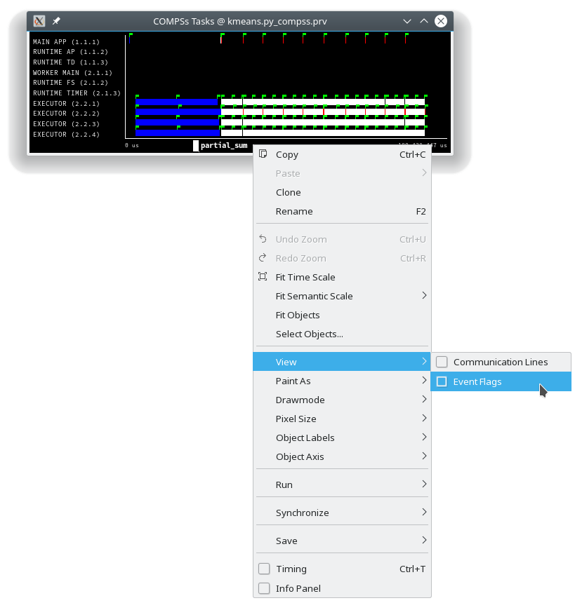

Visualization
=============

Paraver is the BSC tool for trace visualization. Trace events are
encoded in Paraver format (``.prv``) by the Extrae tool. Paraver is a
powerful tool and allows users to show many views of the trace data
using different configuration files. Users can manually load, edit or
create configuration files to obtain different tracing views.

The following subsections explain how to load a trace file into Paraver,
open the task events view using an already predefined configuration
file, and how to adjust the view to display the data properly.

For further information about Paraver, please visit the following site:

http://www.bsc.es/computer-sciences/performance-tools/paraver

Trace Loading
-------------

The final trace file in Paraver format (.prv) is at the base log folder
of the application execution inside the trace folder. The fastest way to
open it is calling the Paraver binary directly using the tracefile name
as the argument.

.. code-block:: console

    $ wxparaver /path/to/trace/trace.prv

.. TIP::

    The path where the traces are usually located is
    ``${HOME}/.COMPSs/<APPLICATION_NAME_INFO>/trace/``.

    Where <APPLICATION_NAME_INFO> represents the executed application name and
    some information, such as the execution number or deployment information
    (e.g. number of nodes) and the generation time.

Configurations
--------------

To see the different events, counters and communications that the
runtime generates, diverse configurations are available with the COMPSs
installation. To open one of them, go to the "Load Configuration" option
in the main window and select "File". The configuration files are under
the following path for the default installation
``/opt/COMPSs/Dependencies/paraver/cfgs/``. A detailed list of all
the available configurations can be found in
:ref:`Sections/05_Tracing/06_Paraver_configs:Paraver: configurations`.

The following guide uses a kmeans trace (result from executing the
:ref:`Sections/07_Sample_Applications/02_Python/kmeans:Kmeans` sample code with
the ``--tracing`` flag.) with the *compss_tasks.cfg* configuration file as an
example to illustrate the basic usage of Paraver. After accepting the load of
the configuration file, another window appears showing the view.
:numref:`1_paraver` and :numref:`2_kmeans_trace` show an example of this
process.

   Paraver menu

   Kmeans Trace file

.. CAUTION::

    In a Paraver view, a red exclamation sign may appear in the bottom-left
    corner. This means that some event values are not being shown
    (because they are out of the current view scope), so little adjustments
    must be made to view the trace correctly:

    -  Fit window: modifies the view scope to fit and display all the events
       in the current window.

       -  Right click on the trace window

       -  Choose the option Fit Semantic Scale / Fit Both

View Adjustment
---------------

-  View Event Flags: marks with a green flag all the emitted events.

   -  Right click on the trace window

   -  Chose the option View / Event Flags

   Paraver view adjustment: View Event Flags

-  Show Info Panel: display the information panel. In the tab "Colors"
   we can see the legend of the colors shown in the view.

   -  Right click on the trace window

   -  Check the Info Panel option

   -  Select the Colors tab in the panel

   Paraver view adjustment: Show info panel

-  Zoom: explore the tracefile more in-depth by zooming into the most
   relevant sections.

   -  Select a region in the trace window to see that region in detail

   -  Repeat the previous step as many times as needed

   -  The undo-zoom option is in the right click panel

   Paraver view adjustment: Zoom configuration

   Paraver view adjustment: Zoom result
