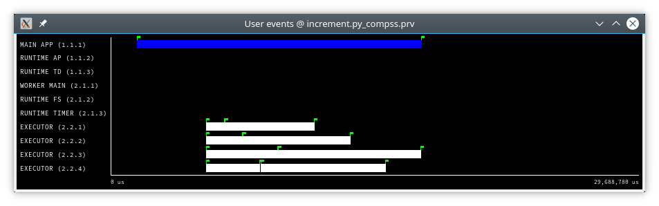

User Events in Python
=====================

Users can emit custom events inside their python **tasks**. Thanks to
the fact that python is not a compiled language, users can emit events
inside their own tasks using the available EXTRAE instrumentation object
because it is already loaded and available in the PYTHONPATH when
running with tracing enabled.  

To emit an event first import pyextrae:

  * ``import pyextrae.sequential as pyextrae`` to emit events from the main code.
  * ``import pyextrae.multiprocessing as pyextrae`` to emit events within tasks code.

And then just use the call ``pyextrae.event(type, id)`` (or
``pyextrae.eventandcounters (type, id)`` if you also want to emit PAPI
hardware counters).

.. TIP::

    It must be used a type number higher than ``8000050`` in order to avoid type
    conflicts.

    **We suggest to use** ``9100000`` since we provide the ``user_events.cfg``
    configuration file to visualize the user events of this type in PARAVER.

Events in main code
-------------------

The following code snippet shows how to emit an event from the main code (or
any other code which is not within a task). In this case it is necessary to
import ``pyextrae.sequential``.

.. code-block:: python

    from pycompss.api.api import compss_wait_on
    from pycompss.api.task import task
    import pyextrae.sequential as pyextrae

    @task(returns=1)
    def increment(value):
        return value + 1

    def main():
        value = 1
        pyextrae.eventandcounters(9100000, 2)
        result = increment(value)
        result = compss_wait_on(result)
        pyextrae.eventandcounters(9100000, 0)
        print("result: " + str(result))

    if __name__ == "__main__":
        main()

Events in task code
-------------------

The following code snippet shows how to emit an event from the task code.
In this case it is necessary to import ``pyextrae.multiprocessing``.

.. code-block:: python

    from pycompss.api.task import task

    @task()
    def compute():
        import pyextrae.multiprocessing as pyextrae
        pyextrae.eventandcounters(9100000, 2)
        ...
        # Code to wrap within event 2
        ...
        pyextrae.eventandcounters(9100000, 0)

.. CAUTION::

    Please, note that the ``import pyextrae.multiprocessing as pyextrae`` is
    performed within the task. If the user needs to add more events to tasks
    within the same module (excluding the applicatin main module) and wants to
    put this import in the top of the module making ``pyextrae`` available for
    all of them, it is necessary to enable the tracing hook on the tasks that
    emit events:

    .. code-block:: python

        from pycompss.api.task import task
        import pyextrae.multiprocessing as pyextrae

        @task(tracing_hook=True)
        def compute():
            pyextrae.eventandcounters(9100000, 2)
            ...
            # Code to wrap within event 2
            ...
            pyextrae.eventandcounters(9100000, 0)

    The ``tracing_hook`` is disabled by default in order to reduce the overhead
    introduced by tracing avoiding to intercept all function calls within the
    task code.

Result trace
------------

The events will appear automatically on the generated trace.
In order to visualize them, just load the ``user_events.cfg`` configuration file
in PARAVER.

If a different type value is choosen, take the same ``user_events.cfg`` and go
to ``Window Properties -> Filter -> Events`` ``-> Event Type`` and change
the value labeled *Types* for your custom events type.

.. TIP::

    If you want to name the events, you will need to manually add them to the
    ``.pcf`` file with the corresponding name for each ``value``.

Practical example
-----------------

Consider the following application where we define an event in the main code
(``1``) and another within the task (``2``).
The ``increment`` task is invoked 8 times (with a mimic computation time of
the value received as parameter.)

.. code-block:: python

    from pycompss.api.api import compss_wait_on
    from pycompss.api.task import task
    import time

    @task(returns=1)
    def increment(value):
        import pyextrae.multiprocessing as pyextrae
        pyextrae.eventandcounters(9100000, 2)
        time.sleep(value)  # mimic some computation
        pyextrae.eventandcounters(9100000, 0)
        return value + 1

    def main():
        import pyextrae.sequential as pyextrae
        elements = [1, 2, 3, 4, 5, 6, 7, 8]
        results = []
        pyextrae.eventandcounters(9100000, 1)
        for element in elements:
            results.append(increment(element))
        results = compss_wait_on(results)
        pyextrae.eventandcounters(9100000, 0)
        print("results: " + str(results))

    if __name__ == "__main__":
        main()

After launching with tracing enabled (``-t`` flag), the trace has been
generated into the logs folder:

    * ``$HOME/.COMPSs/events.py_01/trace`` if using ``runcompss``.

    * ``$HOME/.COMPSs/<JOB_ID>/trace`` if using ``enqueue_compss``.

Now it is time to modify the ``.pcf`` file including the folling text at
the end of the file with your favourite text editor:

.. code-block:: text

    EVENT_TYPE
    0    9100000    User events
    VALUES
    0      End
    1      Main code event
    2      Task event

.. CAUTION::

    Keep value 0 with the End message.

    Add all values defined in the application with a descriptive short
    name to ease the event identification in PARAVER.

Open PARAVER, load the tracefile (``.prv``) and open the ``user_events.cfg``
configuration file. The result (see :numref:`user_events`) shows that
there are 8 "Task event" (in white), and 1 "Main code event" (in blue) as
we expected.
Their length can be seen with the event flags (green flags), and measured
by double clicking on the event of interest.

   User events trace file

Paraver uses by default the ``.pcf`` with the same name as the tracefile so
if you add them to one, you can reuse it just by changing its name to
the tracefile.
