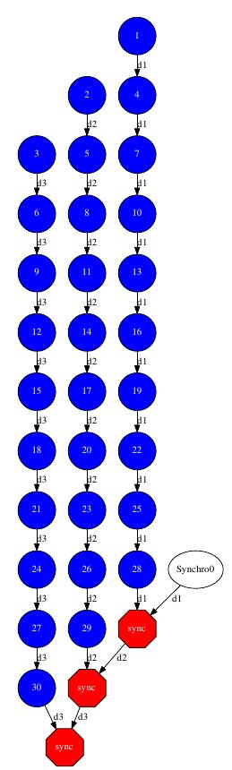

Python Sample applications
==========================

The first two examples in this section are simple applications developed
in COMPSs to easily illustrate how to code, compile and run COMPSs
applications. These applications are executed locally and show different
ways to take advantage of all the COMPSs features.

The rest of the examples are more elaborated and consider the execution
in a cloud platform where the VMs mount a common storage on
**/sharedDisk** directory. This is useful in the case of applications
that require working with big files, allowing to transfer data only
once, at the beginning of the execution, and to enable the application
to access the data directly during the rest of the execution.

The Virtual Machine available at our webpage (http://compss.bsc.es/)
provides a development environment with all the applications listed in
the following sections. The codes of all the applications can be found
under the ``/home/compss/tutorial_apps/python/`` folder.

Simple
------

The Simple application is a Python application that increases a counter
by means of a task. The counter is stored inside a file that is
transfered to the worker when the task is executed. Next, we provide the
main code and the task declaration:

.. code-block:: python

    from pycompss.api.task import task
    from pycompss.api.parameter import FILE_INOUT

    @task(filePath = FILE_INOUT)
    def increment(filePath):
        # Read value
        fis = open(filePath, 'r')
        value = fis.read()
        fis.close()

        # Write value
        fos = open(filePath, 'w')
        fos.write(str(int(value) + 1))
        fos.close()

    def main_program():
        from pycompss.api.api import compss_open

        # Check and get parameters
        if len(sys.argv) != 2:
            exit(-1)
        initialValue = sys.argv[1]

        fileName="counter"

        # Write value
        fos = open(fileName, 'w')
        fos.write(initialValue)
        fos.close()
        print "Initial counter value is " + initialValue

        # Execute increment
        increment(fileName)

        # Write new value
        fis = compss_open(fileName, 'r+')
        finalValue = fis.read()
        fis.close()
        print "Final counter value is " + finalValue

    if __name__=='__main__':
        main_program()

The simple application can be executed by invoking the runcompss command
with the ``--lang=python`` flag. The following lines provide an example of
its execution.

.. code-block:: console

    compss@bsc:~$ cd ~/tutorial_apps/python/simple/
    compss@bsc:~/tutorial_apps/python/simple$ runcompss --lang=python ~/tutorial_apps/python/simple/simple.py 1
    [  INFO] Using default execution type: compss
    [  INFO] Using default location for project file: /opt/COMPSs/Runtime/configuration/xml/projects/default_project.xml
    [  INFO] Using default location for resources file: /opt/COMPSs/Runtime/configuration/xml/resources/default_resources.xml

    ----------------- Executing simple.py --------------------------

    WARNING: COMPSs Properties file is null. Setting default values
    [(639)    API]  -  Starting COMPSs Runtime v<version>
    Initial counter value is 1
    Final counter value is 2
    [(6230)    API]  -  Execution Finished

    ------------------------------------------------------------

Increment
---------

The Increment application is a Python application that increases N times
three different counters. Each increase step is developed by a separated
task. The purpose of this application is to show parallelism between the
three counters.

Next we provide the main code of this application. The code inside the
*increment* task is the same than the previous example.

.. code-block:: python

    from pycompss.api.task import task
    from pycompss.api.parameter import FILE_INOUT

    @task(filePath = FILE_INOUT)
    def increment(filePath):
        # Read value
        fis = open(filePath, 'r')
        value = fis.read()
        fis.close()

        # Write value
        fos = open(filePath, 'w')
        fos.write(str(int(value) + 1))
        fos.close()

    def main_program():
        # Check and get parameters
        if len(sys.argv) != 5:
            exit(-1)
        N = int(sys.argv[1])
        counter1 = int(sys.argv[2])
        counter2 = int(sys.argv[3])
        counter3 = int(sys.argv[4])

        # Initialize counter files
        initializeCounters(counter1, counter2, counter3)
        print "Initial counter values:"
        printCounterValues()

        # Execute increment
        for i in range(N):
            increment(FILENAME1)
            increment(FILENAME2)
            increment(FILENAME3)

        # Write final counters state (sync)
        print "Final counter values:"
        printCounterValues()

    if __name__=='__main__':
        main_program()

As shown in the main code, this application has 4 parameters that stand
for:

#. **N:** Number of times to increase a counter

#. **counter1:** Initial value for counter 1

#. **counter2:** Initial value for counter 2

#. **counter3:** Initial value for counter 3

Next we run the Increment application with the *-g* option to be able to
generate the final graph at the end of the execution.

.. code-block:: console

    compss@bsc:~/tutorial_apps/python/increment$ runcompss --lang=python -g ~/tutorial_apps/python/increment/increment.py 10 1 2 3
    [  INFO] Using default execution type: compss
    [  INFO] Using default location for project file: /opt/COMPSs/Runtime/configuration/xml/projects/default_project.xml
    [  INFO] Using default location for resources file: /opt/COMPSs/Runtime/configuration/xml/resources/default_resources.xml

    ----------------- Executing increment.py --------------------------

    WARNING: COMPSs Properties file is null. Setting default values
    [(670)    API]  -  Starting COMPSs Runtime v<version>
    Initial counter values:
    - Counter1 value is 1
    - Counter2 value is 2
    - Counter3 value is 3
    Final counter values:
    - Counter1 value is 11
    - Counter2 value is 12
    - Counter3 value is 13
    [(7390)    API]  -  Execution Finished

    ------------------------------------------------------------

By running the *compss_gengraph* command users can obtain the task
graph of the above execution. Next we provide the set of commands to
obtain the graph show in :numref:`increment_python`.

.. code-block:: console

    compss@bsc:~$ cd ~/.COMPSs/increment.py_01/monitor/
    compss@bsc:~/.COMPSs/increment.py_01/monitor$ compss_gengraph complete_graph.dot
    compss@bsc:~/.COMPSs/increment.py_01/monitor$ evince complete_graph.pdf

   Python increment tasks graph
