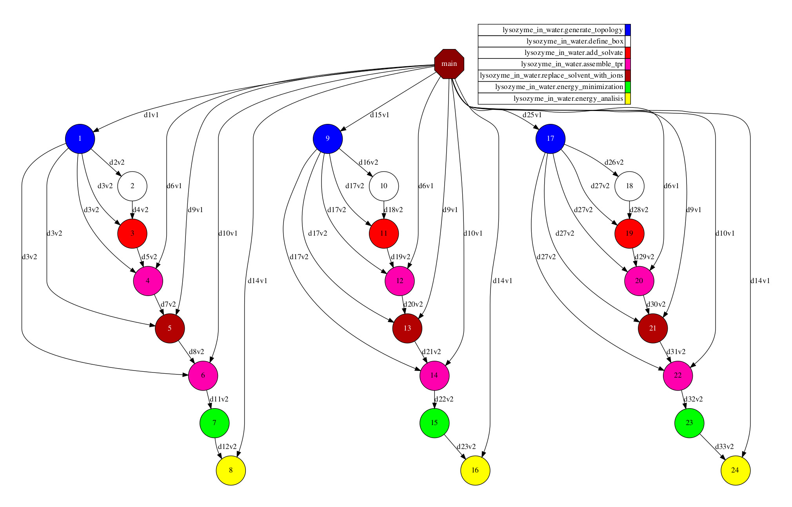
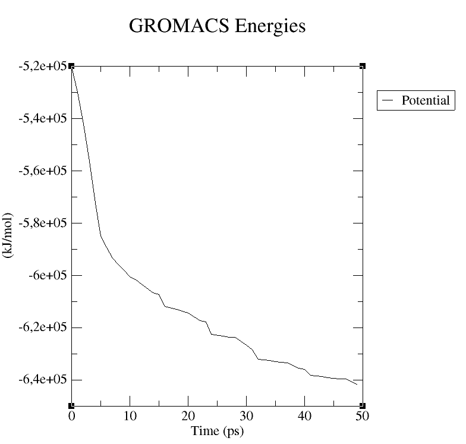

Lysozyme in water
-----------------

This example will guide a new user through the usage of the ``@binary``,
``@mpi`` and ``@constraint`` decorators for setting up a simulation system
containing a set of proteins (lysozymes) in boxes of water with ions.
Each step contains an explanation of input and output,
using typical settings for general use.

Extracted from: http://www.mdtutorials.com/gmx/lysozyme/index.html
Originally done by: Justin A. Lemkul, Ph.D.
From: Virginia Tech Department of Biochemistry

.. NOTE::

    This example reaches up to stage 4 (energy minimization).

.. IMPORTANT::

    This application requires **Gromacs** ``gmx`` and ``gmx_mpi``.

.. code-block:: python

    from os import listdir
    from os.path import isfile, join
    import sys

    from pycompss.api.task import task
    from pycompss.api.constraint import constraint
    from pycompss.api.binary import binary
    from pycompss.api.mpi import mpi
    from pycompss.api.parameter import *

    # ############ #
    # Step 1 tasks #
    # ############ #

    @binary(binary='${GMX_BIN}/gmx')
    @task(protein=FILE_IN,
          structure=FILE_OUT,
          topology=FILE_OUT)
    def generate_topology(mode='pdb2gmx',
                             protein_flag='-f', protein=None,
                             structure_flag='-o', structure=None,
                             topology_flag='-p', topology=None,
                             flags='-ignh',
                             forcefield_flag='-ff', forcefield='oplsaa',
                             water_flag='-water', water='spce'):
        # Command: gmx pdb2gmx -f protein.pdb -o structure.gro -p topology.top -ignh -ff amber03 -water tip3p
        pass

    # ############ #
    # Step 2 tasks #
    # ############ #

    @binary(binary='${GMX_BIN}/gmx')
    @task(structure=FILE_IN,
          structure_newbox=FILE_OUT)
    def define_box(mode='editconf',
                   structure_flag='-f', structure=None,
                   structure_newbox_flag='-o', structure_newbox=None,
                   center_flag='-c',
                   distance_flag='-d', distance='1.0',
                   boxtype_flag='-bt', boxtype='cubic'):
        # Command: gmx editconf -f structure.gro -o structure_newbox.gro -c -d 1.0 -bt cubic
        pass

    # ############ #
    # Step 3 tasks #
    # ############ #

    @binary(binary='${GMX_BIN}/gmx')
    @task(structure_newbox=FILE_IN,
          protein_solv=FILE_OUT,
          topology=FILE_IN)
    def add_solvate(mode='solvate',
                    structure_newbox_flag='-cp', structure_newbox=None,
                    configuration_solvent_flag='-cs', configuration_solvent='spc216.gro',
                    protein_solv_flag='-o', protein_solv=None,
                    topology_flag='-p', topology=None):
        # Command: gmx solvate -cp structure_newbox.gro -cs spc216.gro -o protein_solv.gro -p topology.top
        pass

    # ############ #
    # Step 4 tasks #
    # ############ #

    @binary(binary='${GMX_BIN}/gmx')
    @task(conf=FILE_IN,
          protein_solv=FILE_IN,
          topology=FILE_IN,
          output=FILE_OUT)
    def assemble_tpr(mode='grompp',
                    conf_flag='-f', conf=None,
                    protein_solv_flag='-c', protein_solv=None,
                    topology_flag='-p', topology=None,
                    output_flag='-o', output=None):
        # Command: gmx grompp -f ions.mdp -c protein_solv.gro -p topology.top -o ions.tpr
        pass

    @binary(binary='${GMX_BIN}/gmx')
    @task(ions=FILE_IN,
          output=FILE_OUT,
          topology=FILE_IN,
          group={Type:FILE_IN, StdIOStream:STDIN})
    def replace_solvent_with_ions(mode='genion',
                                  ions_flag='-s', ions=None,
                                  output_flag='-o', output=None,
                                  topology_flag='-p', topology=None,
                                  pname_flag='-pname', pname='NA',
                                  nname_flag='-nname', nname='CL',
                                  neutral_flag='-neutral',
                                  group=None):
        # Command: gmx genion -s ions.tpr -o 1AKI_solv_ions.gro -p topol.top -pname NA -nname CL -neutral < ../config/genion.group
        pass

    # ############ #
    # Step 5 tasks #
    # ############ #

    computing_units = "24"
    computing_nodes = "1"

    @constraint(computing_units=computing_units)
    @mpi(runner="mpirun", binary="gmx_mpi", computing_nodes=computing_nodes)
    @task(em=FILE_IN,
          em_energy=FILE_OUT)
    def energy_minimization(mode='mdrun',
                            verbose_flag='-v',
                            ompthreads_flag='-ntomp', ompthreads='0',
                            em_flag='-s', em=None,
                            em_energy_flag='-e', em_energy=None):
        # Command: gmx mdrun -v -s em.tpr
        pass

    # ############ #
    # Step 6 tasks #
    # ############ #

    @binary(binary='${GMX_BIN}/gmx')
    @task(em=FILE_IN,
          output=FILE_OUT,
          selection={Type:FILE_IN, StdIOStream:STDIN})
    def energy_analisis(mode='energy',
                        em_flag='-f', em=None,
                        output_flag='-o', output=None,
                        selection=None):
        # Command: gmx energy -f em.edr -o output.xvg
        pass

    # ############# #
    # MAIN FUNCTION #
    # ############# #

    def main(dataset_path, output_path, config_path):
        print("Starting demo")

        protein_names = []
        protein_pdbs = []

        # Look for proteins in the dataset folder
        for f in listdir(dataset_path):
            if isfile(join(dataset_path, f)):
                protein_names.append(f.split('.')[0])
                protein_pdbs.append(join(dataset_path, f))
        proteins = zip(protein_names, protein_pdbs)

        # Iterate over the proteins and process them
        result_image_paths = []
        for name, pdb in proteins:
            # 1st step - Generate topology
            structure = join(output_path, name + '.gro')
            topology = join(output_path, name + '.top')
            generate_topology(protein=pdb,
                              structure=structure,
                              topology=topology)
            # 2nd step - Define box
            structure_newbox = join(output_path, name + '_newbox.gro')
            define_box(structure=structure,
                       structure_newbox=structure_newbox)
            # 3rd step - Add solvate
            protein_solv = join(output_path, name + '_solv.gro')
            add_solvate(structure_newbox=structure_newbox,
                        protein_solv=protein_solv,
                        topology=topology)
            # 4th step - Add ions
            # Assemble with ions.mdp
            ions_conf = join(config_path, 'ions.mdp')
            ions = join(output_path, name + '_ions.tpr')
            assemble_tpr(conf=ions_conf,
                         protein_solv=protein_solv,
                         topology=topology,
                         output=ions)
            protein_solv_ions = join(output_path, name + '_solv_ions.gro')
            group = join(config_path, 'genion.group')   # 13 = SOL
            replace_solvent_with_ions(ions=ions,
                                      output=protein_solv_ions,
                                      topology=topology,
                                      group=group)
            # 5th step - Minimize energy
            # Reasemble with minim.mdp
            minim_conf = join(config_path, 'minim.mdp')
            em = join(output_path, name + '_em.tpr')
            assemble_tpr(conf=minim_conf,
                         protein_solv=protein_solv_ions,
                         topology=topology,
                         output=em)
            em_energy = join(output_path, name + '_em_energy.edr')
            energy_minimization(em=em,
                                em_energy=em_energy)
            # 6th step - Energy analysis (generate xvg image)
            energy_result = join(output_path, name + '_potential.xvg')
            energy_selection = join(config_path, 'energy.selection')  # 10 = potential
            energy_analisis(em=em_energy,
                            output=energy_result,
                            selection=energy_selection)

    if __name__=='__main__':
        config_path = sys.argv[1]
        dataset_path = sys.argv[2]
        output_path = sys.argv[3]

        main(dataset_path, output_path, config_path)

This application can be executed by invoking the ``runcompss`` command defining
the ``config_path``, ``dataset_path`` and ``output_path`` where the application
inputs and outputs are. For the sake of completeness, we show how to execute
this application in a Supercomputer. In this case, the execution will be
enqueued in the supercomputer queuing system (e.g. SLURM) through the use
of the ``enqueue_compss`` command, where all parameters used in runcompss
must appear, as well as some parameters required for the queuing system (e.g. walltime).

The following code shows a bash script to submit the execution in MareNostrum IV
supercomputer:

.. code-block:: bash

    #!/bin/bash -e

    # Define script variables
    scriptDir=$(pwd)/$(dirname $0)
    execFile=${scriptDir}/src/lysozyme_in_water.py
    appClasspath=${scriptDir}/src/
    appPythonpath=${scriptDir}/src/

    # Retrieve arguments
    numNodes=$1
    executionTime=$2
    tracing=$3

    # Leave application args on $@
    shift 3

    # Load necessary modules
    module purge
    module load intel/2017.4 impi/2017.4 mkl/2017.4 bsc/1.0
    module load COMPSs/2.6
    module load gromacs/2016.4   # exposes gmx_mpi binary

    export GMX_BIN=/home/user/lysozyme5.1.2/bin   # exposes gmx binary

    # Enqueue the application
    enqueue_compss \
    --num_nodes=$numNodes \
    --exec_time=$executionTime \
    --master_working_dir=. \
    --worker_working_dir=scratch \
    --tracing=$tracing \
    --graph=true \
    -d \
    --classpath=$appClasspath \
    --pythonpath=$appPythonpath \
    --lang=python \
    $execFile $@

    ######################################################
    # APPLICATION EXECUTION EXAMPLE
    # Call:
    #       ./launch_md.sh <NUMBER_OF_NODES> <EXECUTION_TIME> <TRACING> <CONFIG_PATH> <DATASET_PATH> <OUTPUT_PATH>
    #
    # Example:
    #       ./launch_md.sh 2 10 false $(pwd)/config/ $(pwd)/dataset/ $(pwd)/output/
    #
    #####################################################

Having the ``1aki.pdb``, ``1u3m.pdb`` and 1xyw.pdb`` proteins in the ``dataset``
folder, the execution of this script produces the submission of the job with
the following output:

.. code-block:: console

    $ ./launch_md.sh 2 10 false $(pwd)/config/ $(pwd)/dataset/ $(pwd)/output/

    remove mkl/2017.4 (LD_LIBRARY_PATH)
    remove impi/2017.4 (PATH, MANPATH, LD_LIBRARY_PATH)
    Set INTEL compilers as MPI wrappers backend
    load impi/2017.4 (PATH, MANPATH, LD_LIBRARY_PATH)
    load mkl/2017.4 (LD_LIBRARY_PATH)
    load java/8u131 (PATH, MANPATH, JAVA_HOME, JAVA_ROOT, JAVA_BINDIR, SDK_HOME, JDK_HOME, JRE_HOME)
    load papi/5.5.1 (PATH, LD_LIBRARY_PATH, C_INCLUDE_PATH)
    Loading default Python 2.7.13.
    * For alternative Python versions, please set the COMPSS_PYTHON_VERSION environment variable with 2, 3, 2-jupyter or 3-jupyter before loading the COMPSs module.
    load PYTHON/2.7.13 (PATH, MANPATH, LD_LIBRARY_PATH, LIBRARY_PATH, PKG_CONFIG_PATH, C_INCLUDE_PATH, CPLUS_INCLUDE_PATH, PYTHONHOME)
    load lzo/2.10 (LD_LIBRARY_PATH,PKG_CONFIG_PATH,CFLAGS,CXXFLAGS,LDFLAGS)
    load boost/1.64.0_py2 (LD_LIBRARY_PATH, LIBRARY_PATH, C_INCLUDE_PATH, CPLUS_INCLUDE_PATH, BOOST_ROOT)
    load COMPSs/2.6 (PATH, CLASSPATH, MANPATH, GAT_LOCATION, COMPSS_HOME, JAVA_TOOL_OPTIONS, LDFLAGS, CPPFLAGS)
    load gromacs/2016.4 (PATH, LD_LIBRARY_PATH)
    SC Configuration:          default.cfg
    JobName:                   COMPSs
    Queue:                     default
    Reservation:               disabled
    Num Nodes:                 2
    Num Switches:              0
    GPUs per node:             0
    Job dependency:            None
    Exec-Time:                 00:10:00
    QoS:                       debug
    Constraints:               disabled
    Storage Home:              null
    Storage Properties:
    Other:
    			--sc_cfg=default.cfg
    			--qos=debug
    			--master_working_dir=.
    			--worker_working_dir=/gpfs/home/user/lysozyme
    			--tracing=false
    			--graph=true
    			--classpath=/home/user/lysozyme/./src/
    			--pythonpath=/home/user/lysozyme/./src/
    			--lang=python /home/user/lysozyme/./src/lysozyme_in_water.py /home/user/lysozyme/config/ /home/user/lysozyme/dataset/ /home/user/lysozyme/output/

    Temp submit script is: /scratch/tmp/tmp.sMHLsaTUJj
    Requesting 96 processes
    Submitted batch job 10178129

Once executed, it produces the ``compss-10178129.out`` file, containing all the
standard output messages flushed during the execution:

.. code-block:: console

    $ cat compss-10178129.out

    ------ Launching COMPSs application ------
    [  INFO] Using default execution type: compss
    [  INFO] Relative Classpath resolved: /home/user/lysozyme/./src/:

    ----------------- Executing lysozyme_in_water.py --------------------------
    [(590)    API]  -  Starting COMPSs Runtime v2.6 (build 20191110-1437.rb64656e825a88a4b49e60e5e505999f7b9866662)
    Starting demo

    # Here it takes some time to process the dataset

    [(290788)    API]  -  Execution Finished

    ------------------------------------------------------------
    [LAUNCH_COMPSS] Waiting for application completion

Since the execution has been performed with the task dependency graph generation
enabled, the result is depicted in :numref:`lysozyme_python`. It can be
identified that PyCOMPSs has been able to analyse the three given proteins
in parallel.

   Python Lysozyme in Water tasks graph

The output of the application is a set of files within the output folder.
It can be seen that the files decorated with *FILE_OUT* are stored in this
folder. In particular, potential (``.xvg``) files represent the final results
of the application, which can be visualized with GRACE.

.. code-block:: console

    user@login:~/lysozyme/output> ls -l
    total 79411
    -rw-r--r-- 1 user group    8976 may 19 17:06 1aki_em_energy.edr
    -rw-r--r-- 1 user group 1280044 may 19 17:03 1aki_em.tpr
    -rw-r--r-- 1 user group   88246 may 19 17:03 1aki.gro
    -rw-r--r-- 1 user group 1279304 may 19 17:03 1aki_ions.tpr
    -rw-r--r-- 1 user group   88246 may 19 17:03 1aki_newbox.gro
    -rw-r--r-- 1 user group    2141 may 19 17:06 1aki_potential.xvg  <-------
    -rw-r--r-- 1 user group 1525186 may 19 17:03 1aki_solv.gro
    -rw-r--r-- 1 user group 1524475 may 19 17:03 1aki_solv_ions.gro
    -rw-r--r-- 1 user group  577616 may 19 17:03 1aki.top
    -rw-r--r-- 1 user group  577570 ene 24 16:11 #1aki.top.1#
    -rw-r--r-- 1 user group  577601 may 19 16:59 #1aki.top.10#
    -rw-r--r-- 1 user group  577570 may 19 17:03 #1aki.top.11#
    -rw-r--r-- 1 user group  577601 may 19 17:03 #1aki.top.12#
    -rw-r--r-- 1 user group  577601 ene 24 16:11 #1aki.top.2#
    -rw-r--r-- 1 user group  577570 ene 24 16:20 #1aki.top.3#
    -rw-r--r-- 1 user group  577601 ene 24 16:20 #1aki.top.4#
    -rw-r--r-- 1 user group  577570 ene 24 16:25 #1aki.top.5#
    -rw-r--r-- 1 user group  577601 ene 24 16:25 #1aki.top.6#
    -rw-r--r-- 1 user group  577570 ene 24 16:31 #1aki.top.7#
    -rw-r--r-- 1 user group  577601 ene 24 16:31 #1aki.top.8#
    -rw-r--r-- 1 user group  577570 may 19 16:59 #1aki.top.9#
    -rw-r--r-- 1 user group    8976 may 19 17:08 1u3m_em_energy.edr
    -rw-r--r-- 1 user group 1416272 may 19 17:03 1u3m_em.tpr
    -rw-r--r-- 1 user group   82046 may 19 17:03 1u3m.gro
    -rw-r--r-- 1 user group 1415196 may 19 17:03 1u3m_ions.tpr
    -rw-r--r-- 1 user group   82046 may 19 17:03 1u3m_newbox.gro
    -rw-r--r-- 1 user group    2151 may 19 17:08 1u3m_potential.xvg  <-------
    -rw-r--r-- 1 user group 1837046 may 19 17:03 1u3m_solv.gro
    -rw-r--r-- 1 user group 1836965 may 19 17:03 1u3m_solv_ions.gro
    -rw-r--r-- 1 user group  537950 may 19 17:03 1u3m.top
    -rw-r--r-- 1 user group  537904 ene 24 16:11 #1u3m.top.1#
    -rw-r--r-- 1 user group  537935 may 19 16:59 #1u3m.top.10#
    -rw-r--r-- 1 user group  537904 may 19 17:03 #1u3m.top.11#
    -rw-r--r-- 1 user group  537935 may 19 17:03 #1u3m.top.12#
    -rw-r--r-- 1 user group  537935 ene 24 16:11 #1u3m.top.2#
    -rw-r--r-- 1 user group  537904 ene 24 16:20 #1u3m.top.3#
    -rw-r--r-- 1 user group  537935 ene 24 16:20 #1u3m.top.4#
    -rw-r--r-- 1 user group  537904 ene 24 16:25 #1u3m.top.5#
    -rw-r--r-- 1 user group  537935 ene 24 16:25 #1u3m.top.6#
    -rw-r--r-- 1 user group  537904 ene 24 16:31 #1u3m.top.7#
    -rw-r--r-- 1 user group  537935 ene 24 16:31 #1u3m.top.8#
    -rw-r--r-- 1 user group  537904 may 19 16:59 #1u3m.top.9#
    -rw-r--r-- 1 user group    8780 may 19 17:08 1xyw_em_energy.edr
    -rw-r--r-- 1 user group 1408872 may 19 17:03 1xyw_em.tpr
    -rw-r--r-- 1 user group   80112 may 19 17:03 1xyw.gro
    -rw-r--r-- 1 user group 1407844 may 19 17:03 1xyw_ions.tpr
    -rw-r--r-- 1 user group   80112 may 19 17:03 1xyw_newbox.gro
    -rw-r--r-- 1 user group    2141 may 19 17:08 1xyw_potential.xvg  <-------
    -rw-r--r-- 1 user group 1845237 may 19 17:03 1xyw_solv.gro
    -rw-r--r-- 1 user group 1845066 may 19 17:03 1xyw_solv_ions.gro
    -rw-r--r-- 1 user group  524026 may 19 17:03 1xyw.top
    -rw-r--r-- 1 user group  523980 ene 24 16:11 #1xyw.top.1#
    -rw-r--r-- 1 user group  524011 may 19 16:59 #1xyw.top.10#
    -rw-r--r-- 1 user group  523980 may 19 17:03 #1xyw.top.11#
    -rw-r--r-- 1 user group  524011 may 19 17:03 #1xyw.top.12#
    -rw-r--r-- 1 user group  524011 ene 24 16:11 #1xyw.top.2#
    -rw-r--r-- 1 user group  523980 ene 24 16:20 #1xyw.top.3#
    -rw-r--r-- 1 user group  524011 ene 24 16:20 #1xyw.top.4#
    -rw-r--r-- 1 user group  523980 ene 24 16:25 #1xyw.top.5#
    -rw-r--r-- 1 user group  524011 ene 24 16:25 #1xyw.top.6#
    -rw-r--r-- 1 user group  523980 ene 24 16:31 #1xyw.top.7#
    -rw-r--r-- 1 user group  524011 ene 24 16:31 #1xyw.top.8#
    -rw-r--r-- 1 user group  523980 may 19 16:59 #1xyw.top.9#

:numref:`1xyw_potential` depicts the potential results obtained for the
1xyw protein.

   1xyw Potential result (plotted with GRACE)
