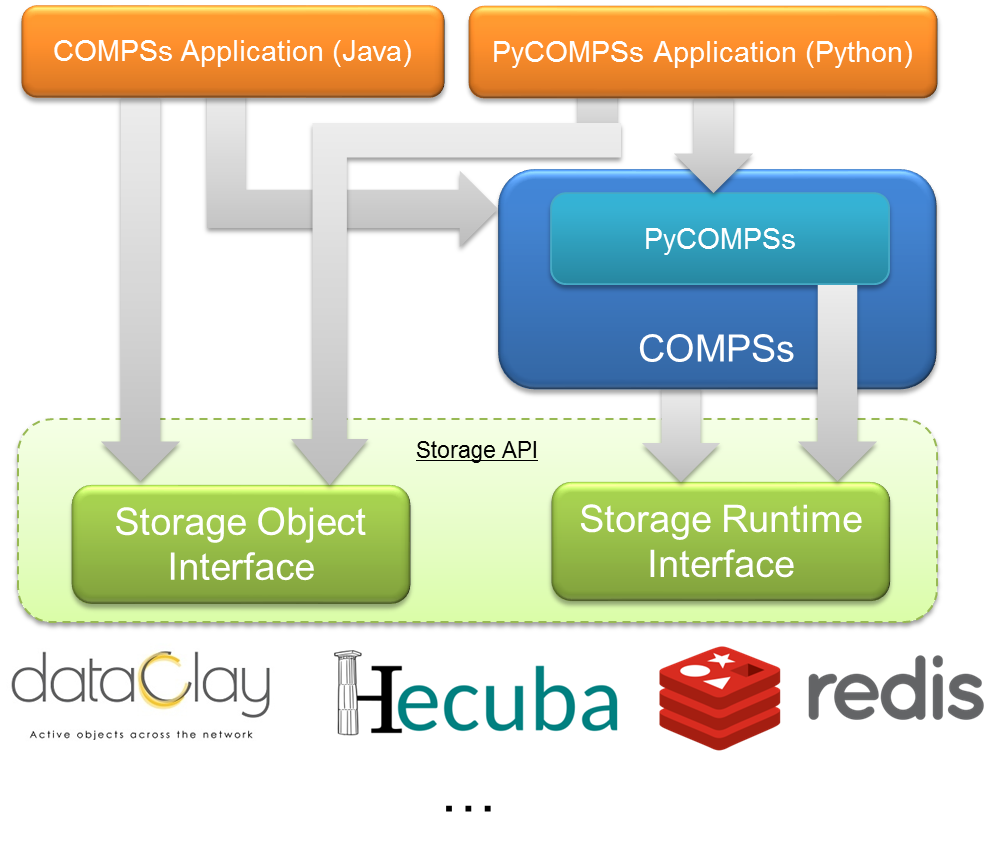

Storage Integration
===================

COMPSs relies on a Storage API to enable the interation with persistent storage
frameworks (:numref:`storage_architecture`), which is composed by two main
modules: *Storage Object Interface* (SOI) and *Storage Runtime Interface* (SRI)

   COMPSs with persistent storage architecture

Any COMPSs application aimed at using a persistent storage framework has to
include calls to the SOI, and relies on COMPSs, which interacts with the
persistent storage framework through the SRI.
In addition, it must be taken into account that the execution of an application
using a persistent storage framework requires some specific flags in
``runcompss`` and ``enqueue_compss``.

Currently, there exists storage interfaces for dataClay_, Hecuba_ and Redis_.
They are thoroughly described from the developer and user point of view in
:ref:`Sections/07_Persistent_Storage/02_COMPSs_dataClay:COMPSs + dataClay`,
:ref:`Sections/07_Persistent_Storage/03_COMPSs_Hecuba:COMPSs + Hecuba` and
:ref:`Sections/07_Persistent_Storage/04_COMPSs_Redis:COMPSs + Redis` Sections.

The interface is open to any other storage framework by implementing the
required functionalities described in
:ref:`Sections/07_Persistent_Storage/05_Own_interface:Implement your own Storage interface for COMPSs`.

.. _dataClay: https://www.bsc.es/research-and-development/software-and-apps/software-list/dataclay

.. _Hecuba: https://www.bsc.es/research-and-development/software-and-apps/software-list/hecuba

.. _Redis: https://redis.io/
