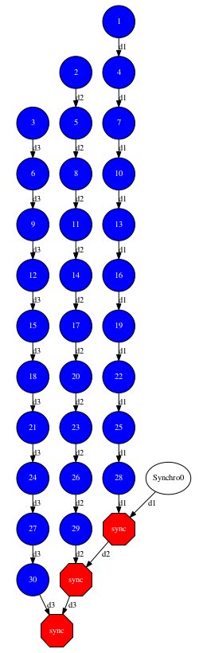

Increment
---------

The Increment application is a Java application that increases N times
three different counters. Each increase step is developed by a separated
task. The purpose of this application is to show parallelism between the
three counters.

Next we provide the main code of this application. The code inside the
*increment* task is the same than the previous example.

.. code-block:: java

    	// increment.Increment

    	public static void main(String[] args) throws Exception {
    		// Check and get parameters
    		if (args.length != 4) {
    			usage();
    			throw new Exception("[ERROR] Incorrect number of parameters");
    		}
    		int N = Integer.parseInt(args[0]);
    		int counter1 = Integer.parseInt(args[1]);
    		int counter2 = Integer.parseInt(args[2]);
    		int counter3 = Integer.parseInt(args[3]);

    		// Initialize counter files
    		System.out.println("Initial counter values:");
    		initializeCounters(counter1, counter2, counter3);

    		// Print initial counters state
    		printCounterValues();

    		// Execute increment tasks
    		for (int i = 0; i < N; ++i) {
    			IncrementImpl.increment(fileName1);
    			IncrementImpl.increment(fileName2);
    			IncrementImpl.increment(fileName3);
    		}

    		// Print final counters state (sync)
    		System.out.println("Final counter values:");
    		printCounterValues();
    	}

As shown in the main code, this application has 4 parameters that stand
for:

#. **N:** Number of times to increase a counter

#. **InitialValue1:** Initial value for counter 1

#. **InitialValue2:** Initial value for counter 2

#. **InitialValue3:** Initial value for counter 3

Next we will compile and run the Increment application with the *-g*
option to be able to generate the final graph at the end of the
execution.

.. code-block:: console

    compss@bsc:~$ cd ~/tutorial_apps/java/increment/src/main/java/increment/
    compss@bsc:~/tutorial_apps/java/increment/src/main/java/increment$ javac *.java
    compss@bsc:~/tutorial_apps/java/increment/src/main/java/increment$ cd ..
    compss@bsc:~/tutorial_apps/java/increment/src/main/java$ jar cf increment.jar increment
    compss@bsc:~/tutorial_apps/java/increment/src/main/java$ mv increment.jar ~/tutorial_apps/java/increment/jar/

    compss@bsc:~$ cd ~/tutorial_apps/java/increment/jar
    compss@bsc:~/tutorial_apps/java/increment/jar$ runcompss -g increment.Increment 10 1 2 3
    [  INFO] Using default execution type: compss
    [  INFO] Using default location for project file: /opt/COMPSs/Runtime/configuration/xml/projects/default_project.xml
    [  INFO] Using default location for resources file: /opt/COMPSs/Runtime/configuration/xml/resources/default_resources.xml

    ----------------- Executing increment.Increment --------------------------

    WARNING: COMPSs Properties file is null. Setting default values
    [(1028)    API]  -  Starting COMPSs Runtime v<version>
    Initial counter values:
    - Counter1 value is 1
    - Counter2 value is 2
    - Counter3 value is 3
    Final counter values:
    - Counter1 value is 11
    - Counter2 value is 12
    - Counter3 value is 13
    [(4403)    API]  -  Execution Finished

    ------------------------------------------------------------

By running the *compss_gengraph* command users can obtain the task
graph of the above execution. Next we provide the set of commands to
obtain the graph show in :numref:`increment_java`.

.. code-block:: console

    compss@bsc:~$ cd ~/.COMPSs/increment.Increment_01/monitor/
    compss@bsc:~/.COMPSs/increment.Increment_01/monitor$ compss_gengraph complete_graph.dot
    compss@bsc:~/.COMPSs/increment.Increment_01/monitor$ evince complete_graph.pdf

   Java increment tasks graph
