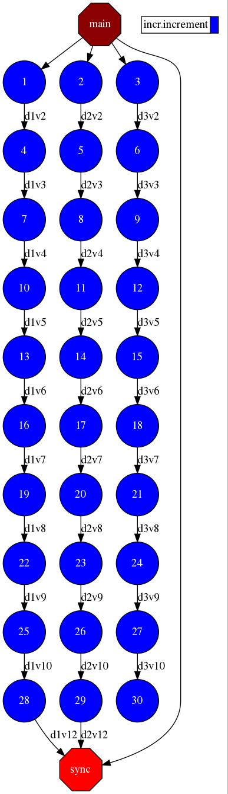

Increment
---------

The Increment application is a Python application that increases N times
three different counters. Each increase step is developed by a separated
task. The purpose of this application is to show parallelism between the
three counters.

Next we provide the main code of this application. The code inside the
*increment* task is the same than the previous example.

.. code-block:: python

    # IMPORTS
    import sys

    # PyCOMPSs imports
    from pycompss.api.task import task
    from pycompss.api.parameter import FILE_INOUT
    from pycompss.api.api import compss_open

    # GLOBAL VARIABLES
    FILENAME1 = "file1"
    FILENAME2 = "file2"
    FILENAME3 = "file3"

    @task(file_path=FILE_INOUT)
    def increment(file_path):
        """Increment the value contained within file_path.

        :param file_path: Path of the file that contains the value to be incremented.
        """
        # Read value
        fis = open(file_path, "r")
        value = fis.read()
        fis.close()

        # Write value
        fos = open(file_path, "w")
        fos.write(str(int(value) + 1))
        fos.close()

    def usage():
        """Show the application usage."""
        print("[ERROR] Bad numnber of parameters")
        print(
            "    Usage: increment <num_iterations> "
            "<counter_value_1> <counter_value_2> <counter_value_3>"
        )

    def initialize_counters(counter1, counter2, counter3):
        """Create the initial files with the given counter values.

        :param counter1: First counter.
        :param counter2: Second counter.
        :param counter3: Third counter.
        """
        # Write value counter 1
        fos = open(FILENAME1, "w")
        fos.write(str(counter1))
        fos.close()

        # Write value counter 2
        fos = open(FILENAME2, "w")
        fos.write(str(counter2))
        fos.close()

        # Write value counter 3
        fos = open(FILENAME3, "w")
        fos.write(str(counter3))
        fos.close()

    def print_counter_values():
        """Display the values contained in the counter files."""
        # Read value counter 1
        fis = compss_open(FILENAME1, "r+")
        counter1 = fis.read()
        fis.close()

        # Read value counter 1
        fis = compss_open(FILENAME2, "r+")
        counter2 = fis.read()
        fis.close()

        # Read value counter 1
        fis = compss_open(FILENAME3, "r+")
        counter3 = fis.read()
        fis.close()

        # Print values
        print("- Counter1 value is " + str(counter1))
        print("- Counter2 value is " + str(counter2))
        print("- Counter3 value is " + str(counter3))

    def main_program():
        """Main increment function."""

        # Check parameters
        if len(sys.argv) != 5:
            usage()
            raise Exception("ERROR: Please fix the input parameters.")

        # Get parameters
        num_iterations = int(sys.argv[1])
        counter1 = int(sys.argv[2])
        counter2 = int(sys.argv[3])
        counter3 = int(sys.argv[4])

        # Initialize counter files
        initialize_counters(counter1, counter2, counter3)
        print("Initial counter values:")
        print_counter_values()

        # Execute increment
        for _ in range(num_iterations):
            increment(FILENAME1)
            increment(FILENAME2)
            increment(FILENAME3)

        # Write final counters state (sync)
        print("Final counter values:")
        print_counter_values()

    if __name__ == "__main__":
        main_program()

As shown in the main code, this application has 4 parameters that stand for:

num_iterations
    Number of times to increase a counter

counter1
    Initial value for counter 1

counter2
    Initial value for counter 2

counter3
    Initial value for counter 3

Next we run the Increment application with the ``-g`` option to be able to
generate the final graph at the end of the execution.

.. code-block:: console

    compss@bsc:~/tutorial_apps/python/increment$ runcompss -g increment.py 10 1 2 3
    [ INFO ] Inferred PYTHON language
    [ INFO ] Using default location for project file: /opt/COMPSs//Runtime/configuration/xml/projects/default_project.xml
    [ INFO ] Using default location for resources file: /opt/COMPSs//Runtime/configuration/xml/resources/default_resources.xml
    [ INFO ] Using default execution type: compss

    ----------------- Executing incr.py --------------------------

    WARNING: COMPSs Properties file is null. Setting default values
    [(693)    API]  -  Starting COMPSs Runtime v3.0.rc2210 (build 20221026-1333.r8e1717372084e4c839cba4ab821c543c080cbd10)
    Initial counter values:
    - Counter1 value is 1
    - Counter2 value is 2
    - Counter3 value is 3
    Final counter values:
    - Counter1 value is 11
    - Counter2 value is 12
    - Counter3 value is 13
    [(9216)    API]  -  Execution Finished

    ------------------------------------------------------------

By running the ``compss_gengraph`` command users can obtain the task
graph of the above execution. Next we provide the set of commands to
obtain the graph show in :numref:`increment_python`.

.. code-block:: console

    compss@bsc:~$ cd ~/.COMPSs/increment.py_01/monitor/
    compss@bsc:~/.COMPSs/increment.py_01/monitor$ compss_gengraph complete_graph.dot
    compss@bsc:~/.COMPSs/increment.py_01/monitor$ evince complete_graph.pdf

   Python increment tasks graph
