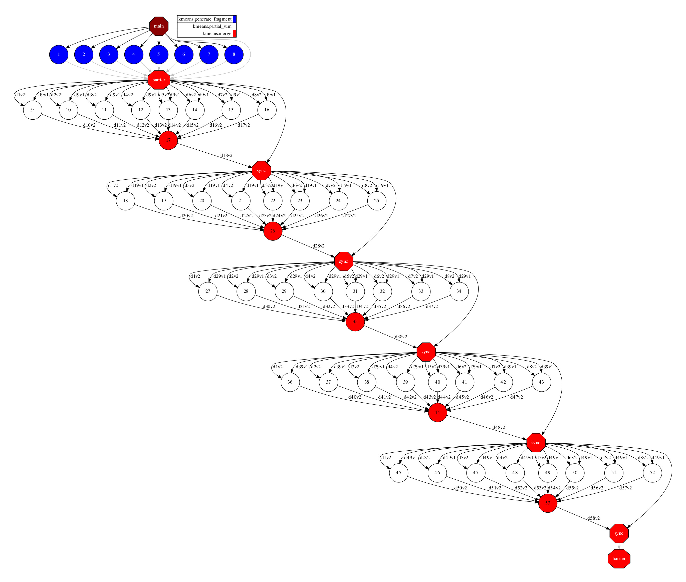

Kmeans
------

KMeans is machine-learning algorithm (NP-hard), popularly employed for cluster
analysis in data mining, and interesting for benchmarking and performance evaluation.

The objective of the Kmeans algorithm to group a set of multidimensional points
into a predefined number of clusters, in which each point belongs to the closest
cluster (with the nearest mean distance), in an iterative process.

.. code-block:: python

    import numpy as np
    import time

    from sklearn.metrics import pairwise_distances
    from sklearn.metrics.pairwise import paired_distances

    from pycompss.api.task import task
    from pycompss.api.api import compss_wait_on
    from pycompss.api.api import compss_barrier

    @task(returns=np.ndarray)
    def partial_sum(fragment, centres):
        partials = np.zeros((centres.shape[0], 2), dtype=object)
        close_centres = pairwise_distances(fragment, centres).argmin(axis=1)
        for center_idx, _ in enumerate(centres):
            indices = np.argwhere(close_centres == center_idx).flatten()
            partials[center_idx][0] = np.sum(fragment[indices], axis=0)
            partials[center_idx][1] = indices.shape[0]
        return partials

    @task(returns=dict)
    def merge(*data):
        accum = data[0].copy()
        for d in data[1:]:
            accum += d
        return accum

    def converged(old_centres, centres, epsilon, iteration, max_iter):
        if old_centres is None:
            return False
        dist = np.sum(paired_distances(centres, old_centres))
        return dist < epsilon**2 or iteration >= max_iter

    def recompute_centres(partials, old_centres, arity):
        centres = old_centres.copy()
        while len(partials) > 1:
            partials_subset = partials[:arity]
            partials = partials[arity:]
            partials.append(merge(*partials_subset))
        partials = compss_wait_on(partials)
        for idx, sum_ in enumerate(partials[0]):
            if sum_[1] != 0:
                centres[idx] = sum_[0] / sum_[1]
        return centres

    def kmeans_frag(
        fragments,
        dimensions,
        num_centres=10,
        iterations=20,
        seed=0.0,
        epsilon=1e-9,
        arity=50,
    ):
        """
        A fragment-based K-Means algorithm.
        Given a set of fragments, the desired number of clusters and the
        maximum number of iterations, compute the optimal centres and the
        index of the centre for each point.
        :param fragments: Number of fragments
        :param dimensions: Number of dimensions
        :param num_centres: Number of centres
        :param iterations: Maximum number of iterations
        :param seed: Random seed
        :param epsilon: Epsilon (convergence distance)
        :param arity: Reduction arity
        :return: Final centres
        """
        # Set the random seed
        np.random.seed(seed)
        # Centres is usually a very small matrix, so it is affordable to have it in
        # the master.
        centres = np.asarray([np.random.random(dimensions) for _ in range(num_centres)])
        # Note: this implementation treats the centres as files, never as PSCOs.
        old_centres = None
        iteration = 0
        while not converged(old_centres, centres, epsilon, iteration, iterations):
            print("Doing iteration #%d/%d" % (iteration + 1, iterations))
            old_centres = centres.copy()
            partials = []
            for frag in fragments:
                partial = partial_sum(frag, old_centres)
                partials.append(partial)
            centres = recompute_centres(partials, old_centres, arity)
            iteration += 1
        return centres

    def parse_arguments():
        """
        Parse command line arguments. Make the program generate
        a help message in case of wrong usage.
        :return: Parsed arguments
        """
        import argparse

        parser = argparse.ArgumentParser(description="KMeans Clustering.")
        parser.add_argument(
            "-s", "--seed", type=int, default=0, help="Pseudo-random seed. Default = 0"
        )
        parser.add_argument(
            "-n",
            "--numpoints",
            type=int,
            default=100,
            help="Number of points. Default = 100",
        )
        parser.add_argument(
            "-d",
            "--dimensions",
            type=int,
            default=2,
            help="Number of dimensions. Default = 2",
        )
        parser.add_argument(
            "-c",
            "--num_centres",
            type=int,
            default=5,
            help="Number of centres. Default = 2",
        )
        parser.add_argument(
            "-f",
            "--fragments",
            type=int,
            default=10,
            help="Number of fragments." + " Default = 10. Condition: fragments < points",
        )
        parser.add_argument(
            "-m",
            "--mode",
            type=str,
            default="uniform",
            choices=["uniform", "normal"],
            help="Distribution of points. Default = uniform",
        )
        parser.add_argument(
            "-i", "--iterations", type=int, default=20, help="Maximum number of iterations"
        )
        parser.add_argument(
            "-e",
            "--epsilon",
            type=float,
            default=1e-9,
            help="Epsilon. Kmeans will stop when:" + " |old - new| < epsilon.",
        )
        parser.add_argument(
            "-a",
            "--arity",
            type=int,
            default=50,
            help="Arity of the reduction carried out during \
                            the computation of the new centroids",
        )
        return parser.parse_args()

    @task(returns=1)
    def generate_fragment(points, dim, mode, seed):
        """
        Generate a random fragment of the specified number of points using the
        specified mode and the specified seed. Note that the generation is
        distributed (the master will never see the actual points).
        :param points: Number of points
        :param dim: Number of dimensions
        :param mode: Dataset generation mode
        :param seed: Random seed
        :return: Dataset fragment
        """
        # Random generation distributions
        rand = {
            "normal": lambda k: np.random.normal(0, 1, k),
            "uniform": lambda k: np.random.random(k),
        }
        r = rand[mode]
        np.random.seed(seed)
        mat = np.asarray([r(dim) for __ in range(points)])
        # Normalize all points between 0 and 1
        mat -= np.min(mat)
        mx = np.max(mat)
        if mx > 0.0:
            mat /= mx

        return mat

    def main(
        seed,
        numpoints,
        dimensions,
        num_centres,
        fragments,
        mode,
        iterations,
        epsilon,
        arity,
    ):
        """
        This will be executed if called as main script. Look at the kmeans_frag
        for the KMeans function.
        This code is used for experimental purposes.
        I.e it generates random data from some parameters that determine the size,
        dimensionality and etc and returns the elapsed time.
        :param seed: Random seed
        :param numpoints: Number of points
        :param dimensions: Number of dimensions
        :param num_centres: Number of centres
        :param fragments: Number of fragments
        :param mode: Dataset generation mode
        :param iterations: Number of iterations
        :param epsilon: Epsilon (convergence distance)
        :param arity: Reduction arity
        :return: None
        """
        start_time = time.time()

        # Generate the data
        fragment_list = []
        # Prevent infinite loops
        points_per_fragment = max(1, numpoints // fragments)

        for l in range(0, numpoints, points_per_fragment):
            # Note that the seed is different for each fragment.
            # This is done to avoid having repeated data.
            r = min(numpoints, l + points_per_fragment)

            fragment_list.append(generate_fragment(r - l, dimensions, mode, seed + l))

        compss_barrier()
        print("Generation/Load done")
        initialization_time = time.time()
        print("Starting kmeans")

        # Run kmeans
        centres = kmeans_frag(
            fragments=fragment_list,
            dimensions=dimensions,
            num_centres=num_centres,
            iterations=iterations,
            seed=seed,
            epsilon=epsilon,
            arity=arity,
        )
        compss_barrier()
        print("Ending kmeans")
        kmeans_time = time.time()

        print("-----------------------------------------")
        print("-------------- RESULTS ------------------")
        print("-----------------------------------------")
        print("Initialization time: %f" % (initialization_time - start_time))
        print("Kmeans time: %f" % (kmeans_time - initialization_time))
        print("Total time: %f" % (kmeans_time - start_time))
        print("-----------------------------------------")
        centres = compss_wait_on(centres)
        print("CENTRES:")
        print(centres)
        print("-----------------------------------------")

    if __name__ == "__main__":
        options = parse_arguments()
        main(**vars(options))

The kmeans application can be executed by invoking the ``runcompss`` command
with the desired parameters (in this case we use ``-g`` to generate the
task depedency graph) and application.
The following lines provide an example of its execution considering 10M points,
of 3 dimensions, divided into 8 fragments, looking for 8 clusters and a maximum
number of iterations set to 10.

.. code-block:: console

    compss@bsc:~$ runcompss -g kmeans.py -n 10240000 -f 8 -d 3 -c 8 -i 10
    [ INFO ] Inferred PYTHON language
    [ INFO ] Using default location for project file: /opt/COMPSs//Runtime/configuration/xml/projects/default_project.xml
    [ INFO ] Using default location for resources file: /opt/COMPSs//Runtime/configuration/xml/resources/default_resources.xml
    [ INFO ] Using default execution type: compss

    ----------------- Executing kmeans.py --------------------------

    WARNING: COMPSs Properties file is null. Setting default values
    [(877)    API]  -  Starting COMPSs Runtime v3.1 (build 20221107-1044.r7c414d34bd2ef4525a7146fbb80f57111e10f780)
    Generation/Load done
    Starting kmeans
    Doing iteration #1/10
    Doing iteration #2/10
    Doing iteration #3/10
    Doing iteration #4/10
    Doing iteration #5/10
    Doing iteration #6/10
    Doing iteration #7/10
    Doing iteration #8/10
    Doing iteration #9/10
    Doing iteration #10/10
    Ending kmeans
    -----------------------------------------
    -------------- RESULTS ------------------
    -----------------------------------------
    Initialization time: 11.720157
    Kmeans time: 21.592080
    Total time: 33.312237
    -----------------------------------------
    CENTRES:
    [[0.69828619 0.74530239 0.48171237]
     [0.54765031 0.20253203 0.21191319]
     [0.24201614 0.74466519 0.75560619]
     [0.21853824 0.66978432 0.23275263]
     [0.7724606  0.68585097 0.16247501]
     [0.22674374 0.23357703 0.67253838]
     [0.75316023 0.73748642 0.83358697]
     [0.75816592 0.23837464 0.71580623]]
    -----------------------------------------
    [(39715)    API]  -  Execution Finished

    ------------------------------------------------------------

:numref:`kmeans_python` depicts the generated task dependency graph. The dataset
generation can be identified in the 8 blue tasks, while the five iterations
appear next. Between the iteration there is a synchronization which corresponds
to the convergence/max iterations check.

   Python kmeans tasks graph
