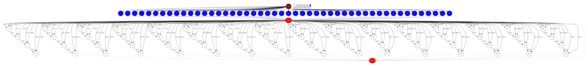

Matmul
------

The matmul performs the matrix multiplication of two matrices.

.. code-block:: python

    import time
    import numpy as np

    from pycompss.api.task import task
    from pycompss.api.parameter import INOUT
    from pycompss.api.api import compss_barrier
    from pycompss.api.api import compss_wait_on

    @task(returns=1)
    def generate_block(size, num_blocks, seed=0, set_to_zero=False):
        """
        Generate a square block of given size.
        :param size: <Integer> Block size
        :param num_blocks: <Integer> Number of blocks
        :param seed: <Integer> Random seed
        :param set_to_zero: <Boolean> Set block to zeros
        :return: Block
        """
        np.random.seed(seed)
        if not set_to_zero:
            b = np.random.random((size, size))
            # Normalize matrix to ensure more numerical precision
            b /= np.sum(b) * float(num_blocks)
        else:
            b = np.zeros((size, size))
        return b

    @task(C=INOUT)
    def fused_multiply_add(A, B, C):
        """
        Multiplies two Blocks and accumulates the result in an INOUT Block (FMA).
        :param A: Block A
        :param B: Block B
        :param C: Result Block
        :return: None
        """
        C += np.dot(A, B)

    def dot(A, B, C):
        """
        A COMPSs blocked matmul algorithm.
        :param A: Block A
        :param B: Block B
        :param C: Result Block
        :return: None
        """
        n, m = len(A), len(B[0])
        # as many rows as A, as many columns as B
        for i in range(n):
            for j in range(m):
                for k in range(n):
                    fused_multiply_add(A[i][k], B[k][j], C[i][j])

    def main(num_blocks, elems_per_block, seed):
        """
        Matmul main.
        :param num_blocks: <Integer> Number of blocks
        :param elems_per_block: <Integer> Number of elements per block
        :param seed: <Integer> Random seed
        :return: None
        """
        start_time = time.time()

        # Generate the dataset in a distributed manner
        # i.e: avoid having the master a whole matrix
        A, B, C = [], [], []
        matrix_name = ["A", "B"]
        for i in range(num_blocks):
            for l in [A, B, C]:
                l.append([])
            # Keep track of blockId to initialize with different random seeds
            bid = 0
            for j in range(num_blocks):
                for ix, l in enumerate([A, B]):
                    l[-1].append(generate_block(elems_per_block,
                                                num_blocks,
                                                seed=seed + bid))
                    bid += 1
                C[-1].append(generate_block(elems_per_block,
                                            num_blocks,
                                            set_to_zero=True))
        compss_barrier()
        initialization_time = time.time()

        # Do matrix multiplication
        dot(A, B, C)

        compss_barrier()
        multiplication_time = time.time()

        print("-----------------------------------------")
        print("-------------- RESULTS ------------------")
        print("-----------------------------------------")
        print("Initialization time: %f" % (initialization_time -
                                           start_time))
        print("Multiplication time: %f" % (multiplication_time -
                                           initialization_time))
        print("Total time: %f" % (multiplication_time - start_time))
        print("-----------------------------------------")

    def parse_args():
        """
        Arguments parser.
        Code for experimental purposes.
        :return: Parsed arguments.
        """
        import argparse
        description = 'COMPSs blocked matmul implementation'
        parser = argparse.ArgumentParser(description=description)
        parser.add_argument('-b', '--num_blocks', type=int, default=1,
                            help='Number of blocks (N in NxN)'
                            )
        parser.add_argument('-e', '--elems_per_block', type=int, default=2,
                            help='Elements per block (N in NxN)'
                            )
        parser.add_argument('--seed', type=int, default=0,
                            help='Pseudo-Random seed'
                            )
        return parser.parse_args()

    if __name__ == "__main__":
        opts = parse_args()
        main(**vars(opts))

The matrix multiplication application can be executed by invoking the
``runcompss`` command with the desired parameters (in this case we use ``-g``
to generate the task depedency graph) and application.
The following lines provide an example of its execution considering 4 x 4 Blocks
of 1024 x 1024 elements each block, which conforms matrices of 4096 x 4096 elements.

.. code-block:: console

    compss@bsc:~$ runcompss -g matmul.py -b 4 -e 1024

    [  INFO] Inferred PYTHON language
    [  INFO] Using default location for project file: /opt/COMPSs//Runtime/configuration/xml/projects/default_project.xml
    [  INFO] Using default location for resources file: /opt/COMPSs//Runtime/configuration/xml/resources/default_resources.xml
    [  INFO] Using default execution type: compss

    ----------------- Executing matmul.py --------------------------

    WARNING: COMPSs Properties file is null. Setting default values
    [(439)    API]  -  Starting COMPSs Runtime v2.6.rc2005 (build 20200519-1005.r6093e5ac94d67250e097a6fad9d3ec00d676fe6c)
    -----------------------------------------
    -------------- RESULTS ------------------
    -----------------------------------------
    Initialization time: 4.112615
    Multiplication time: 2.366103
    Total time: 6.478717
    -----------------------------------------
    [(5609)    API]  -  Execution Finished

    ------------------------------------------------------------

:numref:`matmul_python` depicts the generated task dependency graph. The dataset
generation can be identified in the blue tasks, while the white tasks represent
the multiplication of a block with another.

   Python matrix multiplication tasks graph
