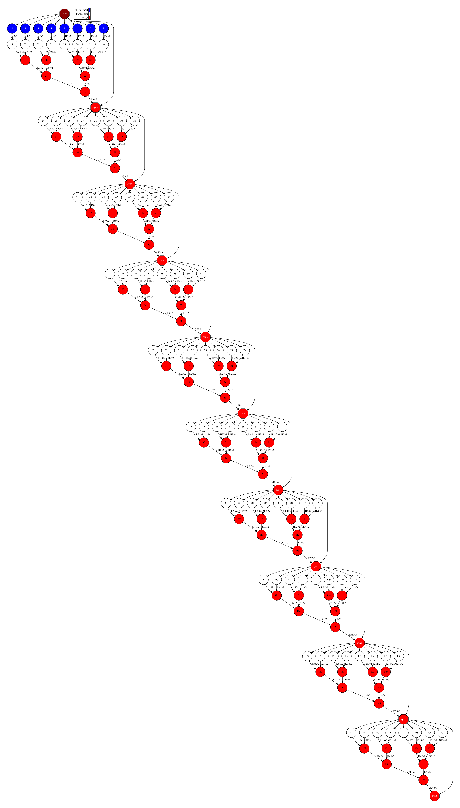

KMeans
------

KMeans is machine-learning algorithm (NP-hard), popularly employed for cluster
analysis in data mining, and interesting for benchmarking and performance evaluation.

The objective of the KMeans algorithm to group a set of multidimensional points
into a predefined number of clusters, in which each point belongs to the closest
cluster (with the nearest mean distance), in an iterative process.

.. code-block:: r
    :caption: ``tasks_kmeans.R``

    # Copyright (c) 2025- King Abdullah University of Science and Technology,
    # All rights reserved.
    # RCOMPSs is a software package, provided by King Abdullah University of Science and Technology (KAUST) - STSDS Group.

    # @file tasks_kmeans.R
    # @brief This file contains the tasks of the K-means clustering application
    # @version 1.0
    # @author Xiran Zhang
    # @date 2025-04-28

    DEBUG <- list(
        partial_sum = FALSE,
        merge = FALSE,
        converged = FALSE,
        recompute_centres = FALSE,
        kmeans_frag = FALSE
    )

    fill_fragment <- function(params_fill_fragment){

        centres <- params_fill_fragment[[1]]
        n <- params_fill_fragment[[2]]
        mode <- params_fill_fragment[[3]]

        # Obtain necessary numbers
        ncluster <- nrow(centres)
        dim <- ncol(centres)

        # Random generation distributions
        rand <- list(
                    "normal" = function(k) rnorm(k, mean = 0, sd = 0.05),
                    "uniform" = function(k) runif(k, 0, 0.1)
        )

        # Initialize the random points
        frag <- matrix(rand[[mode]](n * dim), nrow = n, ncol = dim)

        # Assign to different groups
        group_ind <- sample(1:ncluster, n, replace = TRUE)
        frag <- frag + centres[group_ind, ]

        return(frag)
    }

    partial_sum <- function(fragment, centres) {

        # Get necessary parameters
        ncl <- nrow(centres)
        if(ncol(fragment) != ncol(centres)) {
            stop("fragment and centres must have the same number of columns\nNow fragment has <", ncol(fragment), "> columns and centres has <", ncol(centres), "> columns\n", sep = "")
        }else{
            dimension <- ncol(fragment)
        }
        if(DEBUG$partial_sum) {
            cat("Doing partial sum\n")
            cat("nrow(centres) =", nrow(centres), "\n")
            cat(paste0("dimension = ", dimension, "\n"))
            cat(paste0("typeof(fragment) = ", typeof(fragment), "; ", "typeof(centres) = ", typeof(centres), "\n"))
            cat("fragment:\n")
            #print(fragment)
            cat("centres:\n")
            print(centres)
        }

        partials <- matrix(nrow = ncl, ncol = dimension + 1)
        if(DEBUG$partial_sum) {
            cat("partials in partial_sum after initialization (should be full of NAs)\n")
            print(partials)
        }
        close_centres <- apply(proxy::dist(fragment, centres, method = "euclidean"), 1, which.min)

        if(DEBUG$partial_sum) {
            cat("close_centres\n")
            print(close_centres)
        }
        for (center_idx in 1:ncl) {
            if(DEBUG$partial_sum) {
                cat("center_idx =", center_idx, "\n")
            }
            indices <- which(close_centres == center_idx)
            if(DEBUG$partial_sum) {
                cat("indices:", indices, "\n")
                cat("fragment[indices, ]\n")
                print(fragment[indices, ])
            }
            # Check if there is any empty cluster
            if(length(indices) == 0){
                partials[center_idx,] <- 0
            }else if(length(indices) == 1){
                partials[center_idx, 1:dimension] <- fragment[indices, ]
                partials[center_idx, dimension + 1] <- 1
            }else{
                if(DEBUG$partial_sum) {
                    cat("colSums:", "\n")
                    print(colSums(fragment[indices, ]))
                    cat("length(indices):", "\n")
                    print(length(indices))
                }
                partials[center_idx, 1:dimension] <- colSums(fragment[indices, ])
                partials[center_idx, dimension + 1] <- length(indices)
            }
        }
        if(DEBUG$partial_sum) {
            cat("partials in partial_sum after computation\n")
            print(partials)
        }
        return(partials)
    }

    merge2 <- function(partial1, partial2) {
        if(DEBUG$merge) {
            cat("Doing merge2\n")
            print(partial1)
            print(partial2)
        }
        accum <- partial1 + partial2
        if(DEBUG$merge) {
            cat("accum\n")
            print(accum)
        }
        return(accum)
    }

    merge <- function(...){
        input <- list(...)
        input_len <- length(input)
        if(DEBUG$merge) {
            cat("Doing merge\n")
            for(i in 1:input_len){
                cat("Input", i, "\n")
                print(input[[i]])
            }
        }
        if(input_len == 1){
            return(input[[1]])
        }else if(input_len >= 2){
            accum <- input[[1]]
            for(i in 2:input_len){
                accum <- accum + input[[i]]
            }
            if(DEBUG$merge) {
                cat("accum\n")
                print(accum)
            }
            return(accum)
        }else{
            stop("Wrong input in `merge`!\n")
        }
    }

.. code-block:: r
    :caption: ``functions_kmeans.R``

    # Copyright (c) 2025- King Abdullah University of Science and Technology,
    # All rights reserved.
    # RCOMPSs is a software package, provided by King Abdullah University of Science and Technology (KAUST) - STSDS Group.

    # @file functions_kmeans.R
    # @brief This file contains the functions for the K-means clustering application
    # @version 1.0
    # @author Xiran Zhang
    # @date 2025-04-28

    converged <- function(old_centres, centres, epsilon, iteration, max_iter) {
        if(DEBUG$converged) {
            cat("Doing converged\n")
        }
        if(is.null(old_centres)) {
            return(FALSE)
        }
        dist <- sum(rowSums((centres - old_centres)^2))
        if(dist < epsilon^2){
            cat("Converged!\n")
            End <- TRUE
        }else if(iteration >= max_iter){
            cat("Max iteration reached!\n")
            End <- TRUE
        }else{
            End <- FALSE
        }
        return(End)
    }

    recompute_centres <- function(partials, old_centres, arity) {
        if(DEBUG$recompute_centres){
            cat("\n\n+++++++++++++++++++++++++++++++++++++++++++++++++++++++++\n")
            cat("Doing recompute centres\n")
            cat("partials:\n")
            print(partials)
            cat("old_centres:\n")
            print(old_centres)
            cat("arity:\n")
            print(arity)
        }
        dimension <- ncol(old_centres)
        centres <- old_centres
        if(DEBUG$recompute_centres){
            cat("length(partials) =", length(partials), "\n")
            cat("arity =", arity, "\n\n")
        }

        while(length(partials) > arity) {
            if(DEBUG$recompute_centres >= 2){
                cat("\npartials in recompute_centres\n")
                print(partials)
            }
            if(DEBUG$recompute_centres >= 1){
                cat("length(partials) > arity\n")
            }
            partials_subset <- partials[1:arity]
            if(DEBUG$recompute_centres >= 1){
                cat("partials_subset\n")
                print(partials_subset)
            }
            partials <- partials[(arity + 1):length(partials)]
            if(use_RCOMPSs){
                partials[[length(partials) + 1]] <- do.call(task.merge, partials_subset)
            }else{
                partials[[length(partials) + 1]] <- do.call(merge, partials_subset)
            }
        }
        if(DEBUG$recompute_centres >= 1){
            cat("length(partials) <= arity\n")
        }
        if(use_RCOMPSs){
            partials <- do.call(task.merge, partials)
            partials <- compss_wait_on(partials)
        }else{
            partials <- do.call(merge, partials)
        }
        # For empty clusters, we give a random new mean
        cl0 <- which(partials[,3] == 0)
        if(length(cl0) > 0){
            centres[cl0,] <- matrix(runif(length(cl0) * dimension), nrow = length(cl0), ncol = dimension)
            centres[-cl0,] <- partials[-cl0, 1:dimension] / partials[-cl0, dimension + 1]
        }else{
            centres <- partials[,1:dimension] / partials[,dimension + 1]
        }
        if(DEBUG$recompute_centres >= 2){
            cat("\npartials in recompute_centres after merge\n")
            print(partials)
            cat("dimension =", dimension, "\n")
            cat("\ncentres\n")
            print(centres)
        }
        return(centres)
    }

    #' A fragment-based K-Means algorithm.
    #'
    #' Given a set of fragments, the desired number of clusters and the
    #' maximum number of iterations, compute the optimal centres and the
    #' index of the centre for each point.
    #'
    #' @param fragments Number of fragments
    #' @param dimensions Number of dimensions
    #' @param num_centres Number of centres
    #' @param iterations Maximum number of iterations
    #' @param seed Random seed
    #' @param epsilon Epsilon (convergence distance)
    #' @param arity Reduction arity
    #' @return Final centres
    kmeans_frag <- function(fragment_list, num_centres = 10, iterations = 20, epsilon = 1e-9, arity = 50) {
        # Centres is usually a very small matrix, so it is affordable to have it in
        # the master.
        centres <- matrix(runif(num_centres * dimensions), nrow = num_centres, ncol = dimensions)
        if(DEBUG$kmeans_frag){
            cat("Initialized centres:\n")
            print(centres)
        }

        old_centres <- NULL
        iteration <- 0

        # Necessary parameters
        dimensions <- ncol(fragment_list[[1]]) - 1     # dimensions of the data
        num_frag <- length(fragment_list)              # number of fragments in total

        while (!converged(old_centres, centres, epsilon, iteration, iterations)) {
            cat(paste0("Doing iteration #", iteration + 1, "/", iterations, ". "))
            iteration_time <- proc.time()[3]
            old_centres <- centres
            if(use_RCOMPSs && use_merge2){
                partials_accum <- matrix(0, nrow = nrow(centres), ncol = dimensions + 1)
                for(i in 1:num_frag){
                    partials <- task.partial_sum(fragment = fragment_list[[i]], old_centres)
                    partials_accum <- task.merge2(partials_accum, partials)
                }
                partials_accum <- compss_wait_on(partials_accum)
                if(DEBUG$kmeans_frag){
                    cat("use_RCOMPSs = TRUE; use_merge2 = TRUE\n")
                    cat("partials_accum:\n")
                    print(partials_accum)
                }
                centres <- partials_accum[,1:dimensions] / partials_accum[,dimensions + 1]
            }else{
                partials <- list()
                if(use_RCOMPSs){
                    if(DEBUG$kmeans_frag){
                        cat("use_RCOMPSs = TRUE; use_merge2 = FALSE\n")
                    }
                    for(i in 1:num_frag){
                        partials[[i]] <- task.partial_sum(fragment = fragment_list[[i]], old_centres)
                    }
                }else{
                    for(i in 1:num_frag){
                        partials[[i]] <- partial_sum(fragment = fragment_list[[i]], old_centres)
                    }
                    if(DEBUG$kmeans_frag){
                        cat("use_RCOMPSs = FALSE; use_merge2 = FALSE\n")
                        cat("partials in kmeans_frag:\n")
                        print(partials)
                    }
                }
                centres <- recompute_centres(partials, old_centres, arity)
            }
            iteration <- iteration + 1
            if(DEBUG$kmeans_frag){
                cat("centres:\n")
                print(centres)
            }
            iteration_time <- proc.time()[3] - iteration_time
            cat(paste0("Iteration time: ", round(iteration_time, 3), "\n"))
        }
        return(centres)
    }

    #' generate_points
    #'
    #' Generate points
    #'
    #' @param points Number of points
    #' @param dim Number of dimensions
    #' @param mode Dataset generation mode
    #' @param seed Random seed
    #' @param num_of_centres Number of clusters
    #' @return Dataset fragment
    generate_points <- function(points, dim, mode, seed, num_of_centres = 2) {
        # Random generation distributions
        rand <- list(
                    "normal" = function(k, x) rnorm(k, mean = x, sd = 0.05),
                    "uniform" = function(k, x) runif(k, x - 0.1, x + 0.1)
        )

        # Set the random seed
        set.seed(seed)

        # Generate the random fragment
        cluster_centres <- matrix(runif(num_of_centres * dim), ncol = dim)
        # plot(cluster_centres, col = "red")
        num_of_points_cluster <- points %/% num_of_centres
        mat <- matrix(0, nrow = points, ncol = dim + 1)
        for(i in 1:(num_of_centres - 1)){
            for(j in 1:dim){
                mat[((i-1) * num_of_points_cluster + 1):(num_of_points_cluster * i), j] <- rand[[mode]](num_of_points_cluster, cluster_centres[i,j])
            }
            mat[((i-1) * num_of_points_cluster + 1):(num_of_points_cluster * i), dim + 1] <- i
        }
        rest_of_points <- points - num_of_points_cluster * (num_of_centres - 1)
        # cat("points =", points, "\n")
        # cat("num_of_points_cluster =", num_of_points_cluster, "\n")
        # cat("rest_of_points =", rest_of_points, "\n")
        for(j in 1:dim){
            mat[(points - rest_of_points + 1):points, j] <- rand[[mode]](rest_of_points, cluster_centres[num_of_centres, j])
            mat[(points - rest_of_points + 1):points, dim + 1] <- num_of_centres
        }
        # at <- matrix(rand[[mode]](dim * points), ncol = dim)

        # Normalize all points between 0 and 1
        mat[,1:2] <- apply(mat[,1:2], 2, function(x) (x - min(x)) / (max(x) - min(x)))

        return(mat)
    }

    parse_arguments <- function(Minimize) {

        if(!Minimize){
            cat("Starting parse_arguments\n")
        }

        args <- commandArgs(trailingOnly = TRUE)

        # Define default values
        # Note that if `num_fragments` is not a factor of `numpoints`, the last fragment may give NA due to lack of points.
        seed <- 1
        numpoints <- 100
        dimensions <- 2
        num_centres <- 5
        fragments <- 10
        mode <- "uniform"
        iterations <- 20
        epsilon <- 1e-9
        arity <- 5

        # Execution using RCOMPSs
        use_RCOMPSs <- FALSE

        # Execution using default R function
        use_R_default <- FALSE

        # asking for help
        is.asking_for_help <- FALSE

        # plot?
        needs_plot <- TRUE

        # Parse arguments
        if(length(args) >= 1){
            for (i in 1:length(args)) {
                if (args[i] == "-s") {
                    seed <- as.integer(args[i + 1])
                } else if (args[i] == "--seed") {
                    seed <- as.integer(args[i + 1])
                } else if (args[i] == "-n") {
                    numpoints <- as.integer(args[i + 1])
                } else if (args[i] == "--numpoints") {
                    numpoints <- as.integer(args[i + 1])
                } else if (args[i] == "-d") {
                    dimensions <- as.integer(args[i + 1])
                } else if (args[i] == "--dimensions") {
                    dimensions <- as.integer(args[i + 1])
                } else if (args[i] == "-c") {
                    num_centres <- as.integer(args[i + 1])
                } else if (args[i] == "--num_centres") {
                    num_centres <- as.integer(args[i + 1])
                } else if (args[i] == "-f") {
                    fragments <- as.integer(args[i + 1])
                } else if (args[i] == "--fragments") {
                    fragments <- as.integer(args[i + 1])
                } else if (args[i] == "-m") {
                    mode <- args[i + 1]
                } else if (args[i] == "--mode") {
                    mode <- args[i + 1]
                } else if (args[i] == "-i") {
                    iterations <- as.integer(args[i + 1])
                } else if (args[i] == "--iterations") {
                    iterations <- as.integer(args[i + 1])
                } else if (args[i] == "-e") {
                    epsilon <- as.double(args[i + 1])
                } else if (args[i] == "--epsilon") {
                    epsilon <- as.double(args[i + 1])
                } else if (args[i] == "-a") {
                    arity <- as.integer(args[i + 1])
                } else if (args[i] == "--arity") {
                    arity <- as.integer(args[i + 1])
                } else if (args[i] == "-p") {
                    needs_plot <- as.logical(args[i + 1])
                } else if (args[i] == "--plot") {
                    needs_plot <- as.logical(args[i + 1])
                } else if (args[i] == "-C") {
                    use_RCOMPSs <- TRUE
                } else if (args[i] == "--RCOMPSs") {
                    use_RCOMPSs <- TRUE
                } else if (args[i] == "-R") {
                    use_R_default <- TRUE
                } else if (args[i] == "--R-default") {
                    use_R_default <- FALSE
                } else if (args[i] == "-h") {
                    is.asking_for_help <- TRUE
                } else if (args[i] == "--help") {
                    is.asking_for_help <- TRUE
                }
            }
        }

        if(is.asking_for_help){
            cat("Usage: Rscript kmeans.R [options]\n")
            cat("Options:\n")
            cat("  -s, --seed <seed>                Seed for random number generator\n")
            cat("  -n, --numpoints <numpoints>      Number of points\n")
            cat("  -d, --dimensions <dimensions>    Number of dimensions\n")
            cat("  -c, --num_centres <num_centres>  Number of centers\n")
            cat("  -f, --fragments <fragments>      Number of fragments\n")
            cat("  -m, --mode <mode>                Mode for generating points\n")
            cat("  -i, --iterations <iterations>    Maximum number of iterations\n")
            cat("  -e, --epsilon <epsilon>          Epsilon (convergence distance)\n")
            cat("  -a, --arity <arity>              Reduction arity\n")
            cat("  -p, --plot <needs_plot>          Boolean: Plot?\n")
            cat("  -C, --RCOMPSs <use_RCOMPSs>      Boolean: Use RCOMPSs parallelization?\n")
            cat("  -M, --Minimize <Minimize>        Boolean: Minimize printout?\n")
            cat("  -h, --help                       Show this help message\n")
            q(status = 0)
        }

        if(numpoints %% fragments){
            stop("Number of fragment is not a factor of number of points!\n")
        }

        if(use_RCOMPSs && use_R_default){
            stop("Default R function `kmeans` cannot run with RCOMPSs\n")
        }

        return(list(
                    seed = seed,
                    numpoints = numpoints,
                    dimensions = dimensions,
                    num_centres = num_centres,
                    num_fragments = fragments,
                    mode = mode,
                    iterations = iterations,
                    epsilon = epsilon,
                    arity = arity,
                    needs_plot = needs_plot,
                    use_RCOMPSs = use_RCOMPSs,
                    use_R_default = use_R_default
                    ))
    }

    print_parameters <- function(params) {
        cat("Parameters:\n")
        cat(sprintf("  Seed: %d\n", params$seed))
        cat(sprintf("  Number of points: %d\n", params$numpoints))
        cat(sprintf("  Dimensions: %d\n", params$dimensions))
        cat(sprintf("  Number of centers: %d\n", params$num_centres))
        cat(sprintf("  Number of fragments: %d\n", params$num_fragments))
        cat(sprintf("  Mode: %s\n", params$mode))
        cat(sprintf("  Iterations: %d\n", params$iterations))
        cat(sprintf("  Epsilon: %.e\n", params$epsilon))
        cat(sprintf("  Arity: %d\n", params$arity))
        cat("  needs_plot:", params$needs_plot, "\n")
        cat("  use_RCOMPSs:", params$use_RCOMPSs, "\n")
        cat("  use_R_default:", params$use_R_default, "\n")
    }

.. code-block:: r
    :caption: ``kmeans.R``

    # Copyright (c) 2025- King Abdullah University of Science and Technology,
    # All rights reserved.
    # RCOMPSs is a software package, provided by King Abdullah University of Science and Technology (KAUST) - STSDS Group.

    # @file kmeans.R
    # @brief This file contains the main application of K-means clustering
    # @version 1.0
    # @author Xiran Zhang
    # @date 2025-04-28

    flush.console()
    Sys.sleep(1)

    args <- commandArgs(trailingOnly = TRUE)

    use_merge2 <- FALSE

    Minimize <- FALSE
    # Parse arguments
    if(length(args) >= 1){
        for (i in 1:length(args)) {
            if (args[i] == "-M") {
                Minimize <- TRUE
            } else if (args[i] == "--Minimize") {
                Minimize <- TRUE
            }
        }
    }

    # Source necessary functions
    if(!Minimize){
        cat("Sourcing necessary functions ... ")
    }
    source("tasks_kmeans.R")
    source("functions_kmeans.R")
    if(!Minimize){
        cat("Done.\n")
    }

    if(!Minimize){
        cat("Getting parameters ... ")
    }
    params <- parse_arguments(Minimize)
    if(!Minimize){
        print_parameters(params)
    }
    attach(params)
    if(!Minimize){
        cat("Done.\n")
    }

    set.seed(seed)

    if(use_RCOMPSs){
        require(RCOMPSs)

        # Initiate COMPSs
        if(!Minimize){
            cat("Starting COMPSs ... ")
        }
        compss_start()
        cat("COMPSs started!\n")
        flush.console()
        if(!Minimize){
            cat("Done.\n")
        }

        # Define the tasks
        if(!Minimize){
            cat("Defining the tasks ... ")
        }
        task.fill_fragment <- task(fill_fragment, "tasks_kmeans.R", info_only = FALSE, return_value = TRUE, DEBUG = FALSE)
        task.partial_sum <- task(partial_sum, "tasks_kmeans.R", info_only = FALSE, return_value = TRUE, DEBUG = FALSE)
        task.merge <- task(merge, "tasks_kmeans.R", info_only = FALSE, return_value = TRUE, DEBUG = FALSE)
        task.merge2 <- task(merge2, "tasks_kmeans.R", info_only = FALSE, return_value = TRUE, DEBUG = FALSE)
        if(!Minimize){
            cat("Done.\n")
        }
    }else{
        if(!Minimize){
            cat("Sequential execution without RCOMPSs!\n")
        }
    }

    # Look at the kmeans_frag for the KMeans function.
    # This code is used for experimental purposes.
    # I.e it generates random data from some parameters that determine the size,
    # dimensionality and etc and returns the elapsed time.

    for(replicate in 1:1){

        start_time <- proc.time()

        # Generate the data
        if(!Minimize){
            cat("Generating data replicate", replicate, "... ")
        }
        # Prevent infinite loops
        points_per_fragment <- max(1, numpoints %/% num_fragments)
        # Generate cluster central points
        true_centres <- matrix(runif(num_centres * dimensions),
                                nrow = num_centres, ncol = dimensions)

        fragment_list <- list()
        if(use_RCOMPSs){
            for (f in 1:num_fragments) {
                params_fill_fragment <- list(true_centres, points_per_fragment, mode)
                fragment_list[[f]] <- task.fill_fragment(params_fill_fragment)
            }
            #fragment_list <- compss_wait_on(fragment_list)
        }else{
            for (f in 1:num_fragments) {
                params_fill_fragment <- list(true_centres, points_per_fragment, mode)
                fragment_list[[f]] <- fill_fragment(params_fill_fragment)
            }
        }
        initialization_time <- proc.time()
        if(!Minimize){
            cat("Done.\n")
        }
        #print(fragment_mat)

        # Run kmeans
        if(use_R_default){
            fragment_mat <- do.call(rbind, fragment_list)
            centres <- kmeans(fragment_mat[, 1:dimensions], num_centres, iterations)
        }else{
            centres <- kmeans_frag(
                                fragment_list = fragment_list,
                                num_centres = num_centres,
                                iterations = iterations,
                                epsilon = epsilon,
                                arity = arity
            )
        }

        kmeans_time <- proc.time()

        Initialization_time <- initialization_time[3] - start_time[3]
        Kmeans_time <- kmeans_time[3] - initialization_time[3]
        Total_time <- proc.time()[3] - start_time[3]

        if(!Minimize){
            cat("-----------------------------------------\n")
            cat("-------------- RESULTS ------------------\n")
            cat("-----------------------------------------\n")
            cat("Initialization time:", Initialization_time, "seconds\n")
            cat("Kmeans time:", Kmeans_time, "seconds\n")
            cat("Total time:", Total_time, "seconds\n")
            cat("-----------------------------------------\n")
            # Sort the results and compare
            ind_centres <- sort(centres[,1], index.return = TRUE)$ix
            ind_true_centres <- sort(true_centres[,1], index.return = TRUE)$ix
            cat("CENTRES\n")
            print(centres[ind_centres,])
            cat("TRUE CENTRES\n")
            print(true_centres[ind_true_centres,])
            cat("-----------------------------------------\n")
        }

        if(use_R_default){
            type <- "R_default"
        }else if(use_RCOMPSs){
            type <- "RCOMPSs"
        }else{
            type <- "R_sequential"
        }
        if(Minimize){
            cat("KMEANS_RESULTS,",
                seed, ",",
                numpoints, ",",
                dimensions, ",",
                num_centres, ",",
                num_fragments, ",",
                mode, ",",
                iterations, ",",
                epsilon, ",",
                arity, ",",
                type, ",",
                paste(R.version$major, R.version$minor, sep="."), ",",
                Initialization_time, ",",
                Kmeans_time, ",",
                Total_time, ",",
                replicate,
                "\n", sep = ""
            )
        }
    }

    if(use_RCOMPSs){
        if(needs_plot) fragment_list <- compss_wait_on(fragment_list)
        compss_stop()
    }

    # Plot the data
    if(needs_plot){
        pdf(paste0("kmeans", Sys.time(), ".pdf"))
        par(bg = "white")
        fragment_mat <- do.call(rbind, fragment_list)
        plot(fragment_mat, col = "blue", xlab = "x", ylab = "y")
        points(centres, col = "red", pch = 8)
        dev.off()
    }

The kmeans application can be executed by invoking the ``runcompss`` command
with the desired parameters (in this case we use ``-g`` to generate the
task dependency graph) and application.
The following lines provide an example of its execution considering 10M points,
of 3 dimensions, divided into 8 fragments, looking for 8 clusters and a maximum
number of iterations set to 10.

.. code-block:: console

    compss@bsc:~$ runcompss --lang=r -g kmeans.R --seed 1 --numpoints 10240000 --dimensions 3 --num_centres 8 --fragments 8 --mode "normal" --iterations 10 --epsilon 1e-9 --arity 2 --plot FALSE --RCOMPSs --Minimize
    [ INFO ] Using default location for project file: /opt/COMPSs//Runtime/configuration/xml/projects/default_project.xml
    [ INFO ] Using default location for resources file: /opt/COMPSs//Runtime/configuration/xml/resources/default_resources.xml
    [ INFO ] Using default execution type: compss

    ----------------- Executing kmeans.R --------------------------

    Welcome to Extrae 3.8.3
    [(1352)    API]  -  Starting COMPSs Runtime v3.3.3.post2505 (build 20250513-0839.rfcc8f551ada00b095448810eee6b34a1baca40f8)
    COMPSs started!
    Doing iteration #1/10. Iteration time: 44,889
    Doing iteration #2/10. Iteration time: 32,095
    Doing iteration #3/10. Iteration time: 35,113
    Doing iteration #4/10. Iteration time: 33,972
    Doing iteration #5/10. Iteration time: 46,918
    Doing iteration #6/10. Iteration time: 42,38
    Doing iteration #7/10. Iteration time: 40,026
    Doing iteration #8/10. Iteration time: 35,001
    Doing iteration #9/10. Iteration time: 34,133
    Doing iteration #10/10. Iteration time: 32,708
    Max iteration reached!
    KMEANS_RESULTS,1,10240000,3,8,8,normal,10,1e-09,2,RCOMPSs,3.6.3,0,05,377,302,377,352,1
    [(385289)    API]  -  Execution Finished

    ------------------------------------------------------------

:numref:`kmeans_r` depicts the generated task dependency graph. The dataset
generation can be identified in the 8 blue tasks, while the five iterations
appear next. Between the iteration there is a synchronization which corresponds
to the convergence/max iterations check.

   R kmeans tasks graph
