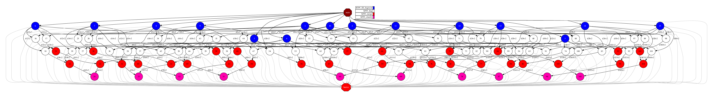

KNN
---

The K-Nearest Neighbors (KNN) classification algorithm is a supervised learning method for classification tasks.
It is based on the principle that similar data points tend to be close to one another in the feature space.
Let :math:`\mathcal{D} = \{(x_1, y_1), (x_2, y_2), \dots, (x_n, y_n)\}` denote a training dataset,
where each :math:`x_i \in \mathbb{R}^d`` is a feature vector and :math:`y_i \in \mathcal{Y}`` is the corresponding label.
Given a query point :math:`x \in \mathbb{R}^d`, the algorithm computes the distance to all training points, typically using the Euclidean metric:

.. math::

    d(x, x_i) = \|x - x_i\|.

It then selects the ``k`` closest samples, :math:`\mathcal{N}_k(x)`, and for classification tasks, assigns the most frequent label among them:

.. math::

    \hat{y} = \arg\max_{y \in \mathcal{Y}} \sum_{i \in \mathcal{N}_k(x)} \mathbb{I}(y_i = y),

where :math:`\mathbb{I}(\cdot)` is the indicator function.

Next we provide the main code of this application.

.. code-block:: r
    :caption: ``task_knn.R``

    # Copyright (c) 2025- King Abdullah University of Science and Technology,
    # All rights reserved.
    # RCOMPSs is a software package, provided by King Abdullah University of Science and Technology (KAUST) - STSDS Group.

    # @file task_knn.R
    # @brief This file contains the tasks of the KNN classification application
    # @version 1.0
    # @author Xiran Zhang
    # @date 2025-04-28

    DEBUG <- list(
                KNN_fill_fragment = FALSE,
                KNN_frag = FALSE,
                KNN_merge = FALSE,
                KNN_classify = FALSE
    )

    KNN_fill_fragment <- function(params_fill_fragment){
        centres <- params_fill_fragment[[1]]
        n <- params_fill_fragment[[2]]

        # Obtain necessary numbers
        nclass <- nrow(centres)
        dim <- ncol(centres)

        # Initialize the random points
        frag <- matrix(nrow = n, ncol = dim + 1)
        frag[,1:dim] <- matrix(rnorm(n * dim, sd = 0.1), nrow = n, ncol = dim)

        # Assign to different groups
        group_ind <- sample(1:nclass, n, replace = TRUE)
        frag[,dim + 1] <- as.integer(group_ind)
        frag[,1:dim] <- frag[,1:dim] + centres[group_ind, ]

        return(frag)
    }

    KNN_frag <- function(train, test, k){
        dimensions <- ncol(train) - 1
        x_train <- train[,1:dimensions]
        cl <- train[,dimensions+1]
        x_test <- test[,1:dimensions]
        if(DEBUG$KNN_frag){
            cat(paste0("Starting KNN_frag, k = ", k, ", dimensions = ", dimensions, "\n"))
            cat("x_train:\n"); print(x_train)
            cat("cl:\n"); print(cl)
            cat("x_test:\n"); print(x_test)
        }
        res_dist <- fields::rdist(x_test, x_train)
        if(DEBUG$KNN_frag){
            cat("res_dist1:\n"); print(res_dist)
        }
        res_cl <- t(apply(res_dist, 1, function(x) cl[sort(x, index.return = TRUE)$ix[1:k]]))
        if(DEBUG$KNN_frag){
            cat("res_cl:\n"); print(res_cl)
        }
        res_dist <- t(apply(res_dist, 1, function(x) sort(x)[1:k]))
        if(DEBUG$KNN_frag){
            cat("res_dist2:\n"); print(res_dist)
        }

        dist_cl <- cbind(res_dist, res_cl)
        return(dist_cl)
    }

    KNN_merge <- function(...){
        input <- list(...)
        input_len <- length(input)
        if(DEBUG$KNN_merge) {
            cat("Doing KNN_merge\n")
            for(i in 1:input_len){
                cat("Input", i, "\n")
                print(input[[i]])
            }
        }
        if(input_len == 1){
            return(input[[1]])
        }else{
            k <- ncol(input[[1]]) / 2
            res_dist <- do.call(cbind, lapply(input, function(x) x[,1:k]))
            res_cl <- do.call(cbind, lapply(input, function(x) x[,(k+1):(2*k)]))
            ntest <- nrow(res_dist)
            if(DEBUG$KNN_merge) {
                cat("Doing KNN_merge\n")
                cat("k =", k, "\n")
                cat("input_len of KNN_merge:", input_len, "\n")
                cat("typeof(res_dist):", typeof(res_dist), "\n")
                cat("class(res_dist):", class(res_dist), "\n")
                cat("dim(res_dist):", dim(res_dist), "\n")
                cat("res_dist before merge:\n"); print(res_dist)
                cat("res_cl before merge:\n"); print(res_cl)
            }
            sorted_distance_ind <- t(apply(res_dist, 1, function(d) sort(d, index.return = TRUE)$ix[1:k]))
            res_dist <- matrix(res_dist[cbind(1:ntest, c(sorted_distance_ind))], nrow = ntest, ncol = k)
            res_cl <- matrix(res_cl[cbind(1:ntest, c(sorted_distance_ind))], nrow = ntest, ncol = k)
            dist_cl <- cbind(res_dist, res_cl)
            if(DEBUG$KNN_merge) {
                cat("sorted_distance_ind:\n")
                print(sorted_distance_ind)
                cat("res_dist after merge:\n")
                print(res_dist)
                cat("res_cl after merge:\n")
                print(res_cl)
                cat("dist_cl:\n")
                print(dist_cl)
            }
            return(dist_cl)
        }
    }

    KNN_classify <- function(...){
        input <- list(...)
        if(DEBUG$KNN_classify) {
            cat("Doing KNN_classify\n")
            print(input)
        }
        if(length(input) > 1){
            final_merge <- do.call(KNN_merge, list(...))
        }else{
            final_merge <- input[[1]]
        }
        if(DEBUG$KNN_classify) {
            cat("final_merge:\n"); print(final_merge)
        }
        k <- ncol(final_merge) / 2
        final_cl <- final_merge[,(k+1):(2*k)]
        KNN_get_mode <- function(x) {
            ux <- unique(x)
            ux[which.max(tabulate(match(x, ux)))]
        }
        predictions <- apply(final_cl, 1, KNN_get_mode)
        if(DEBUG$KNN_classify) {
            cat("predictions:\n"); print(predictions)
        }

        return(predictions)
    }

.. code-block:: r
    :caption: ``function_knn.R``

    # Copyright (c) 2025- King Abdullah University of Science and Technology,
    # All rights reserved.
    # RCOMPSs is a software package, provided by King Abdullah University of Science and Technology (KAUST) - STSDS Group.

    # @file function_knn.R
    # @brief This file contains the functions for the KNN classification application
    # @version 1.0
    # @author Xiran Zhang
    # @date 2025-04-28

    KNN <- function(train, test, k, use_RCOMPSs = FALSE){
        num_frag_train <- length(train)
        num_frag_test <- length(test)

        RES <- vector("list", num_frag_test)
        if(use_RCOMPSs){
            for(i in 1:num_frag_test){
                RES[[i]] <- vector("list", num_frag_train)
                for(j in 1:num_frag_train){
                    RES[[i]][[j]] <- task.KNN_frag(train[[j]], test[[i]], k)
                }
                while(length(RES[[i]]) > arity){
                    RES_subset <- RES[[i]][1:arity]
                    RES[[i]] <- RES[[i]][(arity + 1):length(RES[[i]])]
                    RES[[i]][[length(RES[[i]]) + 1]] <- do.call(task.KNN_merge, RES_subset)
                }
                RES[[i]] <- do.call(task.KNN_classify, RES[[i]])
            }
        }else{
            for(i in 1:num_frag_test){
                RES[[i]] <- vector("list", num_frag_train)
                for(j in 1:num_frag_train){
                    RES[[i]][[j]] <- KNN_frag(train[[j]], test[[i]], k)
                }
                while(length(RES[[i]]) > arity){
                    RES_subset <- RES[[i]][1:arity]
                    RES[[i]] <- RES[[i]][(arity + 1):length(RES[[i]])]
                    RES[[i]][[length(RES[[i]]) + 1]] <- do.call(KNN_merge, RES_subset)
                }
                RES[[i]] <- do.call(KNN_classify, RES[[i]])
            }
        }
        return(RES)
    }

    ######################################################################################
    ######################################################################################
    ### Process arguments
    parse_arguments <- function(Minimize) {

        if(!Minimize){
            cat("Starting parse_arguments\n")
        }

        args <- commandArgs(trailingOnly = TRUE)

        # Define default values
        # Note that if `num_fragments` is not a factor of `numpoints`, the last fragment may give NA due to lack of points.
        seed <- 1
        n_train <- 1000
        n_test <- 200
        dimensions <- 2
        num_class <- 5
        fragments_train <- 5
        fragments_test <- 5
        k <- 3
        arity <- 2

        # Execution using RCOMPSs
        use_RCOMPSs <- FALSE

        # Execution using default R function
        use_R_default <- FALSE

        # asking for help
        is.asking_for_help <- FALSE

        # Confusion matrix?
        confusion_matrix <- FALSE

        # plot?
        needs_plot <- FALSE

        # Parse arguments
        if(length(args) >= 1){
            for (i in 1:length(args)) {
                if (args[i] == "-s") {
                    seed <- as.integer(args[i + 1])
                } else if (args[i] == "--seed") {
                    seed <- as.integer(args[i + 1])
                } else if (args[i] == "-n") {
                    n_train <- as.integer(args[i + 1])
                } else if (args[i] == "--n_train") {
                    n_train <- as.integer(args[i + 1])
                } else if (args[i] == "-N"){
                    n_test <- as.integer(args[i + 1])
                } else if (args[i] == "--n_test") {
                    n_test <- as.integer(args[i + 1])
                } else if (args[i] == "-d") {
                    dimensions <- as.integer(args[i + 1])
                } else if (args[i] == "--dimensions") {
                    dimensions <- as.integer(args[i + 1])
                } else if (args[i] == "-c") {
                    num_class <- as.integer(args[i + 1])
                } else if (args[i] == "--num_class") {
                    num_class <- as.integer(args[i + 1])
                } else if (args[i] == "-f") {
                    fragments_train <- as.integer(args[i + 1])
                } else if (args[i] == "--fragments_train") {
                    fragments_train <- as.integer(args[i + 1])
                } else if (args[i] == "-F") {
                    fragments_test <- as.integer(args[i + 1])
                } else if (args[i] == "--fragments_test") {
                    fragments_test <- as.integer(args[i + 1])
                } else if (args[i] == "-k") {
                    k <- as.integer(args[i + 1])
                } else if (args[i] == "--knn") {
                    k <- as.integer(args[i + 1])
                } else if (args[i] == "-a") {
                    arity <- as.integer(args[i + 1])
                } else if (args[i] == "--arity") {
                    arity <- as.integer(args[i + 1])
                } else if (args[i] == "-m") {
                    confusion_matrix <- TRUE
                } else if (args[i] == "--confusion_matrix") {
                    confusion_matrix <- TRUE
                } else if (args[i] == "-p") {
                    needs_plot <- as.logical(args[i + 1])
                } else if (args[i] == "--plot") {
                    needs_plot <- as.logical(args[i + 1])
                } else if (args[i] == "-C") {
                    use_RCOMPSs <- TRUE
                } else if (args[i] == "--RCOMPSs") {
                    use_RCOMPSs <- TRUE
                } else if (args[i] == "-R") {
                    use_R_default <- TRUE
                } else if (args[i] == "--R-default") {
                    use_R_default <- TRUE
                } else if (args[i] == "-h") {
                    is.asking_for_help <- TRUE
                } else if (args[i] == "--help") {
                    is.asking_for_help <- TRUE
                }
            }
        }

        if(is.asking_for_help){
            cat("Usage: Rscript knn.R [options]\n")
            cat("Options:\n")
            cat("  -s, --seed <seed>                         Seed for random number generator\n")
            cat("  -n, --n_train <n_train>                   Number of training points\n")
            cat("  -N, --n_test <n_test>                     Number of testing points\n")
            cat("  -d, --dimensions <dimensions>             Number of dimensions\n")
            cat("  -c, --num_class <num_class>               Number of classes\n")
            cat("  -f, --fragments_train <fragments_train>   Number of fragments of training data\n")
            cat("  -F, --fragments_test  <fragments_test>    Number of fragments of testing data\n")
            cat("  -k, --knn <k>                             Number of the nearest neighbours to consider\n")
            cat("  -a, --arity <arity>                       Reduction arity\n")
            cat("  -p, --plot <needs_plot>                   Boolean: Plot?\n")
            cat("  -m, --confusion_matrix <confusion_matrix> Flag: confusion_matrix?\n")
            cat("  -C, --RCOMPSs <use_RCOMPSs>               Flag: Use RCOMPSs parallelization?\n")
            cat("  -R, --R-default <use_R_default>           Flag: Use default knn function to compute?\n")
            cat("  -h, --help                                Show this help message\n")
            q(status = 0)
        }

        if(n_train %% fragments_train != 0){
            stop("Number of fragment_train is not a factor of n_train!\n")
        }

        if(n_test %% fragments_test != 0){
            stop("Number of fragment_test is not a factor of n_test!\n")
        }

        return(list(
                    seed = seed,
                    n_train = n_train,
                    n_test = n_test,
                    dimensions = dimensions,
                    num_class = num_class,
                    num_fragments_train = fragments_train,
                    num_fragments_test = fragments_test,
                    k = k,
                    arity = arity,
                    confusion_matrix = confusion_matrix,
                    needs_plot = needs_plot,
                    use_RCOMPSs = use_RCOMPSs,
                    use_R_default = use_R_default
                    ))
        }

        print_parameters <- function(params) {
        cat("Parameters:\n")
        cat(sprintf("  Seed: %d\n", params$seed))
        cat(sprintf("  Number of training points: %d\n", params$n_train))
        cat(sprintf("  Number of testing points: %d\n", params$n_test))
        cat(sprintf("  Dimensions: %d\n", params$dimensions))
        cat(sprintf("  Number of class: %d\n", params$num_class))
        cat(sprintf("  Number of fragments of training data: %d\n", params$num_fragments_train))
        cat(sprintf("  Number of fragments of testing data: %d\n", params$num_fragments_test))
        cat(sprintf("  K: %d\n", params$k))
        cat(sprintf("  Arity: %d\n", params$arity))
        cat("  confusion_matrix:", params$confusion_matrix, "\n")
        cat("  needs_plot:", params$needs_plot, "\n")
        cat("  use_RCOMPSs:", params$use_RCOMPSs, "\n")
        cat("  use_R_default:", params$use_R_default, "\n")
    }

.. code-block:: r
    :caption: ``knn.R``

    # Copyright (c) 2025- King Abdullah University of Science and Technology,
    # All rights reserved.
    # RCOMPSs is a software package, provided by King Abdullah University of Science and Technology (KAUST) - STSDS Group.

    # @file knn.R
    # @brief This file contains the tasks of the KNN classification application
    # @version 1.0
    # @author Xiran Zhang
    # @date 2025-04-28

    # This application requires two extra packages: caret, ggplot2

    flush.console()
    Sys.sleep(1)

    args <- commandArgs(trailingOnly = TRUE)

    Minimize <- FALSE
    # Parse arguments
    if(length(args) >= 1){
        for (i in 1:length(args)) {
            if (args[i] == "-M") {
                Minimize <- TRUE
            } else if (args[i] == "--Minimize") {
                Minimize <- TRUE
            }
        }
    }

    # Source necessary functions
    if(!Minimize){
        cat("Sourcing necessary functions ... ")
    }
    source("task_knn.R")
    source("function_knn.R")
    if(!Minimize){
        cat("Done.\n")
    }

    if(!Minimize){
        cat("Getting parameters ... ")
    }
    params <- parse_arguments(Minimize)
    if(!Minimize){
        print_parameters(params)
    }
    attach(params)
    if(!Minimize){
        cat("Done.\n")
    }

    set.seed(seed)

    if(use_RCOMPSs){
        require(RCOMPSs)

        # Initiate COMPSs
        if(!Minimize){
            cat("Starting COMPSs ... ")
        }
        compss_start()
        cat("COMPSs started!")
        flush.console()
        if(!Minimize){
            cat("Done.\n")
        }

        # Define the tasks
        if(!Minimize){
            cat("Defining the tasks ... ")
        }
        task.KNN_fill_fragment <- task(KNN_fill_fragment, "task_knn.R", return_value = TRUE, DEBUG = FALSE)
        task.KNN_frag <- task(KNN_frag, "task_knn.R", return_value = TRUE, DEBUG = FALSE)
        task.KNN_merge <- task(KNN_merge, "task_knn.R", return_value = TRUE, DEBUG = FALSE)
        task.KNN_classify <- task(KNN_classify, "task_knn.R", return_value = TRUE, DEBUG = FALSE)
        if(!Minimize){
            cat("Done.\n")
        }
    }else{
        if(!Minimize){
            cat("Sequential execution without RCOMPSs!\n")
        }
    }

    for(replicate in 1:1){

        start_time <- proc.time()

        # Generate data
        if(!Minimize){
            cat("Generating data replicate", replicate, "... ")
        }

        points_per_fragment_train <- max(1, n_train %/% num_fragments_train)
        points_per_fragment_test <- max(1, n_test %/% num_fragments_test)
        # Generate cluster central points
        true_centres <- matrix(runif(num_class * dimensions),
                                nrow = num_class, ncol = dimensions)

        params_train <- list(centres = true_centres, n = points_per_fragment_train)
        params_test <- list(centres = true_centres, n = points_per_fragment_test)
        x_train <- vector("list", num_fragments_train)
        x_test <- vector("list", num_fragments_test)
        if(use_RCOMPSs){
            for(f in 1:num_fragments_train){
                x_train[[f]] <- task.KNN_fill_fragment(params_train)
            }
            for(f in 1:num_fragments_test){
                x_test[[f]] <- task.KNN_fill_fragment(params_test)
            }
        }else{
            for(f in 1:num_fragments_train){
                x_train[[f]] <- KNN_fill_fragment(params_train)
            }
            for(f in 1:num_fragments_test){
                x_test[[f]] <- KNN_fill_fragment(params_test)
            }
        }

        initialization_time <- proc.time()
        if(!Minimize){
            cat("Done.\n")
        }

        # Run KNN
        res_KNN <- KNN(train = x_train, test = x_test, k = k, use_RCOMPSs)

        if(!Minimize){
            if(use_RCOMPSs){
                res_KNN <- compss_wait_on(res_KNN)
            }
            PRED <- do.call(c, res_KNN)
        }else if(use_RCOMPSs){
            compss_barrier(FALSE)
        }

        knn_time <- proc.time()

        Initialization_time <- initialization_time[3] - start_time[3]
        KNN_time <- knn_time[3] - initialization_time[3]
        Total_time <- proc.time()[3] - start_time[3]

        Initialization_time <- round(Initialization_time, 3)
        KNN_time <- round(KNN_time, 3)
        Total_time <- round(Total_time, 3)
        cat("-----------------------------------------\n")
        cat("-------------- RESULTS ------------------\n")
        cat("-----------------------------------------\n")
        cat("Initialization time:", Initialization_time, "seconds\n")
        cat("KNN time:", KNN_time, "seconds\n")
        cat("Total time:", Total_time, "seconds\n")
        cat("-----------------------------------------\n")
        if(Minimize){
            cat("KNN_RES,seed,n_train,n_test,dimensions,num_class,k,arity,confusion_matrix,needs_plot,use_RCOMPSs,use_R_default,Minimize,Initialization_time,KNN_time,Total_time,replicate\n")
            cat(paste0("KNN_res,", seed, ",", n_train, ",", n_test, ",", dimensions, ",", num_class, ",", k, ",", arity, ",", confusion_matrix, ",", needs_plot, ",", use_RCOMPSs, ",", use_R_default, ",", Minimize, ",", Initialization_time, ",", KNN_time, ",", Total_time, ",", replicate, "\n"))
        }
        if(!Minimize){
            PRED <- as.factor(as.numeric(PRED))
            if(confusion_matrix){
                cat("Confusion Matrix:\n")
                if(use_RCOMPSs) x_test <- compss_wait_on(x_test)
                x_test <- do.call(rbind, x_test)
                cm <- caret::confusionMatrix(data = PRED, reference = as.factor(x_test[,ncol(x_test)]))
                print(cm)
            }else{
                cat("Result of KNN:\n")
                print(PRED)
            }
            cat("-----------------------------------------\n")
        }

        if(use_R_default){
            res_knn <- class::knn(train = x_train[,1:dimensions], test = x_test[,1:dimensions], cl = x_train[,dimensions], k = k)
            if(confusion_matrix){
                cm <- caret::confusionMatrix(data = res_knn, reference = as.factor(x_test[,ncol(x_test)]))
                print(cm)
            }else{
                print(res_knn)
            }
            if(!identical(res_knn, res_KNN)){
                cat("+++++++++++++++++++++++++++++++++++")
                cat("\n\033[31;1;4mWrong result!\n\033[0m")
            }else{
                cat("+++++++++++++++++++++++++++++++++++")
                cat("\n\033[32;1;4mCorrect result!\n\033[0m")
            }
        }

        # Plot the data
        if(needs_plot){
            x_train <- do.call(rbind, x_train)
            class <- as.factor(x_train[,dimensions + 1])
            x <- x_train[,1]
            y <- x_train[,2]
            library(ggplot2)
            p <- ggplot() +
            geom_point(aes(x = x, y = y, colour = class,
                            shape = "Training data"), size = 3) +
            geom_point(aes(x = x_test[,1], y = x_test[,2], color = PRED,
                        shape = "Testing data"))
            ggsave("plot_knn.pdf", plot = p, device = "pdf", width = 8, height = 8)
        }
    }
    if(use_RCOMPSs){
        compss_stop()
    }

Next we run the KNN application with the ``-g`` option to be able to
generate the final graph at the end of the execution.

.. code-block:: console

    compss@bsc:~/tutorial_apps/r/knn$ runcompss --lang=r -g knn.R --seed 2 --n_train 1000 --n_test 2000 --dimensions 10 --num_class 5 --fragments_train 5 --fragments_test 10 --knn 5 --arity 5 --RCOMPSs --Minimize
    [ INFO ] Using default location for project file: /opt/COMPSs//Runtime/configuration/xml/projects/default_project.xml
    [ INFO ] Using default location for resources file: /opt/COMPSs//Runtime/configuration/xml/resources/default_resources.xml
    [ INFO ] Using default execution type: compss

    ----------------- Executing knn.R --------------------------

    [(951)    API]  -  Starting COMPSs Runtime v3.3.3.post2505 (build 20250515-0858.rb6a767530b0120119c45956d05fa3a1578cad401)
    COMPSs started!
    -----------------------------------------
    -------------- RESULTS ------------------
    -----------------------------------------
    Initialization time: 0,044 seconds
    KNN time: 9,881 seconds
    Total time: 9,925 seconds
    -----------------------------------------
    KNN_RES,seed,n_train,n_test,dimensions,num_class,k,arity,confusion_matrix,needs_plot,use_RCOMPSs,use_R_default,Minimize,Initialization_time,KNN_time,Total_time,replicate
    KNN_res,2,1000,2000,10,5,5,2,FALSE,FALSE,TRUE,FALSE,TRUE,0,044,9,881,9,925,1
    [(14500)    API]  -  Execution Finished

    ------------------------------------------------------------

By running the ``compss_gengraph`` command users can obtain the task
graph of the above execution. Next we provide the set of commands to
obtain the graph show in :numref:`knn_r`.

.. code-block:: console

    compss@bsc:~$ cd ~/.COMPSs/knn.R_01/monitor/
    compss@bsc:~/.COMPSs/knn.R_01/monitor$ compss_gengraph complete_graph.dot
    compss@bsc:~/.COMPSs/knn.R_01/monitor$ evince complete_graph.pdf

   R KNN tasks graph
