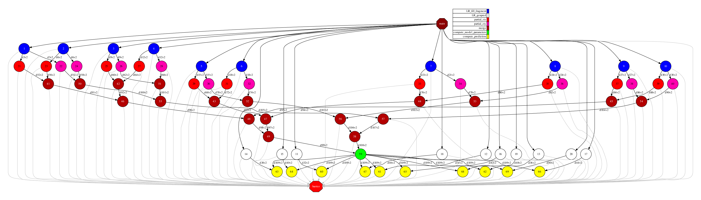

Linear Regression
-----------------

Linear regression models the relationship between a dependent variable ``y`` and a set of independent variables
:math:`x_1, x_2, \dots, x_p`. For a given observation $i$, the model is expressed as:

.. math::

    y_i = \beta_0 + \beta_1 x_{i1} + \beta_2 x_{i2} + \cdots + \beta_p x_{ip} + \varepsilon_i,

where :math:`\beta_0` is the intercept, :math:`\beta_1, \dots, \beta_p` are the regression coefficients, and :math:`\varepsilon_i` is the error term.

In vector form, this becomes:

.. math::

    y_i = \mathbf{x}_i^\top \boldsymbol{\beta} + \boldsymbol\varepsilon_i,

where :math:`\mathbf{x}_i = [1, x_{i1}, x_{i2}, \dots, x_{ip}]^\top` includes the intercept term,
and :math:`\boldsymbol{\beta} = [\beta_0, \beta_1, \dots, \beta_p]^\top` is the parameter vector.
To estimate :math:`\boldsymbol{\beta}`, the method of least squares minimizes the residual sum of squares:

.. math::

    \min_{\boldsymbol{\beta}} \sum_{i=1}^n (y_i - \mathbf{x}_i^\top \boldsymbol{\beta})^2.

Let :math:`\mathbf{X} \in \mathbb{R}^{n \times (p+1)}` be the design matrix and :math:`\mathbf{y} \in \mathbb{R}^n` the response vector.
The closed-form least squares solution is:

.. math::

    \hat{\boldsymbol{\beta}} = (\mathbf{X}^\top \mathbf{X})^{-1} \mathbf{X}^\top \mathbf{y}.

Next we provide the main code of this application.

.. code-block:: r
    :caption: ``task_linear_regression.R``

    # Copyright (c) 2025- King Abdullah University of Science and Technology,
    # All rights reserved.
    # RCOMPSs is a software package, provided by King Abdullah University of Science and Technology (KAUST) - STSDS Group.

    # @file tasks_linear_regression.R
    # @brief This file contains the tasks of the linear regression with predictions application
    # @version 1.0
    # @author Xiran Zhang
    # @date 2025-04-28

    DEBUG <- list(
                LR_fill_fragment = FALSE,
                partial_ztz = FALSE,
                partial_zty = FALSE,
                compute_model_parameters = FALSE,
                merge = FALSE
    )

    LR_fill_fragment <- function(params_LR_fill_fragment, true_coeff){
        num_frag <- params_LR_fill_fragment$dim[1]
        dimension_x <- params_LR_fill_fragment$dim[2]
        dimension_y <- params_LR_fill_fragment$dim[3]
        if(DEBUG$LR_fill_fragment){
            cat("Doing LR_fill_fragment ...\n")
            cat(paste0("num_frag = ", num_frag, "; dimension_x = ", dimension_x, "; dimension_y = ", dimension_y, "\n"))
            cat("class(true_coeff):", class(true_coeff), "\n")
            cat("typeof(true_coeff):", typeof(true_coeff), "\n")
            cat("Printing true_coeff\n"); print(true_coeff)
        }
        # Generate X
        x_frag <- matrix(runif(num_frag * dimension_x), nrow = num_frag, ncol = dimension_x)
        # Create the response variable with some noise
        y_frag <- cbind(1, x_frag) %*% true_coeff
        M <- matrix(rnorm(num_frag * dimension_y), nrow = num_frag, ncol = dimension_y)
        y_frag <- y_frag + M

        X_Y <- cbind(x_frag, y_frag)

        return(X_Y)
    }

    LR_genpred <- function(params_LR_genpred){
        num_frag <- params_LR_genpred$n
        dimension <- params_LR_genpred$d
        # Generate random data for prediction
        x_pred <- matrix(runif(num_frag * dimension), nrow = num_frag, ncol = dimension)
        return(x_pred)
    }

    partial_ztz <- function(x_y, dx) {
        if(DEBUG$partial_ztz){
            cat("Executing task: partial_ztz\n")
            cat("In partial_ztz, x_y: type is", typeof(x_y), "class is", class(x_y), "\n")
        }
        x <- x_y[,1:dx]
        if(DEBUG$partial_ztz){
            cat("In partial_ztz, x:\n")
            print(x)
        }
        x <- cbind(1, x)
        if(DEBUG$partial_ztz){
            cat("Executing task: partial_ztz\n")
        }
        ztz <- t(x) %*% x
        if(DEBUG$partial_ztz){
            cat("Executing task: partial_ztz ---- Success!\n")
        }
        return(ztz)
    }

    partial_zty <- function(x_y, dx) {
        if(DEBUG$partial_zty){
            cat("Executing task: partial_zty\n")
        }
        x <- x_y[,1:dx]
        y <- x_y[,(dx+1):ncol(x_y)]
        x <- cbind(1, x)
        zty <- t(x) %*% y
        if(DEBUG$partial_zty){
            cat("Executing task: partial_zty ---- Success!\n")
        }
        return(zty)
    }

    compute_model_parameters <- function(ztz, zty) {
        params <- solve(ztz, zty)
        return(params)
    }

    compute_prediction <- function(x, parameters){
        x <- cbind(1, x)
        return(x %*% parameters)
    }

    row_combine <- function(...){
        do.call(rbind, list(...))
    }

    merge <- function(...){
        input <- list(...)
        input_len <- length(input)
        if(DEBUG$merge) {
            cat("Doing merge\n")
            for(i in 1:input_len){
                cat("Input", i, "\n")
                print(input[[i]])
            }
            for(i in 1:input_len){
                cat("Input dimension", i, dim(input[[i]]), "\n")
            }
        }
        if(input_len == 1){
            return(input[[1]])
        }else if(input_len >= 2){
            accum <- input[[1]]
            for(i in 2:input_len){
                accum <- accum + input[[i]]
            }
            if(DEBUG$merge) {
                cat("accum\n")
                print(accum)
            }
            return(accum)
        }else{
            stop("Wrong input in `merge`!\n")
        }
    }

.. code-block:: r
    :caption: ``functions_linear_regression.R``

    # Copyright (c) 2025- King Abdullah University of Science and Technology,
    # All rights reserved.
    # RCOMPSs is a software package, provided by King Abdullah University of Science and Technology (KAUST) - STSDS Group.

    # @file functions_linear_regression.R
    # @brief This file contains the functions for the linear regression with predictions application
    # @version 1.0
    # @author Xiran Zhang
    # @date 2025-04-28

    fit_linear_regression <- function(x_y, dx, dy, arity = 2, use_RCOMPSs = FALSE) {

        nfrag <- length(x_y)
        ztz <- vector("list", nfrag)
        zty <- vector("list", nfrag)
        if(use_RCOMPSs){
            # Compute ztz and zty
            for(i in 1:nfrag) {
                ztz[[i]] <- task.partial_ztz(x_y[[i]], dx)
                zty[[i]] <- task.partial_zty(x_y[[i]], dx)
            }
            # Merge ztz
            while(length(ztz) > arity){
                ztz_subset <- ztz[1:arity]
                ztz <- ztz[(arity + 1):length(ztz)]
                ztz[[length(ztz) + 1]] <- do.call(task.merge, ztz_subset)
            }
            ztz <- do.call(task.merge, ztz)
            # Merge zty
            while(length(zty) > arity){
                zty_subset <- zty[1:arity]
                zty <- zty[(arity + 1):length(zty)]
                zty[[length(zty) + 1]] <- do.call(task.merge, zty_subset)
            }
            zty <- do.call(task.merge, zty)
            # Compute ztz^(-1) %*% zty
            parameters <- task.compute_model_parameters(ztz, zty)
        }else{
            # Compute ztz and zty
            for(i in 1:nfrag) {
                ztz[[i]] <- partial_ztz(x_y[[i]], dx)
                zty[[i]] <- partial_zty(x_y[[i]], dx)
            }
            # Merge ztz
            while(length(ztz) > arity){
                ztz_subset <- ztz[1:arity]
                ztz <- ztz[(arity + 1):length(ztz)]
                ztz[[length(ztz) + 1]] <- do.call(merge, ztz_subset)
            }
            ztz <- do.call(merge, ztz)
            # Merge zty
            while(length(zty) > arity){
                zty_subset <- zty[1:arity]
                zty <- zty[(arity + 1):length(zty)]
                zty[[length(zty) + 1]] <- do.call(merge, zty_subset)
            }
            zty <- do.call(merge, zty)
            # Compute ztz^(-1) %*% zty
            parameters <- compute_model_parameters(ztz, zty)
        }
        return(parameters)
    }

    predict_linear_regression <- function(x, parameters, arity, use_RCOMPSs) {
        nf <- length(x)
        pred <- vector("list", nf)
        if(use_RCOMPSs){
            for(i in 1:nf){
                pred[[i]] <- task.compute_prediction(x[[i]], parameters)
            }
        }else{
            for(i in 1:nf){
                pred[[i]] <- compute_prediction(x[[i]], parameters)
            }
        }
        return(pred)
    }

    parse_arguments <- function(Minimize) {

        if(!Minimize){
            cat("Starting parse_arguments\n")
        }

        args <- commandArgs(trailingOnly = TRUE)

        # Define default values
        # Note that if `num_fragments` is not a factor of `numpoints`, the last fragment may give NA due to lack of points.
        seed <- 1
        num_fit <- 9000
        num_pred <- 1000
        dimensions_x <- 2
        dimensions_y <- 2
        num_fragments_fit <- 10
        num_fragments_pred <- 5
        arity <- 2

        # Execution using RCOMPSs
        use_RCOMPSs <- FALSE

        # asking for help
        is.asking_for_help <- FALSE

        # Compare accuracy?
        compare_accuracy <- FALSE

        # Parse arguments
        if(length(args) >= 1){
            for (i in 1:length(args)) {
                if (args[i] == "-s") {
                    seed <- as.integer(args[i + 1])
                } else if (args[i] == "--seed") {
                    seed <- as.integer(args[i + 1])
                } else if (args[i] == "-n") {
                    num_fit <- as.integer(args[i + 1])
                } else if (args[i] == "--num_fit") {
                    num_fit <- as.integer(args[i + 1])
                } else if (args[i] == "-N") {
                    num_pred <- as.integer(args[i + 1])
                } else if (args[i] == "--num_pred") {
                    num_pred <- as.integer(args[i + 1])
                } else if (args[i] == "-d") {
                    dimensions_x <- as.integer(args[i + 1])
                } else if (args[i] == "--dimensions_x") {
                    dimensions_x <- as.integer(args[i + 1])
                } else if (args[i] == "-D") {
                    dimensions_y <- as.integer(args[i + 1])
                } else if (args[i] == "--dimensions_y") {
                    dimensions_y <- as.integer(args[i + 1])
                } else if (args[i] == "-f") {
                    num_fragments_fit <- as.integer(args[i + 1])
                } else if (args[i] == "--fragments_fit") {
                    num_fragments_fit <- as.integer(args[i + 1])
                } else if (args[i] == "-F") {
                    num_fragments_pred <- as.integer(args[i + 1])
                } else if (args[i] == "--fragments_pred") {
                    num_fragments_pred <- as.integer(args[i + 1])
                } else if (args[i] == "-a") {
                    arity <- as.integer(args[i + 1])
                } else if (args[i] == "--arity") {
                    arity <- as.integer(args[i + 1])
                } else if (args[i] == "-C") {
                    use_RCOMPSs <- TRUE
                } else if (args[i] == "--RCOMPSs") {
                    use_RCOMPSs <- TRUE
                } else if (args[i] == "--compare_accuracy") {
                    compare_accuracy <- TRUE
                } else if (args[i] == "-h") {
                    is.asking_for_help <- TRUE
                } else if (args[i] == "--help") {
                    is.asking_for_help <- TRUE
                }
            }
        }

        if(is.asking_for_help){
            cat("Usage: Rscript linear_regression.R [options]\n")
            cat("Options:\n")
            cat("  -s, --seed <seed>                          Seed for random number generator\n")
            cat("  -n, --num_fit <num_fit>                    Number of fitting points\n")
            cat("  -N, --num_pred <num_pred>                  Number of predicting points\n")
            cat("  -d, --dimensions_x <dimensions_x>          Number of X dimensions\n")
            cat("  -D, --dimensions_y <dimensions_y>          Number of Y dimensions\n")
            cat("  -f, --fragments_fit <num_fragments_fit>    Number of fragments of the fitting data\n")
            cat("  -F, --fragments_pred <num_fragments_pred>  Number of fragments of the prediction data\n")
            cat("  -r, --arity <arity>                        Integer: Arity of the merge\n")
            cat("  -C, --RCOMPSs <use_RCOMPSs>                Boolean: Use RCOMPSs parallelization?\n")
            cat("  -M, --Minimize <Minimize>                  Boolean: Minimize printout?\n")
            cat("  --compare_accuracy <compare_accuracy>      Boolean: Compare accuracy?\n")
            cat("  -h, --help                                 Show this help message\n")
            q(status = 0)
        }

        return(list(
                    seed = seed,
                    num_fit = num_fit,
                    num_pred = num_pred,
                    dimensions_x = dimensions_x,
                    dimensions_y = dimensions_y,
                    num_fragments_fit = num_fragments_fit,
                    num_fragments_pred = num_fragments_pred,
                    arity = arity,
                    use_RCOMPSs = use_RCOMPSs,
                    compare_accuracy = compare_accuracy
                    ))
    }

    print_parameters <- function(params) {
        cat("Parameters:\n")
        cat("  Seed:", params$seed, "\n")
        cat("  Number of fitting points:", params$num_fit, "\n")
        cat("  Number of predicting points:", params$num_pred, "\n")
        cat("  X dimensions:", params$dimensions_x, "\n")
        cat("  Y dimensions:", params$dimensions_y, "\n")
        cat("  Number of fragments of the fitting data:", params$num_fragments_fit, "\n")
        cat("  Number of fragments of the predicting data:", params$num_fragments_pred, "\n")
        cat("  Arity:", params$arity, "\n")
        cat("  use_RCOMPSs:", params$use_RCOMPSs, "\n")
        cat("  Compare accuracy?", params$compare_accuracy, "\n")
    }

.. code-block:: r
    :caption: ``linear_regression.R``

    # Copyright (c) 2025- King Abdullah University of Science and Technology,
    # All rights reserved.
    # RCOMPSs is a software package, provided by King Abdullah University of Science and Technology (KAUST) - STSDS Group.

    # @file linear_regression.R
    # @brief This file is the main file of the linear regression with predictions application
    # @version 1.0
    # @author Xiran Zhang
    # @date 2025-04-28

    # Processing parameters
    args <- commandArgs(trailingOnly = TRUE)

    Minimize <- FALSE
    # Parse arguments
    if(length(args) >= 1){
        for (i in 1:length(args)) {
            if (args[i] == "-M") {
                Minimize <- TRUE
            } else if (args[i] == "--Minimize") {
                Minimize <- TRUE
            }
        }
    }

    # Source necessary functions
    if(!Minimize){
        cat("Sourcing necessary functions ... ")
    }
    source("tasks_linear_regression.R")
    source("functions_linear_regression.R")
    if(!Minimize){
        cat("Done.\n")
    }

    if(!Minimize){
        cat("Getting parameters ... ")
    }
    params <- parse_arguments(Minimize)
    print_parameters(params)
    attach(params)
    if(!Minimize){
        cat("Done.\n")
    }
    # Finished processing parameters

    if (use_RCOMPSs){
        require(RCOMPSs)

        compss_start()
        task.LR_fill_fragment <- task(LR_fill_fragment, "tasks_linear_regression.R", info_only = FALSE, return_value = TRUE, DEBUG = FALSE)
        task.LR_genpred <- task(LR_genpred, "tasks_linear_regression.R", info_only = FALSE, return_value = TRUE, DEBUG = FALSE)
        task.partial_ztz <- task(partial_ztz, "tasks_linear_regression.R", info_only = FALSE, return_value = TRUE, DEBUG = FALSE)
        task.partial_zty <- task(partial_zty, "tasks_linear_regression.R", info_only = FALSE, return_value = TRUE, DEBUG = FALSE)
        task.compute_model_parameters <- task(compute_model_parameters, "tasks_linear_regression.R", info_only = FALSE, return_value = TRUE, DEBUG = FALSE)
        task.compute_prediction <- task(compute_prediction, "tasks_linear_regression.R", info_only = FALSE, return_value = TRUE, DEBUG = FALSE)
        task.row_combine <- task(row_combine, "tasks_linear_regression.R", info_only = FALSE, return_value = TRUE, DEBUG = FALSE)
        task.merge <- task(merge, "tasks_linear_regression.R", info_only = FALSE, return_value = TRUE, DEBUG = FALSE)
    }

    # Example usage:
    set.seed(seed)
    n <- num_fit
    N <- num_pred
    d <- dimensions_x
    D <- dimensions_y

    # Generate random regression coefficients
    true_coeff <- matrix(round(runif((d+1)*D, -10, 10)), nrow = d + 1, ncol = D)
    # If all the covariate are corresponding to 0, we need to do it again
    for(j in 1:D){
        while(all(true_coeff[-1,j] == 0)){
            true_coeff[-1,j] <- round(runif(d, -10, 10))
        }
    }

    for(replicate in 1:1){
        cat("Doing replicate", replicate, "...\n")

        if(replicate > 1) compare_accuracy <- FALSE

        start_time <- proc.time()

        # Generate random data
        X_Y <- vector("list", num_fragments_fit)
        PRED <- vector("list", num_fragments_pred)
        if(use_RCOMPSs){
            params <- list(dim = c(n / num_fragments_fit, d, D))
            for(i in 1:num_fragments_fit){
                X_Y[[i]] <- task.LR_fill_fragment(params, true_coeff)
            }
            params <- list(n = N / num_fragments_pred, d = d)
            for(j in 1:num_fragments_pred){
                PRED[[j]] <- task.LR_genpred(params)
            }
        }else{
            params <- list(dim = c(n / num_fragments_fit, d, D))
            for(i in 1:num_fragments_fit){
                X_Y[[i]] <- LR_fill_fragment(params, true_coeff)
            }
            params <- list(n = N / num_fragments_pred, d = d)
            for(j in 1:num_fragments_pred){
                PRED[[j]] <- LR_genpred(params)
            }
        }

        # Fit the model
        model <- fit_linear_regression(X_Y, d, D, arity = arity, use_RCOMPSs = use_RCOMPSs)

        # Predict using the model
        predictions <- predict_linear_regression(PRED, model, arity, use_RCOMPSs)

        if(use_RCOMPSs){
            if(compare_accuracy){
                predictions <- compss_wait_on(predictions)
            }else{
                compss_barrier()
            }
        }
        linear_regression_time <- proc.time()

        LR_time <- round(linear_regression_time[3] - start_time[3], 3)

        # To compare accuracy
        if(compare_accuracy){
            if(use_RCOMPSs){
                X_Y <- do.call(task.row_combine, X_Y)
                X_Y <- compss_wait_on(X_Y)
                PRED <- do.call(task.row_combine, PRED)
                PRED <- compss_wait_on(PRED)
                predictions <- do.call(task.row_combine, predictions)
                predictions <- compss_wait_on(predictions)
                model <- compss_wait_on(model)
            }else{
                X_Y <- do.call(rbind, X_Y)
                PRED <- do.call(rbind, PRED)
                predictions <- do.call(rbind, predictions)
            }
            X <- X_Y[,1:dimensions_x]
            Y <- X_Y[,(dimensions_x+1):(dimensions_x+dimensions_y)]
            start_lm <- proc.time()
            model_base <- lm(Y ~ X)
            coeff <- coefficients(model_base)
            predictions_base <- cbind(1, PRED) %*% coeff
            end_lm <- proc.time()
            lm_time <- round(end_lm[3] - start_lm[3], 3)
            # Results:
            cat("\nTrue coefficients:\n"); print(round(true_coeff, 2))
            cat("\nEstimated coefficients:\n"); print(round(model, 2))
            cat("\n`lm` coefficients:\n"); print(round(coeff, 2))
            cat("\nSquared error of the difference between `predictions` and `predictions_base` is:", sum((predictions - predictions_base)^2), "\n")

            rm(X, Y, PRED, model_base, coeff, predictions_base)
        }

        cat("-----------------------------------------\n")
        cat("-------------- RESULTS ------------------\n")
        cat("-----------------------------------------\n")
        cat("Linear regression time:", LR_time, "seconds\n")
        if(compare_accuracy) cat("Base R lm time:", lm_time, "seconds\n")
        cat("-----------------------------------------\n")
        if(Minimize){
            cat("LR_RES,seed,num_fit,num_pred,dimensions_x,dimensions_y,num_fragments_fit,num_fragments_pred,arity,use_RCOMPSs,compare_accuracy,Minimize,LR_time,run\n")
            cat(paste0("LR_res,", seed, ",", num_fit, ",", num_pred, ",", dimensions_x, ",", dimensions_y, ",", num_fragments_fit, ",", num_fragments_pred, ",", arity, ",", use_RCOMPSs, ",", compare_accuracy, ",", Minimize, ",", LR_time, ",", replicate, "\n"))
        }
        rm(X_Y, model, predictions)
    }

    if(use_RCOMPSs) compss_stop()

Next we run the Linear Regression application with the ``-g`` option to be able to
generate the final graph at the end of the execution.

.. code-block:: console

    compss@bsc:~/tutorial_apps/r/linear_regression$ runcompss --lang=r -g linear_regression.R --seed 3 --num_fit 1000 --num_pred 10 --dimensions_x 10 --dimensions_y 2 --fragments_fit 10 --fragments_pred 10 --arity 2 --RCOMPSs --Minimize
    [ INFO ] Using default location for project file: /opt/COMPSs//Runtime/configuration/xml/projects/default_project.xml
    [ INFO ] Using default location for resources file: /opt/COMPSs//Runtime/configuration/xml/resources/default_resources.xml
    [ INFO ] Using default execution type: compss

    ----------------- Executing linear_regression.R --------------------------

    Parameters:
    Seed: 3
    Number of fitting points: 1000
    Number of predicting points: 100
    X dimensions: 10
    Y dimensions: 2
    Number of fragments of the fitting data: 10
    Number of fragments of the predicting data: 10
    Arity: 2
    use_RCOMPSs: TRUE
    Compare accuracy? FALSE
    [(823)    API]  -  Starting COMPSs Runtime v3.3.3.post2505 (build 20250515-0858.rb6a767530b0120119c45956d05fa3a1578cad401)
    Doing replicate 1 ...
    -----------------------------------------
    -------------- RESULTS ------------------
    -----------------------------------------
    Linear regression time: 5,798 seconds
    -----------------------------------------
    LR_RES,seed,num_fit,num_pred,dimensions_x,dimensions_y,num_fragments_fit,num_fragments_pred,arity,use_RCOMPSs,compare_accuracy,Minimize,LR_time,run
    LR_res,3,1000,100,10,2,10,10,2,TRUE,FALSE,TRUE,5,798,1
    [(9331)    API]  -  Execution Finished

    ------------------------------------------------------------

By running the ``compss_gengraph`` command users can obtain the task
graph of the above execution. Next we provide the set of commands to
obtain the graph show in :numref:`linear_regression_r`.

.. code-block:: console

    compss@bsc:~$ cd ~/.COMPSs/linear_regression.R_01/monitor/
    compss@bsc:~/.COMPSs/linear_regression.R_01/monitor$ compss_gengraph complete_graph.dot
    compss@bsc:~/.COMPSs/linear_regression.R_01/monitor$ evince complete_graph.pdf

   R Linear Regression tasks graph
